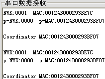

&emsp;&emsp;实验内容：协调器上电后建立网路，路由器自动加入网络。然后路由器调用调用相关的`API`函数获得某一网络号节点的`MAC`地址，然后通过串口将其发送到`PC`端的串口调试助手。<!--more-->
&emsp;&emsp;获得某一网络号节点的`MAC`地址的`API`函数：

``` cpp
ZDP_IEEEAddrReq ( uint16 shortAddr, byte ReqType, byte StartIndex, byte SecurtyEnable );
```

除了`shortAddr`这个参数外，其他均填`0`。
&emsp;&emsp;协调器程序和`获取自身和父节点网络与MAC地址`实验一样。路由器程序设计如下：

``` cpp
#include "OSAL.h"
#include "AF.h"
#include "ZDApp.h"
#include "ZDObject.h"
#include "ZDProfile.h"
#include <string.h>
#include "Coordinator.h"
#include "DebugTrace.h"

#if !defined(WIN32)
    #include "OnBoard.h"
#endif

#include "hal_lcd.h"
#include "hal_led.h"
#include "hal_key.h"
#include "hal_uart.h"

#define SHOW_INFO_EVENT 0x01

const cId_t GenericApp_ClusterList[GENERICAPP_MAX_CLUSTERS] = {
    GENERICAPP_CLUSTERID
};

const SimpleDescriptionFormat_t GenericApp_SimpleDesc = {
    GENERICAPP_ENDPOINT,
    GENERICAPP_PROFID,
    GENERICAPP_DEVICEID,
    GENERICAPP_DEVICE_VERSION,
    GENERICAPP_FLAGS,
    0,
    ( cId_t * ) NULL,
    GENERICAPP_MAX_CLUSTERS,
    ( cId_t * ) GenericApp_ClusterList
};

endPointDesc_t GenericApp_epDesc;
byte GenericApp_TaskID;
byte GenericApp_TransID;
devStates_t GenericApp_NwkState;

void ShowInfo ( void );
void To_string ( uint8 *dest, char *src, uint8 length );

/* 增加这个函数的目的是对ZDO_CB_MSG消息响应 */
void GenericApp_ProcessZDOMsgs ( zdoIncomingMsg_t *inMsg );

typedef struct RFTXBUF {
    uint8 myNWK[4];
    uint8 myMAC[16];
    uint8 pNWK[4];
    uint8 pMAC[16];
} RFTX;

void GenericApp_Init ( byte task_id ) {
    GenericApp_TaskID = task_id;
    GenericApp_NwkState = DEV_INIT;
    GenericApp_TransID = 0;
    GenericApp_epDesc.endPoint = GENERICAPP_ENDPOINT;
    GenericApp_epDesc.task_id = &GenericApp_TaskID;
    GenericApp_epDesc.simpleDesc = ( SimpleDescriptionFormat_t * ) &GenericApp_SimpleDesc;
    GenericApp_epDesc.latencyReq = noLatencyReqs;
    afRegister ( &GenericApp_epDesc );
    halUARTCfg_t uartConfig;
    uartConfig.configured = TRUE;
    uartConfig.baudRate = HAL_UART_BR_115200;
    uartConfig.flowControl = FALSE;
    uartConfig.callBackFunc = NULL;
    HalUARTOpen ( 0, &uartConfig );
    ZDO_RegisterForZDOMsg ( GenericApp_TaskID, IEEE_addr_rsp ); /* 对IEEE_addr_rsp消息响应的注册 */
}

UINT16 GenericApp_ProcessEvent ( byte task_id, UINT16 events ) {
    afIncomingMSGPacket_t *MSGpkt;

    if ( events & SYS_EVENT_MSG ) {
        MSGpkt = ( afIncomingMSGPacket_t * ) osal_msg_receive ( GenericApp_TaskID );

        while ( MSGpkt ) {
            switch ( MSGpkt->hdr.event ) {
                case ZDO_CB_MSG:
                    GenericApp_ProcessZDOMsgs ( ( zdoIncomingMsg_t * ) MSGpkt ); /* 注意这句代码 */
                    break;
                case ZDO_STATE_CHANGE:
                    GenericApp_NwkState = ( devStates_t ) ( MSGpkt->hdr.status );

                    if ( GenericApp_NwkState == DEV_ROUTER ) {
                        HalLedBlink ( HAL_LED_1, 0, 50, 500 );
                        osal_set_event ( GenericApp_TaskID, SHOW_INFO_EVENT );
                    }

                    break;
                default:
                    break;
            }

            osal_msg_deallocate ( ( uint8 * ) MSGpkt );
            MSGpkt = ( afIncomingMSGPacket_t * ) osal_msg_receive ( GenericApp_TaskID );
        }

        return ( events ^ SYS_EVENT_MSG );
    }

    if ( events & SHOW_INFO_EVENT ) {
        HalLedBlink ( HAL_LED_2, 0, 50, 500 );
        ShowInfo();
        ZDP_IEEEAddrReq ( 0x0000, 0, 0, 0 ); /* 请求协调器IEEE地址 */
        osal_start_timerEx ( GenericApp_TaskID, SHOW_INFO_EVENT, 5000 );
        return ( events ^ SHOW_INFO_EVENT );
    }

    return 0;
}

void GenericApp_ProcessZDOMsgs ( zdoIncomingMsg_t *inMsg ) {
    char buf[16];
    char changeline[2] = {0x0A, 0x0D};

    switch ( inMsg->clusterID ) {
        case IEEE_addr_rsp: {
            /* 对接受到的数据包进行解析，解析完后，pRsp指向数据包的存放地址 */
            ZDO_NwkIEEEAddrResp_t *pRsp = ZDO_ParseAddrRsp ( inMsg );

            if ( pRsp ) {
                if ( pRsp->status == ZSuccess ) { /* 解析是否正确 */
                    To_string ( buf, pRsp->extAddr, 8 ); /* 把MAC地址转换为16进制形式存放 */
                    HalUARTWrite ( 0, "Coordinator MAC:", osal_strlen ( "Coordinator MAC:" ) );
                    HalUARTWrite ( 0, buf, 16 );
                    HalUARTWrite ( 0, changeline, 2 );
                }

                osal_mem_free ( pRsp ); /* 调用该函数释放数据包缓冲区 */
            }
        }

        break;
    }
}

void ShowInfo ( void ) {
    RFTX rftx;
    uint8 buf[8];
    uint8 changline[2] = {0x0A, 0x0D};
    uint16 nwk;
    nwk = NLME_GetShortAddr();
    To_string ( rftx.myNWK, ( uint8 * ) &nwk, 2 );
    To_string ( rftx.myMAC, NLME_GetExtAddr(), 8 );
    nwk = NLME_GetCoordShortAddr();
    To_string ( rftx.pNWK, ( uint8 * ) &nwk, 2 );
    NLME_GetCoordExtAddr ( buf );
    To_string ( rftx.pMAC, buf, 8 );
    HalUARTWrite ( 0, "NWK:", osal_strlen ( "NWK:" ) );
    HalUARTWrite ( 0, rftx.myNWK, 4 );
    HalUARTWrite ( 0, "  MAC:", osal_strlen ( "  MAC:" ) );
    HalUARTWrite ( 0, rftx.myMAC, 16 );
    HalUARTWrite ( 0, "  p-NWK:", osal_strlen ( "  p-NWK:" ) );
    HalUARTWrite ( 0, rftx.pNWK, 4 );
    HalUARTWrite ( 0, "  p-MAC:", osal_strlen ( "  p-MAC:" ) );
    HalUARTWrite ( 0, rftx.pMAC, 16 );
    HalUARTWrite ( 0, changline, 2 );
}

void To_string ( uint8 *dest, char *src, uint8 length ) {
    uint8 *xad;
    uint8 i = 0;
    uint8 ch;
    xad = src + length - 1;

    for ( i = 0; i < length; i++, xad-- ) {
        ch = ( *xad >> 4 ) & 0x0F;
        dest[i << 1] = ch + ( ( ch < 10 ) ? '0' : '7' );
        ch = *xad & 0x0F;
        dest[ ( i << 1 ) + 1] = ch + ( ( ch < 10 ) ? '0' : '7' );
    }
}
```

&emsp;&emsp;注意`ZDO_ParseAddrRsp`函数的返回值为`ZDO_NwkIEEEAddrResp_t`类型，该结构体如下(`ZDObject.h`)：

``` cpp
typedef struct {
    uint8 status;
    uint16 nwkAddr;
    uint8 extAddr[Z_EXTADDR_LEN];
    uint8 numAssocDevs;
    uint8 startIndex;
    uint16 devList[];
} ZDO_NwkIEEEAddrResp_t;
```

