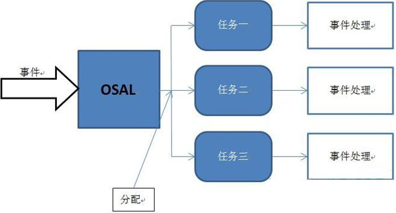

### 概述

&emsp;&emsp;`OSAL`(`Operating System Abstraction Layer`)，翻译为`操作系统抽象层`。`OSAL`就是一种支持多任务运行的系统资源分配机制，它与标准的操作系统还是有很大的区别。简单而言，`OSAL`实现了类似操作系统的某些功能，但并不能称之为真正意义上的操作系统。<!--more-->

### OSAL任务运行方式

&emsp;&emsp;我们以`TI 1.2.1`的`BLE`协议栈中的`SimpleBLEPeripheral`为例，分析一下`OSAL`。其中有一个`simpleBLEPeripheral.c`文件，里面有`2`个比较重要的函数：`SimpleBLEPeripheral_Init`和`SimpleBLEPeripheral_ProcessEvent`。`SimpleBLEPeripheral_Init`是任务的初始化函数，而`SimpleBLEPeripheral_ProcessEvent`则负责处理传递给此任务的事件。大概浏览一下`SimpleBLEPeripheral_ProcessEvent`这个函数，可以发现此函数的主要功能是判断由参数传递的事件类型，然后执行相应的事件处理函数。由此，可以推断出`BLE`协议栈应用程序的运行机制如下：



&emsp;&emsp;当有一个事件发生的时候，`OSAL`负责将此事件分配给能够处理此事件的任务，然后此任务判断事件的类型，调用相应的事件处理程序进行处理。明白了这个问题，新的问题又摆在了我们的面前：`OSAL`是如何传递事件给任务的。

### OSAL的事件传递机制

&emsp;&emsp;在试图弄清楚这个问题之前，我们需要弄清楚另外一个十分基础而重要的问题，那就是如何向我们的应用程序中添加一个任务。打开`OSAL_SimpleBLEPeripheral.c`文件，这里可以找到数组`tasksArr`和函数`osalInitTasks`。`TaskArr`这个数组里存放了所有任务的事件处理函数的地址，在这里事件处理函数就代表了任务本身，也就是说事件处理函数标识了与其对应的任务。`osalInitTasks`是`OSAL`的任务初始化函数，所有任务的初始化工作都在这里面完成，并且自动给每个任务分配一个`ID`。
&emsp;&emsp;要添加新任务，需要编写新任务的事件处理函数和初始化函数，然后将事件处理函数的地址加入此数组，最后在`osalInitTasks`中调用此任务的初始化函数。在此例中，`SimpleBLEPeripheral_ProcessEvent`这个函数被添加到了数组的末尾，`SimpleBLEPeripheral_Init`这个函数在`osalInitTasks`中被调用。
&emsp;&emsp;值得注意的是，`TaskArr`数组里各任务函数的排列顺序要与`osalInitTasks`函数中调用各任务初始化函数的顺序必须一致，只有这样才能够保证每个任务能够通过初始化函数接收到正确的任务`ID`。另外，为了保存任务初始化函数所接收的任务`ID`，我们需要给每一个任务定义一个全局变量来保存这个`ID`。在`SimpleBLEPeripheral.c`中定义了一个全局变量`SimpleBLEPeripheral_TaskID`，并且在`SimpleBLEPeripheral_Init`函数中进行了赋值：

``` cpp
SimpleBLEPeripheral_TaskID = task_id;
```

这条语句将分配给`SimpleBLEPeripheral`的任务`ID`保存了下来。到此，我们就给应用程序中完整的添加了一个任务。
&emsp;&emsp;我们回到`OSAL`如何将事件分配给任务这个问题上来，在`OSAL_SimpleBLEPeripheral.c`文件中，在定义`TaskArr`这个数组之后，又定义了两个全局变量：`tasksCnt`和`tasksEvents`。`tasksCnt`这个变量保存了当前的任务个数；`tasksEvents`是一个指向数组的指针，此数组保存了当前任务的状态。在任务初始化函数中做了如下操作：

``` cpp
tasksEvents = ( uint16 * ) osal_mem_alloc ( sizeof ( uint16 ) * tasksCnt );
osal_memset ( tasksEvents, 0, ( sizeof ( uint16 ) * tasksCnt ) );
```

&emsp;&emsp;`osal_mem_alloc`为当前`OSAL`中的各任务分配存储空间(实际上是一个任务数组)，函数返回指向任务缓冲区的指针，因此`tasksEvents`指向该任务数组(任务队列)。注意`tasksEvents`和`tasksArr`里的顺序是一一对应的，`tasksArr`中的第`i`个事件处理函数对应于`tasksEvents`中的第`i`个任务的事件；`osal_memset`把开辟的内存全部设置为`0`。`sizeof(uint16)`是`2`个字节，即一个任务的长度(任务函数同样是`uint16`定义)，乘以任务数量`tasksCnt`，即全部内存空间。我们可以看出所有任务的状态都被初始化为`0`，代表了当前任务没有需要响应的事件。
&emsp;&emsp;紧接着来到`main`函数，先来看`osal_init_system`这个函数。在此函数中，`osalInitTasks`被调用，从而`tasksEvents`中的所有内容被初始化为`0`。之后进入了`osal_start_system`函数，此函数为一个死循环，在这个循环中完成了所有的事件分配。首先来看这样一段代码：

``` cpp
do {
    if ( tasksEvents[idx] ) {
        break;
    }
} while ( ++idx < tasksCnt );
```

当`tasksEvents`这个数组中的某个元素不为`0`，即代表此任务有事件需要相应，事件类型取决于这个元素的值，这个`do-while`循环会选出当前优先级最高的需要响应的任务。

``` cpp
events = ( tasksArr[idx] ) ( idx, events );
```

此语句调用`tasksArr`数组里面相应的事件处理函数来响应事件。如果我们新添加的任务有了需要响应的事件，那么此任务的事件处理程序将会被调用。就这样，`OSAL`就将需要响应的事件传递给了对应的任务处理函数进行处理。`tasksArr[idx]`就是一个函数指针数组，里面存储的就是函数的指针：

``` cpp
const pTaskEventHandlerFn tasksArr[] = {
    LL_ProcessEvent,                 /* task 0  */
    Hal_ProcessEvent,                /* task 1  */
    HCI_ProcessEvent,                /* task 2  */
#if defined ( OSAL_CBTIMER_NUM_TASKS )
    OSAL_CBTIMER_PROCESS_EVENT ( osal_CbTimerProcessEvent ), /* task 3  */
#endif
    L2CAP_ProcessEvent,              /* task 4  */
    GAP_ProcessEvent,                /* task 5  */
    GATT_ProcessEvent,               /* task 6  */
    SM_ProcessEvent,                 /* task 7  */
    GAPRole_ProcessEvent,            /* task 8  */
    GAPBondMgr_ProcessEvent,         /* task 9  */
    GATTServApp_ProcessEvent,        /* task 10 */
    SimpleBLEPeripheral_ProcessEvent /* task 11 */
};
```

假设`idx = 11`，就是调用了`events = (tasksArr[11])(11, events)`，其实就是执行了`SimpleBLEPeripheral_ProcessEvent(11, events);`函数。

### 事件的捕获

&emsp;&emsp;不过接下来就有了更加深入的问题了：事件是如何被捕获的？直观一些来说就是，`tasksEvents`这个数组里的元素是什么时候被设定为非零数，来表示有事件需要处理的？为了详细的说明这个过程，我们将以`SimpleBLEPeripheral`这个例程中响应按键的过程来进行说明。其他的事件虽然稍有差别，却是大同小异。
&emsp;&emsp;按键在我们的应用里面应该属于硬件资源，所以`OSAL`理应为我们提供使用和管理这些硬件的服务。稍微留意一下之前说过的`tasksArr`这样一个数组，它保存了所有任务的事件处理函数。我们从中发现了一个很重要的信息：`Hal_ProcessEvent`。`HAL`(`Hardware Abstraction Layer`)翻译为`硬件抽象层`。许多人在这里经常把将`BLE`的硬件抽象层与物理层混为一谈。在这里，我们应该将`BLE`的硬件抽象层与物理层区分开来。硬件抽象层所包含的范围是我们当前硬件电路上面所有对于系统可用的设备资源；而物理层则是针对无线通信而言，它所包含的仅限于支持无线通讯的硬件设备。通过这个重要的信息，可以得出这样一个结论：`OSAL`将硬件的管理也作为一个任务来处理。那么我们很自然地去寻找`Hal_ProcessEvent`这个事件处理函数，看看它究竟是如何管理硬件资源的。
&emsp;&emsp;在`HAL\Commn\hal_drivers.c`这个文件中找到这个函数，我们直接分析与按键有关的一部分代码：

``` cpp
if ( events &HAL_KEY_EVENT ) {
#if (defined HAL_KEY) && (HAL_KEY == TRUE)
    HalKeyPoll(); /* Check for keys */

    if ( !Hal_KeyIntEnable ) { /* if interrupt disabled, do next polling */
        osal_start_timerEx ( Hal_TaskID, HAL_KEY_EVENT, 100 );
    }

#endif /* HAL_KEY */
    return events ^ HAL_KEY_EVENT;
}
```

&emsp;&emsp;在事件处理函数接收到`HAL_KEY_EVENT`这样一个事件后，首先执行`HalKeyPoll`函数。由于这个例程的按键采用查询的方法获取，所以是禁止中断的，于是表达式`!Hal_KeyIntEnable`的值为真。那么`osal_start_timerEx(Hal_TaskID, HAL_KEY_EVENT, 100)`得以执行。`osal_start_timerEx`这是一个很常用的函数，它在这里的功能是经过`100`毫秒后，向`Hal_TaskID`这个`ID`所标示的任务(也就是其本身)发送一个`HAL_KEY_EVENT`事件。这样以来，每经过`100`毫秒，`Hal_ProcessEvent`这个事件处理函数都会至少执行一次来处理`HAL_KEY_EVENT`事件，也就是说每隔`100`毫秒都会执行`HalKeyPoll`函数。
&emsp;&emsp;那么我们来看看`HalKeyPoll`函数到底在搞什么鬼！代码中给的注释为：

``` cpp
HalKeyPoll(); /* Check for keys */
```

我们推断这个函数的作用是检查当前的按键情况。进入函数一看，`keys`变量(在函数起始位置定义的)获得了当前按键的状态。最后有一个十分重要的函数调用：

``` cpp
( pHalKeyProcessFunction ) ( keys, HAL_KEY_STATE_NORMAL );
```

`pHalKeyProcessFunction`函数指针指向了如下函数：

``` cpp
void OnBoard_KeyCallback ( uint8 keys, uint8 state );
```

此函数在`OnBoard.c`文件中可以找到。这个函数又调用了：

``` cpp
void OnBoard_KeyCallback ( uint8 keys, uint8 state );
```

在这个函数中，按键的状态信息被封装到了一个消息结构体中。最后有一个极其重要的函数被调用了：

``` cpp
osal_msg_send ( registeredKeysTaskID, ( uint8 * ) msgPtr );
```

与前面的`pHalKeyProcessFunction`相同，先直接告诉大家`registeredKeysTaskID`所指示的任务正是我们需要响应按键的`SimpleBLEPeripheral`这个任务。也就是说，在这里我们向`SimpleBLEPeripheral`发送了一个附带按键信息的消息。在`osal_msg_send`函数中：

``` cpp
osal_set_event ( destination_task, SYS_EVENT_MSG );
```

将被调用，它在这里的作用是设置`destination_task`这个任务的事件为`SYS_EVENT_MSG`。而这个`destination_task`正式由`osal_msg_send`这个函数通过参数传递而来的，它也指示的是`SimpleBLEPeripheral`这个任务。在`osal_set_event`这个函数中，有这样一个语句：

``` cpp
tasksEvents[task_id] |= event_flag;
```

至此，刚才所提到的问题得到了解决。我们再将这个过程整理一遍。
&emsp;&emsp;首先`OSAL`专门建立了一个任务来对硬件资源进行管理，这个任务的事件处理函数是`Hal_ProcessEvent`。在这个函数中通过调用`osal_start_timerEx(Hal_TaskID, HAL_KEY_EVENT, 100);`这个函数使得每隔`100`毫秒就会执行一次`HalKeyPoll`函数。`HalKeyPoll`获取当前按键的状态，并且通过调用`OnBoard_KeyCallback`函数向`SimpleBLEPeripheral`任务发送一个按键消息，并且设置`tasksEvents`中`SimpleBLEPeripheral`所对应的值为非零。如此，当`main`函数里这样一段代码：

``` cpp
do {
    if ( tasksEvents[idx] ) {
        break;
    }
} while ( ++idx < tasksCnt );
```

执行了该代码以后，`SimpleBLEPeripheral`这个任务就会被挑选出来。然后通过：

``` cpp
events = ( tasksArr[idx] ) ( idx, events );
```

这个函数调用其事件处理函数，完成事件的响应。现在，我们回过头来处理我们之前遗留下来的问题。
&emsp;&emsp;1. `pHalKeyProcessFunction`这个函数指针为何指向了`OnBoard_KeyCallback`函数。在`HAL\Common\hal_drivers.c`这个文件中，我们找到了`HalDriverInit`这个函数，在这个函数中，按键的初始化函数`HalKeyInit`被调用。在`HalKeyInit`中有这样的语句：

``` cpp
pHalKeyProcessFunction = NULL;
```

这说明在初始化以后`pHalKeyProcessFunction`并没有指向任何一个函数。那么`pHalKeyProcessFunction`是什么时候被赋值的呢？就在`HalKeyInit`的下方有一个这样的函数`HalKeyConfig`。其中有这样一条语句：

``` cpp
pHalKeyProcessFunction = cback;
```

`cback`是`HalKeyConfig`所传进来的参数，所以想要知道它所指向的函数，必须找到其调用的地方。在`main`函数中有这样一个函数调用：`InitBoard(OB_READY);`，此函数中做了如下调用：

``` cpp
HalKeyConfig ( OnboardKeyIntEnable, OnBoard_KeyCallback );
```

&emsp;&emsp;2. `registeredKeysTaskID`为什么标识了`SimpleBLEPeripheral`这个任务？由于`OSAL`是一个支持多任务的调度机制，所以在同一时间内将会有多个任务同时运行。但是从逻辑上来讲，一个事件只能由一个任务来处理，按键事件也不例外。那么如何向`OSAL`声明处理按键事件的任务是`SimpleBLEPeripheral`呢？在`SimpleBLEPeripheral_Init`(`SimpleBLEPeripheral`的任务初始化函数)中有这么一个语句：

``` cpp
RegisterForKeys ( SimpleBLEPeripheral_TaskID );
```

`RegisterForKeys`函数向`OSAL`声明按键事件将由`SimpleBLEPeripheral`任务来处理。在`RegisterForKeys`函数中：

``` cpp
registeredKeysTaskID = task_id;
```

我想我不用再做多余的解释了。

### 消息队列

&emsp;&emsp;首先我需要向大家解释清楚消息与事件的联系。事件是驱动任务去执行某些操作的条件，当系统产生了一个事件，将这个传递给相应的任务后，任务才能执行一个相应的操作。但是某些事件在它发生的同时，又伴随着一些附加信息的产生。任务的事件处理函数在处理这个事件的时候，还需要参考其附加信息。最典型的一类便是按键消息，它同时产生了一个哪个按键被按下了附加信息。所以在`OnBoard_SendKeys`这个函数中，不仅向`SimpleBLEPeripheral`发送了事件，还通过调用`osal_msg_send`函数向`SimpleBLEPeripheral`发送了一个消息，这个消息记录了这个事件的附加信息。在`SimpleBLEPeripheral_ProcessEvent`中，通过：

``` cpp
MSGpkt = ( afIncomingMSGPacket_t * ) osal_msg_receive ( SimpleBLEPeripheral_TaskID );
```

获取了这样一个消息，然后再进一步处理。`OSAL`在后台维护了一个消息队列，每一个消息都会被放到这个消息队列中去，当任务接收到事件以后，从消息队列中获取属于自己的消息，然后进行处理。

---

&emsp;&emsp;首先看的当然是`main`函数：

``` cpp
int main ( void ) {
    osal_int_disable ( INTS_ALL ); /* Turn off interrupts 关闭全局中断“EA = 0”，初始化过程不响应任何中断 */
    HAL_BOARD_INIT(); /* Initialization for board related stuff such as LEDs 配置了时钟、LED、串口 */
    zmain_vdd_check(); /* Make sure supply voltage is high enough to run 检查电源电压 */
    zmain_ram_init();/* Initialize stack memory 初始化堆内存 */
    InitBoard ( OB_COLD ); /* Initialize board I/O 初始化板子用到的IO口 */
    HalDriverInit(); /*Initialze HAL drivers 初始化外设 */
    osal_nv_init ( NULL ); /* Initialize NV System 系统初始化 */
    zgInit(); /* Initialize basic NV items 任务初始化 */
    ZMacInit(); /* Initialize the MAC */
    zmain_ext_addr(); /* Determine the extended address 确定长地址 */
#ifndef NONWK
    afInit(); /* Since the AF isn't a task, call it's initialization routine */
#endif
    osal_init_system(); /* Initialize the operating system 系统初始化 */
    osal_int_enable ( INTS_ALL ); /* Allow interrupts 使能中断 */
    InitBoard ( OB_READY ); /* Final board initialization 后期初始化 */
    zmain_dev_info(); /* Display information about this device 显示设备信息 */
#ifdef LCD_SUPPORTED
    zmain_lcd_init(); /* Display the device info on the LCD */
#endif
#ifdef WDT_IN_PM1
    WatchDogEnable ( WDTIMX ); /* If WDT is used, this is a good place to enable it 使用看门狗 */
#endif
    osal_start_system(); /* No Return from here 正常情况下不返回 */
    return ( 0 );
}
```

其中含有`osal`的都是与操作系统相关的。这里主要提一下这些函数：

``` cpp
HalDriverInit(); /* Initialze HAL drivers 初始化外设 */
```

片内外设与片外外设基本上在这个函数中初始化，像`Timer`、`DMA`、`LCD`等，该函数调用后设备即可使用。

``` cpp
zgInit(); /* Initialize basic NV items */
```

这个函数通过调用：

``` cpp
zgInitItems ( setDefault ); /* Initialize the items table */
```

初始化了数组`zgItemTable`(`ZGlobal Item Table`)。
&emsp;&emsp;我们讨论的任务在如下函数中调用`osalInitTasks`进行初始化：

``` cpp
osal_init_system(); /* Initialize the operating system */
```

在该函数中为每一个任务分配了一个`ID`号，这个`ID`号在任务切换的时候将用到。该函数中的初始化函数的顺序与函数指针数组`const pTaskEventHandlerFn tasksArr[];`中对应的任务的顺序是一致的，这一点不难理解，就是为了保证任务与`ID`号的对应。该函数中还有这么两条语句值得注意：

``` cpp
tasksEvents = ( uint16 * ) osal_mem_alloc ( sizeof ( uint16 ) * tasksCnt ); /* 申请空间，用于存放任务 */
osal_memset ( tasksEvents, 0, ( sizeof ( uint16 ) * tasksCnt ) ); /* 用0初始化申请到的空间 */
```

`tasksEvents`是一个指针，任务切换的时候就是通过`tasksEvents`来查找需要处理的任务。`tasksEvents`指向的对象保存的是对应任务的掩码。最后通过调用如下函数启动操作系统：

``` cpp
osal_start_system(); /* No Return from here */
```

该函数正常情况下是不返回的。然后所有的任务都在这个`for`循环中被处理：

``` cpp
#if !defined ( ZBIT ) && !defined ( UBIT )
for ( ;; ) /* Forever Loop */
#endif
{
    uint8 idx = 0;
    osalTimeUpdate(); /* 定时器任务更新 */
    Hal_ProcessPoll(); /* This replaces MT_SerialPoll() and osal_check_timer() 轮询处理 */

    do {
        if ( tasksEvents[idx] ) { /* Task is highest priority that is ready 查找优先级最高的任务 */
            break;
        }
    } while ( ++idx < tasksCnt ); /* tasksCnt为总的任务数 */

    if ( idx < tasksCnt ) { /* 任务数检查 */
        uint16 events;
        halIntState_t intState;
        HAL_ENTER_CRITICAL_SECTION ( intState ); /* 保存中断状态 */
        events = tasksEvents[idx]; /* 取出任务后立即清除 */
        tasksEvents[idx] = 0; /* Clear the Events for this task */
        HAL_EXIT_CRITICAL_SECTION ( intState ); /* 恢复中断状态 */
        events = ( tasksArr[idx] ) ( idx, events ); /* 执行任务，返回值是未处理的事件的掩码 */
        HAL_ENTER_CRITICAL_SECTION ( intState );
        /* Add back unprocessed events to the current task 添加未被处理的任务 */
        tasksEvents[idx] |= events;
        HAL_EXIT_CRITICAL_SECTION ( intState );
    }

#if defined( POWER_SAVING )
    else { /* Complete pass through all task events with no activity */
        osal_pwrmgr_powerconserve(); /* Put the processor/system into sleep 当任务ID号出错时进入睡眠 */
    }

#endif
}
```

&emsp;&emsp;当有任务需要处理时，便调用函数`osal_set_event`添加任务：

``` cpp
/*----------------------------------------------------------------
 * This function is called to set the event flags for a task.
 * The event passed in is OR'd into the task's event variable.
 * 设置事件标志，这些事件保存到变量task
 * uint8 task_id - receiving tasks ID
 * uint8 event_flag - what event to set
-----------------------------------------------------------------*/
uint8 osal_set_event ( uint8 task_id, uint16 event_flag ) {
    if ( task_id < tasksCnt ) { /* 正确的ID */
        halIntState_t intState;
        HAL_ENTER_CRITICAL_SECTION ( intState ); /* Hold off interrupts */
        tasksEvents[task_id] |= event_flag; /* Stuff the event bit(s) 添加需要处理的事件的掩码 */
        HAL_EXIT_CRITICAL_SECTION ( intState ); /* Release interrupts */
    } else {
        return ( INVALID_TASK );
    }

    return ( SUCCESS );
}
```

再看函数`osal_start_system`，对于`tasksEvents`就比较清楚了。在所有调用`osal_set_event`的函数中，比较值得关注的是`osalTimerUpdate`，先来看看函数体：

``` cpp
/*-----------------------------------------------------
 * Update the timer structures for a timer tick.
 * 更新定时器任务
-----------------------------------------------------*/
void osalTimerUpdate ( uint16 updateTime ) {
    halIntState_t intState;
    osalTimerRec_t *srchTimer;
    osalTimerRec_t *prevTimer;
    HAL_ENTER_CRITICAL_SECTION ( intState ); /* Hold off interrupts 保存中断状态 */
    osal_systemClock += updateTime; /* Update the system time 更新系统时间 */
    HAL_EXIT_CRITICAL_SECTION ( intState ); /* Re-enable interrupts 恢复中断状态 */

    if ( timerHead != NULL ) { /* Look for open timer slot */
        srchTimer = timerHead; /* Add it to the end of the timer list 添加到定时器列表 */
        prevTimer = ( void * ) NULL;

        while ( srchTimer ) { /* Look for open timer slot 遍历链表 */
            osalTimerRec_t *freeTimer = NULL;
            HAL_ENTER_CRITICAL_SECTION ( intState ); /* Hold off interrupts */

            if ( srchTimer->timeout <= updateTime ) { /* 超时检查 */
                srchTimer->timeout = 0;
            } else {
                srchTimer->timeout = srchTimer->timeout - updateTime;
            }

            /* When timeout or delete (event_flag == 0) 需要处理的事件 */
            if ( srchTimer->timeout == 0 || srchTimer->event_flag == 0 ) {
                if ( prevTimer == NULL ) { /* Take out of list */
                    timerHead = srchTimer->next;
                } else {
                    prevTimer->next = srchTimer->next;
                }

                freeTimer = srchTimer; /* Setup to free memory 设置要被释放的资源 */
                srchTimer = srchTimer->next; /* Next */
            } else {
                prevTimer = srchTimer; /* Get next 下一个任务 */
                srchTimer = srchTimer->next;
            }

            HAL_EXIT_CRITICAL_SECTION ( intState ); /* Re-enable interrupts */

            if ( freeTimer ) { /* 释放任务 */
                if ( freeTimer->timeout == 0 ) {
                    /* 时间到了，设置事件标志以等待处理 */
                    osal_set_event ( freeTimer->task_id, freeTimer->event_flag );
                }

                osal_mem_free ( freeTimer ); /* 释放该定时器任务的资源 */
            }
        }
    }
}
```

在我所使用的版本中，该函数只被两个函数调用，分别是：

``` cpp
/* Update the timer structures for elapsed ticks */
void osal_adjust_timers ( void ) {
    uint16 eTime;

    if ( timerHead != NULL ) {
        eTime = TimerElapsed() / TICK_COUNT; /* Compute elapsed time (msec) */

        if ( eTime ) {
            osalTimerUpdate ( eTime );
        }
    }
}

/*------------------------------------------------------------------------
 * Uses the free running rollover count of the MAC backoff timer;
 * this timer runs freely with a constant 320 usec interval. The
 * count of 320-usec ticks is converted to msecs and used to update
 * the OSAL clock and Timers by invoking osalClockUpdate() and
 * osalTimerUpdate(). This function is intended to be invoked
 * from the background, not interrupt level.
------------------------------------------------------------------------*/
void osalTimeUpdate ( void ) { /* 定时器任务更新 */
    uint16 tmp;
    uint16 ticks320us;
    uint16 elapsedMSec = 0;
    /* Get the free-running count of 320us timer ticks 设置时间片 */
    tmp = macMcuPrecisionCount(); /* 获取溢出值，该溢出值是一个累计的溢出值 */

    if ( tmp != previousMacTimerTick ) { /* 相等则代表没有溢出 */
        /* Calculate the elapsed ticks of the free-running timer 计算已经消耗的时间 */
        ticks320us = tmp - previousMacTimerTick;
        /* Store the MAC Timer tick count for the next time through this function 保存当前时间 */
        previousMacTimerTick = tmp;

        /* It is necessary to loop to convert the usecs to msecs in increments so as not to
           overflow the 16-bit variables. 这是必要的循环转换usecs毫秒的增量，以免溢出16位变量 */
        while ( ticks320us > MAXCALCTICKS ) {
            ticks320us -= MAXCALCTICKS;
            elapsedMSec += MAXCALCTICKS * 8 / 25;
            remUsTicks += MAXCALCTICKS * 8 % 25;
        }

        /* update converted number with remaining ticks from loop and the accumulated remainder from loop */
        tmp = ( ticks320us * 8 ) + remUsTicks;
        /* Convert the 320 us ticks into milliseconds and a remainder */
        elapsedMSec += tmp / 25;
        remUsTicks = tmp % 25;

        if ( elapsedMSec ) { /* Update OSAL Clock and Timers 更新系统定时器 */
            osalClockUpdate ( elapsedMSec ); /* 更新系统时间 */
            osalTimerUpdate ( elapsedMSec ); /* 更新定时器任务，并设置需要处理的任务的掩码标志 */
        }
    }
}
```

都是跟定时器相关的。在函数`osalTimerUpdate`开头定义了两个指针：

``` cpp
osalTimerRec_t *srchTimer;
osalTimerRec_t *prevTimer;
```

其结构`osalTimerRec_t`定义为：

``` cpp
typedef struct {
    void *next;
    uint16 timeout;
    uint16 event_flag;
    uint8 task_id;
} osalTimerRec_t;
```

操作一个单向链表，链表头为`timerHead`，该链表中保存了所有需要定时执行的任务，这些任务在函数`osalAddTimer`中被创建。而该函数只被`osal_start_timerEx`调用：

``` cpp
uint8 osal_start_timerEx ( uint8 taskID, uint16 event_id, uint16 timeout_value ) {
    halIntState_t intState;
    osalTimerRec_t *newTimer;
    HAL_ENTER_CRITICAL_SECTION ( intState ); /* Hold off interrupts 保存中断状态 */
    newTimer = osalAddTimer ( taskID, event_id , timeout_value ); /* Add timer 添加定时器任务 */
    HAL_EXIT_CRITICAL_SECTION ( intState ); /* Re-enable interrupts */
    return ( ( newTimer != NULL ) ? SUCCESS : NO_TIMER_AVAIL );
}
```

其中`event_id`跟如下函数中`event_flag`的作用是一样的，都是最后被写入到`tasksEvents`中的掩码。

``` cpp
uint8 osal_set_event ( uint8 task_id, uint16 event_flag );
```

通过函数`osal_set_event`更改`tasksEvents`：

``` cpp
tasksEvents[task_id] |= event_flag; /* Stuff the event bit(s) 添加需要处理的事件的掩码 */
```

函数`osal_start_timerEx`使用结构`osalTimerRec_t`临时保存`newTimer->event_flag = event_flag;`。最后通过在主循环中调用`osalTimeUpdate`，通过代码：

``` cpp
if ( freeTimer ) { /* 释放任务 */
    if ( freeTimer->timeout == 0 ) {
        /* 时间到了，设置事件标志以等待处理 */
        osal_set_event ( freeTimer->task_id, freeTimer->event_flag );
    }

    osal_mem_free ( freeTimer ); /* 释放该定时器任务的资源 */
}
```

最后还是调用函数`osal_set_event`对`tasksEvents`进行更改。当一个任务处理完毕时在主循环中清除相应的掩码。
&emsp;&emsp;当然，当一开始进入函数`osal_start_system`中时，应该是没有任务的。这个时候，任务是通过中断层层调用，最后还是调用函数`osal_set_event`添加任务。在`ZigBee`协议栈中，中断函数是通过宏来实现的。这些宏在`Hal_mcu.h`文件中定义：

``` cpp
#define _PRAGMA(x)                     _Pragma(#x)
#define HAL_ISR_FUNC_DECLARATION(f, v) _PRAGMA(vector=v) __near_func __interrupt void f(void)
#define HAL_ISR_FUNC_PROTOTYPE(f, v)   _PRAGMA(vector=v) __near_func __interrupt void f(void)
#define HAL_ISR_FUNCTION(f, v)         HAL_ISR_FUNC_PROTOTYPE(f, v); HAL_ISR_FUNC_DECLARATION(f, v)
```

当需要编写一个中断函数实体，使用宏`HAL_ISR_FUNCTION(f,v)`：

``` cpp
HAL_ISR_FUNCTION ( halKeyPort0Isr, P0INT_VECTOR ) { /* P0口中断服务函数 */
    if ( ( HAL_KEY_SW_6_PXIFG & HAL_KEY_SW_6_BIT ) || ( HAL_KEY_SW_7_PXIFG & HAL_KEY_SW_7_BIT ) ) {
        halProcessKeyInterrupt();
    }

    /* Clear the CPU interrupt flag for Port_0 PxIFG has to be cleared before PxIF 清除中断标志 */
    HAL_KEY_SW_6_PXIFG = 0;
    HAL_KEY_CPU_PORT_0_IF = 0;
}

HAL_ISR_FUNCTION ( halTimer1Isr, T1_VECTOR ) { /* 定时器1中断服务函数 */
    halProcessTimer1 ();
}

HAL_ISR_FUNCTION ( macMcuRfIsr, RF_VECTOR ) /* RF中断服务函数 */
```

只要对这些宏进行展开，就得到了`CC2530`中断服务函数的形式。下面就来看一下中断服务函数是怎样添加任务的。`P0`口中断服务函数调用了函数`halProcessKeyInterrupt`：

``` cpp
/*--------------------------------------------------------------------------------------
 * Checks to see if it's a valid key interrupt, saves interrupt driven key states for
 * processing by HalKeyRead(), and debounces keys by scheduling HalKeyRead() 25ms later.
---------------------------------------------------------------------------------------*/
void halProcessKeyInterrupt ( void ) {
    bool valid = FALSE;

    /* 检查中断源 */
    if ( HAL_KEY_SW_6_PXIFG & HAL_KEY_SW_6_BIT ) { /* Interrupt Flag has been set */
        HAL_KEY_SW_6_PXIFG = ~ ( HAL_KEY_SW_6_BIT ); /* Clear Interrupt Flag */
        valid = TRUE;
    }

    if ( HAL_KEY_SW_7_PXIFG & HAL_KEY_SW_7_BIT ) { /* Interrupt Flag has been set */
        HAL_KEY_SW_7_PXIFG = ~ ( HAL_KEY_SW_7_BIT ); /* Clear Interrupt Flag */
        valid = TRUE;
    }

    if ( HAL_KEY_JOY_MOVE_PXIFG & HAL_KEY_JOY_MOVE_BIT ) { /* Interrupt Flag has been set */
        HAL_KEY_JOY_MOVE_PXIFG = ~ ( HAL_KEY_JOY_MOVE_BIT ); /* Clear Interrupt Flag */
        valid = TRUE;
    }

    if ( valid ) { /* 添加定时器任务 */
        /* 使用定时器定时触发任务 */
        osal_start_timerEx ( Hal_TaskID, HAL_KEY_EVENT, HAL_KEY_DEBOUNCE_VALUE );
    }
}
```

在函数`osal_start_timerEx`中添加了一个定时任务，其中`ID`号就不用多说了，`HAL_KEY_EVENT`是将要被添加到`tasksEvents`的任务的掩码，`HAL_KEY_DEBOUNCE_VALUE`则是用来进行消抖的一个时间值。当按键按下时会产生抖动，而通常消抖的方法是延时。所以我们也可以知道，在这里产生`IO`口中断的是按键。并不是每个中断都必须添加对应的任务，例如定时器中断。在中断服务函数中，是否添加对应的任务应视具体情况而定。