### Zigbee协议栈简介

&emsp;&emsp;协议是一系列的通信标准，通信双方需要按照这一标准进行正常的数据发射和接收。协议栈是协议的具体实现形式，通俗讲协议栈就是协议和用户之间的一个接口，开发人员通过使用协议栈来使用这个协议，进而实现无线数据收发。<!--more-->
&emsp;&emsp;`Zigbee`协议分为两部分，`IEEE 802.15.4`定义了`PHY`(物理层)和`MAC`(介质访问层)技术规范；`Zigbee`联盟定义了`NWK`(网络层)、`APS`(应用程序支持层)、`APL`(应用层)技术规范。`Zigbee`协议栈就是将各个层定义的协议都集合在一起，以函数的形式实现，并给用户提供`API`(应用层)，用户可以直接调用。

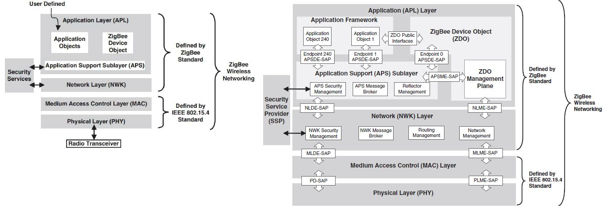

### 如何理解Zigbee协议栈

&emsp;&emsp;协议栈是协议的实现，可以理解为代码库函数，供上层应用调用，协议较底下的层与应用是相互独立的。商业化的协议栈只提供给你接口(其实和互联网行业的`API`模式很像)，就像你调用地图`API`时不需要关心底层地图是怎么根据位置或坐标绘制的，你也不用关心协议栈底层的实现，除非你想做协议研究。每个厂家的协议栈是有区别的，比如`TI`的`BLE`协议栈和`nordic`的`BLE`协议栈就有很大的不同(多说一点，`TI`的`BLE`协议栈更像是安卓的`BLE`结构，所以会安卓蓝牙的人可能会看懂`TI`的代码)。
&emsp;&emsp;`TI`推出的`ZigBee 2007`协议栈也称为`Z-Stack`，它是挪威半导体公司`Chipcon`(目前已经被`TI`公司收购)推出其`CC2430`开发平台时，开发的一款业界领先的商业级协议栈软件。由于这个协议栈软件的出现，用户可以很容易地开发出具体的应用程序来，也就是大家说的掌握`10`个函数就能使用`ZigBee`通讯的原因。`Chipcon`公司为自己设计的`Z-Stack`协议栈中提供了一个名为操作系统抽象层`OSAL`的协议栈调度程序。对于用户来说，除了能够看到这个调度程序外，其它任何协议栈操作的具体实现细节都被封装在库代码中。用户在进行具体的应用开发时只能够通过调用`API`接口来进行，而无法知道`ZigBee`协议栈实现的具体细节，也没必要去知道。
&emsp;&emsp;下图是`TI`公司的基于`ZigBee 2007`的协议栈`Z-Stack-CC2530-2.3.0`，所有文件目录如红色框所示，我们可以把它看做一个庞大的工程，或者是一个小型的操作系统，采用任务轮询的方法运行。

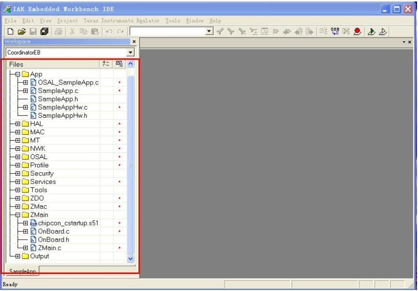

### 如何使用Zigbee协议栈

&emsp;&emsp;以简单的无线数据通信为例，其一般步骤为：

- 组网：调用协议栈组网函数、加入网络函数，实现网络的建立和节点的加入。
- 发送：发送节点调用协议栈的发送函数，实现数据无线发送。
- 接收：接收节点调用协议栈的无线接收函数，实现无线数据接收。

&emsp;&emsp;由于协议栈都把这些函数都封装好了，因此我们用起来比较方便。大家可以了解一下下面的关键字：

- `CCM`：`Counter with CBC-MAC`(`mode of operation`)
- `HAL`：`Hardware Abstraction Layer`(硬件抽象层)
- `PAN`：`Personal Area Network`(个人局域网)
- `RF`：`Radio Frequency`(射频)
- `RSSI`：`Received Signal Strength Indicator`(接收信号强度指示)

&emsp;&emsp;`CC2530 BasicRF`文件夹结构如下图：

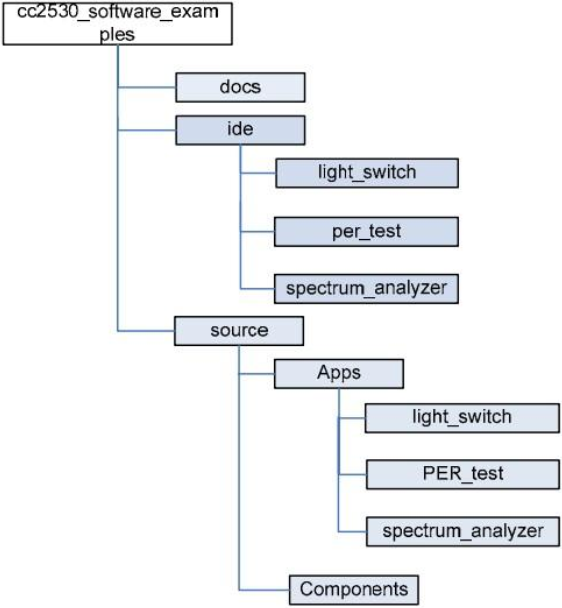

- `docs`文件夹：打开文件夹，里面仅有一个名为`CC2530_Software_Examples`的`PDF`文档，文档的主要内容是介绍`Basic RF`的特点、结构及使用。从中我们可以知道，里面`Basic RF`包含三个实验例程：无线点灯、传输质量检测、谱分析应用。
- `Ide`文件夹：打开文件夹后会有三个文件夹，以及一个`cc2530_sw_examples.eww`工程，这个工程是上面提及的三个实验例程工程的集合。在`IAR`环境中打开该工程，在`workspace`看到如下文件夹：`Ide\Settings`文件夹是在每个基础实验的文件夹里都会有的，它用于保存读者自己的IAR环境设置；`Ide\srf05_CC2530`文件夹里面放有三个工程，即`light_switch.eww`、`per_test.eww`和`spectrum_analyzer.eww`。
- `Source`文件夹：该文件夹里面有`apps`文件夹和`components`文件夹。`Source\apps`文件夹存放`Basic RF`三个实验的应用实现的源代码；`Source\components`文件夹包含着`Basic RF`的应用程序使用不同组件的源代码。

&emsp;&emsp;打开文件夹`WeBee CC2530 BasicRF\ide\srf05_cc2530\iar`路径里面的工程`light_switch.eww`(无线点灯)，我们的实验就是对它进行修改的。在介绍`Basic RF`之前，来看看这个实验例程设计的大体结构。

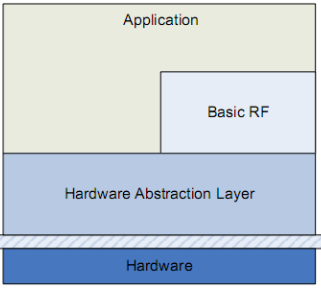

- `Hardware layer`：这是实现数据传输的基础。
- `Hardware Abstraction layer`：它提供了一种接口来访问`TIMER`、`GPIO`、`UART`、`ADC`等，这些接口都通过相应的函数进行实现。
- `Basic RF layer`：为双向无线传输提供一种简单的协议。
- `Application layer`：它是用户应用层，相当于用户使用`Basic RF`层和`HAL`的接口。我们通过在`Application layer`就可以使用到封装好的`Basic RF`和`HAL`的函数。

&emsp;&emsp;`Basic RF`由`TI`公司提供，它包含了`IEEE 802.15.4`标准的数据包的收发功能，但并没有使用到协议栈，仅仅让两个结点进行简单的通信。也就是说，`Basic RF`仅仅是包含`IEEE 802.15.4`标准的一小部分。其主要特点有：

1. 不会自动加入协议，也不会自动扫描其他节点也没有组网指示灯(`LED3`)。
2. 没有协议栈里面所说的协调器、路由器或者终端的区分，节点的地位都是相等的。
3. 没有自动重发的功能。

&emsp;&emsp;`Basic RF layer`为双向无线通信提供了一个简单的协议，通过这个协议能够进行数据的发送和接收。`Basic RF`还提供了安全通信所使用的`CCM-64`身份验证和数据加密，它的安全性读者可以通过在工程文件里面定义`SECURITY_CCM`，在`Project -> Option`里面就可以选择。本次实验并不是什么高度机密，所以在`SECURITY_CCM`前面带`x`了：

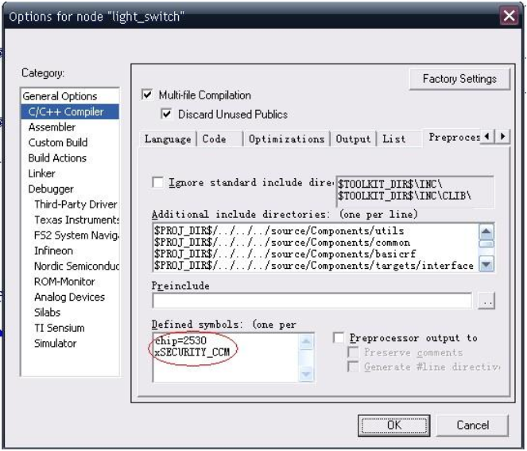

&emsp;&emsp;`Basic RF`的工作过程有启动、发射和接收。使用`Basic RF`实现无线传输只要学会使用这些过程的相应函数就可以了。
&emsp;&emsp;启动的要求如下：
&emsp;&emsp;1. 确保外围器件没有问题。
&emsp;&emsp;2. 创建一个`basicRfCfg_t`的数据结构，并初始化其中的成员，在`basic_rf.h`代码中可以找到：

``` cpp
typedef struct {
    uint16 myAddr;    /* 16位的短地址(就是节点的地址) */
    uint16 panId;     /* 节点的“PAN ID”             */
    uint8 channel;    /* RF通道(必须在11至26之间     */
    uint8 ackRequest; /* 目标确认就置为true          */
#ifdef SECURITY_CCM   /* 是否加密，预定义里取消了加密 */
    uint8 *securityKey;
    uint8 *securityNonce;
#endif
} basicRfCfg_t;
```

&emsp;&emsp;3. 调用`basicRfInit`函数进行协议的初始化，在`basic_rf.c`代码中可以找到：

``` cpp
uint8 basicRfInit ( basicRfCfg_t *pRfConfig );
```

函数功能是对`Basic RF`的数据结构初始化，设置模块的传输通道、短地址和`PAD ID`。
&emsp;&emsp;发送过程如下：
&emsp;&emsp;1. 创建一个`buffer`，把`payload`放入其中，`Payload`不大于`103`个字节。
&emsp;&emsp;2. 调用`basicRfSendPacket`函数发送，并查看其返回值。在`basic_rf.c`中可以找到：

``` cpp
uint8 basicRfSendPacket ( uint16 destAddr, uint8 *pPayload, uint8 length )
```

参数`destAddr`是目的短地址，`pPayload`是指向发送缓冲区的指针，`length`是发送数据长度。函数功能是给目的短地址发送指定长度的数据，发送成功刚返回`SUCCESS`，失败则返回`FAILED`。
&emsp;&emsp;接收过程如下：
&emsp;&emsp;1. 上层通过`basicRfPacketIsReady`函数来检查是否收到一个新数据包。在`basic_rf.c`中可以找到：

``` cpp
uint8 basicRfPacketIsReady ( void );
```

函数功能是检查模块是否已经可以接收下一个数据，如果准备好了，则返回`TRUE`。
&emsp;&emsp;2. 调用`basicRfReceive`函数，把收到的数据复制到`buffer`中。代码可以在`basic_rf.c`中找到：

``` cpp
uint8 basicRfReceive ( uint8 *pRxData, uint8 len, int16 *pRssi );
```

函数功能是接收来自`Basic RF`层的数据包，并为所接收的数据和`RSSI`值配缓冲区。

### 无线点灯示例

&emsp;&emsp;`light_switch.c`代码详解：无论你看哪个实验的代码，首先要找的就是`main`函数：

``` cpp
void main ( void ) {
    uint8 appMode = NONE; /* 不设置模块的模式 */
    /* Config basicRF */
    basicRfConfig.panId = PAN_ID;
    basicRfConfig.channel = RF_CHANNEL;
    basicRfConfig.ackRequest = TRUE;
#ifdef SECURITY_CCM /* 密钥安全通信，本例程不加密 */
    basicRfConfig.securityKey = key;
#endif
    /* Initalise board peripherals 初始化外围设备 */
    halBoardInit();
    halJoystickInit();
    /* Initalise hal_rf 对硬件抽象层的rf进行初始化 */
    if ( halRfInit() = = FAILED ) {
        HAL_ASSERT ( FALSE );
    }
    /*-----------根据WeBee学习底板配置----------*/
    halLedClear ( 2 ); /* 关LED2 */
    halLedClear ( 1 ); /* 关LED1 */
    /*-----选择性下载程序，发送模块和接收模块-----*/
    appSwitch(); /* 节点为按键S1，引脚为P0_0 */
    appLight(); /* 节点为指示灯LED1，引脚为P1_0 */
    /* Role is undefined. This code should not be reached */
    HAL_ASSERT ( FALSE );
}
```

- 第`20`至`21`行：关闭`WeBee`底板的`LED2`和`LED1`。`halLedSet(x)`是使灯点亮，`halLedClear(x)`是使灯熄灭。
- 第`23`至`24`行：选择其中的一行，并把另外一行屏蔽掉。一个是实现发射按键信息的功能，另一个是接收按键信息并改变`LED`状态，分别为`Basic RF`发射和接收。不同模块在烧写程序时选择不同功能。

注意，程序会在`appSwitch`函数或者`appLight`函数里面循环或者等待，不会执行到第`26`行。
&emsp;&emsp;接下来看`appSwitch`函数：

``` cpp
static void appSwitch() {
#ifdef ASSY_EXP4618_CC2420
    halLcdClearLine ( 1 );
    halLcdWriteSymbol ( HAL_LCD_SYMBOL_TX, 1 );
#endif
    /* Initialize BasicRF */
    basicRfConfig.myAddr = SWITCH_ADDR;

    if ( basicRfInit ( &basicRfConfig ) == FAILED ) {
        HAL_ASSERT ( FALSE );
    }

    pTxData[0] = LIGHT_TOGGLE_CMD;
    /* Keep Receiver off when not needed to save power */
    basicRfReceiveOff();

    /* Main loop */
    while ( TRUE ) { /* 程序进入死循环 */
        if ( halButtonPushed() == HAL_BUTTON_1 ) { /* 按键S1被按下 */
            basicRfSendPacket ( LIGHT_ADDR, pTxData, APP_PAYLOAD_LENGTH );
            /* Put MCU to sleep. It will wake up on joystick interrupt */
            halIntOff();
            halMcuSetLowPowerMode ( HAL_MCU_LPM_3 ); /* Will turn on global */
            /* interrupt enable */
            halIntOn();
        }
    }
}
```

- 第`2`至`5`行：`TI`学习板上的液晶模块的定义，我们不用管它。
- 第`7`至`11`行：`Basic RF`启动中的初始化，就是上面所讲的`Basic RF`启动的第`3`步。
- 第`13`行：`Basic RF`发射第`1`步，把要发射的数据或者命令放入一个数据`buffer`，此处把灯状态改变的命令`LIGHT_TOGGLE_CMD`放到`pTxData`中。
- 第`15`行：由于模块只需要发射，所以把接收屏蔽掉以降低功耗。
- 第`19`行：`if(halButtonPushed() == HAL_BUTTON_1)`判断按键`S1`是否被按下。函数`halButtonPushed`是`halButton.c`里面的，它的功能是：按键`S1`有被按动时，就回返回`true`，则进入`basicRfSendPacket(LIGHT_ADDR, pTxData, APP_PAYLOAD_LENGTH);`。
- 第`20`行：`Basic RF`发射第`2`步，也是发送数据最关键的一步，函数功能在前面已经讲述。`basicRfSendPacket(LIGHT_ADDR, pTxData, APP_PAYLOAD_LENGTH)`将`LIGHT_ADDR`、`pTxData`、`APP_PAYLOAD_LENGTH`的实参写出来就是`basicRfSendPacket(0xBEEF, pTxData[0], 1)`，实际上就是把字节长度为`1`的命令，发送到地址`0xBEEF`。
- 第`22`至`23`行：`WeBee`开发板暂时还没有`joystick`(多方向按键)，不用理它。
- 第`25`行：使能中断。

&emsp;&emsp;发送的`appSwitch`讲解完毕，接下来就到接收函数`appLight`：

``` cpp
static void appLight() {
    /*-----------------------------------------
    halLcdWriteLine(HAL_LCD_LINE_1, “Light”);
    halLcdWriteLine(HAL_LCD_LINE_2, “Ready”);
    -----------------------------------------*/
#ifdef ASSY_EXP4618_CC2420
    halLcdClearLine ( 1 );
    halLcdWriteSymbol ( HAL_LCD_SYMBOL_RX, 1 );
#endif
    /* Initialize BasicRF */
    basicRfConfig.myAddr = LIGHT_ADDR;
    if ( basicRfInit ( &basicRfConfig ) == FAILED ) {
        HAL_ASSERT ( FALSE );
    }
    basicRfReceiveOn();
    /* Main loop */
    while ( TRUE ) {
        while ( !basicRfPacketIsReady() );
        if ( basicRfReceive ( pRxData, APP_PAYLOAD_LENGTH, NULL ) > 0 ) {
            if ( pRxData[0] == LIGHT_TOGGLE_CMD ) {
                halLedToggle ( 1 );
            }
        }
    }
}
```

- 第`7`至`9`行：这是`LCD`显示的内容，暂时不用理它。
- 第`11`至`15`行：`Basic RF`启动中的初始化，上面`Basic RF`启动的第`3`步。
- 第`17`行：函数`basicRfReceiveOn`开启无线接收功能，调用这个函数后模块一直会接收，除非再调用`basicRfReceiveOff`使它关闭接收。
- 第`20`行：程序开始进行不断扫描的循环。
- 第`21`行：`Basic RF`接收的第`1`步，`while(!basicRfPacketIsReady())`检查是否接收上层数据。
- 第`23`行：`Basic RF`接收的第`2`步，`if(basicRfReceive(pRxData, APP_PAYLOAD_LENGTH, NULL) > 0)`判断否接收到有效数据。
- 第`24`行：`if(pRxData[0] == LIGHT_TOGGLE_CMD)`判断接收到的数据是否就是发送函数里面的`LIGHT_TOGGLE_CMD`。如果是，则执行第`25`行。
- 第`25`行：`halLedToggle(1)`改变`Led1`的状态。

&emsp;&emsp;完成烧写后上电，按下发射模块的`S1`按键，可以看到接收模块的`LED1`被点亮。

### 信号传输质量检测

&emsp;&emsp;`PER`(误包率检测)实验是`Basic RF`的第二个实验，和无线点灯一样是没有使用协议栈的点对点通讯。实验现象：两块`WeBee`模块通信，一个模块作发射，另外一个模块接收，接收模块通过串口在`PC`机上显示当前的误包率、`RSSI`值和接收到数据包的个数。

``` cpp
void main ( void ) {
    uint8 appMode;
    appState = IDLE;
    appStarted = TRUE;
    /* Config basicRF 配置“Basic RF” */
    basicRfConfig.panId = PAN_ID;
    basicRfConfig.ackRequest = FALSE;
    /* Initialise board peripherals 初始化外围硬件 */
    halBoardInit();

    /* Initalise hal_rf 初始化hal_rf */
    if ( halRfInit() == FAILED ) {
        HAL_ASSERT ( FALSE );
    }

    /* Indicate that device is powered */
    halLedSet ( 1 );
    /* Print Logo and splash screen on LCD */
    utilPrintLogo ( "PER Tester" );
    /* Wait for user to press S1 to enter menu */
    halMcuWaitMs ( 350 );
    /* Set channel 设置信道，规范要求信道只能为为11至25，这里选择信道11 */
    basicRfConfig.channel = 0x0B;
#ifdef MODE_SEND /* 设置模块的模式，一个作为发射，另一个为接收，看是否“define MODE_SEND” */
    appMode = MODE_TX;
#else
    appMode = MODE_RX;
#endif
    /* Transmitter application */
    if ( appMode == MODE_TX ) {
        /* No return from here 如果“define MODE_SEND”，则进入appTransmitter发射模式 */
        appTransmitter();
    } else if ( appMode == MODE_RX ) { /* Receiver application */
        /* No return from here 如果没有“define MODE_SEND”，则进入appReceiver接收模式 */
        appReceiver();
    }

    HAL_ASSERT ( FALSE ); /* Role is undefined. This code should not be reached */
}
```

大家看注释也应该知道`main.c`做了哪些事情：一大堆的初始化(都是必须的)；设置信道，发射和接收模块的信道必须一致；选择为发射或者接收模式。
&emsp;&emsp;发射函数`define MODE_SEND`则进入`appTransmitter`：

``` cpp
static void appTransmitter() {
    uint32 burstSize = 0;
    uint32 pktsSent = 0;
    uint8 appTxPower;
    uint8 n;
    /* Initialize BasicRF 初始化“Basic RF” */
    basicRfConfig.myAddr = TX_ADDR;

    if ( basicRfInit ( &basicRfConfig ) == FAILED ) {
        HAL_ASSERT ( FALSE );
    }

    /* Set TX output power 设置输出功率 */
    halRfSetTxPower ( 2 ); /* HAL_RF_TXPOWER_4_DBM */
    /* Set burst size 设置进行一次测试所发送的数据包数量 */
    burstSize = 1000;
    /* Basic RF puts on receiver before transmission of packet, and turns off after packet is sent */
    basicRfReceiveOff();
    /* Config timer and IO 配置定时器和IO */
    appConfigTimer ( 0xC8 );
    /* Initalise packet payload 初始化数据包载荷 */
    txPacket.seqNumber = 0;

    for ( n = 0; n < sizeof ( txPacket.padding ); n++ ) {
        txPacket.padding[n] = n;
    }

    while ( TRUE ) {
        while ( appStarted ) {
            if ( pktsSent < burstSize ) {
                /* Make sure sequence number has network byte order */
                UINT32_HTON ( txPacket.seqNumber ); /* 改变发送序号的字节顺序 */
                basicRfSendPacket ( RX_ADDR, ( uint8 * ) &txPacket, PACKET_SIZE );
                /* Change byte order back to host order before increment 在增加序号前将字节顺序改回为主机顺序 */
                UINT32_NTOH ( txPacket.seqNumber );
                txPacket.seqNumber++; /* 数据包序列号自加1 */
                pktsSent++;
                appState = IDLE;
                halLedToggle ( 1 ); /* 改变LED1的亮灭状态 */
                halMcuWaitMs ( 500 );
            } else {
                appStarted = !appStarted;
            }

            pktsSent = 0; /* Reset statistics and sequence number 复位统计和序号 */
        }
    }
}
```

总结`appTransmitter`函数完成的任务：初始化`Basic RF`；设置发射功率；设定测试的数据包量；配置定时器和`IO`；初始化数据包载荷；进行循环函数，不断地发送数据包，每发送完一次，下一个数据包的序列号自加`1`再发送。

``` cpp
static void appReceiver() {
    uint32 segNumber = 0; /* 数据包序列号 */
    int16 perRssiBuf[RSSI_AVG_WINDOW_SIZE] = {0}; /* Ring buffer for RSSI 存储RSSI的环形缓冲区 */
    uint8 perRssiBufCounter = 0; /* Counter to keep track of the 计数器用于RSSI缓冲区统计 */
    perRxStats_t rxStats = {0, 0, 0, 0};
    int16 rssi;
    uint8 resetStats = FALSE;
    int8 Myper[5];
    int8 Myrssi[2];
    int8 Myreceive[4];
    int32 temp_per; /* 存放掉包率 */
    int32 temp_receive; /* 存放接收的包的个数 */
    int32 temp_rssi; /* 存放前32个rssi值的平均值 */
    /*-----------------------------------------------------------------------*/
    initUART();
    basicRfConfig.myAddr = RX_ADDR;

    if ( basicRfInit ( &basicRfConfig ) == FAILED )  { /* 初始化“Basic RF” */
        HAL_ASSERT ( FALSE );
    }

    basicRfReceiveOn();

    while ( TRUE ) {
        while ( !basicRfPacketIsReady() ); /* 等待新的数据包 */
        if ( basicRfReceive ( ( uint8 * ) &rxPacket, MAX_PAYLOAD_LENGTH, &rssi ) > 0 ) {
            halLedSet ( 3 ); /* 对应的引脚为P1_4 */
            UINT32_NTOH ( rxPacket.seqNumber ); /* 改变接收序号的字节顺序 */
            segNumber = rxPacket.seqNumber

            if ( resetStats ) { /* 若统计被复位，设置期望收到的数据包序号为已经收到的数据包序号 */
                rxStats.expectedSeqNum = segNumber;
                resetStats = FALSE;
            }

            rxStats.rssiSum -= perRssiBuf[perRssiBufCounter]; /* 从sum中减去旧的RSSI值 */
            perRssiBuf[perRssiBufCounter] = rssi; /* 存储新的RSSI值到环形缓冲区，之后它将被加入sum */
            rxStats.rssiSum += perRssiBuf[perRssiBufCounter]; /* 增加新的RSSI值到sum */

            if ( ++perRssiBufCounter == RSSI_AVG_WINDOW_SIZE ) {
                perRssiBufCounter = 0; /* Wrap ring buffer counter */
            }

            /* Check if received packet is the expected packet 检查接收到的数据包是否是所期望收到的数据包 */
            if ( rxStats.expectedSeqNum == segNumber ) { /* 是所期望收到的数据包 */
                rxStats.expectedSeqNum++;
            } else if ( rxStats.expectedSeqNum < segNumber ) { /* 大于期望收到的数据包的序号，则认为丢包 */
                /* If there is a jump in the sequence numbering this means some packets inbetween has been lost. */
                rxStats.lostPkts += segNumber – rxStats.expectedSeqNum;
                rxStats.expectedSeqNum = segNumber + 1;
            } else { /* 小于期望收到的数据包的序号 */
                rxStats.expectedSeqNum = segNumber + 1;
                rxStats.rcvdPkts = 0;
                rxStats.lostPkts = 0;
            }

            rxStats.rcvdPkts++;
            /*---------------以下为串口打印部分的函数---------------*/
            temp_receive = ( int32 ) rxStats.rcvdPkts;
            if ( temp_receive > 1000 ) {
                if ( halButtonPushed() == HAL_BUTTON_1 ) {
                    resetStats = TRUE;
                    rxStats.rcvdPkts = 1;
                    rxStats.lostPkts = 0;
                }
            }

            Myreceive[0] = temp_receive / 100 + '0'; /* 打印接收到数据包的个数 */
            Myreceive[1] = temp_receive % 100 / 10 + '0';
            Myreceive[2] = temp_receive % 10 + '0';
            Myreceive[3] = '\0';
            UartTX_Send_String ( "RECE: ", strlen ( "RECE: " ) );
            UartTX_Send_String ( Myreceive, 4 );
            UartTX_Send_String ( " ", strlen ( " " ) );
            /*--------------------------------------------------------------------------------------------*/
            temp_per = ( int32 ) ( ( rxStats.lostPkts * 1000 ) / ( rxStats.lostPkts + rxStats.rcvdPkts ) );
            Myper[0] = temp_per / 100 + '0'; /* 打印当前计算出来的误包率 */
            Myper[1] = temp_per % 100 / 10 + '0';
            Myper[2] = '.';
            Myper[3] = temp_per % 10 + '0';
            Myper[4] =  '%';
            UartTX_Send_String ( "PER: ", strlen ( "PER: " ) );
            UartTX_Send_String ( Myper, 5 );
            UartTX_Send_String ( " ", strlen ( " " ) );
            /*------------------------------------------------------------------------------------*/
            temp_rssi = ( 0 - ( int32 ) rxStats.rssiSum / 32 ); /* 打印上32个数据包的RSSI值的平均值 */
            Myrssi[0] = temp_rssi / 10 + '0';
            Myrssi[1] = temp_rssi % 10 + '0';
            UartTX_Send_String ( "RSSI: -", strlen ( "RSSI: -" ) );
            UartTX_Send_String ( Myrssi, 2 );
            UartTX_Send_String ( "\n", strlen ( "\n" ) );
            /*-----------------------------------------*/
            halLedClear ( 3 );
            halMcuWaitMs ( 300 );
        }
    }
}
```

&emsp;&emsp;接收函数的作用：串口初始化；初始化`Basic RF`；不断地接收数据包，并检查数据包序号是否为期望值，作出相应处理；串口打印出接收包的个数、误包率及上`32`个数据包的`RSSI`值的平均值。有几个比较重要的数据作个简要的说明一下：为了获取传输的性能参数，接收器中包含了如下几个数据(包含在`rxStats`变量中，其类型为`perRxStats_t`)：

- `rxStats.expectedSeqNum`：预计下一个数据包的序号，其值等于`成功接收的数据包 + 丢失的数据包 + 1`。
- `rxStats.rssiSum`：上`32`个数据包的`RSSI`值的和。
- `rxStats.rcvdPkts`：每次`PER`测试中，成功接收到的数据包的个数。
- `rxStats.lostPkts`：丢失数据包的个数。

&emsp;&emsp;这些数据具体是怎么得来，我们没有必要具体去分析，直接读取我们感兴趣的数据就可以了。误包率又是怎么计数的呢？`TI`公司的使用文档是有说明的：The `PER` value per thousand packets is calculated by the formula:

$$
PER = 1000\ *\ \frac{rxStats.lostPkts}{rxStats.lostPkts + rxStats.rcvdPkts},\ (for\ rxStats.rcvdPkts >= 1)
$$

&emsp;&emsp;如果大家想了解具体内容的话，就可以去`CC2530 BasicRF\docs`文件夹中找到`CC2530_Software_Examples.pdf`文档`4.2`章节。

### 协议栈工作原理介绍

&emsp;&emsp;`ZigBee`的任务轮询如下图：

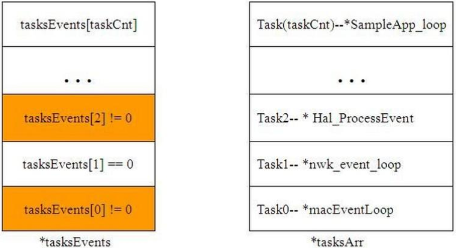

&emsp;&emsp;打开协议栈文件夹`Texas Instruments\Projects\zstack`，里面包含了`TI`公司的例程和工具。再打开`Samples`文件夹：

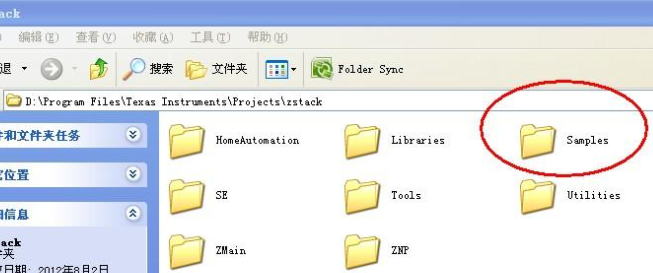

&emsp;&emsp;`Samples`文件夹里面有三个例子，即`GenericApp`、`SampleApp`、`SimpleApp`。在这里我们选择`SampleApp`对协议栈的工作流程进行讲解。打开`SampleApp\CC2530DB`下的工程文件`SampleApp.eww`，留意左边的工程目录，我们暂时只需要关注`Zmain`文件夹和`App`文件夹。

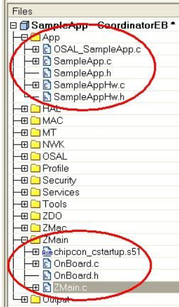

&emsp;&emsp;任何程序都在`main`函数开始运行，`Z-STACK`也不例外。打开`Zmain.C`，找到`main`函数。大概浏览一下`main`函数的代码：

``` cpp
int main ( void ) {
    osal_int_disable ( INTS_ALL ); /* Turn off interrupts 关闭所有中断 */
    HAL_BOARD_INIT(); /* Initialization for board related stuff such as LEDs */
    zmain_vdd_check(); /* Make sure supply voltage is high enough to run 检查芯片电压是否正常 */
    InitBoard ( OB_COLD ); /* Initialize board I/O 初始化I/O、LED、Timer等 */
    HalDriverInit(); /* Initialze HAL drivers 初始化芯片各硬件模块 */
    osal_nv_init ( NULL ); /* Initialize NV System 初始化Flash存储器 */
    ZmacInit(); /* Initialize the MAC 初始化MAC层 */
    zmain_ext_addr(); /* Determine the extended address 确定“IEEE 64”位地址 */
    zgInit(); /* Initialize basic NV items 初始化非易失变量 */
#ifndef NONWK
    afInit(); /* Since the AF isn't a task, call it's initialization routine */
#endif
    osal_init_system(); /* Initialize the operating system 初始化操作系统 */
    osal_int_enable ( INTS_ALL ); /* Allow interrupts 使能全部中断 */
    InitBoard ( OB_READY ); /* Final board initialization 初始化按键 */
    zmain_dev_info(); /* Display information about this device 显示设备信息 */
#ifdef LCD_SUPPORTED /* Display the device info on the LCD */
    zmain_lcd_init();
#endif
#ifdef WDT_IN_PM1
    WatchDogEnable ( WDTIMX ); /* If WDT is used, this is a good place to enable it. */
#endif
    osal_start_system(); /* No Return from here 执行操作系统，进去后不会返回 */
    return 0; /* Shouldn't get here. */
}
```

&emsp;&emsp;我们重点了解`2`个函数：初始化操作系统`osal_init_system`，运行操作系统`osal_start_system`。先来看`osal_init_system`系统初始化函数。进入该函数，发现里面有`6`个初始化函数，这里只关心`osalInitTasks`任务初始化函数：

``` cpp
void osalInitTasks ( void ) {
    uint8 taskID = 0;
    tasksEvents = ( uint16 * ) osal_mem_alloc ( sizeof ( uint16 ) * tasksCnt ); /* 分配内存，返回指向缓冲区的指针 */
    osal_memset ( tasksEvents, 0, ( sizeof ( uint16 ) * tasksCnt ) ); /* 设置所分配的内存空间单元值为0 */
    /* 任务优先级由高向低依次排列，高优先级对应taskID的值反而小 */
    macTaskInit ( taskID++ ); /* macTaskInit(0)，用户不需考虑 */
    nwk_init ( taskID++ ); /* nwk_init(1)，用户不需考虑 */
    Hal_Init ( taskID++ ); /* Hal_Init(2)，用户需考虑 */
#if defined( MT_TASK )
    MT_TaskInit ( taskID++ );
#endif
    APS_Init ( taskID++ ); /* APS_Init(3)，用户不需考虑 */
#if defined ( ZIGBEE_FRAGMENTATION )
    APSF_Init ( taskID++ );
#endif
    ZDApp_Init ( taskID++ ); /* ZDApp_Init(4)，用户需考虑 */
#if defined ( ZIGBEE_FREQ_AGILITY ) || defined ( ZIGBEE_PANID_CONFLICT )
    ZDNwkMgr_Init ( taskID ++ );
#endif
    SampleApp_Init ( taskID ); /* SampleApp_Init(5)，用户需考虑 */
}
```

&emsp;&emsp;我们可以这样理解，函数对`taskID`这个东西进行初始化，每初始化一个任务，`taskID`加一。大家看到了注释后面有些写着用户需要考虑，有些则写着用户不需考虑。写着需要考虑的，用户可以根据自己的硬件平台进行设置；写着不需考虑的，则是不能修改的。
&emsp;&emsp;我们再来看第二个函数`osal_start_system`运行操作系统。`TI`对该函数的描述为`This function is the main loop function of the task system. It will look through all task events and call the task_event_processor() function for the task with the event. If there are no events (for all tasks), this function puts the processor into Sleep. This Function doesn't return.`，翻译成中文是`这个是任务系统轮询的主要函数，它会查找发生的事件，然后调用相应的事件执行函数。如果没有事件登记要发生，那么就进入睡眠模式。这个函数是永远不会返回的`。

``` cpp
void osal_start_system ( void ) {
#if !defined ( ZBIT ) && !defined ( UBIT )
    for ( ;; ) /* Forever Loop */
#endif
    {
        uint8 idx = 0;
        osalTimeUpdate(); /* 这里是在扫描哪个事件被触发了，然后置相应的标志位 */
        Hal_ProcessPoll(); /* This replaces MT_SerialPoll() and osal_check_timer(). */

        Do {
            if ( tasksEvents[idx] ) { /* Task is highest priority that is ready. */
                break; /* 得到待处理的最高优先级任务索引号idx */
            }
        } while ( ++idx < tasksCnt );

        if ( idx < tasksCnt ) {
            uint16 events;
            halIntState_t intState;
            HAL_ENTER_CRITICAL_SECTION ( intState ); /* 进入临界区，保护 */
            events = tasksEvents[idx]; /* 提取需要处理的任务中的事件 */
            tasksEvents[idx] = 0; /* Clear the Events for this task. 清除本次任务的事件 */
            HAL_EXIT_CRITICAL_SECTION ( intState ); /* 退出临界区 */
            events = ( tasksArr[idx] ) ( idx, events ); /* 通过指针调用任务处理函数，关键 */
            HAL_ENTER_CRITICAL_SECTION ( intState ); /* 进入临界区 */
            tasksEvents[idx] |= events; /* Add back unprocessed events to the current task. 保存未处理的事件 */
            HAL_EXIT_CRITICAL_SECTION ( intState ); /* 退出临界区 */
        }
#if defined( POWER_SAVING )
        else { /* Complete pass through all task events with no activity? */
            osal_pwrmgr_powerconserve(); /* Put the processor/system into sleep */
        }
#endif
    }
}
```

### 协议栈的串口实验

&emsp;&emsp;打开`Z-stack`目录`Projects\zstack\Samples\SamplesAPP\CC2530DB`里面的`SampleApp.eww`工程，这次试验直接基于协议栈的`SampleApp`来修改的。打开工程后，`workspace`目录下有两个比较重要的文件夹，即`Zmain`和`App`。这里主要用到`App`，它是用户自己添加自己代码的地方，主要文件是`SampleApp.c`和`SampleApp.h`。
&emsp;&emsp;**串口初始化**：我们在`workspace`下找到`HAL\Target\CC2530EB\drivers`的`hal_uart.c`，可以看到里面已经包括了串口初始化、发送、接收等函数。再看看`workspace`上的`MT`层，发觉有很多基本函数前面带`MT`，包括`MT_UART.C`。打开这个文件，看到`MT_UartInit`函数，这里也有一个串口初始化函数。`Z-stack`上有一个`MT`层，用户可以选用`MT`层配置和调用其他驱动，进一步简化了操作流程。
&emsp;&emsp;打开`APP`目录下的`OSAL_SampleApp.C`文件，找到上节提到的`osalInitTasks`任务初始化函数中的`SampleApp_Init`函数。进入这个函数，发现原来在`SampleApp.c`文件中，我们在这里加入串口初始化代码。在函数中加入语句`MT_UartInit();`：

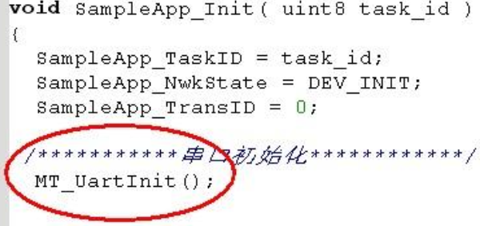

&emsp;&emsp;进入`MT_UartInit`函数，修改自己想要的初始化配置：

``` cpp
void MT_UartInit () {
    halUARTCfg_t uartConfig;
    /* Initialize APP ID */
    App_TaskID = 0;
    /* UART Configuration */
    uartConfig.configured = TRUE;
    uartConfig.baudRate = MT_UART_DEFAULT_BAUDRATE;
    uartConfig.flowControl = MT_UART_DEFAULT_OVERFLOW;
    uartConfig.flowControlThreshold = MT_UART_DEFAULT_THRESHOLD;
    uartConfig.rx.maxBufSize = MT_UART_DEFAULT_MAX_RX_BUFF;
    uartConfig.tx.maxBufSize = MT_UART_DEFAULT_MAX_TX_BUFF;
    uartConfig.idleTimeout = MT_UART_DEFAULT_IDLE_TIMEOUT;
    uartConfig.intEnable = TRUE;
#if defined (ZTOOL_P1) || defined (ZTOOL_P2)
    uartConfig.callBackFunc = MT_UartProcessZToolData;
#elif defined (ZAPP_P1) || defined (ZAPP_P2)
    uartConfig.callBackFunc = MT_UartProcessZAppData;
#else
    uartConfig.callBackFunc = NULL;
#endif
    /* Start UART */
#if defined (MT_UART_DEFAULT_PORT)
    HalUARTOpen ( MT_UART_DEFAULT_PORT, &uartConfig );
#else
    /* Silence IAR compiler warning */
    ( void ) uartConfig;
#endif
    /* Initialize for Zapp */
#if defined (ZAPP_P1) || defined (ZAPP_P2)
    /* Default max bytes that ZAPP can take */
    MT_UartMaxZAppBufLen = 1;
    MT_UartZAppRxStatus = MT_UART_ZAPP_RX_READY;
#endif
}
```

- 第`7`行：`uartConfig.baudRate = MT_UART_DEFAULT_BAUDRATE;`是配置波特率，查看`MT_UART_DEFAULT_BAUDRATE`的定义，可以看到`#define MT_UART_DEFAULT_BAUDRATE HAL_UART_BR_38400`，默认的波特率是`38400bps`。现在修改成`115200bps`，修改成`#define MT_UART_DEFAULT_BAUDRATE HAL_UART_BR_115200`。
- 第`8`行：`uartConfig.flowControl = MT_UART_DEFAULT_OVERFLOW;`语句是配置流控，进入定义可以看到`#define MT_UART_DEFAULT_OVERFLOW TRUE`，默认是打开串口流控。如果你是只连了`TX/RX`的`2`根线方式，务必将流控进行关闭，即`#define MT_UART_DEFAULT_OVERFLOW FALSE`。注意，`2`根线的通讯连接务一定要关闭流控，不然是永远收发不了信息的。
- 第`14`至`20`行：这个是预编译，根据预先定义的`ZTOOL`或者`ZAPP`选择不同的数据处理函数。后面的`P1`和`P2`则是串口`0`和串口`1`，在这里使用`ZTOOL`和串口`0`。可以在`option -> C/C++ Compiler`的`Preprocessor`里面看到，已经默认添加`ZTOOL_P1`预编译：

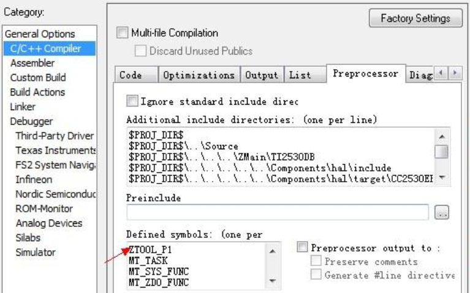

&emsp;&emsp;**登记任务号**：在函数`SampleApp_Init`刚添加的串口初始化语句下面加入`MT_UartRegisterTaskID(task_id);/* 登记任务号 */`，意思就是把串口事件通过`task_id`登记在函数`SampleApp_Init`里面：

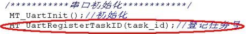

&emsp;&emsp;**串口发送**：经过前面两个步骤，现在串口已经可以发送信息了。我们在刚刚添加初始化代码后面加入一条上电提示`Hello World`的语句`HalUARTWrite(0, "Hello World\n", 12); /* 串口0, "字符", 字符个数 */`。注意，需要在`SampleApp.c`文件里加入头文件`MT_UART.h`。下载并通过串口调试助手查看，可以看到输出了`Hello World`。

### 协议栈的按键实验

&emsp;&emsp;通过节点`1`的按键`S1`中断配置，检测按键的按下情况，整个过程在协议栈`Z-STACK`的`SampleApp.eww`上完成。协议栈已经自带了按键的驱动和使用函数，所以将按键改到任意`IO`口也不是问题的。首先就是要了解协议栈中按键的检测与按键事件的传递过程，这里主要以常用的普通按键为例进行讲解，`J-STICK`摇杆的部分可以直接注释掉。
&emsp;&emsp;打开`SampleApp.eww`工程，在`ZMain.c`的`main`函数中跟按键相关的有`HalDriverInit`和`InitBoard(OB_READY)`。进入`HalDriverInit`中的`HalKeyInit`：

``` cpp
void HalKeyInit ( void ) {
    halKeySavedKeys = 0; /* Initialize previous key to 0 */
    HAL_KEY_SW_6_SEL &= ~ ( HAL_KEY_SW_6_BIT ); /* Set pin function to GPIO */
    HAL_KEY_SW_6_DIR &= ~ ( HAL_KEY_SW_6_BIT ); /* Set pin direction to Input */
    HAL_KEY_JOY_MOVE_SEL &= ~ ( HAL_KEY_JOY_MOVE_BIT ); /* Set pin function to GPIO */
    HAL_KEY_JOY_MOVE_DIR &= ~ ( HAL_KEY_JOY_MOVE_BIT ); /* Set pin direction to Input */
    pHalKeyProcessFunction  = NULL; /* Initialize callback function */
    HalKeyConfigured = FALSE; /* Start with key is not configured */
}
```

这里主要是初始化按键相关的引脚，`HAL_KEY_SW_6`就是对应`P01`，而`HAL_KEY_JOY`就是`TI`板子上的`J-STICK`摇杆，这里我们用不到，直接注释或删掉。接着分析`InitBoard(OB_READY)`函数：

``` cpp
void InitBoard ( uint8 level ) {
    if ( level == OB_COLD ) {
        * ( uint8 * ) 0x0 = 0; /* IAR does not zero-out this byte below the XSTACK. */
        osal_int_disable ( INTS_ALL ); /* Interrupts off */
        ChkReset(); /* Check for Brown-Out reset */
    } else { /* !OB_COLD */
        HalKeyConfig ( HAL_KEY_INTERRUPT_DISABLE, OnBoard_KeyCallback ); /* Initialize Key stuff */
    }
}
```

配置按键的检测方式和按键的回调函数是`HalKeyConfig(HAL_KEY_INTERRUPT_DISABLE, OnBoard_KeyCallback);`，进入到此函数中，我们配置的是非中断检测方式，先看代码：

``` cpp
void HalKeyConfig ( bool interruptEnable, halKeyCBack_t cback ) {
    Hal_KeyIntEnable = interruptEnable; /* Enable/Disable Interrupt or */
    pHalKeyProcessFunction = cback; /* 注册回调函数，重点部分 */

    if ( Hal_KeyIntEnable ) { /* Determine if interrupt is enable or not */
        /* ...... */
    } else { /* Interrupts NOT enabled */
        HAL_KEY_SW_6_ICTL &= ~ ( HAL_KEY_SW_6_ICTLBIT );
        HAL_KEY_SW_6_IEN &= ~ ( HAL_KEY_SW_6_IENBIT );
        osal_set_event ( Hal_TaskID, HAL_KEY_EVENT ); /* 启动HAL_KEY_EVENT事件 */
    }

    HalKeyConfigured = TRUE; /* Key now is configured */
}
```

从上面的配置我们知道按键检测有两种方式，一种为`中断`，一种为`定时检测`；定时检测的话在配置时就会直接启动`HAL_KEY_EVENT`事件，那么在`HAL_KEY_EVENT`中会做什么事情呢？找到此事件的处理函数。`hal_drivers.c`(在`HAL/Common`目录下)中的`Hal_ProcessEvent`函数：

``` cpp
if ( events &HAL_KEY_EVENT ) {
    HalKeyPoll(); /* Check for keys 检测按键，重点 */

    if ( !Hal_KeyIntEnable ) { /* 如果不是中断方式的话，就定时启动此事件检测按键 */
        osal_start_timerEx ( Hal_TaskID, HAL_KEY_EVENT, 100 );
    }

    return events ^ HAL_KEY_EVENT;
}
```

接下来就是`HalKeyPol`函数了，这里直接看修改完的代码(所有跟`J-STICK`摇杆相关的代码都直接删除)：

``` cpp
void HalKeyPoll ( void ) {
    uint8 keys = 0;

    /* 检测按键S2是否按下 */
    if ( HAL_PUSH_BUTTON1() ) { /* 这里需要改成低电平按下 */
        keys |= HAL_KEY_SW_6;
    }

    if ( !Hal_KeyIntEnable ) {
        /* 按键延时，防止按键按下发送多次按键事件 */
        if ( keys == halKeySavedKeys ) {
            return; /* Exit - since no keys have changed */
        }

        /* Store the current keys for comparation next time */
        halKeySavedKeys = keys;
    } else {
        /* Key interrupt handled here */
    }

    /* 调用注册的回调函数，即上面的OnBoard_KeyCallback */
    if ( keys && ( pHalKeyProcessFunction ) ) {
        ( pHalKeyProcessFunction ) ( keys, HAL_KEY_STATE_NORMAL );
    }
}
```

第`5`至`7`行就是对按键的检测，`#define HAL_PUSH_BUTTON1() (PUSH1_POLARITY (PUSH1_SBIT))`，这里我们是低电平按下，所以改成`#define PUSH1_POLARITY ACTIVE_LOW`。当按键按下时，就传递给上面注册过的回调函数`OnBoard_KeyCallback`，传递进去的就是相应的键值`keys`。找到之前注册的回调函数`OnBoard_KeyCallback`(在`OnBoard.c`中)：

``` cpp
void OnBoard_KeyCallback ( uint8 keys, uint8 state ) {
    uint8 shift;
    ( void ) state;
    shift = ( keys & HAL_KEY_SW_6 ) ? true : false;

    if ( OnBoard_SendKeys ( keys, shift ) != ZSuccess ) {
        /* Process SW1 here */
        if ( keys & HAL_KEY_SW_1 ) { /* Switch 1 */
        }

        /* Process SW2 here */
        if ( keys & HAL_KEY_SW_2 ) { /* Switch 2 */
        }

        /* Process SW3 here */
        if ( keys & HAL_KEY_SW_3 ) { /* Switch 3 */
        }

        /* Process SW4 here */
        if ( keys & HAL_KEY_SW_4 ) { /* Switch 4 */
        }

        /* Process SW5 here */
        if ( keys & HAL_KEY_SW_5 ) { /* Switch 5 */
        }

        /* Process SW6 here */
        if ( keys & HAL_KEY_SW_6 ) { /* Switch 6 */
        }
    }
}
```

这里就是通过`OnBoard_SendKeys(keys, shift)`再发送系统信息给用户的应用任务：

``` cpp
uint8 OnBoard_SendKeys ( uint8 keys, uint8 state ) {
    keyChange_t *msgPtr;

    if ( registeredKeysTaskID != NO_TASK_ID ) {
        /* Send the address to the task */
        msgPtr = ( keyChange_t * ) osal_msg_allocate ( sizeof ( keyChange_t ) );

        if ( msgPtr ) {
            msgPtr->hdr.event = KEY_CHANGE;
            msgPtr->state = state;
            msgPtr->keys = keys;
            osal_msg_send ( registeredKeysTaskID, ( uint8 * ) msgPtr );
        }

        return ( ZSuccess );
    } else {
        return ( ZFailure );
    }
}
```

注意`osal_msg_send( registeredKeysTaskID, (uint8 *)msgPtr );`，`registeredKeysTaskID`这个就是用户根据自己的需要选择按键的传递的任务号，可通过`RegisterForKeys( xxx_TaskID );`注册。此工程中在`SampleApp_Init`中已经调用此函数注册到`SampleApp_TaskID`中了，就是说按键信息会传递到此任务中。

``` cpp
uint16 SampleApp_ProcessEvent ( uint8 task_id, uint16 events ) {
    afIncomingMSGPacket_t *MSGpkt;
    ( void ) task_id; /* Intentionally unreferenced parameter */

    if ( events & SYS_EVENT_MSG ) { /* 系统信息发送事件 */
        MSGpkt = ( afIncomingMSGPacket_t * ) osal_msg_receive ( SampleApp_TaskID );

        while ( MSGpkt ) {
            switch ( MSGpkt->hdr.event ) {
                /* Received when a key is pressed */
                case KEY_CHANGE: /* 按键事件与处理函数 */
                    SampleApp_HandleKeys ( ( ( keyChange_t * ) MSGpkt )->state, ( ( keyChange_t * ) MSGpkt )->keys );
                    break;
                /* Received when a messages is received (OTA) for this endpoint */
                case AF_INCOMING_MSG_CMD:
                    SampleApp_MessageMSGCB ( MSGpkt );
                    break;
                /* Received whenever the device changes state in the network */
                case ZDO_STATE_CHANGE:
                    SampleApp_NwkState = ( devStates_t ) ( MSGpkt->hdr.status );

                    if ( ( SampleApp_NwkState == DEV_ZB_COORD )
                         || ( SampleApp_NwkState == DEV_ROUTER )
                         || ( SampleApp_NwkState == DEV_END_DEVICE ) ) {
                        /* Start sending the periodic message in a regular interval. */
                        osal_start_timerEx ( SampleApp_TaskID,
                                             SAMPLEAPP_SEND_PERIODIC_MSG_EVT,
                                             SAMPLEAPP_SEND_PERIODIC_MSG_TIMEOUT );
                    } else {
                        /* Device is no longer in the network */
                    }

                    break;
                default:
                    break;
            }

            osal_msg_deallocate ( ( uint8 * ) MSGpkt ); /* Release the memory */
            MSGpkt = ( afIncomingMSGPacket_t * ) osal_msg_receive ( SampleApp_TaskID ); /* Next - if one is available */
        }

        return ( events ^ SYS_EVENT_MSG ); /* return unprocessed events */
    }
    /* Send a message out - This event is generated by a timer (setup in SampleApp_Init()). */
    if ( events & SAMPLEAPP_SEND_PERIODIC_MSG_EVT ) {
        /* Send the periodic message */
        SampleApp_SendPeriodicMessage();
        /* Setup to send message again in normal period (+ a little jitter) */
        osal_start_timerEx ( SampleApp_TaskID, SAMPLEAPP_SEND_PERIODIC_MSG_EVT,
                             ( SAMPLEAPP_SEND_PERIODIC_MSG_TIMEOUT + ( osal_rand() & 0x00FF ) ) );
        return ( events ^ SAMPLEAPP_SEND_PERIODIC_MSG_EVT ); /* return unprocessed events */
    }

    return 0; /* Discard unknown events */
}
```

接下来就是终点站了：

``` cpp
void SampleApp_HandleKeys ( uint8 shift, uint8 keys ) {
    ( void ) shift; /* Intentionally unreferenced parameter */
    if ( keys & HAL_KEY_SW_1 ) {
        /* This key sends the Flash Command is sent to Group 1.
         * This device will not receive the Flash Command from this
         * device (even if it belongs to group 1).
         */
        SampleApp_SendFlashMessage ( SAMPLEAPP_FLASH_DURATION );
    }

    if ( keys & HAL_KEY_SW_2 ) {
        /* The Flashr Command is sent to Group 1.
         * This key toggles this device in and out of group 1.
         * If this device doesn't belong to group 1, this application
         * will not receive the Flash command sent to group 1.
         */
        aps_Group_t *grp;
        grp = aps_FindGroup ( SAMPLEAPP_ENDPOINT, SAMPLEAPP_FLASH_GROUP );

        if ( grp ) {
            aps_RemoveGroup ( SAMPLEAPP_ENDPOINT, SAMPLEAPP_FLASH_GROUP ); /* Remove from the group */
        } else {
            aps_AddGroup ( SAMPLEAPP_ENDPOINT, &SampleApp_Group ); /* Add to the flash group */
        }
    }

    if ( keys & HAL_KEY_SW_6 ) {
        HalUARTWrite ( 0, "KEY S2\n", 7 );
    }
}
```

根据具体的键值做相应的处理，这里利用串口打印提示按键按下。根据下面的框图再走一遍就基本上能很清晰地理解了：

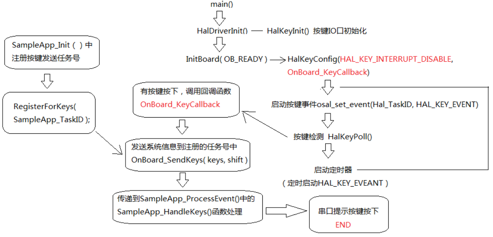

&emsp;&emsp;到这里就讲了一大半了，至于第二种按键检测方式(中断检测)，下面就简单说明一下：在`HalKeyConfig(HAL_KEY_INTERRUPT_ENABLE, OnBoard_KeyCallback);`中设置成中断检测方式。设置成中断检测方式就不会定时启动`HAL_KEY_EVENT`事件，这样就会更加节省系统资源，所以一般都是使用中断方式来检测按键。当按下按键时会进入`P0`口中断服务函数`HAL_ISR_FUNCTION(halKeyPort0Isr, P0INT_VECTOR)`：

``` cpp
HAL_ISR_FUNCTION ( halKeyPort0Isr, P0INT_VECTOR ) {
    HAL_ENTER_ISR();
    if ( HAL_KEY_SW_6_PXIFG & HAL_KEY_SW_6_BIT ) {
        halProcessKeyInterrupt();
    }

    /* Clear the CPU interrupt flag for Port_0. PxIFG has to be cleared before PxIF */
    HAL_KEY_SW_6_PXIFG = 0;
    HAL_KEY_CPU_PORT_0_IF = 0;
    CLEAR_SLEEP_MODE();
    HAL_EXIT_ISR();
}
```

并调用`halProcessKeyInterrupt`函数处理按键中断事件：

``` cpp
void halProcessKeyInterrupt ( void ) {
    bool valid = FALSE;

    if ( HAL_KEY_SW_6_PXIFG & HAL_KEY_SW_6_BIT ) { /* Interrupt Flag has been set */
        HAL_KEY_SW_6_PXIFG = ~ ( HAL_KEY_SW_6_BIT ); /* Clear Interrupt Flag */
        valid = TRUE;
    }

    if ( HAL_KEY_JOY_MOVE_PXIFG & HAL_KEY_JOY_MOVE_BIT ) { /* Interrupt Flag has been set */
        HAL_KEY_JOY_MOVE_PXIFG = ~ ( HAL_KEY_JOY_MOVE_BIT ); /* Clear Interrupt Flag */
        valid = TRUE;
    }

    if ( valid ) {
        osal_start_timerEx ( Hal_TaskID, HAL_KEY_EVENT, HAL_KEY_DEBOUNCE_VALUE );
    }
}
```

这里又跑去启动`HAL_KEY_EVENT`事件了，然后就把按键发送个系统上层任务。
&emsp;&emsp;第一步：修改`hal_key.C`(位于`HAL/Target/CC2530EB/Drivers`目录下)文件。修改`SW_6`所在`IO`口：

``` cpp
/* SW_6 is at P0.4 */
#define HAL_KEY_SW_6_PORT  P0
#define HAL_KEY_SW_6_BIT   BV(4) /* BV(1)改到P0.4 */
#define HAL_KEY_SW_6_SEL   P0SEL
#define HAL_KEY_SW_6_DIR   P0DIR
```

设置边缘触发方式：

``` cpp
/* edge interrupt */
#define HAL_KEY_SW_6_EDGEBIT  BV(0)
#define HAL_KEY_SW_6_EDGE     HAL_KEY_RISING_EDGE /* HAL_KEY_FALLING_EDGE 改成上升缘触发 */
```

设置中断一些相关标志位：

``` cpp
/* SW_6 interrupts */
#define HAL_KEY_SW_6_IEN     IEN1  /* CPU interrupt mask register */
#define HAL_KEY_SW_6_IENBIT  BV(5) /* Mask bit for all of Port_0  */
#define HAL_KEY_SW_6_ICTL    P0IEN /* Port Interrupt Control register */
#define HAL_KEY_SW_6_ICTLBIT BV(4) // 原为BV(1) /* P0IEN - P0.1 enable/disable bit改到P0.4 */
#define HAL_KEY_SW_6_PXIFG   P0IFG /* Interrupt flag at source */
```

我们不需要用到`TI`的摇杆`J-STICK`，所以把代码注释掉：

``` cpp
void HalKeyPoll ( void ) {
    uint8 keys = 0;

    if ( ( HAL_KEY_JOY_MOVE_PORT & HAL_KEY_JOY_MOVE_BIT ) ) { /* Key is active HIGH */
        // keys = halGetJoyKeyInput();
    }

    /* If interrupts are not enabled, previous key status and current key
       status are compared to find out if a key has changed status. */
    if ( !Hal_KeyIntEnable ) {
        if ( keys == halKeySavedKeys ) {
            return; /* Exit - since no keys have changed */
        }

        halKeySavedKeys = keys; /* Store the current keys for comparation next time */
    } else {
        /* Key interrupt handled here */
    }

    if ( HAL_PUSH_BUTTON1() ) {
        keys |= HAL_KEY_SW_6;
    }

    if ( keys && ( pHalKeyProcessFunction ) ) { /* Invoke Callback if new keys were depressed */
        ( pHalKeyProcessFunction ) ( keys, HAL_KEY_STATE_NORMAL );
    }
}
```

&emsp;&emsp;第二步：修改`hal_board_cfg.h`文件(位于`HAL/Target/CC2530EB/Config`目录下)。修改`SW_6`所在`IO`口：

``` cpp
/* S1 */
#define PUSH1_BV    BV(4) /* 原为BV(1) */
#define PUSH1_SBIT  P0_4 /* 原为P0_1 */
```

&emsp;&emsp;第三步：修改`OnBoard.C`文件(位于`ZMain`目录下)，使能中断`HalKeyConfig(HAL_KEY_INTERRUPT_ENABLE, OnBoard_KeyCallback);`：

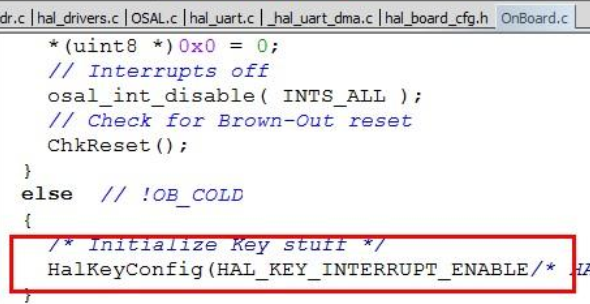

&emsp;&emsp;通过简单的几个步骤，我们就配置好了按键所需要的文件。下面我们来看看协议栈是检测到按键按下时候是如何处理的，`16`位必须只占`1`位，所以只能`16`个任务。回到`SampleApp.c`文件，找到按键时间处理`KEY_CHANGE`事件的函数：

``` cpp
case KEY_CHANGE: /* Received when a key is pressed */
    SampleApp_HandleKeys ( ( ( keyChange_t * ) MSGpkt )->state,
                         ( ( keyChange_t * ) MSGpkt )->keys );
    break;
```

当按键按下时，就会进入上面的事件，我们加入串口提示：

``` cpp
case KEY_CHANGE: /* Received when a key is pressed */
    HalUARTWrite ( 0, "KEY ", 4 ); /* 串口提示 */
    SampleApp_HandleKeys ( ( ( keyChange_t * ) MSGpkt )->state,
                         ( ( keyChange_t * ) MSGpkt )->keys );
    break;
```

进入`SampleApp_HandleKeys`函数，加入我们的按键处理函数。这里是`SW_6`，也即是我们刚定义好的开发板上的`S1`：

``` cpp
if ( keys & HAL_KEY_SW_6 ) {
    HalUARTWrite ( 0, "K1 ", 3 ); /* 提示被按下的是KEY1 */
    HalLedBlink ( HAL_LED_1, 2, 50, 500 ); /* LED1闪烁提示 */
}
```

&emsp;&emsp;下载程序到开发板，打开串口调试助手，当按下按键`S1`时候，可以看到有提示信息打印出来。

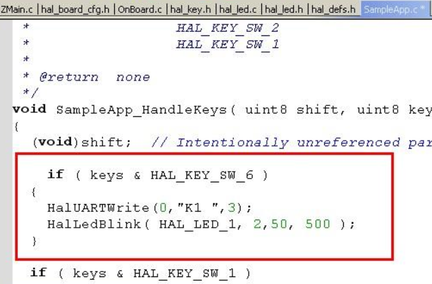