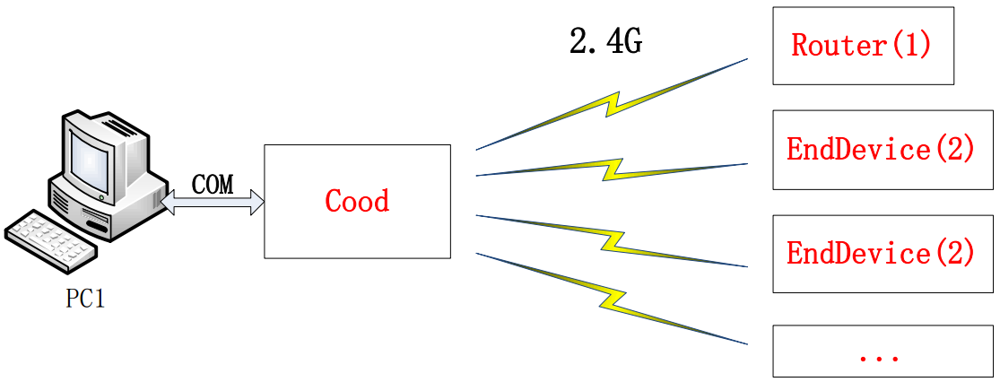

### 无线数据传输

&emsp;&emsp;本次实验实现终端节点将数据`0123456789`通过无线发送到协调器，协调器通过串口发送给`PC`上位机显示出来，此实验是基于`SampleApp`工程进行的。<!--more-->
&emsp;&emsp;打开`SampleApp.C`文件，搜索找到函数`void SampleApp_MessageMSGCB( afIncomingMSGPacket_t *pkt )`，在`case SAMPLEAPP_PERIODIC_CLUSTERID:`下面加入`HalUARTWrite(0, "I get data\n", 11);`。选择`CoodinatorEB`，下载到开发板`1`(作为协调器串口跟电脑连接)；选择`EndDeviceEB`，下载到开发板`2`(作为终端设备无线发送数据给协调器)。
&emsp;&emsp;发送部分(可以将这部分内容理解成是发送终端需要执行的)：
&emsp;&emsp;1. 登记事件，设置编号、发送时间等。打开`SampleApp.C`文件，找到`SampleApp`事件处理函数`uint16 SampleApp_ProcessEvent(uint8 task_id, uint16 events)`，找到函数中下面的代码：

``` cpp
/* Received whenever the device changes state in the network */
case ZDO_STATE_CHANGE: /* 当网络状态改变时，如从未连上状态到连上网络状态 */
    SampleApp_NwkState = ( lustered_t ) ( MSGpkt->hdr.status );
    /* 协调器、路由器或者终端都执行 */
    if ( ( SampleApp_NwkState == DEV_ZB_COORD ) || ( SampleApp_NwkState == DEV_ROUTER ) || ( SampleApp_NwkState == DEV_END_DEVICE ) ) {
        /* Start sending the periodic message in a regular interval. */
        osal_start_timerEx ( SampleApp_TaskID, SAMPLEAPP_SEND_PERIODIC_MSG_EVT, SAMPLEAPP_SEND_PERIODIC_MSG_TIMEOUT );
    } else {
        /* Device is no longer in the network */
    }

    break;
```

第`7`行是代码的关键部分，函数的这三个参数决定了周期性发送数据的命脉。分别查看它们的定义：

- `SampleApp_TaskID`是任务`ID`，函数开头定义了`SampleApp_TaskID = task_id;`，也就是`SampleApp`初始化的任务`ID`号。
- `SAMPLEAPP_SEND_PERIODIC_MSG_EVT`的解释是`Application Events (OSAL) - These are bit weighted definitions.`，定义为`#define SAMPLEAPP_SEND_PERIODIC_MSG_EVT 0x0001`，同一个任务下可以有多个事件，这个是事件的号码。我们可以定义自己的事件，但是编号不能重复，而且事件号码`16`位必须只占`1`位，所以只能定义`16`个事件。
- `SAMPLEAPP_SEND_PERIODIC_MSG_TIMEOUT`的解释是`Send Message Timeout Every 5 seconds`，定义为`#define SAMPLEAPP_SEND_PERIODIC_MSG_TIMEOUT 5000`，即事件重复执行的时间。这里以毫秒为单位，所以是`5s`，也就是实验为什么隔约`5s`收到数据的原因，这里可以改成你需要发送数据的时间间隔。

&emsp;&emsp;登记好事件后，看第二行代码可以知道，如果网络一直处于连接状态，就不会再次进入这个函数了，所以这段代码相当于初始化，只执行`1`次。
&emsp;&emsp;2. 设置发送内容，自动周期性地发送：在同一个函数下面可以找到如下代码：

``` cpp
/* Send a message out -- This event is generated by a timer (setup in SampleApp_Init()). */
if ( events & SAMPLEAPP_SEND_PERIODIC_MSG_EVT ) {
    SampleApp_SendPeriodicMessage(); /* Send the periodic message */
    /* Setup to send message again in normal period (+ a little jitter) */
    osal_start_timerEx ( SampleApp_TaskID, SAMPLEAPP_SEND_PERIODIC_MSG_EVT, ( SAMPLEAPP_SEND_PERIODIC_MSG_TIMEOUT + ( osal_rand() & 0x00FF ) ) );
    return ( events ^ SAMPLEAPP_SEND_PERIODIC_MSG_EVT ); /* return unprocessed events */
}
```

- 第`2`行：判断`SAMPLEAPP_SEND_PERIODIC_MSG_EVT(0x0001)`有没有发生，如果有就执行下面的函数。
- 第`3`行：`SampleApp_SendPeriodicMessage();`是主要的代码，这是我们编写需要发送内容的地方，我们进去做一些修改：

``` cpp
/*---------------周期性发送数据函数---------------*/
void SampleApp_SendPeriodicMessage ( void ) {
    if ( AF_DataRequest ( &SampleApp_Periodic_DstAddr,
                          &SampleApp_epDesc,
                          SAMPLEAPP_PERIODIC_CLUSTERID,
                          1,
                          ( uint8 * ) &SampleAppPeriodicCounter,
                          &SampleApp_TransID,
                          AF_DISCV_ROUTE,
                          AF_DEFAULT_RADIUS ) == afStatus_SUCCESS ) {
    }
    else {
        /* Error occurred in request to send. */
    }
}
```

- 第`5`行：`SAMPLEAPP_PERIODIC_CLUSTERID`的定义为`#define SAMPLEAPP_PERIODIC_CLUSTERID 1`，其作用是和接收方建立联系。当协调器收到这个标号时，如果是`1`，就证明是由周期性广播方式发送过来的。
- 第`6`行：`1`是数据长度。
- 第`7`行：`(uint8 *)&SampleAppPeriodicCounter`是要发送的内容。

&emsp;&emsp;知道代码功能后，我们可以做以下修改：添加数据`0~9`，发送字符数`10`个，内容是`data`数组：

``` cpp
/*---------------周期性发送数据函数---------------*/
void SampleApp_SendPeriodicMessage ( void ) {
    uint8 data [10] = {'0', '1', '2', '3', '4', '5', '6', '7', '8', '9' };
    if ( AF_DataRequest ( &SampleApp_Periodic_DstAddr,
                          &SampleApp_epDesc,
                          SAMPLEAPP_PERIODIC_CLUSTERID,
                          10,
                          data, /* 指针方式 */
                          &SampleApp_TransID,
                          AF_DISCV_ROUTE,
                          AF_DEFAULT_RADIUS ) == afStatus_SUCCESS ) {
    } else {
        /* Error occurred in request to send. */
    }
}
```

至此，发送部分代码修改完成。上电后，`CC2530`会以周期`5s`来广播式发送数据`0`至`9`。
&emsp;&emsp;接收部分(可以将这部分内容理解成是连接电脑的协调器需要执行的)：
&emsp;&emsp;读取接收到的数据：同样在`uint16 SampleApp_ProcessEvent(uint8 task_id, uint16 events)`事件处理函数中找到如下代码：

``` cpp
/* Received when a messages is received (OTA) for this endpoint */
case AF_INCOMING_MSG_CMD:
    SampleApp_MessageMSGCB ( MSGpkt );
    break;
```

其中，`SampleApp_MessageMSGCB(MSGpkt);`就是将接收到的数据包进行处理的函数：

``` cpp
void SampleApp_MessageMSGCB ( afIncomingMSGPacket_t *pkt ) {
    uint16 flashTime;

    switch ( pkt->lustered ) {
        case SAMPLEAPP_PERIODIC_CLUSTERID:
            HalUARTWrite ( 0, "I get data\n", 11 ); /* 提示收到数据 */
            break;
        case SAMPLEAPP_FLASH_CLUSTERID:
            flashTime = BUILD_UINT16 ( pkt->cmd.Data[1], pkt->cmd.Data[2] );
            HalLedBlink ( HAL_LED_4, 4, 50, ( flashTime / 4 ) );
            break;
    }
}
```

- 第`5`行：读取发来的数据包的`ID`号，如果是`SAMPLEAPP_PERIODIC_CLUSTERID`，就执行下面的函数。所有的数据和信息都在函数传入来的`afIncomingMSGPacket_t *pkt`里面，进入`afIncomingMSGPacket_t`的定义，它是一个结构体，内容如下：

``` cpp
typedef struct {
    osal_event_hdr_t hdr; /* OSAL Message header */
    uint16 groupId; /* Message's group ID – 0 if not set */
    uint16 clusterId; /* Message's cluster ID */
    afAddrType_t srcAddr; /* Source Address, if endpoint is STUBAPS_INTER_PAN_EP, it's an InterPAN message */
    uint16 macDestAddr; /* MAC header destination short address */
    uint8 endPoint; /* destination endpoint */
    uint8 wasBroadcast; /* TRUE if network destination was a broadcast address */
    uint8 LinkQuality; /* The link quality of the received data frame */
    uint8 correlation; /* The raw correlation value of the received data frame */
    int8 rssi; /* The received RF power in units dBm */
    uint8 SecurityUse; /* deprecated */
    uint32 timestamp; /* receipt timestamp from MAC */
    afMSGCommandFormat_t cmd; /* Application Data */
} afIncomingMSGPacket_t;
```

里面包含了数据包的所有东西，例如长地址、短地址、`RSSI`等。那么数据在哪里呢？它在`afMSGCommandFormat_t`中，又是一个结构体：

``` cpp
typedef struct { /* Generalized MSG Command Format */
    byte TransSeqNumber; /* 用于存储序列号 */
    uint16 DataLength; /* Number of bytes in TransData 用于存储的发送数据的长度信息 */
    byte *Data; /* 数据接收后放在一个缓冲区中 */
} afMSGCommandFormat_t;
```

&emsp;&emsp;把数据通过串口发送给`PC`机：

``` cpp
void SampleApp_MessageMSGCB ( afIncomingMSGPacket_t *pkt ) {
    uint16 flashTime;
    switch ( pkt->lustered ) {
        case SAMPLEAPP_PERIODIC_CLUSTERID:
            HalUARTWrite ( 0, "I get data\n", 11 );    /* 提示收到数据 */
            HalUARTWrite ( 0, &pkt->cmd.Data[0], 10 ); /* 打印收到数据 */
            HalUARTWrite ( 0, "\n", 1 );               /* 回车换行 */
            break;
        case SAMPLEAPP_FLASH_CLUSTERID:
            flashTime = BUILD_UINT16 ( pkt->cmd.Data[1], pkt->cmd.Data[2] );
            HalLedBlink ( HAL_LED_4, 4, 50, ( flashTime / 4 ) );
            break;
    }
}
```

将代码分别下载到两块开发板上，观察实验现象。

### 串口透传

&emsp;&emsp;本次实验实现两台不同的`PC`机通过串口连接到开发板，通过无线方式相互收发信息，如果没有`2`台电脑，也可以用同一台电脑的不同串口进行实验。
&emsp;&emsp;打开`Z-stack`目录`Projects\zstack\Samples\SampleApp test\CC2530DB`里面的`SampleApp.eww`工程，本次实验是基于`SampleApp`来进行的。
&emsp;&emsp;1. `ZigBee`模块接收到从`PC`机发送信息，然后通过无线发送出去。
&emsp;&emsp;以前我们做的都是`CC2530`给`PC`机串口发信息，还没接触过`PC`机发送信息给`CC2530`。其主要代码在`MT_UART.C`中，该文件在之前协议栈串口实验对串口初始化时候已经有所了解了。在这个文件里找到串口初始化函数`MT_UartInit`，找到下面的代码：

``` cpp
#if defined (ZTOOL_P1) || defined (ZTOOL_P2)
    uartConfig.callBackFunc = MT_UartProcessZToolData;
#elif defined (ZAPP_P1) || defined (ZAPP_P2)
    uartConfig.callBackFunc = MT_UartProcessZAppData;
#else
    uartConfig.callBackFunc = NULL;
#endif
```

我们定义了`ZTOOL_P1`，故协议栈数据处理函数为`MT_UartProcessZToolData`。进入这个函数的定义，下边是对函数关键地方的解释：

``` cpp
/*---------------------------------------------------------------------
* @fn MT_UartProcessZToolData
*
* @brief | SOP | Data Length | CMD |  Data  | FCS |
*        |  1  |      1      |  2  |  0-Len |  1  |
*
* Parses the data and determine either is SPI or just simply serial data
* then send the data to correct place (MT or APP)
*
* @param port - UART port
* event - Event that causes the callback
* @return None
----------------------------------------------------------------------*/
```

这个函数具体说来就是把串口发来的数据包进行打包、校验、生成一个消息、发给处理数据包的任务。如果你看过`MT`的文档，应该知道如果用`ZTOOL`通过串口来沟通协议栈，那么发过来的串口数据具有以下格式：`0xFE | DataLength | CM0 | CM1 | Data payload | FCS`：

- `0xFE`：数据帧头。
- `DataLength`：`Data payload`的数据长度，以字节计，低字节在前。
- `CM0`：命令低字节。
- `CM1`：命令高字节(`ZTOOL`软件就是通过发送一系列命令给`MT`实现和协议栈交互)。
- `Data payload`：数据帧具体的数据，这个长度是可变的，但是要和`DataLength`一致。
- `FCS`：校验和，从`DataLength`字节开始到`Data payload`最后一个字节所有字节的异或按字节操作。

&emsp;&emsp;我们需要把该函数换成自己的串口处理函数，不过前提是我们先要了解自带的这个函数：

``` cpp
void MT_UartProcessZToolData ( uint8 port, uint8 event ) {
    while ( Hal_UART_RxBufLen ( port ) ) { /* 查询缓冲区读信息，也成了这里信息是否接收完的标志 */
        HalUARTRead ( port, &ch, 1 ); /* 一个一个地读，读完一个缓冲区就清1个 */
        switch ( state ) { /* 用了状态机 */
            case SOP_STATE:
                /* MT_UART_SOF的值默认是“0xFE”，所以数据必须以0xFE格式开始发送才能进入下一个状态，否则永远在这里转圈 */
                if ( ch == MT_UART_SOF ) {
                    state = LEN_STATE;
                }

                break;
            case LEN_STATE:
                LEN_Token = ch;
                tempDataLen = 0;
                /* Allocate memory for the data */
                pMsg = ( mtOSALSerialData_t * ) osal_msg_allocate ( sizeof ( mtOSALSerialData_t ) + MT_RPC_FRAME_HDR_SZ + LEN_Token );

                /* 分配内存空间 */
                if ( pMsg ) { /* 如果分配成功 */
                    /* Fill up what we can */
                    pMsg->hdr.event = CMD_SERIAL_MSG; /* 注册事件号CMD_SERIAL_MSG，很有用 */
                    pMsg->msg = ( uint8 * ) ( pMsg + 1 ); /* 定位数据位置 */
                    /* 代码省略部分 */
                    tmp = MT_UartCalcFCS ( ( uint8 * ) &pMsg->msg[0], MT_RPC_FRAME_HDR_SZ + LEN_Token ); /* Make sure it's correct */

                    if ( tmp == FSC_Token ) { /* 数据校验 */
                        osal_msg_send ( App_TaskID, ( byte * ) pMsg ); /* 把数据包发送到OSAL层，很重要 */
                    } else {
                        osal_msg_deallocate ( ( uint8 * ) pMsg ); /* deallocate the msg 清空申请的内存空间 */
                    }

                    state = SOP_STATE; /* Reset the state, send or discard the buffers at this point 状态机一周期完成 */
                }
        }
    }
}
```

串口从`PC`机接收到信息会做如下处理：接收串口数据，判断起始码是否为`0xFE`；得到数据长度，然后给数据包`pMsg`分配内存；给数据包`pMsg`装数据；打包成任务发给上层`OSAL`待处理；释放数据包内存。

``` cpp
void MT_UartProcessZToolData ( uint8 port, uint8 event ) {
    uint8 flag = 0, i, j = 0; /* flag是判断有没有收到数据，j记录数据长度 */
    uint8 buf[128]; /* 串口buffer最大缓冲默认是128，我们这里用128 */
    ( void ) event; /* Intentionally unreferenced parameter */

    while ( Hal_UART_RxBufLen ( port ) ) { /* 检测串口数据是否接收完成 */
        HalUARTRead ( port, &buf[j], 1 ); /* 把数据接收放到buf中 */
        j++; /* 记录字符数 */
        flag = 1; /* 已经从串口接收到信息 */
    }

    if ( flag == 1 ) { /* 已经从串口接收到信息 */
        /* 分配内存空间，为“机构体内容 + 数据内容 + 1”个记录长度的数据 */
        pMsg = ( mtOSALSerialData_t * ) osal_msg_allocate ( sizeof ( mtOSALSerialData_t ) + j + 1 );
        pMsg->hdr.event = CMD_SERIAL_MSG; /* 事件号用原来的CMD_SERIAL_MSG */
        pMsg->msg = ( uint8 * ) ( pMsg + 1 ); /* 把数据定位到结构体数据部分 */
        pMsg->msg [0] = j; /* 给上层的数据第一个是长度 */

        for ( i = 0; i < j; i++ ) { /* 从第二个开始记录数据 */
            pMsg->msg [i + 1] = buf[i];
        }

        osal_msg_send ( App_TaskID, ( byte * ) pMsg ); /* 登记任务，发送至上层 */
        osal_msg_deallocate ( ( uint8 * ) pMsg ); /* 释放内存 */
    }
}
```

由上述代码可以知道，数据包中数据部分的格式是`datalen + data`。到这里，数据接收的处理函数已经完成了，接下来我们要做的就是怎么在任务中处理这个的包内容。很简单，因为串口初始化是在`SampleApp`中进行的，任务号也是`SampleApp`的`ID`，所以当然是在`SampleApp.C`里面进行了。在`SampleApp.C`找到任务处理函数`uint16 SampleApp_ProcessEvent( uint8 task_id, uint16 events )`：

``` cpp
uint16 SampleApp_ProcessEvent ( uint8 task_id, uint16 events ) {
    afIncomingMSGPacket_t *MSGpkt;
    ( void ) task_id; /* Intentionally unreferenced parameter */

    if ( events & SYS_EVENT_MSG ) {
        MSGpkt ( afIncomingMSGPacket_t * ) osal_msg_receive ( SampleApp_TaskID );

        while ( MSGpkt ) {
            switch ( MSGpkt->hdr.event ) {
                /* 串口收到数据后，由MT_UART层传递过来的数据，用上述方法进行接收，编译时不定义MT相关内容 */
                case CMD_SERIAL_MSG:
                    SampleApp_SerialCMD ( ( mtOSALSerialData_t * ) MSGpkt );
                    break;
            }
        }
    }
}
```

串口收到信息后，事件号`CMD_SERIAL_MSG`就会被登记，便进入`case CMD_SERIAL_MSG:`。`SampleApp_SerialCMD`代码如下：

``` cpp
void SampleApp_SerialCMD ( mtOSALSerialData_t *cmdMsg ) {
    uint8 i, len, *str = NULL; /* len为有用数据长度 */
    str = cmdMsg->msg; /* 指向数据开头 */
    len = *str; /* msg里的第1个字节代表后面的数据长度 */

    /*----------打印出串口接收到的数据，用于提示----------*/
    for ( i = 1; i <= len; i++ ) {
        HalUARTWrite ( 0, str + i, 1 );
    }

    HalUARTWrite ( 0, '\n', 1 ); /* 换行 */

    /*----------将数据发送出去----------*/
    if ( AF_DataRequest ( &SampleApp_Periodic_DstAddr,
                          &SampleApp_epDesc,
                          SAMPLEAPP_COM_CLUSTERID, /* 自己定义一个 */
                          len + 1, /* 数据长度 */
                          str, /* 数据内容 */
                          &SampleApp_TransID,
                          AF_DISCV_ROUTE,
                          AF_DEFAULT_RADIUS ) == afStatus_SUCCESS ) {
    } else {
        /* Error occurred in request to send. */
    }
}
```

`SAMPLEAPP_COM_CLUSTERID`是自己定义的`ID`，用于接收方判别：

``` cpp
#define SAMPLEAPP_MAX_CLUSTERS        3
#define SAMPLEAPP_PERIODIC_CLUSTERID  1
#define SAMPLEAPP_FLASH_CLUSTERID     2
#define SAMPLEAPP_COM_CLUSTERID       3
```

到这里，`CC2530`从串口接收信息到转发出去的功能已经完成了，可以实现将用户从串口输入的内容返回给该串口。也就是说`CMD_SERIAL_MSG`事件和`void SampleApp_SerialCMD(mtOSALSerialData_t *cmdMsg)`函数已经被成功执行了。
&emsp;&emsp;2. `ZigBee`模块接收到其它`ZigBee`模块发来的信息，然后发送给`PC`机。
&emsp;&emsp;在`SampleApp`找到下面的函数：

``` cpp
void SampleApp_MessageMSGCB ( afIncomingMSGPacket_t *pkt ) {
    uint8 i, len;

    switch ( pkt-> lustered ) {
        case SAMPLEAPP_COM_CLUSTERID: /* 如果是串口透传的信息 */
            len = pkt->cmd.Data[0];

            for ( i = 0; i < len; i++ ) {
                HalUARTWrite ( 0, &pkt->cmd.Data[i + 1], 1 ); /* 发给PC机 */
            }

            HalUARTWrite ( 0, ” \n” , 1 ); /* 回车换行 */
            break;
            /*
            case SAMPLEAPP_PERIODIC_CLUSTERID:
                break;
            case SAMPLEAPP_FLASH_CLUSTERID:
                flashTime = BUILD_UINT16(pkt->cmd.Data[1],
                pkt->cmd.Data[2] );
                HalLedBlink( HAL_LED_4, 4, 50, (flashTime / 4) );
                break;
            */
    }
}
```

如果想进一步节省资源，可以将函数`uint16 SampleApp_ProcessEvent(uint8 task_id, uint16 events)`里面除了透传`case`以外的所有`case`事件判断都注释掉：

``` cpp
case CMD_SERIAL_MSG:
    SampleApp_SerialCMD ( ( mtOSALSerialData_t * ) MSGpkt );
    break;
```

最后还要修改预编译，注释掉`MT`层的内容。把程序分别下载到`2`个`zigbee`节点模块，一个选择协调器(必需)，另外一个选择路由，这样就可以实现串口透传功能了。

### 网络通讯实验(单播、组播、广播)

&emsp;&emsp;`Zigbee`的通讯方式主要有三种：点播、组播、广播。点播是点对点通信，也就是`2`个设备之间的通讯，不容许有第三个设备收到信息；组播是把网络中的节点分组，每一个组员发出的信息只有相同组号的组员才能收到；广播是`1`个设备上发出的信息所有设备都能接收到，这也是`ZigBee`通信的基本方式。

### 点播(点对点通讯)

&emsp;&emsp;点播描述的就是网络中`2`个节点相互通信的过程，确定通信对象的就是节点的`16 bit`短地址。打开`AF.h`(在`Profile`目录下)文件，找到下面的代码：

``` cpp
typedef enum {
    afAddrNotPresent = AddrNotPresent,
    afAddr16Bit = Addr16Bit,
    afAddr64Bit = Addr64Bit,
    afAddrGroup = AddrGroup,
    afAddrBroadcast = AddrBroadcast
} afAddrMode_t;
```

该类型是一个枚举类型：

- 当`addrMode = Addr16Bit`时，对应点播方式。
- 当`addrMode = AddrGroup`时，对应组播方式。
- 当`addrMode = AddrBroadcast`时，对应广播方式。

打开`SampleApp.c`文件，发现已经存在如下代码：

``` cpp
afAddrType_t SampleApp_Periodic_DstAddr;
afAddrType_t SampleApp_Flash_DstAddr;
```

分别是组播和广播。我们按照格式来添加自己的点播：

``` cpp
afAddrType_t Point_To_Point_DstAddr;
```

参考`SampleApp_Periodic_DstAddr`和`SampleApp_Flash_DstAddr`，对`Point_To_Point_DstAddr`的参数进行配置。在`SampleApp_Init`函数中加入如下代码：

``` cpp
Point_To_Point_DstAddr.addrMode = ( afAddrMode_t ) Addr16Bit; /* 点播 */
Point_To_Point_DstAddr.endPoint = SAMPLEAPP_ENDPOINT;
Point_To_Point_DstAddr.addr.shortAddr = 0x0000; /* 发给协调器 */
```

第3行的含义是点播的发送对象为`0x0000`，也就是协调器的地址，节点和协调器之间实现点对点通讯。这段代码在如下位置添加：

``` cpp
/* Setup for the flash command's destination address - Group 1 */
SampleApp_Flash_DstAddr.addrMode = ( afAddrMode_t ) afAddrGroup;
SampleApp_Flash_DstAddr.endPoint = SAMPLEAPP_ENDPOINT;
SampleApp_Flash_DstAddr.addr.shortAddr = SAMPLEAPP_FLASH_GROUP;
```

继续添加自己的点对点发送函数，在`SampleAPP.c`最后加入下面的代码：

``` cpp
void SampleApp_SendPointToPointMessage ( void ) {
    uint8 data[10] = {0, 1, 2, 3, 4, 5, 6, 7, 8, 9};

    if ( AF_DataRequest ( &Point_To_Point_DstAddr,
                          &SampleApp_epDesc,
                          SAMPLEAPP_POINT_TO_POINT_CLUSTERID,
                          10,
                          data,
                          &SampleApp_TransID,
                          AF_DISCV_ROUTE,
                          AF_DEFAULT_RADIUS ) == afStatus_SUCCESS ) {
    } else {
        /* Error occurred in request to send. */
    }
}
```

还需要在`SampleAPP.c`文件开头添加头函数声明：

``` cpp
void SampleApp_SendPointToPointMessage ( void );
```

在`SampleApp.h`中加入`SAMPLEAPP_POINT_TO_POINT_CLUSTERID`的定义：

``` cpp
#define SAMPLEAPP_MAX_CLUSTERS              3
#define SAMPLEAPP_PERIODIC_CLUSTERID        1
#define SAMPLEAPP_FLASH_CLUSTERID           2
#define SAMPLEAPP_POINT_TO_POINT_CLUSTERID  3
```

接下来把数据传输实验的`SampleApp.c`文件中的`SampleApp_SendPeriodicMessage`函数替换成点对点发送函数`SampleApp_SendPointToPointMessage`，这样的话就能实现周期性点播发送数据了。

``` cpp
if ( events &SAMPLEAPP_SEND_PERIODIC_MSG_EVT ) {
    /* Send the periodic message */
    //SampleApp_SendPeriodicMessage(); /* 周期性发送函数 */
    SampleApp_SendPointToPointMessage(); /* 此处替换成点播函数 */
    /* Setup to send message again in normal period (+ a little jitter) */
    osal_start_timerEx ( SampleApp_TaskID, SAMPLEAPP_SEND_PERIODIC_MSG_EVT,
                         ( SAMPLEAPP_SEND_PERIODIC_MSG_TIMEOUT + ( osal_rand() & 0x00FF ) ) );
    return ( events ^ SAMPLEAPP_SEND_PERIODIC_MSG_EVT ); /* return unprocessed events */
}
```

在接收方面，我们进行如下修改：将接收`ID`在原来基础上改成刚定义的`SAMPLEAPP_POINT_TO_POINT_CLUSTERID`：

``` cpp
void SampleApp_MessageMSGCB ( afIncomingMSGPacket_t *pkt ) {
    uint16 flashTime;

    switch ( pkt->clusterId ) {
        case SAMPLEAPP_POINT_TO_POINT_CLUSTERID:
            HalUARTWrite ( 0, "I get data\n", 11 ); /*用于提示有数据 */
            HalUARTWrite ( 0, &pkt->cmd.Data[0], 10 ); /* 打印收到数据 */
            HalUARTWrite ( 0, "\n", 1 ); /* 回车换行，便于观察 */
            break;
        case SAMPLEAPP_FLASH_CLUSTERID:
            flashTime = BUILD_UINT16 ( pkt->cmd.Data[1], pkt->cmd.Data[2] );
            HalLedBlink ( HAL_LED_4, 4, 50, ( flashTime / 4 ) );
            break;
    }
}
```

由于协调器不允许给自己点播，故周期性点播初始化时协调器不能初始化：

``` cpp
/* Received whenever the device changes state in the network */
case ZDO_STATE_CHANGE:
    SampleApp_NwkState = ( devStates_t ) ( MSGpkt->hdr.status );

    if ( //(SampleApp_NwkState == DEV_ZB_COORD)|| /* 协调器不给自己点播 */
        ( SampleApp_NwkState == DEV_ROUTER ) || ( SampleApp_NwkState == DEV_END_DEVICE ) ) {
        /* Start sending the periodic message in a regular interval */
        osal_start_timerEx ( SampleApp_TaskID,
        SAMPLEAPP_SEND_PERIODIC_MSG_EVT,
        SAMPLEAPP_SEND_PERIODIC_MSG_TIMEOUT );
    } else {
        /* Device is no longer in the network */
    }

    break;
```

将修改后的程序分别以协调器、路由器、终端的方式下载到`3`个节点设备中，并连接串口。可以看到只有协调器在一个周期内收到信息，也就是说路由器和终端均与地址为`0x00`(协调器)的设备通信，不与其他设备通信，实现点对点传输。

### 组播

&emsp;&emsp;组播描述的就是网络中所有节点设备被分组后组内相互通信的过程，确定通信对象的就是节点的组号。关注`SampleApp.c`中的`2`项内容：
&emsp;&emsp;1. 组播`afAddrType_t`的类型变量：

``` cpp
afAddrType_t SampleApp_Flash_DstAddr; /* 组播 */
```

&emsp;&emsp;2. 组播内容的结构体：

``` cpp
aps_Group_t SampleApp_Group; /* 分组内容 */
```

组播参数的配置如下：

``` cpp
/* Setup for the flash command's destination address - Group 1 */
SampleApp_Flash_DstAddr.addrMode = ( afAddrMode_t ) afAddrGroup;
SampleApp_Flash_DstAddr.endPoint = SAMPLEAPP_ENDPOINT;
SampleApp_Flash_DstAddr.addr.shortAddr = SAMPLEAPP_FLASH_GROUP;
```

已经定义的组信息代码，将`ID`修改成组号相对应，方便以后自己扩展分组需要`SAMPLEAPP_FLASH_GROUP`，如下(在`SampleApp_Init`函数中，位于函数最后面)：

``` cpp
/* By default, all devices start out in Group 1 */
SampleApp_Group.ID = SAMPLEAPP_FLASH_GROUP; /* 0x0001 */
osal_memcpy ( SampleApp_Group.name, "Group 1", 7 );
aps_AddGroup ( SAMPLEAPP_ENDPOINT, &SampleApp_Group );
```

在`SampleApp.h`里面可以看到组号为`0x0001`：

``` cpp
/* Group ID for Flash Command */
#define SAMPLEAPP_FLASH_GROUP 0x0001
```

接下来在`SampleAPP.c`最后面添加自己的组播发送函数：

``` cpp
void SampleApp_SendGroupMessage ( void ) {
    uint8 data[10] = {'0', '1', '2', '3', '4', '5', '6', '7', '8', '9'}; /* 自定义数据 */

    if ( AF_DataRequest ( &SampleApp_Flash_DstAddr,
                          &SampleApp_epDesc,
                          SAMPLEAPP_FLASH_CLUSTERID,
                          10,
                          data,
                          &SampleApp_TransID,
                          AF_DISCV_ROUTE,
                          AF_DEFAULT_RADIUS ) == afStatus_SUCCESS ) {
    } else {
        /* Error occurred in request to send */
    }
}
```

添加函数后别忘了在`SampleApp.c`函数声明里加入：

``` cpp
void SampleApp_SendGroupMessage ( void );
```

否则编译将报错。`SAMPLEAPP_FLASH_CLUSTERID`的定义如下：

``` cpp
#define SAMPLEAPP_FLASH_CLUSTERID 2
```

接下来把数据传输实验的`SampleApp.c`文件中的`SampleApp_SendPeriodicMessage`函数替换成组播发送函数`SampleApp_SendGroupMessage`，这样就能实现周期性组播发送数据了。
&emsp;&emsp;在接收方面进行如下修改：组播接收函数改成如下：

``` cpp
void SampleApp_MessageMSGCB ( afIncomingMSGPacket_t *pkt ) {
    // uint16 flashTime;
    switch ( pkt->clusterId ) {
        case SAMPLEAPP_PERIODIC_CLUSTERID:
            HalUARTWrite ( 0, "I get data\n", 11 ); /* 用于提示有数据 */
            HalUARTWrite ( 0, &pkt->cmd.Data[0], 10 ); /* 打印收到数据 */
            HalUARTWrite ( 0, "\n", 1 ); /* 回车换行，便于观察 */
            break;
        case SAMPLEAPP_FLASH_CLUSTERID:
            HalUARTWrite ( 0, "I get data\n", 11 ); /* 用于提示有数据 */
            HalUARTWrite ( 0, &pkt->cmd.Data[0], 10 ); /* 打印收到数据 */
            HalUARTWrite ( 0, "\n", 1 ); /* 回车换行，便于观察 */
            // flashTime = BUILD_UINT16 ( pkt->cmd.Data[1], pkt->cmd.Data[2] );
            // HalLedBlink ( HAL_LED_4, 4, 50, ( flashTime / 4 ) );
            break;
    }
}
```

&emsp;&emsp;将修改后的程序分别以`1`个协调器、`2`个路由器的方式下载到`3`个设备，把协调器和路由器组号`1`设置成`0x0001`，路由器设备`2`组号设成`0x0002`：

``` cpp
/* Group ID for Flash Command */
#define SAMPLEAPP_FLASH_GROUP 0x0002 // 0x0001
```

连接串口，可以观察到只有`0x0001`的两个设备相互发送信息。注意，终端设备不参与组播实验，具体原因是`SampleAPP`例程中终端设备默认采用睡眠中断的工作方式，射频不是一直工作。我们可以下载组播例程到终端，发现不能正常接收组播信息。如果确实需要使用终端设备参与组播，可以参考下面方法：将`f8config.cfg`配置文件中的`-RFD_RCVC_ALWAYS_ON=FALSE`改为`-RFD_RCVC_ALWAYS_ON=TRUE`就可以了！

### 广播

&emsp;&emsp;广播就是任何一个节点设备发出广播数据，网络中的任何设备都能收到。在`SampleApp.c`中可以找到广播参数的配置：

``` cpp
SampleApp_Periodic_DstAddr.addrMode = ( afAddrMode_t ) AddrBroadcast;
SampleApp_Periodic_DstAddr.endPoint = SAMPLEAPP_ENDPOINT;
SampleApp_Periodic_DstAddr.addr.shortAddr = 0xFFFF;
```

其中`0xFFFF`是广播地址。协议栈广播地址主要有`3`种类型：

- `0xFFFF`：数据包将被传送到网络上的所有设备，包括睡眠中的设备。对于睡眠中的设备，数据包将被保留在其父亲节点，直到查询到它或者消息超时。
- `0xFFFD`：数据包将被传送到网络上的所有在空闲时打开接收设备(`RXONWHENIDLE`)，也就是说，除了睡眠中的所有设备。
- `0xFFFC`：数据包发送给所有的路由器，包括协调器。

找到自带广播发送函数，修改代码如下：

``` cpp
void SampleApp_SendPeriodicMessage ( void ) {
    uint8 data[10] = {'0', '1', '2', '3', '4', '5', '6', '7', '8', '9'}; /* 自定义数据 */

    if ( AF_DataRequest ( &SampleApp_Periodic_DstAddr,
                          &SampleApp_epDesc,
                          SAMPLEAPP_PERIODIC_CLUSTERID,
                          10,
                          data,
                          &SampleApp_TransID,
                          AF_DISCV_ROUTE,
                          AF_DEFAULT_RADIUS ) == afStatus_SUCCESS ) {
    } else {
        /* Error occurred in request to send */
    }
}
```

在`SampleApp.h`文件中添加如下代码：

``` cpp
#define SAMPLEAPP_PERIODIC_CLUSTERID 1 /* 广播传输编号 */
```

使用原来的函数`SampleApp_SendGroupMessage`，这样就能实现周期性广播播发送数据了：

``` cpp
if ( events &SAMPLEAPP_SEND_PERIODIC_MSG_EVT ) {
    /* Send the periodic message */
    SampleApp_SendPeriodicMessage(); /* 周期性发送函数 */
    /* Setup to send message again in normal period (+ a little jitter) */
    osal_start_timerEx ( SampleApp_TaskID, SAMPLEAPP_SEND_PERIODIC_MSG_EVT,
                         ( SAMPLEAPP_SEND_PERIODIC_MSG_TIMEOUT + ( osal_rand() & 0x00FF ) ) );
    return ( events ^ SAMPLEAPP_SEND_PERIODIC_MSG_EVT ); /* return unprocessed events */
}
```

`SampleApp_SendGroupMessage`代码如下：

``` cpp
void SampleApp_SendPeriodicMessage ( void ) {
    uint8 data[10] = {'0', '1', '2', '3', '4', '5', '6', '7', '8', '9'}; /* 自定义数据 */

    if ( AF_DataRequest ( &SampleApp_Periodic_DstAddr, &SampleApp_epDesc,
                          SAMPLEAPP_PERIODIC_CLUSTERID,
                          10, /* 字节数 */
                          data, /* 指针头 */
                          &SampleApp_TransID,
                          AF_DISCV_ROUTE,
                          AF_DEFAULT_RADIUS ) == afStatus_SUCCESS ) {
    } else {
        /* Error occurred in request to send */
    }
}
```

在接收方面，默认接收`ID`就是刚定义的周期性广播发送`ID`：

``` cpp
void SampleApp_MessageMSGCB ( afIncomingMSGPacket_t *pkt ) {
    uint16 flashTime;

    switch ( pkt->clusterId ) {
        case SAMPLEAPP_PERIODIC_CLUSTERID:
            HalUARTWrite ( 0, "I get data\n", 11 ); /* 用于提示有数据 */
            HalUARTWrite ( 0, &pkt->cmd.Data[0], 10 ); /* 打印收到数据 */
            HalUARTWrite ( 0, "\n", 1 ); /* 回车换行，便于观察 */
            break;
        case SAMPLEAPP_FLASH_CLUSTERID:
            flashTime = BUILD_UINT16 ( pkt->cmd.Data[1], pkt->cmd.Data[2] );
            HalLedBlink ( HAL_LED_4, 4, 50, ( flashTime / 4 ) );
            break;
    }
}
```

将修改后的程序分别以协调器、路由器、终端的方式下载到`3`个设备，可以看到各个设备都在广播发送信息，同时也接收广播信息。

### Zigbee协议栈网络管理

&emsp;&emsp;`ZigBee`协议栈网络管理主要是对新加入的设备节点进行设备管理。我们都知道每个`CC2530`芯片出厂时候都有一个全球唯一的`32`位`MAC`地址，当时当设备连入网络中的时候，每个设备都能获得由协调器分配的`16`位短地址，协调器默认地址为`0x0000`。很多时候网络就是通过短地址进行管理。



&emsp;&emsp;实验现象：路由器(编号`1`)、终端设备(编号`2`)发送自己的定义的设备号给协调器，协调器通过接收到的设备号判断设备类型，并且获取设备的短地址，通过串口打印出来。
&emsp;&emsp;要实现协调器收集数据的功能，可以使用点播方式传输数据，点播地址为协调器地址(`0x0000`)，避免了路由器和终端之间的互传，减少网络数据拥塞。修改点播信息发送函数：

``` cpp
void SampleApp_SendPointToPointMessage ( void ) {
    uint8 device; /* 设备类型变量 */

    if ( SampleApp_NwkState == DEV_ROUTER ) {
        device = 0x01; /* 编号1表示路由器 */
    } else if ( SampleApp_NwkState == DEV_END_DEVICE ) {
        device = 0x02; /* 编号2表示终端 */
    } else {
        device = 0x03; /* 编号3表示出错 */
    }

    if ( AF_DataRequest ( &Point_To_Point_DstAddr, /* 发送设备类型编号 */
                          &SampleApp_epDesc,
                          SAMPLEAPP_POINT_TO_POINT_CLUSTERID,
                          1,
                          &device,
                          &SampleApp_TransID,
                          AF_DISCV_ROUTE,
                          AF_DEFAULT_RADIUS ) == afStatus_SUCCESS ) {
    } else {
        /* Error occurred in request to send */
    }
}
```

修改完成后，系统设备自动检测自己烧写的类型，然后发送对应的编号，路由器编号为`1`，终端编号为`2`。
&emsp;&emsp;数据接收方面，我们对接收到的数据进行判断，区分路由器和终端设备。然后在数据包中取出`16`位短地址，通过串口打印出来。先看看短地址在数据包里的存放位置，依次是`pkt -> srcAddr -> shortAddr`：

``` cpp
typedef struct {
    osal_event_hdr_t hdr;     /* OSAL Message header */
    uint16 groupId;           /* Message's group ID - 0 if not set */
    uint16 clusterId;         /* Message's cluster ID */
    afAddrType_t srcAddr;     /* Source Address, if endpoint is STUBAPS_INTER_PAN_EP, it's an InterPAN message */
    uint16 macDestAddr;       /* MAC header destination short address */
    uint8 endPoint;           /* destination endpoint */
    uint8 wasBroadcast;       /* TRUE if network destination was a broadcast address */
    uint8 LinkQuality;        /* The link quality of the received data frame */
    uint8 correlation;        /* The raw correlation value of the received data frame */
    int8  rssi;               /* The received RF power in units dBm */
    uint8 SecurityUse;        /* deprecated */
    uint32 timestamp;         /* receipt timestamp from MAC */
    uint8 nwkSeqNum;          /* network header frame sequence number */
    afMSGCommandFormat_t cmd; /* Application Data */
} afIncomingMSGPacket_t;

typedef struct {
    union {
        uint16      shortAddr;
        ZLongAddr_t extAddr;
    } addr;
    afAddrMode_t addrMode;
    uint8 endPoint;
    uint16 panId; /* used for the INTER_PAN feature */
} afAddrType_t;
```

可以在接收函数的点播`ID`中加入下面的代码：

``` cpp
void SampleApp_MessageMSGCB ( afIncomingMSGPacket_t *pkt ) {
    uint16 flashTime, temp;
    /* 16进制转ASCII码表 */
    uint8 asc_16[16] = {'0', '1', '2', '3', '4', '5', '6', '7', '8', '9', 'A', 'B', 'C', 'D', 'E', 'F'};

    switch ( pkt->clusterId ) {
        case SAMPLEAPP_POINT_TO_POINT_CLUSTERID:
            temp = pkt->srcAddr.addr.shortAddr; /* 读出数据包的16位短地址 */

            if ( pkt->cmd.Data[0] == 1 ) { /* 路由器 */
                HalUARTWrite ( 0, "ROUTER ShortAddr:0x", 19 ); /* 提示接收到数据 */
            }

            if ( pkt->cmd.Data[0] == 2 ) { /* 终端 */
                HalUARTWrite ( 0, "ENDDEVICE ShortAddr:0x", 22 ); /* 提示接收到数据 */
            }

            /* 将短地址分解，ASCII码打印 */
            HalUARTWrite ( 0, &asc_16[temp / 4096], 1 );
            HalUARTWrite ( 0, &asc_16[temp % 4096 / 256], 1 );
            HalUARTWrite ( 0, &asc_16[temp % 256 / 16], 1 );
            HalUARTWrite ( 0, &asc_16[temp % 16], 1 );
            HalUARTWrite ( 0, "\n", 1 ); /* 回车换行 */
            break;
        case SAMPLEAPP_FLASH_CLUSTERID:
            flashTime = BUILD_UINT16 ( pkt->cmd.Data[1], pkt->cmd.Data[2] );
            HalLedBlink ( HAL_LED_4, 4, 50, ( flashTime / 4 ) );
            break;
    }
}
```

&emsp;&emsp;将修改后的程序分别以协调器、路由器、终端的方式下载到`3`个或以上的设备，协调器连接到`PC`机。上电后，每个设备往协调器发送自身编号，协调器通过串口打印出来。

### 如何在同一地方组建多个ZigBee网络？

&emsp;&emsp;我们很多时候会遇到同一个实验室或者房间内多个人同时学习`ZigBee`，那就会存在多个协调器，这样网络就会相互冲突，解决这个问题的办法就是给不同网络的设备设置自己的`PANID`，就可以实现在同一地方组建多个`ZigBee`网络。
&emsp;&emsp;打开`f8wConfig.cfg`配置文件，找到如下代码：

``` cpp
-DZDAPP_CONFIG_PAN_ID=0xFFFF
```

由此可见`ZigBee`协议栈网络默认的`PANID`是`0xFFFFF`(所有设备都可以加入模式)。
&emsp;&emsp;假设我们现在需要组建`2`组`ZigBee`网络，可以将第一组设备`PANID`设置成`0xFFF0`，第二组设置成`0xFFF1`，这样`2`个网络建立后就不会相互冲突了。