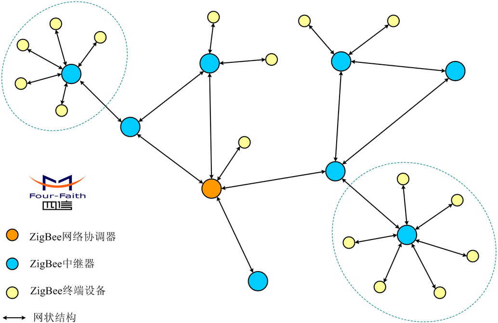

&emsp;&emsp;`ZigBee`是基于`IEEE 802.15.4`标准的低功耗局域网协议。根据国际标准规定，`ZigBee`技术是一种短距离、低功耗的无线通信技术。这一名称(又称`紫蜂协议`)来源于蜜蜂的八字舞，由于蜜蜂(`bee`)是靠飞翔和`嗡嗡`(`zig`)地抖动翅膀的`舞蹈`来与同伴传递花粉所在方位信息，也就是说蜜蜂依靠这样的方式构成了群体中的通信网络。其特点是近距离、低复杂度、自组织、低功耗、低数据速率。主要适合用于自动控制和远程控制领域，可以嵌入各种设备。简而言之，`ZigBee`就是一种便宜的、低功耗的近距离无线组网通讯技术，是一种低速短距离传输的无线网络协议。`ZigBee`协议从下到上分别为物理层`PHY`、媒体访问控制层`MAC`、传输层`TL`、网络层`NWK`、应用层`APL`等。其中物理层和媒体访问控制层遵循`IEEE 802.15.4`标准的规定。<!--more-->

### 起源

&emsp;&emsp;`ZigBee`的底层技术基于`IEEE 802.15.4`，即其物理层和媒体访问控制层直接使用了`IEEE 802.15.4`的定义。
&emsp;&emsp;在蓝牙技术的使用过程中，人们发现蓝牙技术尽管有许多优点，但仍存在许多缺陷。对于工业、家庭自动化控制和工业遥测遥控领域而言，蓝牙技术太复杂、功耗大、距离近、组网规模太小等。而工业自动化对无线数据通信的需求越来越强烈，而且对于工业现场，这种无线传输必须是高可靠的，并能抵抗工业现场的各种电磁干扰。因此，经过人们长期努力，`ZigBee`协议在`2003`年正式问世。另外，`Zigbee`使用了在它之前所研究过的面向家庭网络的通信协议`Home RF Lite`。
&emsp;&emsp;长期以来，低价位、低速率、短距离、低功率的无线通讯市场一直存在着。蓝牙的出现曾让工业控制、家用自动控制、玩具制造商等业者雀跃不已，但是蓝牙的售价一直居高不下，严重影响了这些厂商的使用意愿。如今，这些业者都参加了`IEEE 802.15.4`小组，负责制定`ZigBee`的物理层和媒体介质访问层。`IEEE 802.15.4`规范是一种经济、高效、低数据速率(小于`250kbps`)、工作在`2.4GHz`和`868/915MHz`的无线技术，用于个人区域网和对等网络，它是`ZigBee`应用层和网络层协议的基础。`ZigBee`是一种新兴的近距离、低复杂度、低功耗、低数据速率、低成本的无线网络技术，它是一种介于无线标记技术和蓝牙之间的技术提案，主要用于近距离无线连接。它依据`802.15.4`标准，在数千个微小的传感器之间相互协调实现通信。这些传感器只需要很少的能量，以接力的方式通过无线电波将数据从一个网络节点传到另一个节点，所以它们的通信效率非常高。

### 特性

- 低功耗。在低耗电待机模式下，`2`节`5`号干电池可支持`1`个节点工作`6`至`24`个月，甚至更长，这是`ZigBee`的突出优势。相比较而言，蓝牙只能工作数周，`WiFi`只可工作数小时。
- 低成本。通过大幅简化协议(不到蓝牙的`1/10`)，降低了对通信控制器的要求。而且`ZigBee`免协议专利费，其支持芯片的价格大约为`2`美元。
- 低速率。`ZigBee`工作在`20`至`250kbps`的速率，分别提供`250kbps`(`2.4GHz`)、`40kbps`(`915MHz`)和`20kbps`(`868MHz`)的原始数据吞吐率，满足低速率传输数据的应用需求。
- 近距离。传输范围一般介于`10`至`100m`之间，在增加发射功率后，亦可增加到`1`至`3km`，这指的是相邻节点间的距离。如果通过路由和节点间通信的接力，传输距离将可以更远。
- 短时延。`ZigBee`的响应速度较快，一般从睡眠转入工作状态只需`15ms`，节点连接进入网络只需`30ms`，进一步节省了电能。相比较而言，蓝牙需要`3`至`10s`、`WiFi`需要`3s`。
- 高容量。`ZigBee`可采用星状、片状和网状网络结构，由一个主节点管理若干子节点，最多一个主节点可管理`254`个子节点；同时主节点还可由上一层网络节点管理，最多可组成`65000`个节点的大网。
- 高安全。`ZigBee`提供了三级安全模式，包括无安全设定、使用访问控制清单(`Access Control List`，`ACL`)防止非法获取数据以及采用高级加密标准(`AES128`)的对称密码，以灵活确定其安全属性。
- 免执照频段。使用工业科学医疗(`ISM`)频段，即`915MHz`(美国)、`868MHz`(欧洲)、`2.4GHz`(全球)。由于此三个频带物理层并不相同，其各自信道带宽也不同，分别为`0.6MHz`、`2MHz`和`5MHz`，分别有`1`个、`10`个和`16`个信道。这三个频带的扩频和调制方式亦有区别。扩频都使用直接序列扩频(`DSSS`)，但从比特到码片的变换差别较大。调制方式都用了调相技术，但`868MHz`和`915MHz`频段采用的是`BPSK`，而`2.4GHz`频段采用的是`OQPSK`。

### 组网通信方式

&emsp;&emsp;`ZigBee`技术所采用的自组织网是怎么回事？举一个简单的例子，当一队伞兵空降后，每人持有一个`ZigBee`网络模块终端，降落到地面后，只要他们彼此间在网络模块的通信范围内，通过彼此自动寻找，很快就可以形成一个互联互通的`ZigBee`网络。而且由于人员的移动，彼此间的联络还会发生变化。因而，模块还可以通过重新寻找通信对象，确定彼此间的联络，对原有网络进行刷新，这就是自组织网。
&emsp;&emsp;`ZigBee`技术为什么要使用自组织网来通信？网状网通信实际上就是多通道通信，在实际工业现场，由于各种原因，往往并不能保证每一个无线通道都能够始终畅通，就像城市的街道一样，可能因为车祸、道路维修等，使得某条道路的交通出现暂时中断。此时由于有多个通道，车辆(相当于我们的控制数据)仍然可以通过其他道路到达目的地，而这一点对工业现场控制而言则非常重要。
&emsp;&emsp;为什么自组织网要采用动态路由的方式？所谓动态路由是指网络中数据传输的路径并不是预先设定的，而是传输数据前，通过对网络当时可利用的所有路径进行搜索，分析它们的位置关系以及远近，然后选择其中的一条路径进行数据传输。在我们的网络管理软件中，路径的选择使用的是`梯度法`，即先选择路径最近的一条通道进行传输，如果传不通，再使用另外一条稍远一点的通路进行传输，以此类推，直到数据送达目的地为止。在实际工业现场，预先确定的传输路径随时都可能发生变化，或者因各种原因路径被中断了，或者过于繁忙不能进行及时传送。动态路由结合网状拓扑结构，就可以很好解决这个问题，从而保证数据的可靠传输。
&emsp;&emsp;`ZigBee`网络中的设备可分为协调器(`Coordinator`)、汇聚节点(`Router`)、传感器节点(`EndDevice`)等三种角色：

- 协调器(`coordinator`)：每个`zigbee`网络只允许有一个`zigbee`的协调器，协调器首先选择一个信道和网络标识(`PAN ID`)，然后开始这个网络。因为协调器是整个网络的开始，它具有网络的最高权限，是整个网络的维护者，还可以保持间接寻址用的表格绑定，同时还可以设计安全中心和执行其他动作，保持网络其他设备的通信。
- 路由器(`router`)：路由器是一种支持关联的设备，能够实现其他节点的消息转发功能。Zigbee的树形网络可以有多个`zigbee`路由器设备，`zigbee`的星型网络不支持`zigbee`的路由器设备。
- 终端(`end`)：`zigbee`终端节点是具体执行的数据采集传输的设备，它不能转发其他节点的消息。

### 性能

&emsp;&emsp;数据速率比较低，在`2.4GHz`的频段只有`250Kb/s`，而且这只是链路上的速率，除了信道竞争应答和重传等消耗，真正能被应用所利用的速率可能不足`100Kb/s`，并且余下的速率可能要被邻近多个节点和同一个节点的多个应用瓜分，因此不适合做传输视频之类的事情。适合的应用领域是传感和控制。
&emsp;&emsp;在可靠性方面，`ZigBee`有很多方面进行保证。物理层采用了扩频技术，能够在一定程度上抵抗干扰，`MAC`应用层(`APS`部分)有应答重传功能。`MAC`层的`CSMA`机制使节点发送前先监听信道，可以起到避开干扰的作用。当`ZigBee`网络受到外界干扰，无法正常工作时，整个网络可以动态地切换到另一个工作信道上。
&emsp;&emsp;在时延方面，由于`ZigBee`采用随机接入`MAC`层，且不支持时分复用的信道接入方式，因此不能很好地支持一些实时的业务。
&emsp;&emsp;对于能耗特性，能耗特性是`ZigBee`的一个技术优势。通常`ZigBee`节点所承载的应用数据速率都比较低。在不需要通信时，节点可以进入很低功耗的休眠状态，此时能耗可能只有正常工作状态下的千分之一。由于一般情况下，休眠时间占总运行时间的大部分，有时正常工作的时间还不到百分之一，因此达到很高的节能效果。
&emsp;&emsp;对于组网和路由性，`ZigBee`具有大规模的组网能力，每个网络`65000`个节点，而每个蓝牙网络只有`8`个节点。在路由方面，`ZigBee`支持可靠性很高的网状网的路由，所以可以布置范围很广的网络，并支持多播和广播特性，能够给丰富的应用带来有力的支持。