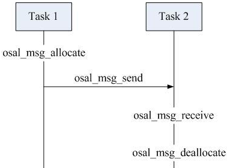

&emsp;&emsp;`zigbee`事件有两类，即系统定义事件和用户定义事件。系统类事件是协议栈已定义好的，用户类事件是我们用户层面来定义的。<!--more-->
&emsp;&emsp;事件类号采用一个`16bit`的常量，使用独热码编码，独热码是只有一个`bit`为`1`，其他全为`0`的一种码制。采用独热码的优点是操作方便，可以使用简单的位操作指令实现，例如提取系统类事件用`events & SYS_EVENT_MSG`，清除系统类事件用`events ^ SYS_EVENT_MSG`。由于事件类号是`16bit`，也就是说`zigbee`事件类只有`16`个，系统类事件`SYS_EVENT_MSG`使用`0x8000`，故自定义事件类只有`15`个，可采用`0x4000`至`0x0001`。
&emsp;&emsp;事件处理函数为：

``` cpp
app_ProcessEvent ( byte task_id, UINT16 events );
```

可见调用此函数将传递两个参数，即`task_id`任务号和`events`事件类号。事件处理函数首先根据事件类号来判断是何种类型事件，然后根据任务号得到消息指针`pMsg`，最后根据消息指针结构里的事件号`pMsg->event`来具体处理事件。`event`为`8bit`的常量，系统`event`在`ZComDef.h`里定义。
&emsp;&emsp;在`ZigBee`协议栈中，任何通信数据都是利用帧的格式来组织的，协议栈的每一层都有特定的帧结构。`AF`定义了两种帧类型，键值对(`Key Value Pair`，`KVP`)和报文(`Message`，`MSG`)。`KVP`消息主要用于传输一些较为简单的变量格式，但由于`Zigbee`的很多应用领域中的消息较为复杂并不适用`KVP`格式，因此`Zigbee`协议规划定义了`MSG`类型。`MSG`对数据格式不作要求，适合任何格式的数据传输，因此可以用于传送数据量大的消息。
&emsp;&emsp;下面对系统`event`说明(其中`AF_`代表应用框架，`ZDO_`代表设备对象)：

- `AF_DATA_CONFIRM_CMD`：`Data confirmation`数据收到确认；`A`设备发送数据，`B`设备收到数据后将返回应答`ack`给`A`，`A`收到此`ack`将触发`AF_DATA_CONFIRM_CMD`事件。`AF_DataRequest`函数参数`options`如果设为`AF_ACK_REQUEST`，则要求对方设备回复`ACK`。
- `AF_INCOMING_MSG_CMD`：`Incoming MSG type message`收到报文类型的消息；`A`设备用`AF_DataRequest`函数发出报文消息，`B`设备收到报文消息将触发`AF_INCOMING_MSG_CMD`事件。
- `AF_INCOMING_KVP_CMD`：`Incoming KVP type message`收到键值对类型的消息。
- `AF_INCOMING_GRP_KVP_CMD`：`Incoming Group KVP type message`收到群键值对类型的消息。
- `KEY_CHANGE`：`Key Events`按键触发事件。
- `ZDO_NEW_DSTADDR`：`ZDO`终端获得新地址；匹配描述符请求(`Match Descriptor Request`)响应指示(例如自动匹配)；如果`A`设备加入绑定后，`A`设备触发`ZDO_NEW_DSTADDR`事件。
- `ZDO_STATE_CHANGE`：`ZDO`网络状态改变；当`A`设备的网络状态改变时，`A`就会触发此消息，例如`SampleApp_NwkState = DEV_INIT`也会触发。
- `ZDO_MATCH_DESC_RSP_SENT`：`ZDO`描述符匹配响应发送；`A`设备发送`ZDP_MatchDescReq`函数请求描述符匹配绑定，`B`设备收到后发送`ZDP_MatchDescRsp`函数响应，`B`设备发送响应函数后触发`ZDO_MATCH_DESC_RSP_SENT`事件。
- `ZDO_CB_MSG`：收到`ZDO`反馈消息；`A`设备用函数`ZDO_RegisterForZDOMsg`注册了特定消息，`A`设备才能用`ZDO_CB_MSG`消息接收解析此特定消息。应用绑定例子：`A`设备发送绑定请求，B设备收到后发送匹配响应，`A`设备收到响应触发`ZDO_CB_MSG`事件。

---

### ZStack的OSAL的事件(event)与消息(message)

&emsp;&emsp;在`zstack`中，有两种方式在`OSAL`的任务(`task`)中添加自定义的功能：事件(`event`)和消息(`message`)。

### 事件

&emsp;&emsp;事件是驱动任务去执行某些操作的条件，当系统产生了一个事件，将这个触发传递给相应的任务后，任务才能执行一个相应的操作。`OSAL`通过一个`16`位宽度的数组来管理事件，意味着`OSAL`最多可以支持`16`个事件，其中最高位(`0x08000`，`SYS_EVENT_MSG`)系统保留，用户可以使用的事件有`15`个。事件的使用很简单：

1. 需要找个地方定义事件的`ID`，实际上是指定该事件占用事件数组的哪个位。例如`#define MY_EVENT 0x02`，占用`bit1`。
2. 在需要触发事件的地方调用函数`osal_set_event(task_id, event_flag)`。这个函数有两个参数，一个是接收事件任务的`ID`，另一个参数指定事件`ID`。
3. 在相应任务的处理函数，检查该事件执行相应代码即可。
4. 清除事件标识。

&emsp;&emsp;一个`event`被调用的过程：

1. `main -> osal_start_system`(在`ZMain.c`中)
2. `osal_start_system -> XX_event`(在`OSAL.c`中)

&emsp;&emsp;第一步简单易懂，重要的是第二步的实现。在`osal_start_system`函数中有如下代码：

``` cpp
/* 调用该idx个任务的事件处理函数(函数指针指向的函数) */
events = ( tasksArr[idx] ) ( idx, events );
```

这一步并不是直接调用的，而是根据不同的参数(`idx`，`events`)来动态调用的。这里涉及到一个很重要的结构体`tasksArr`数组：

``` cpp
const pTaskEventHandlerFn tasksArr[] = {
    macEventLoop,
    nwk_event_loop,
    Hal_ProcessEvent,
#if defined( MT_TASK )
    MT_ProcessEvent,
#endif
    APS_event_loop,
    ZDApp_event_loop,
    ControlWifi_ProcessEvent,
    GenericApp_ProcessEvent
};
```

这时候回到之前的那个语句`events = (tasksArr[idx])(idx, events)`。可以看出，这个语句是调用`tasksArr`中第`idx`个函数，然后把返回值赋给`events`(`events`是若干个标志位，每个标志位代表一个事件的发生与否)。至于调用的是哪个函数，就跟参数(`idx`，`events`)有关了。
&emsp;&emsp;`events`里对应的标志位决定着相应的事件处理函数被调用，只要某一个事件的标志位变成了`1`，处理函数就被调用。那么什么时候这个标志位会从`0`变成`1`呢？以下代码显示了这些标志位都被初始化为`0`：

``` cpp
void osalInitTasks ( void ) {
    uint8 taskID = 0;
    tasksEvents = ( uint16 * ) osal_mem_alloc ( sizeof ( uint16 ) * tasksCnt );
    osal_memset ( tasksEvents, 0, ( sizeof ( uint16 ) * tasksCnt ) );
}
```

从`0`变为`1`是由`osal_set_event`完成的，你想要在哪些动作完成后触发这个事件，就调用这个函数，将相应的标志位置`1`，那么在之后协议栈运行的过程中就会根据需要调用这个事件的处理函数了。如果是消息的话，使用`osal_msg_send`可以完成类似的功能。

### 消息

&emsp;&emsp;消息可以理解为带有附加信息的事件。最典型的一类便是按键消息，它同时产生了一个哪个按键被按下了附加信息。所以在`OnBoard_SendKeys`这个函数中，不仅向`GenericApp`发送了事件，还通过调用`osal_msg_send`函数向`GenericApp`发送了一个消息，这个消息记录了这个事件的附加信息。一般来说，一个消息总是和一个事件对应。当协议栈接收到消息后，在`ProcessEvent`函数中有以下语句：

``` cpp
if ( events &SYS_EVENT_MSG ) {
    MSGpkt = ( afIncomingMSGPacket_t * ) osal_msg_receive ( GenericApp_TaskID );

    while ( MSGpkt ) {
        switch ( MSGpkt->hdr.event ) {
            case /* 消息 */
```

可以看出，消息是被当作系统事件接收的，接收到之后会找到消息对应的`event`，之后进行相应的处理。消息的使用与事件类似，但是使用了不同的函数触发：

``` cpp
byte osal_msg_send ( byte destination_task, byte *msg_ptr );
```

这个函数有两个参数，分别为接收事件任务的`ID`，另一个是指向消息的指针。它的功能是向一个任务发送命令或数据消息，此外这个函数也会触发目标任务的`SYS_EVENT_MSG`(系统消息任务)。
&emsp;&emsp;首先我们需要明确几个概念，`msg`是用来干什么的？`msg`和`event`有什么不同？我们已经知道，`event`是一个事件，当这个事件发生以后，会触发相应的事件处理函数。即`event`是事先定义好的，但不知道会在哪个确定时间点被触发。而消息不同，顾名思义，消息是用来传递信息的，即有两个主体(如下图中的`task1`和`task2`)，在这两个主体想要通信的时候，就会用到消息：



### osal_msg_allocate

&emsp;&emsp;可以看出，`task1`想要给`task2`发送消息(这两个任务可能属于一个设备，也可能属于不同的设备，这一点稍后再说)，于是`task1`就得先产生一个`msg`，这时候就要用到`osal_msg_allocation`给这个消息分配一个缓存：

``` cpp
uint8 *osal_msg_allocate ( uint16 len ) {
    osal_msg_hdr_t *hdr;

    if ( len == 0 ) {
        return ( NULL );
    }

    hdr = ( osal_msg_hdr_t * ) osal_mem_alloc ( ( short ) ( len + sizeof ( osal_msg_hdr_t ) ) );

    if ( hdr ) {
        hdr->next = NULL;
        hdr->len = len;
        hdr->dest_id = TASK_NO_TASK;
        return ( ( uint8 * ) ( hdr + 1 ) );
    } else {
        return ( NULL );
    }
}
```

这个函数的参数`len`是`msg`的长度，那`osal_msg_hdr_t *hdr`又是什么呢？看一下`osal_msg_hdr_t`这个数据结构的定义：

``` cpp
typedef struct {
    void   *next;
    uint16 len;
    uint8  dest_id;
} osal_msg_hdr_t;
```

这个实际上是消息的头部。再看下一句：

``` cpp
hdr = ( osal_msg_hdr_t * ) osal_mem_alloc ( ( short ) ( len + sizeof ( osal_msg_hdr_t ) ) );
```

这句代码是给消息分配缓存区的，而缓存区的大小是`len + sizeof(osal_msg_hdr_t)`，也就是消息的大小加上消息头的大小。
&emsp;&emsp;到这里我们得出结论：一个消息应该是由两部分组成，即消息头和消息的实际内容，消息头是协议栈定义好的，而消息的内容则应该是我们自己添加的。再关注一下`osal_msg_allocate`的代码，可以看出除了分配缓存以外，它还赋给了消息头一个初始值，但是却没有对消息本身做什么处理。因为消息是要留给大家自己定义的，所以`osal_msg_allocate`将消息头`hdr`下一位的指针做为函数的返回值，以便添加自己的消息代码。
&emsp;&emsp;至于消息的具体定义，可以分为两种：系统消息和用户消息。系统消息就拜托协议栈来完成，而用户消息就需要大家根据实际要求动手来写。在接下来的内容中，完整的消息被认为是已经定义好的，直接拿来用就可以了。

### osal_msg_send

&emsp;&emsp;`send`函数有两个参数，一个是目标`task`的地址，另一个是指向消息的指针。

``` cpp
uint8 osal_msg_send ( uint8 destination_task, uint8 *msg_ptr ) {
    if ( msg_ptr == NULL ) {
        return ( INVALID_MSG_POINTER );
    }

    if ( destination_task >= tasksCnt ) {
        osal_msg_deallocate ( msg_ptr );
        return ( INVALID_TASK );
    }

    /* Check the message header */
    if ( OSAL_MSG_NEXT ( msg_ptr ) != NULL ||
        OSAL_MSG_ID ( msg_ptr ) != TASK_NO_TASK ) {
        osal_msg_deallocate ( msg_ptr );
        return ( INVALID_MSG_POINTER );
    }

    OSAL_MSG_ID ( msg_ptr ) = destination_task;
    osal_msg_enqueue ( &osal_qHead, msg_ptr ); /* queue message */
    /* Signal the task that a message is waiting */
    osal_set_event ( destination_task, SYS_EVENT_MSG );
    return ( SUCCESS );
}
```

`osal_msg_enqueue`这句看起来是入栈操作，其实就是这样的。协议栈在内部维护着一个消息队列，也就是说消息是按照队列的方式被操作的，所以就有了入栈出栈的内容。这里只要明白发送的消息被放到(应该是目标任务的)消息队列里就好了。再看一下`osal_set_event( destination_task, SYS_EVENT_MSG );`，它告诉我们，在发送了一个消息之后，会触发目标协议栈的系统事件`SYS_EVENT_MSG`。也就是说，虽然消息的处理方式与事件类似，但是有关消息的事件是系统事件。

### osal_msg_receive

&emsp;&emsp;`osal_msg_receive`又是一个重量级的`API`，这个`API`关系到我们怎么取出消息。

``` cpp
uint16 SampleApp_ProcessEvent ( uint8 task_id, uint16 events ) {
    afIncomingMSGPacket_t *MSGpkt;

    if ( events & SYS_EVENT_MSG ) {
        MSGpkt = ( afIncomingMSGPacket_t * ) osal_msg_receive ( SampleApp_TaskID );

        while ( MSGpkt ) {
            switch ( MSGpkt->hdr.event ) {
                case KEY_CHANGE: /* Received when a key is pressed */
                    SampleApp_HandleKeys ( ( ( keyChange_t * ) MSGpkt )->state,
                                           ( ( keyChange_t * ) MSGpkt )->keys );
                    break;
                /* Received when a messages is received (OTA) for this endpoint */
                case AF_INCOMING_MSG_CMD:
                    SampleApp_MessageMSGCB ( MSGpkt );
                    break;
```

在上面的函数中，首先定义了一个数据结构`afIncomingMSGPacket_t *MSGpkt`：

``` cpp
typedef struct {
    osal_event_hdr_t hdr;     /* OSAL Message header                                  */
    uint16 groupId;           /* Message's group ID - 0 if not set                    */
    uint16 clusterId;         /* Message's cluster ID                                 */
    /* Source Address, if endpoint is STUBAPS_INTER_PAN_EP, it's an InterPAN message  */
    afAddrType_t srcAddr;
    uint16 macDestAddr;       /* MAC header destination short address                 */
    uint8 endPoint;           /* destination endpoint                                 */
    uint8 wasBroadcast;       /* TRUE if network destination was a broadcast address  */
    uint8 LinkQuality;        /* The link quality of the received data frame          */
    uint8 correlation;        /* The raw correlation value of the received data frame */
    int8  rssi;               /* The received RF power in units dBm                   */
    uint8 SecurityUse;        /* deprecated                                           */
    uint32 timestamp;         /* receipt timestamp from MAC                           */
    afMSGCommandFormat_t cmd; /* Application Data                                     */
} afIncomingMSGPacket_t;
```

该结构体以`af_`开头，说明这个数据是经过无线传输后收到的，也就是由另一个设备上的`task`发送给本设备的。再来看一下`osal_event_hdr_t`结构体：

``` cpp
typedef struct {
    uint8 event;
    uint8 status;
} osal_event_hdr_t;
```

只包括了一个事件发生的标志(`event`)和状态(`status`)，它是用来找到事件对应的消息的。
&emsp;&emsp;前面说过，在发送一个消息之后`osal_mem_send`，会触发一个系统事件。我们现在遇到的情况是，有了这个事件之后，怎么找到它对应的消息？这时就需要上面介绍的机制了，定义一个指向`osal_event_hdr_t`类型的指针，然后用`osal_msg_receive`找到这个消息并让前面的指针`MSGpkt`指向它。在代码给出的例子中，指向消息的指针类型是`afIncomingMSGPacket_t`。但是从刚才的分析可以看出，如果是在同一个设备中的两个`task`通信的话，也就是不需要无线传输的时候，用`osal_event_hdr_t`类型的指针就可以满足要求了。
&emsp;&emsp;现在我们既有事件又有消息，接下来就愉快地进入处理带有消息的事件部分。以`case AF_INCOMING_MSG_CMD`为例，只要以`MSGpkt`为参数，调用相应的处理函数就好了，即`SampleApp_MessageMSGCB(MSGpkt);`。