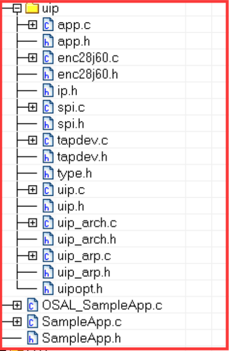

&emsp;&emsp;实验要实现的功能是要`ZigBee`与`ENC28J60`模块通信，然后实现`CC2530`串口与服务器透传，整个实验只需要用到一个`ZigBee`节点。<!--more-->
&emsp;&emsp;1. 打开例程`SampleApp.eww`工程，添加`ENC28J60`模块的驱动：



&emsp;&emsp;2. 在`SampleApp.c`文件中添加如下内容：

``` cpp
#include "tapdev.h"
#include "uip_arp.h"
#include "uip.h"
#include "app.h"

#define ETHBUF ((struct uip_eth_hdr *)&uip_buf[0])
```

&emsp;&emsp;3. 在`SampleApp_Init`函数中初始化网络模块和`PC`端的`IP`地址：

``` cpp
tapdev_init();
uip_arp_init();
uip_init();
{
    uint16 ipaddr[2];
    uip_ipaddr ( ipaddr, 192, 168, 1, 200 ); /* 设置本地IP */
    uip_sethostaddr ( ipaddr );
    uip_ipaddr ( ipaddr, 192, 168, 1, 1 ); /* 设置路由器IP */
    uip_setdraddr ( ipaddr );
    uip_ipaddr ( ipaddr, 255, 255, 255, 0 ); /* 设置网络掩码 */
    uip_setnetmask ( ipaddr );
    /* 启动UDP */
    uip_ipaddr ( ipaddr, 192, 168, 1, 239 ); /* 设置PC端IP */
    uip_udp_new ( ipaddr, 6000, 6000 );
    udp_sendconn->ripaddr[0] = HTONS ( ( 192 << 8 ) | 168 );
    /* 设置UDP发送目标IP */
    udp_sendconn->ripaddr[1] = HTONS ( ( 1 << 8 ) | 239 );
    udp_sendconn->lport = HTONS ( 6000 );
    udp_sendconn->rport = HTONS ( 6000 );
}
```

在`SampleApp_Init`函数的最后设置`ARP`和`uip`发送定时器：

``` cpp
osal_start_timerEx ( SampleApp_TaskID, SAMPLEAPP_ARP_TIMER_MSG_EVT, 100 );
osal_start_timerEx ( SampleApp_TaskID, SAMPLEAPP_UIP_SEND_MSG_EVT, 100 );
```

&emsp;&emsp;4. 修改`SampleApp_ProcessEvent`函数：

``` cpp
uint16 SampleApp_ProcessEvent ( uint8 task_id, uint16 events ) {
    afIncomingMSGPacket_t *MSGpkt;
    ( void ) task_id; /* Intentionally unreferenced parameter */

    if ( events & SYS_EVENT_MSG ) {
        MSGpkt = ( afIncomingMSGPacket_t * ) osal_msg_receive ( SampleApp_TaskID );

        while ( MSGpkt ) {
            switch ( MSGpkt->hdr.event ) {
                case KEY_CHANGE: /* Received when a key is pressed */
                    SampleApp_HandleKeys ( ( ( keyChange_t * ) MSGpkt )->state, \
                                           ( ( keyChange_t * ) MSGpkt )->keys );
                    break;
                /* Received when a messages is received (OTA) for this endpoint */
                case AF_INCOMING_MSG_CMD:
                    SampleApp_MessageMSGCB ( MSGpkt );
                    break;
                case ZDO_STATE_CHANGE:
                    /* Received whenever the device changes state in the network */
                    SampleApp_NwkState = ( devStates_t ) ( MSGpkt->hdr.status );

                    if ( ( SampleApp_NwkState == DEV_ZB_COORD ) || ( SampleApp_NwkState == DEV_ROUTER ) || \
                         ( SampleApp_NwkState == DEV_END_DEVICE ) ) {
                    } else {
                        /* Device is no longer in the network */
                    }

                    break;
                default:
                    break;
            }

            osal_msg_deallocate ( ( uint8 * ) MSGpkt ); /* Release the memory */
            /* Next - if one is available */
            MSGpkt = ( afIncomingMSGPacket_t * ) osal_msg_receive ( SampleApp_TaskID );
        }

        return ( events ^ SYS_EVENT_MSG ); /* return unprocessed events */
    }

    if ( events & SAMPLEAPP_SEND_PERIODIC_MSG_EVT ) { /* 周期发送函数 */
        return ( events ^ SAMPLEAPP_SEND_PERIODIC_MSG_EVT ); /* return unprocessed events */
    }

    if ( events & SAMPLEAPP_ARP_TIMER_MSG_EVT ) { /* arptimer */
        uip_arp_timer();
        /* 10s更新一次 */
        osal_start_timerEx ( SampleApp_TaskID, SAMPLEAPP_ARP_TIMER_MSG_EVT, 10000 );
        return ( events ^ SAMPLEAPP_ARP_TIMER_MSG_EVT ); /* return unprocessed events */
    }

    if ( events & SAMPLEAPP_UIP_REV_MSG_EVT ) { /* 收到网络数据 */
        if ( ETHBUF->type == htons ( UIP_ETHTYPE_IP ) ) {
            uip_arp_ipin();
            uip_input();

            if ( uip_len > 0 ) {
                uip_arp_out();
                tapdev_send();
            }
        } else if ( ETHBUF->type == htons ( UIP_ETHTYPE_ARP ) ) {
            uip_arp_arpin();

            if ( uip_len > 0 ) {
                tapdev_send();
            }
        }

        return ( events ^ SAMPLEAPP_UIP_REV_MSG_EVT ); /* return unprocessed events */
    }

    if ( events & SAMPLEAPP_UIP_SEND_MSG_EVT ) { /* 发送网络数据 */
        uip_udp_periodic ( 0 ); /* 检查UDP是否有数据发送 */

        if ( uip_len > 0 ) {
            uip_arp_out();
            tapdev_send();
        }

        for ( uint8 i = 0; i < UIP_CONNS; i++ ) {
            uip_periodic ( i );

            if ( uip_len > 0 ) {
                uip_arp_out();
                tapdev_send();
            }
        }

        osal_start_timerEx ( SampleApp_TaskID, SAMPLEAPP_UIP_SEND_MSG_EVT, 500 );
        return ( events ^ SAMPLEAPP_UIP_SEND_MSG_EVT ); /* return unprocessed events */
    }

    return 0; /* Discard unknown events */
}
```

&emsp;&emsp;5. 修改`tapdev.c`文件，将`tapdev_poll`函数改为：

``` cpp
void tapdev_poll ( void ) {
    uip_len = tapdev_read();

    if ( uip_len > 0 ) {
        extern uint8 SampleApp_TaskID;
        /* 通知应用程序收到了网络数据 */
        osal_set_event ( SampleApp_TaskID, SAMPLEAPP_UIP_REV_MSG_EVT );
    }
}
```

&emsp;&emsp;6. 将`Hal_ProcessPoll`函数修改为：

``` cpp
void Hal_ProcessPoll () {
#if (defined HAL_TIMER) && (HAL_TIMER == TRUE) /* Timer Poll */
    #error "The hal timer driver module is removed."
#endif

#if (defined HAL_UART) && (HAL_UART == TRUE) /* UART Poll */
    HalUARTPoll();
#endif

#if (defined HAL_SPI) && (HAL_SPI == TRUE) /* SPI Poll */
    HalSpiPoll();
#endif

#if (defined HAL_HID) && (HAL_HID == TRUE) /* HID poll */
    usbHidProcessEvents();
#endif

#if defined( POWER_SAVING )
    ALLOW_SLEEP_MODE(); /* Allow sleep before the next OSAL event loop */
#endif
    tapdev_poll(); /* 检查网络数据 */
}
```

&emsp;&emsp;7. 在串口回传函数中启动网络数据发送：

``` cpp
void SerialCallback ( uint8 port, uint8 events ) {
    ( void ) port;
    uint8 numBytes = 0;
    uint8 buf[60];

    if ( events & HAL_UART_RX_TIMEOUT ) { /* 串口有数据 */
        numBytes = Hal_UART_RxBufLen ( 0 ); /* 读出串口缓冲区有多少字节 */

        if ( numBytes ) {
            /* 从串口缓冲区读出numBytes字节数据 */
            HalUARTRead ( 0, buf, numBytes );
            HalUARTWrite ( 0, "send...\n", 8 );
            osal_memcpy ( udp_sendData, buf, numBytes );
            udp_sendDataLen = numBytes;
            /* 启动网络数据发送事件 */
            osal_set_event ( SampleApp_TaskID, SAMPLEAPP_UIP_SEND_MSG_EVT );
        }
    }
}
```

&emsp;&emsp;8. 在`SampleApp_Init`中添加串口初始化函数：

``` cpp
UartInit ( SerialCallback );
```

&emsp;&emsp;9. 连接硬件，将程序下载到`CC2530`硬件中，串口和网口可以互相发送数据。