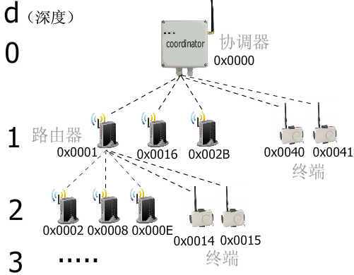

&emsp;&emsp;`ZigBee`有两种地址分配方式：分布式分配机制和随机分配机制。<!--more-->

### 随机分配机制

&emsp;&emsp;随机分配机制是指当`NIB`的`nwkAddrAlloc`值为`0x02`时，地址随机选择。在这种情况下，`nwkMaxRouter`就无意义了。随机地址分配应符合`NIST`测试中的描述。当一个设备加入网络使用的是`MAC`地址，其父设备应选择一个尚未分配过的随机地址。一旦设备已分配一个地址，它没有理由放弃该地址，并应予以保留，除非它收到声明，其地址与另一个设备冲突。此外，设备可能自我指派随机地址，比如利用加入命令帧加入一个网络。

### 分布式分配机制

&emsp;&emsp;每个`ZigBee`设备应该拥有一个唯一的`MAC`地址。协调器`coordinator`在建立网络以后，使用`0x0000`做为自己的短地址。在路由器`router`和终端`enddevice`加入网络以后，使用父设备给它分配的`16`位的短地址来通讯。那么这些短地址是如何分配的呢？`16`位的地址意味着可以分配给`65536`个节点之多，地址的分配取决于整个网络的架构，整个网络的架构由这`3`个值决定：

1. 网络的最大深度`Lm`，对应于`ZigBee`协议栈的`MAX_DEPTH`参数。
2. 每个父亲设备拥有的孩子数`Cm`，对应于`ZigBee`协议栈的`MAX_CHILDREN`参数。
3. 每个父亲设备拥有的孩子节点中路由器的最大数目`Rm`，对应于`ZigBee`协议栈的`MAX_ROUTERS`参数。

&emsp;&emsp;有了这`3`个值就可以根据下面的公式来算出某父设备的路由器子设备之间的地址间隔$Cskip(d)$：

$$
Ckip(d) = \left\{\begin{matrix}
1 + Cm(Lm-d-1), if Rm = 1 \\
\frac{1 + Cm - Rm -Cm*Rm^{Lm -d -1}}{1 - Rm}, otherwise
\end{matrix}\right.
$$

&emsp;&emsp;上面这个公式是用来计算位于深度`d`的父亲设备的，它所分配的子路由器之间的短地址间隔。该父亲设备分配的第`1`个路由器地址等于`父亲设备地址 + 1`，分配的第`2`个路由器地址等于`父亲设备地址 + 1 + Cskip(d)`，第`3`个路由器地址等于`父亲设备地址 + 1 + 2 * Cskip(d)`，依次类推。计算终端地址的公式如下：

$$
A_n = A_{parent} + Cskip(d) * Rm + n
$$

&emsp;&emsp;这个公式是来计算`Aparent`这个父亲设备分配的第`n`个终端设备的地址`An`。来举个简单的例子，假设有一个`ZigBee`网络，最大深度为`3`，每个父亲的最大孩子数是`5`，在孩子当中路由器数量是`3`：

&emsp;&emsp;由图可知，协调器的$Cskip(d) = \frac{1 + 5 - 3 - 5 \ast 3^{3 - 0 - 1}}{1 - 3} = 21$，所以协调器的第一个路由器是`1`，第二个就是`22`，换算成十六进制就是`0x0016`。协调器的第`1`个终端地址等于$0x0000 + 21 \ast 3 + 1 = 64 = 0x0040$，第`2`个就是`0x0041`。由此可见所有同一父亲的终端设备的短地址都是连续的。不难看出一旦`Lm`、`Cm`、`Rm`这`3`个值确定了，整个网络设备的地址也就确定下来。所以知道了某个设备的短地址，就可以计算出它的设备类型和它的父设备地址。