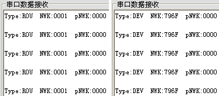

&emsp;&emsp;实验内容：`PC`端串口调试助手向协调器发送字符串`topology`，协调器接受到命令后，将网络拓扑信息发送到`PC`机串口调试助手上。<!--more-->
&emsp;&emsp;在`获取自身和父节点的网络地址、MAC地址`实验中，如果每个节点都获取自身和父节点的网络地址，然后发送到协调器节点，再通过串口发送至`PC`机上，这样就可以获得整个网络的拓扑结构了。

### 协调器程序设计

&emsp;&emsp;`NewCoordinator.h`文件中添加如下结构体：

``` cpp
typedef struct rftx {
    uint8 type[3];
    uint8 myNWK[4];
    uint8 pNWK[4];
} RFTX;
```

&emsp;&emsp;`NewCoordinator.c`如下：

``` cpp
#include "OSAL.h"
#include "AF.h"
#include "ZDApp.h"
#include "ZDObject.h"
#include "ZDProfile.h"
#include "NewCoordinator.h"
#include "DebugTrace.h"

#if !defined( WIN32 )
    #include "OnBoard.h"
#endif

/* HAL */
#include "hal_lcd.h"
#include "hal_led.h"
#include "hal_key.h"
#include "hal_uart.h"

/* This list should be filled with Application specific Cluster IDs. */
const cId_t GenericApp_ClusterList[GENERICAPP_MAX_CLUSTERS] = {
    GENERICAPP_CLUSTERID
};

const SimpleDescriptionFormat_t GenericApp_SimpleDesc = {
    GENERICAPP_ENDPOINT,                /* int Endpoint;            */
    GENERICAPP_PROFID,                  /* uint16 AppProfId[2];     */
    GENERICAPP_DEVICEID,                /* uint16 AppDeviceId[2];   */
    GENERICAPP_DEVICE_VERSION,          /* int AppDevVer:4;         */
    GENERICAPP_FLAGS,                   /* int AppFlags:4;          */
    GENERICAPP_MAX_CLUSTERS,            /* byte AppNumInClusters;   */
    ( cId_t * ) GenericApp_ClusterList, /* byte *pAppInClusterList; */
    0,
    ( cId_t * ) NULL
};

endPointDesc_t GenericApp_epDesc;
byte GenericApp_TaskID;
devStates_t GenericApp_NwkState;
byte GenericApp_TransID;

void GenericApp_MessageMSGCB ( afIncomingMSGPacket_t *pckt );
static void rxCB ( uint8 port, uint8 envent );

void GenericApp_Init ( byte task_id ) {
    GenericApp_TaskID = task_id;
    GenericApp_TransID = 0;
    GenericApp_epDesc.endPoint = GENERICAPP_ENDPOINT;
    GenericApp_epDesc.task_id = &GenericApp_TaskID;
    GenericApp_epDesc.simpleDesc = ( SimpleDescriptionFormat_t * ) &GenericApp_SimpleDesc;
    GenericApp_epDesc.latencyReq = noLatencyReqs;
    afRegister ( &GenericApp_epDesc );
    halUARTCfg_t uartConfig;
    uartConfig.configured = TRUE;
    uartConfig.baudRate   = HAL_UART_BR_115200;
    uartConfig.flowControl = FALSE;
    uartConfig.callBackFunc = rxCB;
    HalUARTOpen ( 0, &uartConfig );
}

UINT16 GenericApp_ProcessEvent ( byte task_id, UINT16 events ) {
    afIncomingMSGPacket_t *MSGpkt;
    HalLedBlink ( HAL_LED_1, 0, 50, 500 );

    if ( events & SYS_EVENT_MSG ) {
        MSGpkt = ( afIncomingMSGPacket_t * ) osal_msg_receive ( GenericApp_TaskID );

        while ( MSGpkt ) {
            switch ( MSGpkt->hdr.event ) {
                case AF_INCOMING_MSG_CMD:
                    HalLedBlink ( HAL_LED_2, 0, 50, 500 );
                    GenericApp_MessageMSGCB ( MSGpkt );
                    break;
                default:
                    break;
            }

            osal_msg_deallocate ( ( uint8 * ) MSGpkt );
            MSGpkt = ( afIncomingMSGPacket_t * ) osal_msg_receive ( GenericApp_TaskID );
        }

        return ( events ^ SYS_EVENT_MSG );
    }

    return 0;
}

RFTX rftx;

void GenericApp_MessageMSGCB ( afIncomingMSGPacket_t *pkt ) {
    switch ( pkt->clusterId ) {
        case GENERICAPP_CLUSTERID:
            osal_memcpy ( &rftx, pkt->cmd.Data, sizeof ( rftx ) );
            break;
    }
}

static void rxCB ( uint8 port, uint8 envent ) {
    uint8 changeline[2] = {0x0A, 0x0D};
    uint8 buf[8];
    HalUARTRead ( 0, buf, 8 );

    if ( osal_memcmp ( buf, "topology", 8 ) ) {
        HalUARTWrite ( 0, "Type: ", osal_strlen ( "Type:" ) );
        HalUARTWrite ( 0, rftx.type, 3 );
        HalUARTWrite ( 0, "  NWK:", osal_strlen ( "  NWK:" ) );
        HalUARTWrite ( 0, rftx.myNWK, sizeof ( rftx.myNWK ) );
        HalUARTWrite ( 0, "  pNWK:", osal_strlen ( "  pNWK:" ) );
        HalUARTWrite ( 0, rftx.pNWK, sizeof ( rftx.pNWK ) );
        HalUARTWrite ( 0, changeline, 2 );
    }
}
```

&emsp;&emsp;路由器节点或终端节点(共用的`Enddevice.c`文件)：

``` cpp
#include "OSAL.h"
#include "AF.h"
#include "ZDApp.h"
#include "ZDObject.h"
#include "ZDProfile.h"
#include "NewCoordinator.h"
#include "DebugTrace.h"

#if !defined( WIN32 )
    #include "OnBoard.h"
#endif

/* HAL */
#include "hal_lcd.h"
#include "hal_led.h"
#include "hal_key.h"
#include "hal_uart.h"

#define SEND_DATA_EVENT 0x01

const cId_t GenericApp_ClusterList[GENERICAPP_MAX_CLUSTERS] = {
    GENERICAPP_CLUSTERID
};

const SimpleDescriptionFormat_t GenericApp_SimpleDesc = {
    GENERICAPP_ENDPOINT,
    GENERICAPP_PROFID,
    GENERICAPP_DEVICEID,
    GENERICAPP_DEVICE_VERSION,
    GENERICAPP_FLAGS,
    0,
    ( cId_t * ) 0,
    GENERICAPP_MAX_CLUSTERS,
    ( cId_t * ) GenericApp_ClusterList
};

endPointDesc_t GenericApp_epDesc;
byte GenericApp_TaskID;
devStates_t GenericApp_NwkState;
byte GenericApp_TransID;

void GenericApp_MessageMSGCB ( afIncomingMSGPacket_t *pckt );
void GenericApp_SendTheMessage ( void );
void To_string ( uint8 *dest, char *src, uint8 length );

void GenericApp_Init ( byte task_id ) {
    GenericApp_TaskID = task_id;
    GenericApp_NwkState = DEV_INIT;
    GenericApp_TransID = 0;
    GenericApp_epDesc.endPoint = GENERICAPP_ENDPOINT;
    GenericApp_epDesc.task_id = &GenericApp_TaskID;
    GenericApp_epDesc.simpleDesc = ( SimpleDescriptionFormat_t * ) &GenericApp_SimpleDesc;
    GenericApp_epDesc.latencyReq = noLatencyReqs;
    afRegister ( &GenericApp_epDesc ); /* Register the endpoint description with the AF */
    halUARTCfg_t uartConfig;
    uartConfig.configured = TRUE;
    uartConfig.baudRate = HAL_UART_BR_115200;
    uartConfig.flowControl = FALSE;
    uartConfig.callBackFunc = NULL;
    HalUARTOpen ( 0, &uartConfig );
}

UINT16 GenericApp_ProcessEvent ( byte task_id, UINT16 events ) {
    afIncomingMSGPacket_t *MSGpkt;

    if ( events & SYS_EVENT_MSG ) {
        MSGpkt = ( afIncomingMSGPacket_t * ) osal_msg_receive ( GenericApp_TaskID );

        while ( MSGpkt ) {
            switch ( MSGpkt->hdr.event ) {
                case ZDO_STATE_CHANGE:
                    GenericApp_NwkState = ( devStates_t ) ( MSGpkt->hdr.status );

                    if ( ( GenericApp_NwkState == DEV_ROUTER ) || ( GenericApp_NwkState == DEV_END_DEVICE ) ) {
                        osal_set_event ( GenericApp_TaskID, SEND_DATA_EVENT );
                    }

                    break;
                default:
                    break;
            }

            osal_msg_deallocate ( ( uint8 * ) MSGpkt );
            MSGpkt = ( afIncomingMSGPacket_t * ) osal_msg_receive ( GenericApp_TaskID );
        }

        return ( events ^ SYS_EVENT_MSG );
    }

    if ( events & SEND_DATA_EVENT ) {
        HalLedBlink ( HAL_LED_2, 0, 50, 500 );
        GenericApp_SendTheMessage();
        osal_start_timerEx ( GenericApp_TaskID, SEND_DATA_EVENT, GENERICAPP_SEND_MSG_TIMEOUT );
        return ( events ^ SEND_DATA_EVENT );
    }

    return 0;
}

RFTX rftx;

void GenericApp_SendTheMessage ( void ) {
    uint16 nwk;

    if ( GenericApp_NwkState == DEV_ROUTER ) {
        osal_memcpy ( rftx.type, "ROU", 3 );
    } else if ( GenericApp_NwkState == DEV_END_DEVICE ) {
        osal_memcpy ( rftx.type, "DEV", 3 );
    }

    nwk = NLME_GetShortAddr();
    To_string ( rftx.myNWK, ( uint8 * ) &nwk, 2 );
    nwk = NLME_GetCoordShortAddr();
    To_string ( rftx.pNWK, ( uint8 * ) &nwk, 2 );
    uint8 changeline[2] = {0x0A, 0x0D};
    HalUARTWrite ( 0, "Type: ", osal_strlen ( "Type:" ) );
    HalUARTWrite ( 0, rftx.type, 3 );
    HalUARTWrite ( 0, "  NWK:", osal_strlen ( "  NWK:" ) );
    HalUARTWrite ( 0, rftx.myNWK, sizeof ( rftx.myNWK ) );
    HalUARTWrite ( 0, "  pNWK:", osal_strlen ( "  pNWK:" ) );
    HalUARTWrite ( 0, rftx.pNWK, sizeof ( rftx.pNWK ) );
    HalUARTWrite ( 0, changeline, 2 );
    afAddrType_t my_DstAddr;
    my_DstAddr.addrMode = ( afAddrMode_t ) Addr16Bit;
    my_DstAddr.endPoint = GENERICAPP_ENDPOINT;
    my_DstAddr.addr.shortAddr = 0x0000;

    if ( AF_DataRequest (
            &my_DstAddr, &GenericApp_epDesc,
            GENERICAPP_CLUSTERID,
            11,
            ( uint8 * ) &rftx,
            &GenericApp_TransID,
            AF_DISCV_ROUTE, AF_DEFAULT_RADIUS ) == afStatus_SUCCESS ) {
        HalLedBlink ( HAL_LED_1, 0, 50, 500 );
    }
}
```

&emsp;&emsp;实验结果(只有两块板子，一个做协调器，另一个只能做路由节点或终端节点，所以看不到拓扑的结果)：



&emsp;&emsp;如果想要看到真实的拓扑结果，可以在协调器中定义`RFTX`数组，然后在串口接收函数中将数组中的所有内容打印出来。