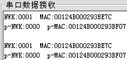

&emsp;&emsp;实验内容：协调器上电后建立网路，路由器自动加入网络。然后路由器调用相关的`API`函数获取本身的网络地址、`MAC`地址，父节点网络地址和父节点`MAC`地址，然后通过串口将其发送到`PC`端的串口调试助手。<!--more-->
&emsp;&emsp;获取本身的网络地址、`MAC`地址，父节点网络地址和父节点`MAC`地址的`API`函数如下：

``` cpp
uinit16 NLME_GetShortAddr ( void ); /* 返回该节点的网络地址 */
byte *NLME_GetExtAddr ( void ); /* 返回指向该节点MAC地址的指针 */
uint16 NLME_GetCoordShortAddr ( void ); /* 函数返回父节点的网络地址 */
void NLME_GetCoordExtAdd ( byte *buf ); /* 该函数的参数是指向存放父节点的MAC地址的缓冲区的指针 */
```

此外，`ZigBee`可以已知节点的网络地址查询节点的`IEEE`地址或已知节点的`IEEE`地址查询该节点的网络地址。
&emsp;&emsp;协调器程序设计(`Coordinator.c`)：

``` cpp
#include "OSAL.h"
#include "AF.h"
#include "ZDApp.h"
#include "ZDObject.h"
#include "ZDProfile.h"
#include <string.h>
#include "Coordinator.h"
#include "DebugTrace.h"

#if !defined(WIN32)
    #include "OnBoard.h"
#endif

#include "hal_lcd.h"
#include "hal_led.h"
#include "hal_key.h"
#include "hal_uart.h"

const cId_t GenericApp_ClusterList[GENERICAPP_MAX_CLUSTERS] = {
    GENERICAPP_CLUSTERID
};

/* 简单设备描述符(描述一个ZigBee设备节点) */
const SimpleDescriptionFormat_t GenericApp_SimpleDesc = {
    GENERICAPP_ENDPOINT,
    GENERICAPP_PROFID,
    GENERICAPP_DEVICEID,
    GENERICAPP_DEVICE_VERSION,
    GENERICAPP_FLAGS,
    GENERICAPP_MAX_CLUSTERS,
    ( cId_t * ) GenericApp_ClusterList,
    0,
    ( cId_t * ) NULL
};

endPointDesc_t GenericApp_epDesc; /* 节点描述符 */
byte GenericApp_TaskID; /* 任务优先级 */
byte GenericApp_TransID; /* 数据发送序列号 */

void GenericApp_Init ( byte task_id ) { /* 任务初始化函数 */
    GenericApp_TaskID = task_id; /* 初始化任务优先级(任务优先级有协议栈的操作系统OSAL分配) */
    GenericApp_TransID = 0; /* 发送数据包的序号初始化为0 */
    /* 对节点描述符进行初始化 */
    GenericApp_epDesc.endPoint = GENERICAPP_ENDPOINT;
    GenericApp_epDesc.task_id = &GenericApp_TaskID;
    GenericApp_epDesc.simpleDesc = ( SimpleDescriptionFormat_t * ) &GenericApp_SimpleDesc;
    GenericApp_epDesc.latencyReq = noLatencyReqs;
    /* afRegister对节点的描述符进行注册。注册后，才能使用OSAL提供的系统服务 */
    afRegister ( &GenericApp_epDesc );
}

UINT16 GenericApp_ProcessEvent ( byte task_id, UINT16 events ) { /* 消息处理函数 */
    return 0;
}
```

&emsp;&emsp;路由器程序设计(`Enddevice.c`)：

``` cpp
#include "OSAL.h"
#include "AF.h"
#include "ZDApp.h"
#include "ZDObject.h"
#include "ZDProfile.h"
#include <string.h>
#include "Coordinator.h"
#include "DebugTrace.h"

#if !defined(WIN32)
    #include "OnBoard.h"
#endif

#include "hal_lcd.h"
#include "hal_led.h"
#include "hal_key.h"
#include "hal_uart.h"

#define SHOW_INFO_EVENT 0x01

const cId_t GenericApp_ClusterList[GENERICAPP_MAX_CLUSTERS] = {
    GENERICAPP_CLUSTERID
};

const SimpleDescriptionFormat_t GenericApp_SimpleDesc = { /* 初始化端口描述符 */
    GENERICAPP_ENDPOINT,
    GENERICAPP_PROFID,
    GENERICAPP_DEVICEID,
    GENERICAPP_DEVICE_VERSION,
    GENERICAPP_FLAGS,
    0,
    ( cId_t * ) NULL,
    GENERICAPP_MAX_CLUSTERS,
    ( cId_t * ) GenericApp_ClusterList
};

endPointDesc_t GenericApp_epDesc; /* 节点描述符 */
byte GenericApp_TaskID; /* 任务优先级 */
byte GenericApp_TransID; /* 数据发送序列号 */
devStates_t GenericApp_NwkState; /* 保存节点状态 */

void ShowInfo ( void );
void To_string ( uint8 *dest, char *src, uint8 length );

typedef struct RFTXBUF {
    uint8 myNWK[4];
    uint8 myMAC[16];
    uint8 pNWK[4];
    uint8 pMAC[16];
} RFTX;

void GenericApp_Init ( byte task_id ) { /* 任务初始化函数 */
    GenericApp_TaskID = task_id; /* 初始化任务优先级 */
    GenericApp_NwkState = DEV_INIT; /* 初始化为DEV_INIT，表示节点没有连接到ZigBee网络 */
    GenericApp_TransID = 0; /* 发送数据包的序列号初始化为0 */
    /* 对节点描述符进行初始化 */
    GenericApp_epDesc.endPoint = GENERICAPP_ENDPOINT;
    GenericApp_epDesc.task_id = &GenericApp_TaskID;
    GenericApp_epDesc.simpleDesc = ( SimpleDescriptionFormat_t * ) &GenericApp_SimpleDesc;
    GenericApp_epDesc.latencyReq = noLatencyReqs;
    /* afRegister函数将节点描述符进行注册，注册后才可以使用OSAL提供的系统服务 */
    afRegister ( &GenericApp_epDesc );
    halUARTCfg_t uartConfig;
    uartConfig.configured = TRUE;
    uartConfig.baudRate = HAL_UART_BR_115200;
    uartConfig.flowControl = FALSE;
    uartConfig.callBackFunc = NULL;
    HalUARTOpen ( 0, &uartConfig );
}

UINT16 GenericApp_ProcessEvent ( byte task_id, UINT16 events ) { /* 消息处理函数 */
    afIncomingMSGPacket_t *MSGpkt;

    if ( events & SYS_EVENT_MSG ) {
        MSGpkt = ( afIncomingMSGPacket_t * ) osal_msg_receive ( GenericApp_TaskID );

        while ( MSGpkt ) {
            switch ( MSGpkt->hdr.event ) {
                case ZDO_STATE_CHANGE:
                    /* 读取节点的设备类型 */
                    GenericApp_NwkState = ( devStates_t ) ( MSGpkt->hdr.status );

                    if ( GenericApp_NwkState == DEV_ROUTER ) {
                        HalLedBlink ( HAL_LED_1, 0, 50, 500 ); /* LED1闪烁 */
                        osal_set_event ( GenericApp_TaskID, SHOW_INFO_EVENT );
                    }

                    break;
                default:
                    break;
            }

            osal_msg_deallocate ( ( uint8 * ) MSGpkt );
            MSGpkt = ( afIncomingMSGPacket_t * ) osal_msg_receive ( GenericApp_TaskID );
        }

        return ( events ^ SYS_EVENT_MSG );
    }

    if ( events & SHOW_INFO_EVENT ) {
        HalLedBlink ( HAL_LED_2, 0, 50, 500 );
        ShowInfo();
        osal_start_timerEx ( GenericApp_TaskID, SHOW_INFO_EVENT, 5000 );
        return ( events ^ SHOW_INFO_EVENT ); /* 清除事件标志 */
    }

    return 0;
}

void ShowInfo ( void ) {
    RFTX rftx;
    uint8 buf[8];
    uint8 changline[2] = {0x0A, 0x0D};
    uint16 nwk;
    nwk = NLME_GetShortAddr();
    To_string ( rftx.myNWK, ( uint8 * ) &nwk, 2 );
    To_string ( rftx.myMAC, NLME_GetExtAddr(), 8 );
    nwk = NLME_GetCoordShortAddr();
    To_string ( rftx.pNWK, ( uint8 * ) &nwk, 2 );
    NLME_GetCoordExtAddr ( buf );
    To_string ( rftx.pMAC, buf, 8 );
    HalUARTWrite ( 0, "NWK:", osal_strlen ( "NWK:" ) );
    HalUARTWrite ( 0, rftx.myNWK, 4 );
    HalUARTWrite ( 0, "  MAC:", osal_strlen ( "  MAC:" ) );
    HalUARTWrite ( 0, rftx.myMAC, 16 );
    HalUARTWrite ( 0, "  p-NWK:", osal_strlen ( "  p-NWK:" ) );
    HalUARTWrite ( 0, rftx.pNWK, 4 );
    HalUARTWrite ( 0, "  p-MAC:", osal_strlen ( "  p-MAC:" ) );
    HalUARTWrite ( 0, rftx.pMAC, 16 );
    HalUARTWrite ( 0, changline, 2 );
}

void To_string ( uint8 *dest, char *src, uint8 length ) {
    uint8 *xad;
    uint8 i = 0;
    uint8 ch;
    xad = src + length - 1;

    for ( i = 0; i < length; i++, xad-- ) {
        ch = ( *xad >> 4 ) & 0x0F;
        dest[i << 1] = ch + ( ( ch < 10 ) ? '0' : '7' );
        ch = *xad & 0x0F;
        dest[ ( i << 1 ) + 1] = ch + ( ( ch < 10 ) ? '0' : '7' );
    }
}
```

