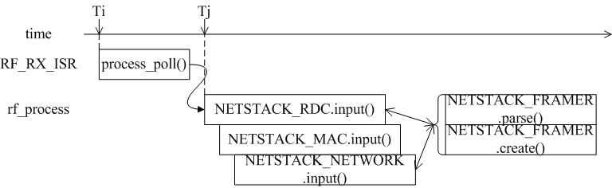

### 协议栈总体框架

&emsp;&emsp;`Contiki`系统为了支持多种硬件平台和软件协议设计了如图`1.1`所示的层次框架，通过`contiki-conf.h`的宏定义，用户可以灵活地选择协议类型：<!--more-->

``` cpp
#define NETSTACK_CONF_NETWORK rime_driver
#define NETSTACK_CONF_MAC     csma_driver
#define NETSTACK_CONF_RDC     cxmac_driver
#define NETSTACK_CONF_RADIO   sx1278_radio_driver
#define NETSTACK_CONF_FRAMER  framer_nullmac
```


<p align="center" style="color:green">图1.1 协议栈层次</p>

&emsp;&emsp;`Contiki V2.7`支持的各层次协议类别如图`1.2`所示。其中`NETSTACK_MAC`是一个概念层次，真正处理`MAC`逻辑是由`NETSTACK_RDC`(`Radio Duty Cycling`)完成的；而`NETSTACK_RADIO`层支持射频驱动，用户可以自由扩展。


<p align="center" style="color:green">图1.2 Contiki V2.7支持的协议类型</p>

### 收发Radio Packet的调用与时序

#### 接收Radio Packet

&emsp;&emsp;图`2.1`显示了接收`Radio Packet`的调用逻辑与时序。当射频硬件接收到数据包时，`ISR`通知`rf_process`，`rf_process`自底向顶调用：`RDC -> MAC -> NETWORK`协议栈的接收函数，最后将数据包提交给应用程序绑定的进程。



<p align="center" style="color:green">图2.1 接收Radio Packet</p>

#### 发送Radio Packet

&emsp;&emsp;如图`2.2`所举例，`process_i`需要发送`abc`(`Anonymous best-effort local area Broad Cast`)数据包，进程自顶向底调用：`MAC -> RDC -> RADIO`协议栈的发送函数，最后通过射频硬件以无线电方式传输。


<p align="center" style="color:green">图2.2 发送Radio Packet</p>

#### CSMA(Carrier Sense Multiple Access)协议原理

&emsp;&emsp;`CSMA`协议提供相对可靠的`MAC`层传输，每次调用`RDC`层发送数据包后，它根据反馈信息判断是否需要缓存并重传该数据包。
&emsp;&emsp;`CSMA`的关键数据结构如图`3.1`所示。`struct neighbor_queue`根据不同的接收地址缓存数据包；`struct rdc_buf_list`将同一个接收地址的不同`PACKETBUF_ATTR_MAC_SEQNO`的数据包进行链接；`struct queuebuf`保存需要重传的数据包头和数据实体；`struct qbuf_metadata`存储回调函数指针等信息。


<p align="center" style="color:green">图3.1 csma关键数据结构</p>

&emsp;&emsp;`CSMA`根据`RDC`层发送数据包的反馈信息选择相应逻辑动作：

- `MAC_TX_OK`：发送成功，回收缓存数据结构和善后工作；
- `MAC_TX_NOACK`：启动`ctimer`，随机延时后重传，直到发送次数超过`MAX`；
- `MAC_TX_COLLISION`：继续重传，且发送次数不受限。

&emsp;&emsp;一个`CSMA`的典型时序如图`3.2`所示，当`RDC`层发送完数据包后，`CSMA`的回调函数`packet_sent`根据发送结果选择动作(见上面逻辑描述)。如果需要重传，则根据重传次数选择一个随机时间设置`ctimer`，当`ctimer`定时器超时后再次发送该缓存的数据包。


<p align="center" style="color:green">图3.2 csma逻辑与时序</p>