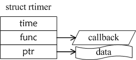
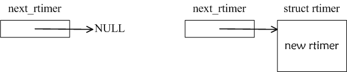
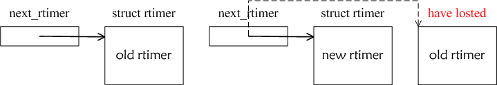
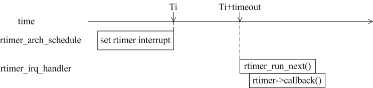

### rtimer用途

&emsp;&emsp;`Contiki`系统引入`rtimer`可以满足精准定时的需要，一些对时间极为敏感的模块(如`MAC`协议)依赖于`rtimer`。和`etimer`的粗粒度(常见为`100Hz`)不同，`rtimer`是细粒度(常见为`10kHz`)定时器。根据经验，细粒度定时器如果中断频繁特别容易消耗`CPU`资源，为此`Contiki`设计`rtimer`时尽可能地减少中断，大部分应用场合为读取定时器计数值。<!--more-->

### 数据结构

&emsp;&emsp;`Rtimer`的数据结构如图`1`所示，`time`赋值为下一次定时器超时中断的时刻点，`func`是定时器超时中断的回调函数，`ptr`是传递给回调函数的数据指针。

图1 rtimer数据结构

&emsp;&emsp;从图`1`发现，`rtimer`没有用常见的`next`指针来挂接后续节点。`Contiki`为了减少`rtimer`中断的爆发，只能挂接一个`rtimer`结构，如图`2`所示。如果同时挂接`2`个或以上的`rtimer`结构，那么最新挂接的有效，其它的`rtimer`结构将丢失，即图`3`的解释。

图2 只能插入一个rtimer

图3 挂接2个rtimer时有1个丢失

### rtimer中断时序

&emsp;&emsp;图`4`展示了`rtimer`的中断时序，当调用`rtimer_arch_schedule`时，它设置`rtimer`定时器的中断间隔时长`timeout`，中断服务程序`rtimer_irq_handler`会调用`rtimer->callback`回调函数。
&emsp;&emsp;需要特别注意`2`点：中断只允许发生一次，即`rtimer_arch_schedule`使能中断，而`rtimer_irq_handler`禁止中断；`rtimer->callback`是在中断状态下运行，特别注意防止竞态错误。例如，调用`process_poll`合法，调用`process_post`非法。

图4 rtimer中断时序

### rtimer移植

&emsp;&emsp;有了上述`rtimer`的理论，再来移植`rtimer`就比较容易了，即基于`MCU`实现`rtimer-arch.c`和`rtimer-arch.h`。
&emsp;&emsp;需要特别注意，大多数定时器(尤其是`8`位`MCU`)位宽为`16`位，即`MAX = 65535`，而`MAC`协议往往需要`1`秒以上的定时周期，因此`rtimer`的频率必须小于`30kHz`。一个比较好的数值是`10kHz`，它既可以保证比较好的精度(间隔为`100us`)，又具备`6.5`秒的满量程，这可以适应大多数的应用需要。
&emsp;&emsp;另外，大多数应用需要随机撤销和重启动`rtimer`，它可以通过添加`2`个函数来实现：`rtimer_arch_disable_irq`和`rtimer_arch_enable_irq`。