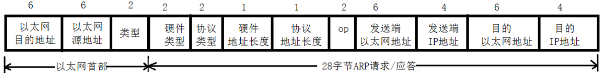

### 初始化函数

- `void uip_init(void)`：此函数用于在启动时初始化`uIP`的`TCP/IP`栈。<!--more-->
- `void uip_setipid(u16_t id)`：此函数用于启动时设置初始的`ip_id`。

&emsp;&emsp;`uip_init`代码分析如下：

``` cpp
void uip_init ( void ) {
    for ( c = 0; c < UIP_LISTENPORTS; ++c ) { /* 将uip_listenports数组全部清零 */
        uip_listenports[c] = 0;
    }

    /* 将所有连接的tcpstateflags状态标志设为关闭，表示此连接为关闭状态 */
    for ( c = 0; c < UIP_CONNS; ++c ) {
        uip_conns[c].tcpstateflags = UIP_CLOSED;
    }

#if UIP_ACTIVE_OPEN
    lastport = 1024;
#endif /* UIP_ACTIVE_OPEN */

#if UIP_UDP
    /* 如果定义了UIP_UDP，则将uip_udp_conns的lport清零 */
    for ( c = 0; c < UIP_UDP_CONNS; ++c ) {
        uip_udp_conns[c].lport = 0;
    }
#endif /* UIP_UDP */
    /* IPv4 initialization */
#if UIP_FIXEDADDR == 0 /* 如果主机地址要为固定的，在下面赋值 */
    /* uip_hostaddr[0] = uip_hostaddr[1] = 0; */
#endif /* UIP_FIXEDADDR */
}
```

- `UIP_LISTENPORTS`：可同时监听的`TCP`端口数最大值，每监听一个`TCP`端口都要占用`2`字节内存。
- `UIP_CONNS`：可同时打开的`TCP`端口数的最大值，由于`TCP`连接是静态分配的，所以降低这个值的大小可以降低占用的内存空间，每个`TCP`连接大约需要`30`字节内存。
- `UIP_UDP_CONNS`：最大的并行`UDP`连接数。
- `uip_conns`：`struct uip_conn`型结构体数列，数列大小为`UIP_CONNS`。每个`uip_conn`代表一个`TCP`连接。
- `uip_udp_conns`：`struct uip_udp_conn`型结构体数列，数列大小为`UIP_UDP_CONNS`。每个`uip_udp_conn`代表一个`UDP`连接。
- `UIP_ACTIVE_OPEN`：是否编译可以让上层应用程序动态打开外向的`TCP`连接的代码。关闭此功能可以降低`uIP`的代码大小。

&emsp;&emsp;`uip_setipid`如下：

``` cpp
void uip_setipid ( u16_t id ) {
    ipid = id; /* 此函数只是将传来的参数赋值给ipid */
}
```

#### uip_conn结构体

&emsp;&emsp;代表一个`uip`的`TCP`连接，此结构体用于监听一个`TCP`连接，对应用来说，除一个域之外，所有的域都是只读的。例外的是`appstate`域，它的目的是让应用存取应用相关的连接状态，此域的类型定义于`uipopt.h`中。

``` cpp
struct uip_conn {
    uip_ipaddr_t ripaddr; /* The IP address of the remote host. 运程主机的ip地址 */
    u16_t lport; /* The local TCP port, in network byte order. 本地主机的TCP端口，以网络传输中的字节顺序 */
    u16_t rport; /* The local remote TCP port, in network byte order. 远程主机的TCP端口，以网络传输中的字节顺序 */
    u8_t rcv_nxt[4]; /* The sequence number that we expect to receive next. 我们期待接收的下一个序号 */
    u8_t snd_nxt[4]; /* The sequence number that was last sent by us. 我们上次发送的序号 */
    u16_t len; /* Length of the data that was previously sent. 上次发送的数据长度 */
    u16_t mss; /* Current maximum segment size for the connection. 现行连接的段大小最大值 */
    u16_t initialmss; /* Initial maximum segment size for the connection. 连接的初始段大小最大值 */
    u8_t sa; /* Retransmission time-out calculation state variable. 重传超时计算状态变量 */
    u8_t sv; /* Retransmission time-out calculation state variable. 重传超时计算状态变量 */
    u8_t rto; /* Retransmission time-out. 重传超时 */
    u8_t tcpstateflags; /* TCP state and flags. TCP状态标志 */
    u8_t timer; /* The retransmission timer. 重传定时器 */
    u8_t nrtx; /* The number of retransmissions for the last segment sent. 上次发送的段的重传次数 */
    uip_tcp_appstate_t appstate; /* The application state. 应用状态 */
};
```

#### uip_udp_conn结构体

&emsp;&emsp;代表一个`uIP`的`UDP`连接：

``` cpp
struct uip_udp_conn {
    uip_ipaddr_t ripaddr; /* The IP address of the remote peer. 远程对等主机的ip地址 */
    u16_t lport; /* The local port number in network byte order. 本地端口号，以网络字节顺序 */
    u16_t rport; /* The remote port number in network byte order. 远程端口号，以网络字节顺序 */
    u8_t ttl; /* Default time-to-live. 默认存活时间 */
    uip_udp_appstate_t appstate; /* The application state. 应用状态 */
};
```


---

### 编译配置相关

&emsp;&emsp;相关文件如下：

- `uip-conf.h`：`uip`配置文件。
- `uipopt.h`：`uip`配置选项。

&emsp;&emsp;针对于工程的配置选项：`uip`有大量的配置选项，它们都可以根据工程需要重载。它们被保存在一个工程相关的`uip-conf.h`文件中，所有配置的名称都有`UIP_CONF`前辍。

``` cpp
#define UIP_CONF_MAX_CONNECTIONS /* 最大的TCP连接数 */
#define UIP_CONF_MAX_LISTENPORTS /* 最大监听的TCP端口数 */
#define UIP_CONF_BUFFER_SIZE     /* uip缓冲区大小 */
#define UIP_CONF_BYTE_ORDER      /* CPU字节顺序 */
#define UIP_CONF_LOGGING         /* 是否开启日志 */
#define UIP_CONF_UDP             /* 是否启用UDP功能 */
#define UIP_CONF_UDP_CHECKSUMS   /* 是否启用UDC校验和 */
#define UIP_CONF_STATISTICS      /* UIP配置统计是否开启 */

typedef uint8_t u8_t               /* 8位的数据类型 */
typedef uint16_t u16_t             /* 16位的数据类型 */
typedef unsigned short uip_stats_t /* 统计数据类型 */
```

&emsp;&emsp;静态配置选项：这些选项可以用来静态配置`IP`地址，条件是`UIP_FIXEDADDR`必须设为`1`。指定节点的配置选项包括`IP`地址、子网掩码、默认路由及以太网址。而后三项只有在以太网中时才可用。

``` cpp
#define UIP_FIXEDADDR    /* 决定uIP使用固定IP与否 */
#define UIP_PINGADDRCONF /* 设置ping地址 */
#define UIP_FIXEDETHADDR /* ARP模块的编译是否用固定的MAC地址 */
```

&emsp;&emsp;`IP`配置选项：

``` cpp
#define UIP_TTL 64          /* 定义UIP包的生存时间TTL */
#define UIP_REASSEMBLY      /* 打开IP包重新组装功能 */
#define UIP_REASS_MAXAGE 40 /* IP片断扔掉之前在重组装缓冲区等待的时间 */
```

&emsp;&emsp;UDP配置选项：

``` cpp
#define UIP_UDP           /* UDP支持是否编译 */
#define UIP_UDP_CHECKSUMS /* 是否使用UDP校验和 */
#define UIP_UDP_CONNS     /* 最大并发UDP连接数 */
```

&emsp;&emsp;TCP配置选项：

``` cpp
#define UIP_ACTIVE_OPEN                                          /* 决定UIP的打开连接支持是否编译 */
#define UIP_CONNS                                                /* 最大同时打开的TCP连接数 */
#define UIP_LISTENPORTS                                          /* 最大TCP监听端口数 */
#define UIP_URGDATA                                              /* 是否编译TCP紧迫数据提醒 */
#define UIP_RTO 3                                                /* 初始重传超时计数，以定时器脉冲个数计 */
#define UIP_MAXRTX 8                                             /* 一段数据最大重传多少次才取消连接 */
#define UIP_MAXSYNRTX 5                                          /* 一段SYN数据要最大得传多少次，才认定连接请求失败 */
#define UIP_TCP_MSS (UIP_BUFSIZE - UIP_LLH_LEN - UIP_TCPIP_HLEN) /* TCP最大段大小 */
#define UIP_RECEIVE_WINDOW                                       /* 广播接收器的最大窗口大小 */
#define UIP_TIME_WAIT_TIMEOUT 120                                /* 一个连接处于TIME_WAIT状态的最大时间 */
```

&emsp;&emsp;ARP配置选项：

``` cpp
#define UIP_ARPTAB_SIZE    /* ARP表大小 */
#define UIP_ARP_MAXAGE 120 /* ARP表的最大存活年龄，单位为10s */
```

&emsp;&emsp;通用配置选项：

``` cpp
#define UIP_BUFSIZE    /* UIP包缓冲区大小 */
#define UIP_STATISTICS /* 是否编译统计功能 */
#define UIP_LOGGING    /* 某些事件的日志功能是否编译 */
#define UIP_BROADCAST  /* 广播功能是否支持 */
#define UIP_LLH_LEN    /* 链路层头长度 */
```

&emsp;&emsp;`CPU`架构配置：这里指定的是`CPU`的大小端模式。当今的`CPU`多是小端的，然而最著名的例外就是`motorola`的CPU，它是大端的。应根据`CPU`的大小端模式不同，配置`BYTE_ORDER`。

``` cpp
#define UIP_BYTE_ORDER /* UIP所运行的CPU大小端模式 */
```

&emsp;&emsp;针对应用的配置：`UIP`应用是使用单个应用函数实现的。只要`TCP/IP`事件发生，`uIP`就会调用这个函数。这个函数的名字必须在编译时使用`UIP_APPCALL`注册到`uIP`。`uIP`应用可以在`uip_conn`结构中保存应用状态。这是通过利用`typedef uip_tcp_appstate_t`和`uip_udp_appstate_t`指定应用的类型实现的。包含此定义的文件必须被包含在`uipopt.h`文件中。下面是一个例子：

``` cpp
void httpd_appcall ( void );
#define UIP_APPCALL httpd_appcall

struct httpd_state {
    u8_t state;
    u16_t count;
    char *dataptr;
    char *script;
};

typedef struct httpd_state uip_tcp_appstate_t;
#define UIP_APPCALL smtp_appcall       /* TCP/IP事件的应答函数名称 */
typedef smtp_state uip_tcp_appstate_t; /* 存储在uip_conn中的应用状态类型 */
typedef int uip_udp_appstate_t;        /* 存储在uip_conn中的应用状态类型 */
#define UIP_LITTLE_ENDIAN 3412
#define UIP_BIG_ENDIAN 1234
```

- `#define UIP_ACTIVE_OPEN`：决定是否支持在`uip`中打开连接。如果此工程中工作于`uip`上层的应用不需要打开`TCP`连接，可以关闭此项以减小编译后的代码大小。
- `#define UIP_ARP_MAXAGE 120`：以`10s`为单位的`ARP`表项的最大年龄，`120`代表的是`20`分钟。
- `#define UIP_ARPTAB_SIZE`：`ARP`表的大小。如果`uip`节点可能在本地网络中有很多连接，则此值应设得大些。
- `#define UIP_BROADCAST`：支持广播。此标志用于配置广播的支持，仅在开启`UDP`时才有意义。
- `#define UIP_BUFSIZE`：`uip`包缓冲区大小。不小于`60`字节，不大于`1500`字节。这个值越小，`TCP`的吞吐量就越小，相反越大。
- `#define UIP_BYTE_ORDER`：`uip`运行的`CPU`构架的字节顺序，可选值仅有两个，分别为`BIG_ENDIAN`和`LITTLE_ENDIAN`。
- `#define UIP_CONNS`：可同时打开的最大`TCP`连接数。每个`TCP`连接需要大约`30`字节的`RAM`。
- `#define UIP_FIXEDADDR`：决定`uIP`是否使用固定`IP`地址。如果使用固定`IP`地址，则此地址可以在`uipopt.h`中指定。否则，如果想用动态的`IP`地址，则可以使用`uip_sethostaddr`、`uip_setdraddr`和`uip_setnetmask`三个宏动态指定。
- `#define UIP_FIXEDETHADDR`：决定`uIP`是否使用固定的`MAC`地址。若不使用固定的`MAC`地址，则可用`uip_setethaddr`在运行时动态指定。
- `#define UIP_LISTENPORTS`：可以同时监听的最大端口数。每监听一个`TCP`端口需要`2`字节内存。
- `#define UIP_LLH_LEN`：链路层头的长度。这个`IP`头在`uip_buf`中的编移量，对于以太网来说，此值为`14`；对于`SLIP`来说，其值为`0`。
- `#define UIP_LOGGING`：定义是否编译事件日志，这对于调试是非常有帮助的。如果打开此项，必须在工程的构架上实现`uip_log`。
- `#define UIP_MAXRTX 8`：在最多多少次重新发送同一段数据之后，就得取消连接。此项不应改变。
- `#define UIP_MAXSYNRTX 5`：一个`SYN`数据最多可以重传多少次，之后就得认为连接请求失败。此项亦不应改变。
- `#define UIP_PINGADDRCONF`：设定`ping`的`IP`地址。如果设定此项，则`uip`使用`ping`包来设定其`IP`地址。此时`uip`启用时会只有一个空的`IP`地址，而把收到的第一个`ping`包设为自己的地址。注意，此项只有在`UIP_FIXEDADDR`设为`0`时才可用。
- `#define UIP_REASSEMBLY`： 打开`IP`包重组。`uip`支持碎片`IP`包的重组。此项特性需要多余的`RAM`来盛放重组缓冲区，重组代码大小约为`700`字节。重组缓冲区的大小与`uip_buf`的大小(由`UIP_BUFSIZE`配置)相同。注意，`IP`包重组并未经过严格测试。
- `#define UIP_RECEIVE_WINDOW`：通告的接收器窗口。如果处理器对输入数据处理能力较慢，则应设得低些(`uip_buf`的大小)，否则应设得高些(`32768`字节)。
- `#define UIP_RTO 3`：以时钟脉冲计算的重传超时计数，此项不应改变。
- `#define UIP_STATISTICS`：决定是否将统计功能加入编译。统计功能对于调试和显示用户是非常有帮助的。
- `#define UIP_TCP_MSS (UIP_BUFSIZE - UIP_LLH_LEN - UIP_TCPIP_HLEN)`：`TCP`最大数据段大小。此值不应大于`(UIP_BUFSIZE - UIP_LLH_LEN - UIP_TCPIP_HLEN)`。
- `#define UIP_TIME_WAIT_TIMEOUT 120`：一个连接应该停留在`TIME_WAIT`状态的最长时间。此配置选项没有真正的实现，所以不应理会。
- `#define UIP_TTL 64`：`uip`发送的`IP`包的生存时间(`TTL`)，通常此项不应更改。
- `#define UIP_UDP_CHECKSUMS`：是否使用`UDP`校验和。注意，对`UDP`校验和的支持目前并不包含于`uIP`，故此项无用。
- `#define UIP_URGDATA`：`TCP`紧迫数据通告功能是否编译。紧迫数据(带外数据)在`TCP`中很少用到，所以很少需要。
- `typedef uint16_t u16_t`：`16`位数据类型。这个类型定义了通贯`uip`所使用的`16`位数据类型。
- `typedef uint8_t u8_t`：`8`位数据类型。此类型定义了通贯`uIP`中使用的`8`位数据类型。
- `typedef unsigned short uip_stats_t`：统计数据类型。此类型定义了通贯`uIP`使用的统计数据类型。
- `typedef uip_tcp_appstate_t`：此种类型的应用状态将会被存储于`uip_conn`结构中。它通常被`typedef`为一种保存应用状态信息的结构。
- `typedef uip_udp_appstate_t`：此种类型的应用状态将会被存储于`uip_conn`结构中。它通常被`typedef`为一种保存应用状态信息的结构。
- `void uip_log (char * msg)`：打印`uip`日志信息。此函数必须为使用`uIP`的模块实现，`uIP`每产生一条日志信息就会调用一次这个函数。

---

### 设备驱动与uIP的对接

&emsp;&emsp;实现设备驱动与`uIP`的对接，需要开发者实现如下`7`个接口程序：

``` cpp
#define uip_input()                 /* 处理一个输入的数据包 */
#define uip_periodic(conn)          /* 通过连接号，对连接周期性进行处理 */
#define uip_conn_active(conn) (uip_conns[conn].tcpstateflags != UIP_CLOSED)
#define uip_periodic_conn(conn)     /* 周期性处理一个连接，此操作要借助指向这个连接的结构体的指针 */
#define uip_poll_conn(conn)         /* 请求轮询(poll)某一指定连接 */
#define uip_udp_periodic(conn)      /* 周期性处理udp连接，此操作要借助连接号 */
#define uip_udp_periodic_conn(conn) /* 周期性处理udp连接，要借助指向此连接结构体的指针 */
```

还有一个变量在接口中用到：

``` cpp
u8_t uip_buf [UIP_BUFSIZE + 2] /* uip包缓冲区 */
```

- `uip_input`：此函数应该在设备从网络上接收到数据包时得到调用。设备驱动应该在调用此函数之前，将接收到的数据包内容存入`uip_buf`缓冲区，并将其长度赋给`uip_len`变量。此函数返回时，如果系统有数据要输出，会直接将数据存入`uip_buf`，并将其长度值赋给`uip_len`。如果没有数据要发送，则将`uip_len`赋`0`。通常使用此函数的方法如下：

``` cpp
uip_len = devicedriver_poll();

if ( uip_len > 0 ) {
    uip_input();

    if ( uip_len > 0 ) {
        devicedriver_send();
    }
}
```

注意，如果你写的`uip`设备驱动需要使用`ARP`协议，比如说在以太网内使用`uip`的时候，你就得在调用此函数之前先调用`uip`的`ARP`代码：

``` cpp
#define BUF ((struct uip_eth_hdr *)&uip_buf[0])
uip_len = ethernet_devicedrver_poll();

if ( uip_len > 0 ) {
    if ( BUF->type == HTONS ( UIP_ETHTYPE_IP ) ) {
        uip_arp_ipin();
        uip_input();

        if ( uip_len > 0 ) {
            uip_arp_out();
            ethernet_devicedriver_send();
        }
    } else if ( BUF->type == HTONS ( UIP_ETHTYPE_ARP ) ) {
        uip_arp_arpin();

        if ( uip_len > 0 ) {
            ethernet_devicedriver_send();
        }
    }
}
```

- `uip_periodic`：周期性处理一连接，需借助其连接号。此函数对`uip`的`tcp`连接进行一些必要的周期性处理(定时器、轮询等)，它应该在周期性`uip`定时器消息到来时被调用。它应该对每一个连接都得到调用，不管连接是打开的还是关闭的。此函数返回时，可能会有要传送出去的数据包等待得到服务，包内容会被放到`uip`包缓冲区中。如果真的有数据包需要送出，则`uip_len`的值会被置为一个大于零的数，此时设备驱动应该将数据包发送出去。通常调用此函数时，会使用一个如下的`for`循环：

``` cpp
for ( i = 0; i < UIP_CONNS; ++i ) {
    uip_periodic ( i );

    if ( uip_len > 0 ) {
        devicedriver_send();
    }
}
```

注意，如果你所写的设备驱动需要使用`ARP`协议，例如是在以太网中使用`uip`，你就得在调用驱动函数发送传出数据之间调用`uip_arp_out`函数：

``` cpp
for ( i = 0; i < UIP_CONNS; ++i ) {
    uip_periodic ( i );

    if ( uip_len > 0 ) {
        uip_arp_out();
        ethernet_devicedriver_send();
    }
}
```

- `uip_periodic_conn`：对一个连接进行周期性处理，需要借助指向其结构体的指针。这个函数与`uip_periodic`执行的操作是相同的，不同之处仅在于传入的参数是一个指向`uip_conn`结构体的指针。此函数可以用于对某个连接强制进行周期性处理。参数`conn`是指向要进行处理的连接结构体的指针。
- `uip_poll_conn`：请求对特定连接进行轮询，函数功能与`uip_periodic_conn`相同，但不是执行任何定时器处理，轮询以得到新数据。参数`conn`是指向要进行处理的连接结构体`uip_conn`的指针。
- `uip_udp_periodic`：借助连接号，周期性处理`udp`连接。此函数基本上与`uip_periodic`相同，区别之处仅在于这里处理的是`udp`连接。其调用方式也与`uip_periodic`类似：

``` cpp
for ( i = 0; i < UIP_UDP_CONNS; i++ ) {
    uip_udp_periodic ( i );

    if ( uip_len > 0 ) {
        devicedriver_send();
    }
}
```

注意，对于`uip_periodic`函数，在`uip`中使用`arp`和以太网时，要特别注意一些事情，这对于`uip_udp_periodic`也一样：

``` cpp
for ( i = 0; i < UIP_UDP_CONNS; i++ ) {
    uip_udp_periodic ( i );

    if ( uip_len > 0 ) {
        uip_arp_out();
        ethernet_devicedriver_send();
    }
}
```

- `uip_udp_periodic_conn`：周期性处理`udp`连接，需借助指向该连接结构体的指针。函数功能与`uip_udp_periodic(conn)`相同，不同之处在于所用参数为指向连接结构体的指针而非连接号。此函数可用于强制执行周期性处理某连接。参数`conn`是指向要处理的`udp`连接的`uip_udp_conn`结构体的指针。
- `uip_buf`：它是`uip`数据包缓冲区。`uip_buf`数组用于盛放传入/传出的数据包。设备驱动应将传入的数据放于此缓冲区中。发送数据时，设备驱动从缓冲区中读取链路层的头和`TCP/IP`头。链路层头的大小在`UIP_LLH_LEN`中定义。注意，应用数据无需放在这个缓冲区中，所以设备驱动需要从`uip_appdata`指针所指的地方读取数据。下面是一个例子：

``` cpp
void devicedriver_send ( void ) {
    hwsend ( &uip_buf[0], UIP_LLH_LEN );
    if ( uip_len <= UIP_LLH_LEN + UIP_TCPIP_HLEN ) {
        hwsend ( &uip_buf[UIP_LLH_LEN], uip_len - UIP_LLH_LEN );
    } else {
        hwsend ( &uip_buf[UIP_LLH_LEN], UIP_TCPIP_HLEN );
        hwsend ( uip_appdata, uip_len - UIP_TCPIP_HLEN - UIP_LLH_LEN );
    }
}
```

- `uip_len`：`uip_buf`缓冲区中的数据包长度(`uip_buf`是一数组，其长度固定，此处指的是动态存的数据长度，不是指数列本身长度)。这个全局变量盛放存储于`uip_buf`中的数据包的长度。当网络设备驱动调用`uip`输入函数时，`uip_len`要被设为传入数据包的大小。当向处发送数据包时，设备驱动通过这个变量确定要发送的数据包在`uip_buf`中的长度。

---

### 配置使用函数

&emsp;&emsp;`uIP`配置函数用于设置一些如`ip`地址等的`uIP`运行时参数。它包括以下一些函数：

``` cpp
#define uip_sethostaddr(addr) /* 设定主机IP地址 */
#define uip_gethostaddr(addr) /* 获取主机IP地址 */
#define uip_setdraddr(addr)   /* 设定默认路由器地址 */
#define uip_getdraddr(addr)   /* 获取默认路由器地址 */
#define uip_setnetmask(addr)  /* 设定网络掩码 */
#define uip_getnetmask(addr)  /* 获取网络掩码 */
#define uip_setethaddr(eaddr) /* 设定以太网MAC地址 */
```

前六个函数皆定义于`uip.h`，最后一个定义于`uip_arp.h`：

``` cpp
uip_sethostaddr：
#define uip_sethostaddr(addr) uip_ipaddr_copy(uip_hostaddr, (addr))
```

- `uip_sethostaddr`：设置主机`IP`地址，参数`addr`是指向`IP`地址类型`uip_ipaddr_t`的指针：

``` cpp
uip_ipaddr_t addr;
uip_ipaddr ( &addr, 192, 168, 1, 2 );
uip_sethostaddr ( &addr );
```

- `uip_gethostaddr`：设置主机`IP`地址：

``` cpp
#define uip_gethostaddr(addr) uip_ipaddr_copy((addr), uip_hostaddr)
```

使用方法如下：

``` cpp
uip_ipaddr_t hostaddr;
uip_gethostaddr ( &hostaddr )
```

- `uip_setdraddr`：设定默认路由器地址：

``` cpp
#define uip_setdraddr(addr) uip_ipaddr_copy(uip_draddr, (addr))
```

- `uip_getdraddr`：获取默认路由器地址：

``` cpp
#define uip_getdraddr(addr) uip_ipaddr_copy((addr), uip_draddr)
```

- `uip_setnetmask`：设定子网掩码：

``` cpp
#define uip_setnetmask(addr) uip_ipaddr_copy(uip_netmask, (addr))
```

- `uip_getnetmask`：获取子网掩码：

``` cpp
#define uip_getnetmask(addr) uip_ipaddr_copy((addr), uip_netmask)
```

- `uip_setethaddr`：获取以太网的`MAC`地址，`ARP`代码需要知道以太网卡的`MAC`地址才能回应`ARP`查询，并产生以太网头：

``` cpp
#define uip_setethaddr(eaddr) do {uip_ethaddr.addr[0] = eaddr.addr[0]; \
    uip_ethaddr.addr[1] = eaddr.addr[1];\
    uip_ethaddr.addr[2] = eaddr.addr[2];\
    uip_ethaddr.addr[3] = eaddr.addr[3];\
    uip_ethaddr.addr[4] = eaddr.addr[4];\
    uip_ethaddr.addr[5] = eaddr.addr[5];} while(0)
```

注意，此宏只能用来确定以太网卡的`MAC`地址，并不能用来改变它。参数`eaddr`是指向`uip_eth_addr`结构体的指针，里面包含了以太网卡的`MAC`地址：

``` cpp
struct uip_eth_addr {
    u8_t addr[6];
};
```


---

### uIP应用程序

&emsp;&emsp;`uIP`的发行版中包含了大量的应用程序，它们既可以直接使用，也可以用来学习写`uIP`应用程序：

- `DNS resolver`：`DNS`服务器，用于查找主机名，并将其映射到`IP`地址。
- `SMTP E-mail sender`：`RFC821`定义的简单邮件传输协议，它是在因特网上发送和传输邮件的标准方法。
- `Telnet server`：基于`uIP`的`Telnet`服务器。
- `Hello world`：一个小例程，用于讲述如何使用原始套接字写应用程序。
- `Web client`：一个`HTTP`客户端，可以网络服务器上下载网页和文件。
- `Web server`：一个非常简单的网络服务器实现。

---

### ARP应答

&emsp;&emsp;`ARP`应答部分代码为`uip_arp.c`中的`uip_arp_arpin`函数。这个函数是在设备接收到`ARP`包时，由驱动程序调用的。如果收到的`ARP`包是一个对本地主机上次发送的`ARP`请求的应答，那么就从包中取得自己想要的主机的`MAC`地址，加入自己的`ARP`缓存表中；如果收到是一个`ARP`请求，那就把自己的`MAC`地址打包成一个`ARP`应答，发送给请求的主机：

``` cpp
/*
 * ARP processing for incoming ARP packets 对传入的ARP包的处理
 *
 * This function should be called by the device driver when an ARP
 * packet has been received. The function will act differently
 * depending on the ARP packet type: if it is a reply for a request
 * that we previously sent out, the ARP cache will be filled in with
 * the values from the ARP reply. If the incoming ARP packet is an ARP
 * request for our IP address, an ARP reply packet is created and put
 * into the uip_buf[] buffer.
 * 此函数在收到ARP包时由设备驱动调用，函数行为会因包类型而有不同。如果收到的是一个对前先发送的请求的应答
 * 则根据应答的值填充缓存。如果传入的包是对我们的IP的请求，则创建一个ARP应答，并放入uip_buf中
 *
 * When the function returns, the value of the global variable uip_len
 * indicates whether the device driver should send out a packet or
 * not. If uip_len is zero, no packet should be sent. If uip_len is
 * non-zero, it contains the length of the outbound packet that is
 * present in the uip_buf[] buffer.
 * 函数返回时，全局变量uip_len的值指明了设备驱动要不要发送包。若uip_len为0，
 * 则不需发送；若uip_len不是0，则其值是uip_buf中包含的要传出的包的大小
 *
 * This function expects an ARP packet with a prepended Ethernet header in the
 * uip_buf[] buffer, and the length of the packet in the global variable uip_len.
 * 此函数预期中的uip_buf中有一个带以太网头的ARP包，其长度存为uip_len中
 */
void uip_arp_arpin ( void ) {
    if ( uip_len < sizeof ( struct arp_hdr ) ) {
        uip_len = 0;
        return;
    }

    uip_len = 0;

    switch ( BUF->opcode ) {
        case HTONS ( ARP_REQUEST ) :
            /* ARP request. If it asked for our address, we send out a reply. 如果是一个ARP请求，则发送应答 */
            if ( uip_ipaddr_cmp ( BUF->dipaddr, uip_hostaddr ) ) {
                /* First, we register the one who made the request in our ARP table, since it is
                   likely that we will do more communication with this host in the future.
                   首先，我们将发送请求的主机注册到ARP缓存表中，因为我们很可能要跟它要有更多的交流 */
                uip_arp_update ( BUF->sipaddr, &BUF->shwaddr );
                /* The reply opcode is 2. 应答的操作码为2 */
                BUF->opcode = HTONS ( 2 );
                memcpy ( BUF->dhwaddr.addr, BUF->shwaddr.addr, 6 );
                memcpy ( BUF->shwaddr.addr, uip_ethaddr.addr, 6 );
                memcpy ( BUF->ethhdr.src.addr, uip_ethaddr.addr, 6 );
                memcpy ( BUF->ethhdr.dest.addr, BUF->dhwaddr.addr, 6 );
                BUF->dipaddr[0] = BUF->sipaddr[0];
                BUF->dipaddr[1] = BUF->sipaddr[1];
                BUF->sipaddr[0] = uip_hostaddr[0];
                BUF->sipaddr[1] = uip_hostaddr[1];
                BUF->ethhdr.type = HTONS ( UIP_ETHTYPE_ARP );
                uip_len = sizeof ( struct arp_hdr );
            }

            break;
        case HTONS ( ARP_REPLY ) :
            /* ARP reply. We insert or update the ARP table if it was meant for us.
               如果收到的是一个ARP应答，而且也是我们所要的应答的话，就插件并更新ARP缓存表 */
            if ( uip_ipaddr_cmp ( BUF->dipaddr, uip_hostaddr ) ) {
                uip_arp_update ( BUF->sipaddr, &BUF->shwaddr );
            }

            break;
    }

    return;
}
```

这里有一件事是很有意思的，就是说如果某个主机请求得到我们的`MAC`的地址，我们先把它的`MAC`地址加入到自己的表中。就好比社交网络中，别人请求加我们为好友，如果我们接收的话，也自动加对方为好友一样。既然对方找上我们了，肯定是要做进一步的交流，互加`MAC`地址也很自然的。
&emsp;&emsp;如果收到了一个请求，我们要做应答：

``` cpp
BUF->opcode = HTONS ( 2 ); /* The reply opcode is 2. */
memcpy ( BUF->dhwaddr.addr, BUF->shwaddr.addr, 6 );
memcpy ( BUF->shwaddr.addr, uip_ethaddr.addr, 6 );
memcpy ( BUF->ethhdr.src.addr, uip_ethaddr.addr, 6 );
memcpy ( BUF->ethhdr.dest.addr, BUF->dhwaddr.addr, 6 );
BUF->dipaddr[0] = BUF->sipaddr[0];
BUF->dipaddr[1] = BUF->sipaddr[1];
BUF->sipaddr[0] = uip_hostaddr[0];
BUF->sipaddr[1] = uip_hostaddr[1];
BUF->ethhdr.type = HTONS ( UIP_ETHTYPE_ARP );
uip_len = sizeof ( struct arp_hdr );
```

由于请求和应答包很多地方是相同的，我们只需将收到的请求稍加修改就可以发送回去了。首先要改一下`MAC`地址，一共有`4`个地方。然后要将目标主机`IP`设为设为请求包的源主机`IP`，目的主机`IP`设为我们的`IP`就可以了。另外说一下对`ARP`缓存表的设置：

``` cpp
/* 这个函数是集插入、更新一体的，有两个参数，分别是IP地址和MAC地址 */
static void uip_arp_update ( u16_t *ipaddr, struct uip_eth_addr *ethaddr ) {
    register struct arp_entry *tabptr;
    /* Walk through the ARP mapping table and try to find an entry to update.
       If none is found, the IP -> MAC address mapping is inserted in the ARP table.
       遍历ARP映射表，看看有没有需要更新的表项。如果没有，就将新的表项插入 */
    for ( i = 0; i < UIP_ARPTAB_SIZE; ++i ) {
        tabptr = &arp_table[i];
        /* Only check those entries that are actually in use.
           所谓更新就是传入参数IP在表中己经存在了，这时不需要新建表项，而是要修改己存表项。
           只查使用中的表项，如果有些表项IP是0，那么就不是使用中的 */
        if ( tabptr->ipaddr[0] != 0 && tabptr->ipaddr[1] != 0 ) {
            /* Check if the source IP address of the incoming packet matches the
               IP address in this ARP table entry. 看看传入的IP有没有匹配项 */
            if ( ipaddr[0] == tabptr->ipaddr[0] && ipaddr[1] == tabptr->ipaddr[1] ) {
                /* An old entry found, update this and return.
                   如果有己存的匹配项，修改该项的MAC地址和更新时间 */
                memcpy ( tabptr->ethaddr.addr, ethaddr->addr, 6 );
                tabptr->time = arptime;
                return;
            }
        }
    }

    /* If we get here, no existing ARP table entry was found, so we create one.
       如果运行到这里，说明没有己存的表项，则创建一个 */
    /* First, we try to find an unused entry in the ARP table. 先看看有没有空表项可用 */
    for ( i = 0; i < UIP_ARPTAB_SIZE; ++i ) {
        tabptr = &arp_table[i];

        if ( tabptr->ipaddr[0] == 0 && tabptr->ipaddr[1] == 0 ) {
            break;
        }
    }

    /* If no unused entry is found, we try to find the oldest entry and
       throw it away. 如果没空表项，就找到一个最旧的表项，扔掉它，换成我们的 */
    if ( i == UIP_ARPTAB_SIZE ) {
        tmpage = 0;
        c = 0;

        for ( i = 0; i < UIP_ARPTAB_SIZE; ++i ) {
            tabptr = &arp_table[i];

            if ( arptime - tabptr->time > tmpage ) {
                tmpage = arptime - tabptr->time;
                c = i;
            }
        }

        i = c;
        tabptr = &arp_table[i];
    }

    /* Now, i is the ARP table entry which we will fill with the new
       information. 现在i就是我们最终得到的表项，我们把新的信息插入到这里 */
    memcpy ( tabptr->ipaddr, ipaddr, 4 );
    memcpy ( tabptr->ethaddr.addr, ethaddr->addr, 6 );
    tabptr->time = arptime;
```

`uip_arp_timer`如下：

``` cpp
/*
 * Periodic ARP processing function. ARP周期性处理函数。
 *
 * This function performs periodic timer processing in the ARP module
 * and should be called at regular intervals. The recommended interval
 * is 10 seconds between the calls.
 * 此函数在ARP模块中实行周期性处理，它应该每隔一段时间就调用一次，推荐为10秒
 */
void uip_arp_timer ( void ) {
    struct arp_entry *tabptr;
    ++arptime;

    for ( i = 0; i < UIP_ARPTAB_SIZE; ++i ) {
        tabptr = &arp_table[i];

        if ( ( tabptr->ipaddr[0] | tabptr->ipaddr[1] ) != 0 && \
             arptime - tabptr->time >= UIP_ARP_MAXAGE ) {
            memset ( tabptr->ipaddr, 0, 4 );
        }
    }
}
```

`UIP_ARP_MAXAGE`如下：

``` cpp
#define UIP_ARP_MAXAGE 120 /* 即20分钟 */
```

从这里可以看出，`ARP`表项中的更新时间是一个数，每调用一个上面这个函数，这个数就加`1`。这个周期性处理函数的作用就是每隔一段时间把超过`20`分钟都没有更新过的表项扔掉。
&emsp;&emsp;`uip_arp_init`如下：

``` cpp
/* Initialize the ARP module. 初始化ARP模块 */
void uip_arp_init ( void ) {
    for ( i = 0; i < UIP_ARPTAB_SIZE; ++i ) {
        memset ( arp_table[i].ipaddr, 0, 4 );
    }
}
```

所谓初始化，就是把数组中的每一个表项都扔掉，变成空表项。

---

### ARP请求

&emsp;&emsp;对于一个设备用的`ARP`协议而言，重要的东西包括三方面：

1. 一个本地的`IP`与`MAC`地址的缓存表，已有对应的更新和查询操作。
2. 一个发送`ARP`请求的函数。
3. 一个处理`ARP`回复的函数。

&emsp;&emsp;下面来看`uIP`中是如何实现的(代码见`uip_arp.c`)，首先定义一个缓存表的数据结构：

``` cpp
struct arp_entry {
    u16_t ipaddr[2];
    struct uip_eth_addr ethaddr;
    u8_t time;
};
```

第一项是`ip`地址，保存四个八位组；第二项是`MAC`地址；第三项是缓存更新时间。下面是`ARP`请求发送函数：

``` cpp
/*
 * Prepend Ethernet header to an outbound IP packet and see if we need to
 * send out an ARP request. 为传出的IP包添加以太网头并看是否需要发送ARP请求
 *
 * This function should be called before sending out an IP packet. The function
 * checks the destination IP address of the IP packet to see what Ethernet MAC
 * address that should be used as a destination MAC address on the Ethernet.
 * 此函数应该在发送IP包时调用，它会检查IP包的目的IP地址，看看以太网应该使用什么目的MAC地址
 *
 * If the destination IP address is in the local network (determined by logical ANDing
 * of netmask and our IP address), the function checks the ARP cache to see if an entry
 * for the destination IP address is found. If so, an Ethernet header is prepended and
 * the function returns. If no ARP cache entry is found for the destination IP address,
 * the packet in the uip_buf[] is replaced by an ARP request packet for the IP address.
 * The IP packet is dropped and it is assumed that they higher level protocols (e.g., TCP)
 * eventually will retransmit the dropped packet.
 * 如果目的IP地址是在局域网中(由IP地址与子网掩码的与逻辑决定)，函数就会从ARP缓存表中查找有
 * 无对应项。若有，就取对应的MAC地址，加上以太网头，并返回。否则uip_buf[]中的数据包会被替换成一个
 * 目的IP在址的ARP请求。原来的IP包会被简单的扔掉，此函数假设高层协议(如TCP)会最终重传扔掉的包。
 *
 * If the destination IP address is not on the local network,
 * the IP address of the default router is used instead.
 * 如果目标IP地址并非一个局域网IP，则会使用默认路由的IP地址。
 *
 * When the function returns, a packet is present in the uip_buf[] buffer,
 *  and the length of the packet is in the global variable uip_len.
 * 函数返回时，uip_buf[]中已经有了一个包，其长度由uip_len指定。
 */
void uip_arp_out ( void ) {
    struct arp_entry *tabptr;
    /* Find the destination IP address in the ARP table and construct
       the Ethernet header. If the destination IP addres isn't on the
       local network, we use the default router's IP address instead.
       在ARP表中找到目的IP地址，构成以太网头。如果目的IP地址不在局域网中，则使用默认路由的IP
       If not ARP table entry is found, we overwrite the original IP
       packet with an ARP request for the IP address. 如果ARP表中找不到，则将原来的IP包替换成一个ARP请求 */
    /* First check if destination is a local broadcast. 首先检查目标是不是广播 */
    if ( uip_ipaddr_cmp ( IPBUF->destipaddr, broadcast_ipaddr ) ) {
        memcpy ( IPBUF->ethhdr.dest.addr, broadcast_ethaddr.addr, 6 );
    } else {
        /* Check if the destination address is on the local network. 检查目标地址是否在局域网内 */
        if ( !uip_ipaddr_maskcmp ( IPBUF->destipaddr, uip_hostaddr, uip_netmask ) ) {
            /* Destination address was not on the local network, so we need to use the default router's
               IP address instead of the destination address when determining the MAC address.
               目的地址不在局域网内，所以保用默认路由器的地址来确在MAC地址 */
            uip_ipaddr_copy ( ipaddr, uip_draddr );
        } else {
            /* Else, we use the destination IP address. 否则，使用目标IP地址 */
            uip_ipaddr_copy ( ipaddr, IPBUF->destipaddr );
        }

        for ( i = 0; i < UIP_ARPTAB_SIZE; ++i ) { /* 这里遍历表，对比目的IP与ARP缓存表中的IP */
            tabptr = &arp_table;
            if ( uip_ipaddr_cmp ( ipaddr, tabptr->ipaddr ) ) {
                break;
            }
        }

        if ( i == UIP_ARPTAB_SIZE ) {
            /* The destination address was not in our ARP table, so we overwrite the IP packet
               with an ARP request. 如果遍历到头没找到，将原IP包替换为ARP请求并返回 */
            memset ( BUF->ethhdr.dest.addr, 0xff, 6 );
            memset ( BUF->dhwaddr.addr, 0x00, 6 );
            memcpy ( BUF->ethhdr.src.addr, uip_ethaddr.addr, 6 );
            memcpy ( BUF->shwaddr.addr, uip_ethaddr.addr, 6 );
            uip_ipaddr_copy ( BUF->dipaddr, ipaddr );
            uip_ipaddr_copy ( BUF->sipaddr, uip_hostaddr );
            BUF->opcode = HTONS ( ARP_REQUEST ); /* ARP request. */
            BUF->hwtype = HTONS ( ARP_HWTYPE_ETH );
            BUF->protocol = HTONS ( UIP_ETHTYPE_IP );
            BUF->hwlen = 6;
            BUF->protolen = 4;
            BUF->ethhdr.type = HTONS ( UIP_ETHTYPE_ARP );
            uip_appdata = &uip_buf[UIP_TCPIP_HLEN + UIP_LLH_LEN];
            uip_len = sizeof ( struct arp_hdr );
            return;
        }

        /* Build an ethernet header. 如果是在局域网中，且在ARP缓存中找到了
          (如果没找到进行不到这一步，在上面就返回了)，则构建以太网头 */
        memcpy ( IPBUF->ethhdr.dest.addr, tabptr->ethaddr.addr, 6 );
    }

    memcpy ( IPBUF->ethhdr.src.addr, uip_ethaddr.addr, 6 );
    IPBUF->ethhdr.type = HTONS ( UIP_ETHTYPE_IP );
    uip_len += sizeof ( struct uip_eth_hdr );
}
```

&emsp;&emsp;下面再总结一下其基本顺序：用`IPBUF->ethhdr.dest.addr`来存储目的`IP`地址，它有可能是局域网内一主机，也可能是路由器(如果是发往外网，即原来的目的`IP`不在局域网内)，还有可能是广播专用的`MAC`(`broadcast_ethaddr.addr`)。
&emsp;&emsp;先看是不是在广播，如果是广播，将`IPBUF->ethhdr.dest.addr`设为广播`MAC`。再看是不是在局域网内，如果不是，则将`IPBUF->ethhdr.dest.addr`设为路由器`MAC`。如果在局域网内，查看是否已经存在于`ARP`缓存表中，如果不在，将要发送的换成`ARP`请求，返回；如果已存在，则查找使用查找到的`MAC`地址为`IP`包添加以太网头。
&emsp;&emsp;这里还要解释一些细节问题，主要是：

1. 如何在`IP`包上添加以太网头？
2. 如果将`IP`包替换成`ARP`请求，`ARP`请求的格式是什么？
3. 广播地址。

&emsp;&emsp;将`IP`包替换成`ARP`请求部分代码(实际上`IP`包是放在`uip_buf`里的，这里只是将`uip_buf`填充上`ARP`请求即可)，位于`uip_arp.c`：

``` cpp
/* The destination address was not in our ARP table, so we
   overwrite the IP packet with an ARP request. */
memset ( BUF->ethhdr.dest.addr, 0xff, 6 );
memset ( BUF->dhwaddr.addr, 0x00, 6 );
memcpy ( BUF->ethhdr.src.addr, uip_ethaddr.addr, 6 );
memcpy ( BUF->shwaddr.addr, uip_ethaddr.addr, 6 );
uip_ipaddr_copy ( BUF->dipaddr, ipaddr );
uip_ipaddr_copy ( BUF->sipaddr, uip_hostaddr );
BUF->opcode = HTONS ( ARP_REQUEST ); /* ARP request. */
BUF->hwtype = HTONS ( ARP_HWTYPE_ETH );
BUF->protocol = HTONS ( UIP_ETHTYPE_IP );
BUF->hwlen = 6;
BUF->protolen = 4;
BUF->ethhdr.type = HTONS ( UIP_ETHTYPE_ARP );
uip_appdata = &uip_buf[UIP_TCPIP_HLEN + UIP_LLH_LEN];
uip_len = sizeof ( struct arp_hdr );
return;
```

首先解释这里的`BUF`(位于`uip_arp.c`)：

``` cpp
#define BUF ((struct arp_hdr *)&uip_buf[0])
```

可见这里的`BUF`就是`uip_buf`，只不过这里将它取做一个`struct arp_hdr`的结构体：

``` cpp
struct arp_hdr {
    struct uip_eth_hdr ethhdr;
    u16_t hwtype;                /* 硬件类型 */
    u16_t protocol;              /* 协议类型 */
    u8_t hwlen;
    u8_t protolen;
    u16_t opcode;                /* 操作码 */
    struct uip_eth_addr shwaddr; /* 源以太网地址 */
    u16_t sipaddr[2];            /* 源IP地址 */
    struct uip_eth_addr dhwaddr; /* 目的以太网地址 */
    u16_t dipaddr[2];            /* 目的IP地址 */
};
```

&emsp;&emsp;这里需要了解一下`ARP`的帧格式：



``` cpp
struct uip_eth_hdr {
    struct uip_eth_addr dest;
    struct uip_eth_addr src;
    u16_t type;
};
```

这是`arp_hdr`的第一个成员`ethhdr`的类型定义，对应图片中的前三项，即目的以太网地址、源以太网地址、`2`字节数据类型(`ARP`请求和应答为`0x0806`)。

- `arp_hdr`的`hwtype`对应图片中第三项，`2`字节硬件类型(值为`1`表示以太网)。注意，从这一行及以下提到的项数都是从`0`开始计数！
- `arp_hdr`的`protocol`对应图片中第四项，`2`字节要映射的协议地址类型(`ip`地址为`0x0800`)。
- `arp_hdr`的`hwlen`对应图片中第五项，`1`字节硬件地址长度(对`MAC`地址来说为`6`)。
- `arp_hdr`的`protolen`对应图片中第六项，`1`字节协议地址长度(对`IP`地址来说为`4`)。
- `arp_hdr`的`opcode`对应图片中第七项，`2`字节操作码(`1-ARP`请求、`2-ARP`应答、`3-RARP`请求、`4-RARP`应答，必需字段)。
- `arp_hdr`的`shwaddr`对应图片中第八项，`6`字节源以太网地址。
- `arp_hdr`的`sipaddr`对应图片中第九项，`2`字节源`IP`地址。
- `arp_hdr`的`dhwaddr`对应图片中第十项，`6`字节目标以太网地址。
- `arp_hdr`的`dipaddr`对应图片中第十一项，`2`字节目标`IP`地址。

这就是一个`ARP`帧的结构，可以看到，里面的源和目的以太网地址都是重复的。我们再看函数中的代码：

``` cpp
memset ( BUF->ethhdr.dest.addr, 0xff, 6 );
memset ( BUF->dhwaddr.addr, 0x00, 6 );
memcpy ( BUF->ethhdr.src.addr, uip_ethaddr.addr, 6 );
memcpy ( BUF->shwaddr.addr, uip_ethaddr.addr, 6 );
```

这里四个`memset`将重复的源和目的以太网地址一起设置了，四个`memset`对应图片中的`1`、`10`、`2`、`8`项。但是对`1`和`10`两项，都是源以太网地址，但置的值是不同的，分别为`0xff * 6`和`0x00 * 6`。
&emsp;&emsp;注意这里说，目的地址为全为`1`的广播地址。什么意思？当你发送一个`ARP`请求时，你是想知道一个`IP`对应的以太网地址(即`MAC`地址)，但是你现在不知道目的主机的以太网地址，你问谁啊？不知道问谁，这种情况下，只能是广播一下了，`0xff * 6`就是广播地址。
&emsp;&emsp;从图片中可以看到，`ARP`包是分成两部分的，前`6 + 6 + 2`叫做`以太网首部`，它的意义就是`分组是从谁(源地址)发给谁(目的地址)的什么类型`(帧类型，请求和应答为`0x0806`)，第二部分则是内容。请求帧如下(为了清晰在每行的前面加了字节计数，每行`16`个字节)：

``` cpp
以太网首部(14字节)
0000: ff ff ff ff ff ff 00 05 5d 61 58 a8 08 06
ARP帧(28字节)
0000:                                           00 01
0010: 08 00 06 04 00 01 00 05 5d 61 58 a8 c0 a8 00 37
0020: 00 00 00 00 00 00 c0 a8 00 02
填充位(18字节)
0020:                               00 77 31 d2 50 10
0030: fd 78 41 d3 00 00 00 00 00 00 00 00
```

- 以太网首部：目的主机采用广播地址，源主机的`MAC`地址是`00:05:5d:61:58:a8`，上层协议类型`0x0806`表示`ARP`。
- `ARP`帧：硬件类型`0x0001`表示以太网，协议类型`0x0800`表示`IP`协议，硬件地址(`MAC`地址)长度为`6`，协议地址(`IP`地址)长度为`4`，`op`为`0x0001`表示请求目的主机的`MAC`地址，源主机`MAC`地址为`00:05:5d:61:58:a8`，源主机`IP`地址为`c0 a8 00 37`(`192.168.0.55`)，目的主机`MAC`地址全`0`待填写，目的主机`IP`地址为`c0 a8 00 02`(`192.168.0.2`)。

&emsp;&emsp;由于以太网规定最小数据长度为`46`字节，`ARP`帧长度只有`28`字节，因此有`18`字节填充位，填充位的内容没有定义，与具体实现相关。
&emsp;&emsp;上面是一个`ARP`请求，它由`MAC`地址为`00:05:5d:61:58:a8`，`IP`地址为`c0 a8 00 37`(`192.168.0.55`)的主机发出，将`以太网首部`的源太网地址设为自己的`MAC`地址，目的以太网址设为全`1`，即广播。将最后四项中的源以太网地址和`IP`地址分别设为自己的`MAC`地址和`IP`地址，将目的`IP`地址，设为自己想到查询的`IP`地址，将目的以太网地址设为全`0`。应答帧如下：

``` cpp
以太网首部
0000: 00 05 5d 61 58 a8 00 05 5d a1 b8 40 08 06
ARP帧
0000:                                           00 01
0010: 08 00 06 04 00 02 00 05 5d a1 b8 40 c0 a8 00 02
0020: 00 05 5d 61 58 a8 c0 a8 00 37
填充位
0020:                               00 77 31 d2 50 10
0030: fd 78 41 d3 00 00 00 00 00 00 00 00
```

- 以太网首部：目的主机的`MAC`地址是`00:05:5d:61:58:a8`，源主机的`MAC`地址是`00:05:5d:a1:b8:40`，上层协议类型`0x0806`表示`ARP`。
- `ARP`帧：硬件类型`0x0001`表示以太网，协议类型`0x0800`表示`IP`协议，硬件地址(`MAC`地址)长度为`6`，协议地址(`IP`地址)长度为`4`，`op`为`0x0002`表示应答，源主机`MAC`地址为`00:05:5d:a1:b8:40`，源主机`IP`地址为`c0 a8 00 02`(`192.168.0.2`)，目的主机`MAC`地址为`00:05:5d:61:58:a8`，目的主机`IP`地址为`c0 a8 00 37`(`192.168.0.55`)。

&emsp;&emsp;上面是一个针对前面的`ARP`请求的应答，应答者是`MAC`地址为`00:05:5d:a1:b8:40`，`IP`地址为`c0 a8 00 02`(`192.168.0.2`)的主机。它将应答中的源主机地址设为自己的`MAC`地址，目的主机地址设为发出请求的主机的`MAC`地址。将最后四项中的源主机地址和`IP`地址设为自己的`MAC`地址和`IP`地址，目的主机地址和`IP`地址设为发出请求的主机的`MAC`地址和`IP`地址。可见，一个`ARP`的请求的应答帧很多域的值都是固定的，只有以太网首部`6 + 6`(目的`MAC`、源`MAC`)，最后四项`6 + 4 + 6 + 4`(源`MAC`、源`IP`、目的`MAC`、目的`IP`)和`opcode`(`1-ARP`请求、`2-ARP`应答、`3-RARP`请求、`4-RARP`应答，必需字段)需要按需填写。其中不知道的填全`0`，`ARP`请求的目的`MAC`在以太网首部为广播`MAC`，即全`0`。接着看如下代码：

``` cpp
uip_ipaddr_copy ( BUF->dipaddr, ipaddr );
uip_ipaddr_copy ( BUF->sipaddr, uip_hostaddr );
BUF->opcode = HTONS ( ARP_REQUEST ); /* ARP request. */
BUF->hwtype = HTONS ( ARP_HWTYPE_ETH );
BUF->protocol = HTONS ( UIP_ETHTYPE_IP );
BUF->hwlen = 6;
BUF->protolen = 4;
BUF->ethhdr.type = HTONS ( UIP_ETHTYPE_ARP );
```

前两句填写后四项中的`IP`地址部分，`ipaddr`为要查询的`IP`地址，`uip_hostaddr`为本机`IP`地址。前者在本函数中：

``` cpp
uip_ipaddr_copy ( ipaddr, IPBUF->destipaddr );
```

复制了`IP_BUF->destipaddr`的内容，它是在确定了是局域网`IP`时才复制的。`uip_arp.c`如下：

``` cpp
#define ARP_REQUEST    1
#define ARP_REPLY      2
#define ARP_HWTYPE_ETH 1
```

`uip_arp.h`如下：

``` cpp
#define UIP_ETHTYPE_ARP 0x0806
#define UIP_ETHTYPE_IP  0x0800
#define UIP_ETHTYPE_IP6 0x86dd
```

 &emsp;&emsp;`HTONS`是用来将单片机的字节序转换为网络字节序(位于`uip.h`)：

``` cpp
#ifndef HTONS
    #if UIP_BYTE_ORDER == UIP_BIG_ENDIAN
        #define HTONS(n) (n)
    #else /* UIP_BYTE_ORDER == UIP_BIG_ENDIAN */
        #define HTONS(n) (u16_t)((((u16_t) (n)) << 8) | (((u16_t) (n)) >> 8))
    #endif /* UIP_BYTE_ORDER == UIP_BIG_ENDIAN */
#else
    #error "HTONS already defined!"
#endif /* HTONS */
```

至于能在本机找到目的主机的`MAC`地址的情况，则为其加上以太网头，即以太网首部，读过上面的内容，这个也就容易理解了，就是填上前`6 + 6 + 2`字节而己。
&emsp;&emsp;如果在本地缓存表能找到目的主机`IP`地址，则直接为`IP`包加上以太网头，`IP`包的数据结构如下：

``` cpp
struct ethip_hdr {
    struct uip_eth_hdr ethhdr;
    /* IP header. */
    u8_t vhl,
         tos,
         len[2],
         ipid[2],
         ipoffset[2],
         ttl,
         proto;
    u16_t ipchksum;
    u16_t srcipaddr[2],
          destipaddr[2];
};
```

`arp_entry`结构如下：

``` cpp
struct arp_entry {
    u16_t ipaddr[2];
    struct uip_eth_addr ethaddr;
    u8_t time;
};

#define IPBUF ((struct ethip_hdr *)&uip_buf[0])
```


---

### 应用层要调用的函数

&emsp;&emsp;宏定义如下：

``` cpp
#define uip_outstanding(conn) ((conn)->len)
#define uip_datalen()           /* 存放在uip_appdata中的现行可用的传入数据长度 */
#define uip_urgdatalen()        /* 到达连接的带外数据长度(紧急的) */
#define uip_close()             /* 关闭当前连接 */
#define uip_abort()             /* 中止当前连接 */
#define uip_stop()              /* 告诉发送方主机停止发送数据 */
#define uip_stopped()           /* 查明当前连接是否以前被uip_stop停止过 */
#define uip_restart()           /* 如果当前连接被uip_stop停止过，重新开始 */
#define uip_udpconnection()     /* 查明当前连接是否是udp连接 */
#define uip_newdata()           /* 查明新传入的数据是否可用 */
#define uip_acked()             /* 查明以前发送的数据是否得到回应了 */
#define uip_connected()         /* 查明连接是否连接上了 */
#define uip_closed()            /* 查明连接是否是被另一端关闭 */
#define uip_aborted()           /* 查明连接是否被另一端中止 */
#define uip_timeout()           /* 查明连接是否超时 */
#define uip_rexmit()            /* 查明是否需要将上次传送的数据重新传送 */
#define uip_poll()              /* 查明连接是否被uip轮询了 */
#define uip_initialmss()        /* 获得当前连接的初始最大段大小 */
#define uip_mss()               /* 获取可以在当前连接上发送的最大段大小 */
#define uip_udp_remove(conn)    /* 移除一个udp连接 */
#define uip_udp_bind(conn,port) /* 绑定一个udp连接到本地端口 */
#define uip_udp_send(len)       /* 在当前连接上发送一个长度为len的udp数据报 */
```

&emsp;&emsp;函数如下：

``` cpp
void uip_listen ( u16_t port );                                  /* 开始监听指定的端口 */
void uip_unlisten ( u16_t port );                                /* 停止监听指定的端口 */
uip_conn *uip_connect ( uip_ipaddr_t *ripaddr, u16_t port );     /* 通过TCP连接到远程主机 */
void uip_send ( const void *data, int len );                     /* 在当前连接上发送数据 */
uip_udp_conn *uip_udp_new ( uip_ipaddr_t *ripaddr, u16_t port ); /* 建立一个新的udp连接 */
```

- `#define uip_datalen()`：如果有当前可用的传入数据的话，获取其长度。必需先调用`uip_data`查明是否有当前可用的传入数据。
- `#define uip_urgdatalen()`：任何到达连接的带外数据(紧迫数据)长度。要使用此宏，应配置`UIP_URGDATA`宏为真。
- `#define uip_close()`：此函数会以一种谨慎的方式关闭连接。
- `#define uip_abort()`：此函数用于中止(重置)当前连接，多用于出现错误导致无法使用`uip_close`的场合。
- `#define uip_stop()`：告诉发送主机停止发送数据。此函数会关闭接收机窗口，停止从当前连接接收数据。
- `#define uip_restart()`：如果当前连接曾被`uip_stop`停止，那么重新开始。该函数会重新打开接收机窗口，从当前连接上接收数据。
- `#define uip_udpconnection()`：此函数查明当前连接是否是一个`udp`连接。
- `#define uip_newdata()`：如果`uip_appdata`指针所指之处有送给应用的新数据，此宏得到一个非零值。数据的大小可以通过`uip_len`获得。
- `#define uip_acked()`：如果上次发送给远程主机的数据得到回应了，此宏得到一个非零值，这意味着应用可以发送新的数据。
- `#define uip_connected()`：如果当前连接己经与远程主机连接，则此宏得到非零值。这包括两种情形，一是连接被主动打开(通过`uip_connect`)，二是连接被被动打开(通过`uip_listen`)。
- `#define uip_closed()`：如果远程主机关闭了当前连接，则此宏得到非零值。这时应用可能要做一些清理工作。
- `#define uip_aborted()`：如果当前连接被远程主机中止或重置，则为非零值。
- `#define uip_timeout()`：如果当前连接由于多次重传导致超时中止，则为非零值。
- `#define uip_rexmit()`：如果上次传输的数据在网络中丢失，而应用应该重新传输，则此宏得非零值。应该使用`uip_send`重新传输与上次传输的完全相同的数据。
- `#define uip_poll()`：这个宏解决的问题是连接是不是由`uIP`轮询的。如果应用收到请求的原因是因为当前连接空闲太久被`uIP`轮询了，此宏得到非零值。轮询事件是用来发送数据的，这无需等待远程主机发送数据。
- `#define uip_mss()`：在连接上传送的当前最大段大小是由接收机的窗口计算和连接的`MSS`计算的(它可以由`uip_initialmss`计算)。
- `#define uip_udp_remove(conn)`：移除一个`udp`连接。参数`conn`是指向代表连接的`uip_udp_conn`的结构体。
- `#define uip_udp_bind(conn, port)`：绑定一个`udp`连接到本地端口。参数`conn`是指向代表`udp`连接的`uip_udp_conn`结构体的指针；`port`是本地端口号，以网络字节顺序。
- `#define uip_udp_send(len)`：在当前连接收发送一个长度为`len`的数据报。该函数只有在`udp`事件(轮询或新数据)才能调用。要发送的数据要提前送到`uip_buf`缓冲区中`uip_appdata`指针所指示的位置。参数`len`是存放在`uip_buf`中要发送的数据报的长度。
- `void listen(u16_t port)`：开始监听指定端口。注意，由于此函数中所用的参数`port`是网络字节顺序的，所以需要用到转换函数`HTONS`或`htons`。

``` cpp
uip_listen ( HTONS ( 80 ) );
```

- `void uip_unlisten(u16_t port)`：停止监听指定端口。注意，由于这里面用到的`port`是以网络字节顺序的，所以需要用到`HTONS`或`htons`函数。
- `void uip_send( void *data, int len)`：在当前连接上发送数据，此函数用于发送一个单段`TCP`数据。只有`uIP`因为事件处理而请求的应用才能发送数据。调用这个函数后实际发送数据量多少取决于`TCP`允许的数据量多少。`uIP`会自动裁剪数据，以保证发出去的数据是适量的。可以用`uip_mss`来查询实际可以发送的数据量。注意，此函数不保证发送的数据能到达目的地。如果数据在网络中丢失，应用会接到请求，此求时`uip_rexmit`事件被置位。这时应用就得使用此函数重发数据。参数`data`指向将要发送的数据的指针，`len`是要发送的数据的长度最大值。
- `struct uip_udp_conn * uip_udp_new(uip_ipaddr_t * ripaddr, u16_t rport)`：建立新的`UDP`连接。此函数用于建立一个新的`UDP`连接。此函数会自动为新连接分配一个本地未使用的端口。然而，也可以调用`uip_udp_new`函数之后，调用`uip_udp_bind`选择一个新的端口：

``` cpp
uip_ipaddr_t addr;
struct uip_udp_conn *c;
uip_ipaddr ( &addr, 192, 168, 2, 1 );
c = uip_udp_new ( &addr, HTONS ( 12345 ) );

if ( c != NULL ) {
    uip_udp_bind ( c, HTONS ( 12344 ) );
}
```

参数`ripaddr`是远程主机的`IP`地址，`rport`是远程主机的端口号，以网络字节顺序。返回值是指向新连接结构体`uip_udp_conn`的指针，如果连接未能分配，则为`NULL`。

---

### 原始线程

&emsp;&emsp;详细说明：`原始线程`是一种轻量级的、无需堆栈的线程。它主要用于内存极为受限的系统，如嵌入式系统、传感器网络等。
&emsp;&emsp;`原始线程`是以`C`语言代码实现的，为事件驱动的系统提供了线性的代码执行空间。`原始线程`即可以用在有实时操作系统的系统中，也可以用在没有实时操作系统的系统中。它在事件驱动的系统上层提供了阻塞上下文，省去了每个线程的单独堆栈空间开销。原始线程的目标是在没有复杂的状态机或多线程的情况下实现控制顺序流。原始线程在`C`语言内部实现了条件阻塞。
&emsp;&emsp;原始线程相对于纯事件驱动方法的优势是原始线程提供了可以阻塞函数的顺序代码结构。在纯事件驱动的方法中，阻塞的实现必须将一个函数手动分成两个部分。一部分放在阻塞调用前，一部分放在阻塞调用后。这让使用`if`和`while`语句变得困难。
&emsp;&emsp;原始线程相对于普通线程的优势是，它不需要为每个线程分配堆栈。在内存受限的系统中，为每个线程分配堆栈空间会占用大量的内存。相比而言，原始线程的每个线程只需`2`到`12`个字节的状态字，具体多大与构架有关。注意，由于原始线程在阻塞调用中不需保存堆栈上下文，原始线程阻塞时，局部变量也不再保留。这意味着局部变量的使用必须十分小心。如果不确定的话，尽量不要在原始线程中使用局部变量。
&emsp;&emsp;原始线程包括四个基本的操作：初始化(`PT_INIT`)、执行(`PT_BEGIN`)、条件阻塞(`PT_WAIT_UNTIL`)和退出(`PT_EXIT`)。在此之上还有两个方便使用的函数：反向条件阻塞(`PT_WAIT_WHILE`)和原始线程阻塞(`PT_WAIT_THREAD`)。
&emsp;&emsp;原始线程相对于多线程的优势在于原始线程是相当轻量极的，原始线程不需要自己的堆栈。相反，所有的线程都运行在同一个堆栈中，上下文的切换是通过堆栈的回转实现的。这在内存受限的系统中是具有优势的，因为那里一个线程的堆栈可能就占用了很大的一部分内存。原始线程的每条线程只需两字节，而且原始线程是纯用`C`语言实现的，不需要任何机器有关的汇编语言代码。
&emsp;&emsp;一个原始线程在一个`C`语言函数中运行，不能跨过多个函数。原始线程可以调用普通的`C`语言函数，而调用的`C`语言函数不能阻塞。嵌套调用的函数内部的阻塞是通过为可以阻塞的函数产生一个新的线程来实现的。这种方法的优点是阻塞是明确的，程序员确切的知道哪些函数是可以阻塞的，哪些函数是永远也不会阻塞的。
&emsp;&emsp;原始线程与不对称的协同程序是相似的，主要的不同在于协同程序为每个协同程序使用单独的堆栈，而原始线程无需堆栈。与原始线程最相似的机制是`Python`产生器。这些产生器也是无堆栈的结构，但用途不同。原始线程在`C`函数内部实现阻塞上下文，而`python`产生器从产生函数中提供了多个退出点。
&emsp;&emsp;原始线程是通过重复调用宿主函数驱动的。每调用宿主函数一次，原始线程都会运行到阻塞或退出为止。这样说来，原始线程的高度是由使用原始线程的应用做到的。
&emsp;&emsp;原始线程的实现采用了`local continuation`机制。`local continuation`代表的是一个程序在某个位置的当前执行状态，但不提供任何调用历史或局部变量。`local continuation`可以在指定函数内设定，以捕获程序的状态。`local continuation`设定后可以恢复，以复原`local continuation`设定时函数的状态。
&emsp;&emsp;`local continuation`的实现的多种方法：

- 使用机器相关的汇编语言。
- 使用标准`C`结构体。
- 使用编译器扩展。

&emsp;&emsp;第一种方式通过保存和恢复处理器状态实现，所说的处理器状态不包括堆栈指针。这种方式每个原始线程需要`16`到`32`个字节的内存空间，具体是多少与处理器构架有关。标准`C`语言的实现方式每个线程只需要`2`字节，它以一种不明显的方式优化了`C`语言中的`switch`语句，这与`Duff`的设备类似。然而，这种实现对使用原始线程的代码稍有限制，不能在代码中使用`switch`语句。某些编译器有`C`语言的扩展也可以实现原始线程。比如说`GCC`支持标签指针，这就可以用于此目的。在这种实现方式下，每个原始线程需要`4`字节内存。
&emsp;&emsp;文件`ft.h`实现原始线程，相应的数据结构为`struct pt`。初始化如下：

- `#define PT_INIT(pt)`：初始化原始线程。

&emsp;&emsp;声明和定义如下：

- `#define PT_THREAD(name_args)`：声明原始线程。
- `#define PT_BEGIN(pt)`：在要实现原始线程的函数内部声明原始线程的开始。
- `#define PT_END(pt)`：声明原始线程的结尾。

&emsp;&emsp;阻塞等待如下：

- `#define PT_WAIT_UNTIL(pt, condition)`：等待直到条件为真。
- `#define PT_WAIT_WHILE(pt, cond)`：等待只要条件为真。

&emsp;&emsp;分级的原始线程如下：

- `#define PT_WAIT_THREAD(pt, thread)`：阻塞等待子线程完成。
- `#define PT_SPAWN(pt, child, thread)`：产生子进程并等待其结束。

&emsp;&emsp;退出和重启如下：

- `#define PT_RESTART(pt)`：重启原始线程。
- `#define PT_EXIT(pt)`：退出原始线程。

&emsp;&emsp;调用原始线程如下：

- `#define PT_SCHEDULE(pt)`：高度原始线程。

&emsp;&emsp;原始线程让位如下：

- `#define PT_YIELD(pt)`：当前原始线程让位(即暂时中止，让别的线程先执行)。
- `#define PT_YIELD_UNTIL(pt)`：面前原始线程让位，直到条件为真。

&emsp;&emsp;线程状态定义如下：

``` cpp
#define PT_WAITING 0
#define PT_EXITED  1
#define PT_ENDED   2
#define PT_YIELDED 3
```

- `#define PT_BEGIN(pt)`：在实现原始线程的`C`函数中声明原始线程开始。此宏用于声明原始线程的开始点，应该把它放在使用原始线程的函数的开头。放在此句之前的`C`语句每次原始线程的调度都会执行一次。参数`pt`是指向线程控制结构的指针。
- `#define PT_END(pt)`：声明原始线程的结尾。此宏用于声明原始线程的结尾，它通常必须与`PT_BEGIN`宏匹配使用。参数`pt`是指向原始线程控制结构的指针。
- `#define PT_EXIT(pt)`：退出原始线程。此宏使用始线程退出。如果退出的线程是一个子线程，则其父线程结束阻塞状态，得以继续运行。参数`pt`是指向原始线程控制结构的指针。
- `#define PT_INIT(pt)`：初始化原始线程。初始化必须在使用之前完成。参数`pt`是指向原始线程控制结构的指针。
- `#define PT_RESTART(pt)`：重启原始线程。此宏会致使运行的线程从`PT_BEGIN`处重新开始执行。参数`pt`是指向原始线程控制结构的指针。
- `#define PT_SCHEDULE(f)`：调试线程。此函数用于调度线程，如果调度的线程在运行则此函数返回非零值；如已经退出，则返回零值。参数`f`为要调度的线程的宿主函数的调用。
- `#define PT_SPAWN(pt, child, thread)`：此宏用于产生一个子线程并等待直到子线程的退出，它只能用于线程内部。参数`pt`是指向线程控制结构的指针。`child`是指向子线程的控制结构的指针。
- `#define PT_THREAD(name_args)`：此宏用于声明原始线程，所有的原始线程都必须由此声明。
- `#define PT_WAIT_THREAD(pt, thread)`：阻塞并等待子线程完成。这个宏调度了一个子线程，并等待子线程的完成。注意，在此函数使用之前，子原始线程必须通过`PT_INIT`初始化。参数`pt`是指向原始线程控制结构体的指针，`thread`是带有参数的子线程。
- `#define PT_WAIT_UNTIL(pt, condition)`：阻塞等待，直到条件为真。此宏阻塞线程直到指定的条件为真。参数`pt`是指向原始线程控制结构体的指针，`condition`是指定的条件。
- `#define PT_WAIT_WHILE(pt, cond)`：阻塞等待，直到条件为真。此宏阻塞线程只要指定的条件为真。参数`pt`是指向原始线程控制结构体的指针，`condition`是指定的条件。
- `#define PT_YIELD(pt)`：从当前线程中让位。这个函数会让当前线程让位，从而使其它线程先在系统中运行。参数`pt`是指向原始个线程控制结构体的指针。
- `#define PT_YEILD_UNTIL(pt, cond)`：使当前线程让位，直到某条件发生。参数`pt`是指向原始线程控制结构的指针，`cond`是条件。此函数会让当前线程让位，直到某条件为真。

---

### 原始套接字

&emsp;&emsp;原始套接字(`protosocket`)为`uIP`提供了一个与传统`BSD`套接字接口类似的接口。不同于为传统`uIP`事件驱动接口写的程序，为原始套接字(`protosocket`)接口写的程序是顺序方式执行的，并且无需以明确的状态机方式实现。原始套接字只能用于`TCP`连接。
&emsp;&emsp;原始套接字库使用`原始线程`来提供顺序控制流。这使得原始套接字在内存方面变得轻量型，但也同时意味着原始套接字继承了`原始线程`的功能限制。每个原始套接字只能生存于单个函数中。自动变量(栈变量)不能跨原始套接字函数调用存在。注意，由于原始套接字库使用的是`原始线程`，在调用原始套接字库函数时，局部变量并不总能得到保存。所以这里建议局部变量的使用要十分小心。
&emsp;&emsp;原始套接字库提供了一些无需处理重传和回应的发送数据函数和一些无需对被分解成多个`TCP`段的数据进行处理的读取数据函数。由于每个原始套接字都作为一个`原始线程`来运行，应在使用原始套接字的函数起始处通过调用`PSOCK_BEGIN`的方式启用原始套接字。与之类似，原始套接字可以通过调用`PSOCK_EXIT`结束掉。
&emsp;&emsp;相关文件是`psock.h`，这是原始套接字库头文件。相关结构体是`struct psock_bufstruct psock`，它代表一个原始套接字。相关宏定义如下：

``` cpp
#define PSOCK_INIT(psock, buffer, buffersize)       /* 初始化一个原始套接字 */
#define PSOCK_BEGIN(psock)                          /* 在一个函数中启用一个原始套接字的原始线程 */
#define PSOCK_SEND(psock, data, datalen)            /* 发送数据 */
#define PSOCK_SEND_STR(psock, str)                  /* 发送一个以零结尾的字符串 */
#define PSOCK_GENERATOR_SEND(psock, generator, arg) /* 通过函数(generator)产生数据并发送出去 */
#define PSOCK_CLOSE(psock)                          /* 关闭一个原始套接字 */
#define PSOCK_READBUF(psock)                        /* 读数据直到缓冲区满 */
#define PSOCK_READTO(psock, c)                      /* 读数据到字符c */
#define PSOCK_DATALEN(psock)                        /* 获得上次读到的数据长度 */
#define PSOCK_EXIT(psock)                           /* 退出原始套接字的原始线程 */
#define PSOCK_CLOSE_EXIT(psock)                     /* 关闭一个原始套接字，并退出其原始线程 */
#define PSOCK_END(psock)                            /* 声明一个原始套接字的原始线程的结尾 */
#define PSOCK_NEWDATA(psock)                        /* 查明是否有数据到达原始套接字 */
#define PSOCK_WAIT_UNTIL(psock, condition)          /* 等待，直到条件(condition)为真 */
#define PSOCK_WAIT_THREAD(psock, condition) PT_WAIT_THREAD(&((psock)->pt), (condition))
```

相关函数如下：

``` cpp
u16_t psock_datalen ( struct psock *psock ) char psock_newdata ( psock *s )
```

- `#define PSOCK_BEGIN(psock)`：启用一个原始套接字的原始线程。此宏启用一个原始套接字关联的原始线程，必须在使用此原始套接字的函数调用其他原始套接字函数之前出现。参数`psock`指向要启用的原始套接字的结构体指针。
- `#define PSOCK_CLOSE(psock)`：此宏用于关闭一个原始套接字，只能用于此原始套接字生存的原始线程中。参数`psock`指向要关闭的原始套接字的结构体指针。
- `#define PSOCK_CLOSE_EXIT(psock)`：此宏用于关闭一个原始套接字，并退出原始套接字生存的线程。参数`psock`指向要关闭的原始套接字的结构体指针。
- `#define PSOCK_DATALEN(psock)`：返回之前通过`PSOCK_READTO`或`PSOCK_READ`读到的数据长度。参数`psock`指向盛放数据的原始套接字的结构体指针。
- `#define PSOCK_END(psock)`：此宏用于声明原始套接字的原始线程结束，常与`PSOCK_BEGIN(psock)`配合使用。参数`psock`指向原始套接字的结构体指针。
- `#define PSOCK_EXIT(psock)`：此宏用于终止原始套接字的原始线程，必须与`PSOCK_CLOSE`一起使用，也可以直接使用`PSOCK_CLOSE_EXIT`。参数`psock`指向原始套接字的结构体指针。
- `#define PSOCK_GENERATOR_SEND(psock, generator, arg)`：通过函数产生数据并发送。参数`psock`指向原始套接字的指针，`generator`指向产生数据的函数的指针，`arg`是要传给函数的参数。使宏用于通过函数产生数据，并通过原始套接字发送。它可以用于动态产生数据并传输，而不必先将产生的数据存入缓冲区。此函数减小了缓冲区内存的开销。产生器函数由应用程序实现，使用时要将函数的指针作为一个参数传给宏。产生器函数应该将产生的数据直接存放在`uip_appdata`缓冲区中，并返回产生数据的长度。数据每一次发送时，原始套接字层会调用产生器函数，并且如果出现重发的情况看，则也会调用一次产生器函数，也就是说重发的值并非第一次产生器函数调用时的值。
- `#define PSOCK_INIT(psock, buffer, buffersize)`：这个宏初始化一个原始套接字，它必须在使用套接字之间得到调用。此宏还规定了套接字的输入缓冲区。参数`psock`指向要初始化的原始套接字的指针，`buffer`指向原始套接字的输入缓冲区的指针，`buffersize`是输入缓冲区的大小。
- `#define PSOCK_NEWDATA(psock)`：此宏用于查明是否有数据到达套接字。它常和`PSOCK_WAIT_UNTIL`连用，查看套接字上是否有新的数据到达。参数`psock`指向套接字的指针。
- `#define PSOCK_READBUF(psock)`：读数据直到缓冲区满。此宏会阻塞数据等待，把数据读入由`PSOCK_INIT`指定的输入缓冲区。读数据操作会进行到缓冲区满为止。参数`psock`指向数据读取来源套接字的指针。
- `#define PSOCK_READTO(psock, c)`：读数据直到某字符出现。此宏会阻塞数据等待并开始读取数据到由`PSOCK_INIT`指定的输入缓冲区，数据读取会一直持续到由参数`c`指定的字符出现为止。参数`psock`指向数据读取来源套接字的指针，`c`用于指示停止读取数据的字符。
- `#define PSOCK_SEND(psock, data, datalen)`：发送数据。此宏通过原始套接字发送数据。原始套接字阻塞原始线程，直到所有的数据发送完毕，并且已经被完程`TCP`终端接收。参数`psock`指向用于发送数据的原始套接字的指针，`data`指向要发送的数据的指针，`datalen`是要发送的数据长度。
- `#define PSOCK_SEND_STR(psock, str)`：发送一个以零结尾的字符串。参数`psock`指向要用来发送数据的套接字指针，`str`是要发送的字符串。
- `#define PSOCK_WAIT_UNTIL(psock, condition)`：等待直接条件为真。下宏阻塞原始线程，直到条件为真。宏`PSOCK_NEWDATA`可以用来检查此宏等待时有没有新数据到来。参数`psock`是套接字指针，`condition`是等待条件。此宏的典型用法如下：

``` cpp
PT_THREAD ( thread ( struct psock *s, struct timer *t ) ) {
    PSOCK_BEGIN ( s );
    PSOCK_WAIT_UNTIL ( s, PSOCK_NEWADATA ( s ) || timer_expired ( t ) );

    if ( PSOCK_NEWDATA ( s ) ) {
        PSOCK_READTO ( s, '\n' );
    } else {
        handle_timed_out ( s );
    }

    PSOCK_END ( s );
}
```