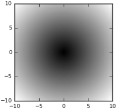

&emsp;&emsp;建立一个一维数组，数据类型是`int`。也可以不指定数据类型，使用默认参数：<!--more-->

``` python
import numpy as np
a1 = np.array([1, 2, 3], dtype=int)
```

&emsp;&emsp;建立一个二维数组，此处和`MATLAB`的二维数组(矩阵)的建立有很大差别：

``` python
a2 = np.array([[1, 2, 3], [2, 3, 4]])
```

&emsp;&emsp;全零矩阵的建立：

``` python
b1 = np.zeros((2, 3))  # 生成一个2行3列的全零矩阵，参数是一个tuple
```

&emsp;&emsp;单位矩阵的建立：

``` python
a_eye = np.eye(3)  # 创建3阶单位矩阵
```

&emsp;&emsp;对角矩阵的建立：

``` python
b = np.diag(a)  # a是一个矩阵
```

&emsp;&emsp;逆矩阵的建立：

``` python
np.linalg.inv(a)
```

&emsp;&emsp;矩阵基本运算：

``` python
a + b  # 矩阵加法
a - b  # 矩阵减法
b * num  # 矩阵的数乘
np.dot(a, b)  # 矩阵的乘法
```

&emsp;&emsp;矩阵的行列式：

``` python
np.linalg.det(A)
```

&emsp;&emsp;矩阵的秩：

``` python
np.linalg.matrix_rank(a)
```

&emsp;&emsp;伴随矩阵的建立：

``` python
np.dot(np.linalg.det(a), np.linalg.inv(a))
```

&emsp;&emsp;矩阵的特征值和特征向量：

``` python
b, c = np.linalg.eig(a)
```

&emsp;&emsp;矩阵的迹：

``` python
np.trace(A)
```

&emsp;&emsp;矩阵的索引：

- `a[:, 2]`：索引列，只读取第`3`列的元素(`:`表示所有)。
- `a[0]`：索引行。
- `a[x, y]`：`x`相当于行，`y`相当于列。
- `a[:, 1:3]`：索引第`2`和第`3`列。
- `a[::-1]`：省略范围的开始下标和结束下标，步长为`-1`，整个数组头尾颠倒。

&emsp;&emsp;向量內积的运算：

``` python
dot(a, b)  # a与b是两个向量
```

&emsp;&emsp;`arrange`用于生成等差数列：

``` python
arange([start, ] stop [, step], dtype=None)
```

根据`start`与`stop`指定范围，根据`step`设定的步长，默认为`1`：

``` python
a = np.arange(0, 100, 10)
print(a)  # 结果为[ 0 10 20 30 40 50 60 70 80 90]
```

&emsp;&emsp;`numpy`的三角函数如下：

函数                         | 说明
-----------------------------|-----
`sin(x[, out])`              | Trigonometric sine, element-wise
`cos(x[, out])`              | Cosine element-wise
`tan(x[, out])`              | Compute tangent element-wise
`arcsin(x[, out])`           | Inverse sine, element-wise
`arccos(x[, out])`           | Trigonometric inverse cosine, element-wise
`arctan(x[, out])`           | Trigonometric inverse tangent, element-wise
`hypot(x1, x2[, out])`       | Given the `legs` of a right triangle, return its hypotenuse
`arctan2(x1, x2[, out])`     | Element-wise arc tangent of `x1/x2` choosing the quadrant correctly
`degrees(x[, out])`          | Convert angles from radians to degrees
`radians(x[, out])`          | Convert angles from degrees to radians
`unwrap(p[, discont, axis])` | Unwrap by changing deltas between values to `2 * pi` complement
`deg2rad(x[, out])`          | Convert angles from degrees to radians
`rad2deg(x[, out])`          | Convert angles from radians to degrees

&emsp;&emsp;`numpy`自带的常量：

- `np.pi`：圆周率。
- `np.NaN`：无穷值。

### numpy.random模块

&emsp;&emsp;相关函数如下：

函数                                  | 说明
--------------------------------------|-----
`rand(d0, d1, ..., dn)`               | Random values in a given shape
`randn(d0, d1, ..., dn)`              | Return a sample (or samples) from the `standard normal` distribution
`randint(low [, high, size, dtype])`  | Return random integers from low (inclusive) to `high` (exclusive)
`random_integers(low [, high, size])` | Random integers of type `np.int` between `low` and `high`, inclusive
`random_sample([size])`               | Return random floats in the `half-open` interval `[0.0, 1.0)`
`random([size])`                      | Return random floats in the `half-open` interval `[0.0, 1.0)`
`ranf([size])`                        | Return random floats in the `half-open` interval `[0.0, 1.0)`
`sample([size])`                      | Return random floats in the `half-open` interval `[0.0, 1.0)`
`choice(a [, size, replace, p])`      | Generates a random sample from a given `1-D` array
`bytes(length)`                       | Return random bytes

`numpy.random`模块提供了产生各种分布随机数的`API`：

函数                                            | 说明
------------------------------------------------|-----
`beta(a, b [, size])`                           | 贝塔分布样本，在`[0, 1]`内
`binomial(n, p [, size])`                       | 二项分布的样本
`chisquare(df [, size])`                        | 卡方分布样本
`dirichlet(alpha [, size])`                     | 狄利克雷分布样本
`exponential([scale, size])`                    | 指数分布
`f(dfnum, dfden [, size])`                      | `F`分布样本
`gamma(shape [, scale, size])`                  | 伽马分布
`geometric(p [, size])`                         | 几何分布
`gumbel([loc, scale, size])`                    | 耿贝尔分布
`hypergeometric(ngood, nbad, nsample [, size])` | 超几何分布样本
`laplace([loc, scale, size])`                   | 拉普拉斯或双指数分布样本
`logistic([loc, scale, size])`                  | `Logistic`分布样本
`lognormal([mean, sigma, size])`                | 对数正态分布
`logseries(p [, size])`                         | 对数级数分布
`multinomial(n, pvals [, size])`                | 多项分布
`multivariate_normal(mean, cov [, size])`       | 多元正态分布
`negative_binomial(n, p [, size])`              | 负二项分布
`noncentral_chisquare(df, nonc [, size])`       | 非中心卡方分布
`noncentral_f(dfnum, dfden, nonc [, size])`     | 非中心`F`分布
`normal([loc, scale, size])`                    | 正态(高斯)分布
`pareto(a [, size])`                            | 帕累托(`Lomax`)分布
`poisson([lam, size])`                          | 泊松分布
`power(a [, size])`                             | Draws samples in `[0, 1]` from a power distribution with positive exponent `a - 1`
`rayleigh([scale, size])`                       | `Rayleigh`分布
`standard_cauchy([size])`                       | 标准柯西分布
`standard_exponential([size])`                  | 标准的指数分布
`standard_gamma(shape [, size])`                | 标准伽马分布
`standard_normal([size])`                       | 标准正态分布(`mean=0, stdev=1`)
`standard_t(df [, size])`                       | Standard Student's t distribution with df degrees of freedom
`triangular(left, mode, right [, size])`        | 三角形分布
`uniform([low, high, size])`                    | 均匀分布
`vonmises(mu, kappa [, size])`                  | `von Mises`分布
`wald(mean, scale [, size])`                    | 瓦尔德(逆高斯)分布
`weibull(a [, size])`                           | `Weibull`分布
`zipf(a [, size])`                              | 齐普夫分布

示例代码：

``` python
import numpy as np

np.set_printoptions(precision=3)
print(np.random.dirichlet((1, 1, 1, 1, 1, 1), 5))
```

执行结果：

``` python
[[0.068 0.444 0.093 0.021 0.114 0.26 ]
 [0.159 0.261 0.258 0.052 0.094 0.176]
 [0.082 0.264 0.022 0.167 0.405 0.06 ]
 [0.288 0.181 0.226 0.005 0.136 0.164]
 [0.047 0.39  0.269 0.036 0.044 0.215]]
```

&emsp;&emsp;`numpy.random.seed`：用于指定随机数生成时所用算法开始的整数值。如果使用相同的`seed`值，则每次生成的随即数都相同；如果不设置这个值，则系统根据时间来自己选择这个值，此时每次生成的随机数因时间差异而不同。

### mean函数

&emsp;&emsp;函数原型如下：

``` python
numpy.mean(a, axis=None, dtype=None, out=None)
```

经常操作的参数为`axis`，以`m * n`矩阵举例：

- `axis`不设置值：对`m * n`个数求均值，返回一个实数。
- `axis = 0`：压缩行，对各列求均值，返回`1 * n`矩阵。
- `axis = 1`：压缩列，对各行求均值，返回`m * 1`矩阵

实例如下：

``` python
>>> import numpy as np
>>> num1 = np.array([[1, 2, 3], [2, 3, 4], [3, 4, 5], [4, 5, 6]])
>>> now2 = np.mat(num1)
>>> now2
matrix([[1, 2, 3],
        [2, 3, 4],
        [3, 4, 5],
        [4, 5, 6]])
>>> np.mean(now2)  # 对所有元素求均值
3.5
>>> np.mean(now2, 0)  # 压缩行，对各列求均值
matrix([[ 2.5,  3.5,  4.5]])
>>> np.mean(now2, 1)  # 压缩列，对各行求均值
matrix([[ 2.],
        [ 3.],
        [ 4.],
        [ 5.]])
```

### allclose函数

&emsp;&emsp;`allclose`函数用于判断两个`array`在误差范围内是否相等：

``` python
allclose(a, b, rtol=1e-05, atol=1e-08)
```

若`absolute(a - b) <= (atol + rtol * absolute(b))`，则相等。

``` python
A = np.random.randint(0, 2, 5)
B = np.random.randint(0, 2, 5)
equal = np.allclose(A, B)
print(equal)
```

### abs和fabs

&emsp;&emsp;计算绝对值使用：

``` python
np.abs(ndarray)  # 计算绝对值
np.fabs(ndarray)  # 计算绝对值(非复数)
```

### Exp和log

&emsp;&emsp;`Exp`和`log`函数：

函数               | 说明
-------------------|-----
`exp(x [, out])`   | Calculate the exponential of the elements in the input array
`expm1(x [, out])` | Return the exponential of the elements in the array minus one
`log(x [, out])`   | Natural logarithm, element-wise
`log10(x [, out])` | Compute the logarithm in base `10` element-wise
`log2(x [, y])`    | Return the base `2` logarithm
`log1p(x [, out])` | `log(1 + x)` in base `e`, element-wise

### any和all

&emsp;&emsp;`any`和`all`函数的使用：

``` python
ndarray.any()  # 是否至少有一个True
ndarray.all()  # 是否全部为True
```

### amin和amax

&emsp;&emsp;`numpy.amin`(`numpy.ndarray.min`)和`numpy.amax`(`numpy.ndarray.max`)这些函数从给定数组中的元素沿指定轴返回最小值和最大值：

``` python
import numpy as np

a = np.array([[3, 7, 5],
              [8, 4, 3],
              [2, 4, 9]])
print('调用amin函数:', np.amin(a, 1))  # 第二个轴是“行”
print('再次调用amin函数:', np.amin(a, 0))  # 第一个轴是“列”
print('调用amax函数:', np.amax(a))  # 返回最大值
print('再次调用amax函数:', np.amax(a, axis=0))
```

执行结果：

``` python
调用amin函数: [3 3 2]
再次调用amin函数: [2 4 3]
调用amax函数: 9
再次调用amax函数: [8 7 9]
```

### angle函数

&emsp;&emsp;`angle`函数的原型为：

``` python
numpy.angle(z, deg=0)
```

Return the `angle` of the `complex` argument. Parameters:

- `z`: `array_like`; A `complex` number or sequence of `complex` numbers.
- `deg`: `bool`, optional; Return angle in degrees if `True`, radians if `False` (default).

&emsp;&emsp;The counterclockwise angle from the positive real axis on the `complex` plane, with dtype as `numpy.float64`.

``` python
>>> np.angle([1.0, 1.0j, 1+1j])  # in radians
array([ 0.        ,  1.57079633,  0.78539816])
>>> np.angle(1+1j, deg=True)  # in degrees
45.0
```

### numpy算数运算函数

&emsp;&emsp;`numpy`算数运算函数如下：

- `np.sqrt(array)`：计算各元素的平方根。
- `np.square(array)`：计算各元素的平方。
- `np.subtract(a, b)`：`a - b`。
- `np.sqrt(array)`：计算各元素的开方。
- `np.multiply(a, b)`：`a * b`。

### 范数

&emsp;&emsp;`norm`表示范数，首先需要注意的是，范数是对向量(或者矩阵)的度量，它是一个标量(`scalar`)。首先使用`help(np.linalg.norm)`查看其文档：

``` python
norm(x, ord=None, axis=None, keepdims=False)
```

这里只对常用设置进行说明，`x`表示要度量的向量，`ord`表示范数的种类：

参数           | 说明                       | 计算方法
---------------|---------------------------|--------
默认           | 二范数：$\zeta_{2}$        | $\sqrt{x_{1}^{2} + x_{2}^{2} + \cdots + x_{n}^{2}}$
`ord = 2`      | 二范数：$\zeta_{2}$        | 同上
`ord = 2`      | 一范数：$\zeta_{1}$        | $\left &#124; x_{1} \right &#124; + \left &#124; x_{2} \right &#124; + \cdots + \left &#124; x_{n} \right &#124;$
`ord = np.inf` | 无穷范数：$\zeta_{\infty}$ | $max(\left &#124; x_{i} \right &#124;)$

``` python
>>> x = np.array([3, 4])
>>> np.linalg.norm(x)
5.
>>> np.linalg.norm(x, ord=2)
5.
>>> np.linalg.norm(x, ord=1)
7.
>>> np.linalg.norm(x, ord=np.inf)
4
```

### 奇异值分解

&emsp;&emsp;`Python`中可以使用`numpy`包的`linalg.svd`来求解`SVD`：

``` python
import numpy as np

A = np.array(
    [[2, 4],
     [1, 3],
     [0, 0],
     [0, 0]])
print(np.linalg.svd(A))
```

执行结果：

``` python
(array([[-0.81741556, -0.57604844,  0.        ,  0.        ],
        [-0.57604844,  0.81741556,  0.        ,  0.        ],
        [ 0.        ,  0.        ,  1.        ,  0.        ],
        [ 0.        ,  0.        ,  0.        ,  1.        ]]),
 array([ 5.4649857 ,  0.36596619]),
 array([[-0.40455358, -0.9145143 ],
        [-0.9145143 ,  0.40455358]]))
```

### Moore-Penrose伪逆

&emsp;&emsp;计算方阵的`Moore-Penrose`伪逆使用函数`pinv`：

``` python
B = pinv(A)
```

如果矩阵`A`是可逆(非奇异)的，那么`pinv(A)`与`inv(A)`的结果是一样的，而且`pinv`比`inv`效率低。但如果矩阵`A`是奇异矩阵，则`inv(A)`不存在，但`pinv(A)`仍然存在，并表现出一些与逆矩阵类似的性质。在`pinv`函数中，`A`不一定是方阵。示例如下：

``` python
import numpy as np

A = np.array(
    [[1, 2, 3],
     [4, 5, 6]])
B = np.linalg.pinv(A)
print(B)
```

执行结果：

``` python
[[-0.94444444  0.44444444]
 [-0.11111111  0.11111111]
 [ 0.72222222 -0.22222222]]
```

### genfromtxt

&emsp;&emsp;`genfromtxt`可以用来处理数据文本，例如文件`test.csv`：

``` python
user_id,item_id,behavior_type,user_geohash,item_category,time
99512554,37320317,3,94gn6nd,9232,2014-11-26 20
9909811,266982489,1,,3475,2014-12-02 23
98692568,27121464,1,94h63np,5201,2014-11-19 13
96089426,114407102,1,949g5i3,836,2014-11-26 07
90795949,402391768,1,94h6dlp,3046,2014-12-09 21
```

用如下代码将数据完全提取出来：

``` python
data = np.genfromtxt(filename, delimiter=',', skip_header=1, dtype=None)
```

如果只取特定的列，可以使用：

``` python
data = np.genfromtxt(filename, usecols=(2, 5), delimiter=',', skip_header=1, dtype=None)
```

### dstack

&emsp;&emsp;`dstack(tup)`: Stack arrays in sequence depth wise (along third axis).

``` python
>>> a = np.array((1, 2, 3))
>>> b = np.array((2, 3, 4))
>>> np.dstack((a, b))
array([[[1, 2],
        [2, 3],
        [3, 4]]])
>>> a = np.array([[1], [2], [3]])
>>> b = np.array([[2], [3], [4]])
>>> np.dstack((a, b))
array([[[1, 2]],
       [[2, 3]],
       [[3, 4]]])
```

### strides

&emsp;&emsp;`NumPy`的`strides`属性表示的是在每个维数上以字节计算的步长：

``` python
>>> a = np.arange(6)
>>> a
array([0, 1, 2, 3, 4, 5])
>>> a.strides
(4,)
```

`a`数组中每个元素都是`NumPy`中的整数类型，占`4`个字节，所以第一维中相邻元素之间的步长为`4`个字节。同样，`2`维数组如下：

``` python
>>> b = np.arange(12).reshape(3, 4)
>>> b
array([[ 0,  1,  2,  3],
       [ 4,  5,  6,  7],
       [ 8,  9, 10, 11]])
>>> b.strides
(16, 4)
```

从里面开始看，里面是一个`4`个元素的一维整数数组，所以步长应该为`4`。外面是一个含有`3`个元素，每个元素的长度是`4 * 4 = 16`，所以步长为`16`。下面来看一下`3`维数组：

``` python
>>> c = np.arange(27).reshape(3, 3, 3)
array([[[ 0,  1,  2],
        [ 3,  4,  5],
        [ 6,  7,  8]],
       [[ 9, 10, 11],
        [12, 13, 14],
        [15, 16, 17]],
       [[18, 19, 20],
        [21, 22, 23],
        [24, 25, 26]]])
```

从里面开始算，应该为`(3 * 4 * 3, 3 * 4, 4)`，验证如下：

``` python
>>> c.strides
(36, 12, 4)
```

### set_printoptions

&emsp;&emsp;使用`set_printoptions`设置输出精度：

``` python
set_printoptions([precision, threshold, ...])
```

使用示例如下：

``` python
np.set_printoptions(precision=3)
print(x)  # [ 0.078  0.48   0.413  0.83   0.776  0.102]
```

### numpy.r_

&emsp;&emsp;Translates slice objects to concatenation along the first axis.
&emsp;&emsp;This is a simple way to build up arrays quickly. There are two use cases.

- If the index expression contains comma separated arrays, then stack them along their first axis.
- If the index expression contains slice notation or scalars, then create a `1-D` array with a range indicated by the slice notation.

&emsp;&emsp;If slice notation is used, the syntax `start:stop:step` is equivalent to `np.arange(start, stop, step)` inside of the brackets. However, if `step` is an imaginary number (i.e. `100j`), then its integer portion is interpreted as a `number-of-points` desired and the `start` and `stop` are inclusive. In other words `start:stop:stepj` is interpreted as `np.linspace(start, stop, step, endpoint=1)` inside of the brackets. After expansion of slice notation, all comma separated sequences are concatenated together.
&emsp;&emsp;Optional character strings placed as the first element of the index expression can be used to change the output. The strings `r` or `c` result in matrix output. If the result is `1-D` and `r` is specified a `1 x N` (row) matrix is produced. If the result is `1-D` and `c` is specified, then a `N x 1` (column) matrix is produced. If the result is `2-D` then both provide the same matrix result.
&emsp;&emsp;A string integer specifies which axis to stack multiple comma separated arrays along. A string of two `comma-separated` integers allows indication of the minimum number of dimensions to force each entry into as the second integer (the axis to concatenate along is still the first integer).
&emsp;&emsp;A string with three `comma-separated` integers allows specification of the axis to concatenate along, the minimum number of dimensions to force the entries to, and which axis should contain the start of the arrays which are less than the specified number of dimensions. In other words the third integer allows you to specify where the `1's` should be placed in the shape of the arrays that have their shapes upgraded. By default, they are placed in the front of the shape tuple. The third argument allows you to specify where the start of the array should be instead. Thus, a third argument of `0` would place the `1's` at the end of the array shape. Negative integers specify where in the new shape tuple the last dimension of upgraded arrays should be placed, so the default is `-1`.
&emsp;&emsp;Parameters: Not a function, so takes no parameters.
&emsp;&emsp;Returns: A concatenated ndarray or matrix.

``` python
>>> np.r_[np.array([1, 2, 3]), 0, 0, np.array([4, 5, 6])]
array([1, 2, 3, 0, 0, 4, 5, 6])
>>> np.r_[-1:1:6j, [0] * 3, 5, 6]
array([-1. , -0.6, -0.2,  0.2,  0.6,  1. ,  0. ,  0. ,  0. ,  5. ,  6. ])
```

String integers specify the axis to concatenate along or the minimum number of dimensions to force entries into.

``` python
>>> a = np.array([[0, 1, 2], [3, 4, 5]])
>>> np.r_['-1', a, a]  # concatenate along last axis
array([[0, 1, 2, 0, 1, 2],
       [3, 4, 5, 3, 4, 5]])
>>> np.r_['0,2', [1, 2, 3], [4, 5, 6]]  # concatenate along first axis, dim>=2
array([[1, 2, 3],
       [4, 5, 6]])
>>> np.r_['0,2,0', [1, 2, 3], [4, 5, 6]]
array([[1],
       [2],
       [3],
       [4],
       [5],
       [6]])
>>> np.r_['1,2,0', [1, 2, 3], [4, 5, 6]]
array([[1, 4],
       [2, 5],
       [3, 6]])
```

Using `r` or `c` as a first string argument creates a matrix.

``` python
>>> np.r_['r',[1,2,3], [4,5,6]]
matrix([[1, 2, 3, 4, 5, 6]])
```

### numpy.linspace

&emsp;&emsp;`numpy.linspace(start, stop, num=50, endpoint=True, retstep=False, dtype=None, axis=0)`: Return evenly spaced numbers over a specified interval. Returns `num` evenly spaced samples, calculated over the interval `[start, stop]`. The endpoint of the interval can optionally be excluded. Changed in `version 1.16.0`: Non-scalar `start` and `stop` are now supported. Parameters:

- `start`: `array_like`. The starting value of the sequence.
- `stop`: `array_like`. The end value of the sequence, unless `endpoint` is set to `False`. In that case, the sequence consists of all but the last of `num + 1` evenly spaced samples, so that `stop` is excluded. Note that the step size changes when `endpoint` is `False`.
- `num`: `int`, optional. Number of samples to generate.
- `endpoint`: `bool`, optional. If `True`, `stop` is the last sample. Otherwise, it is not included.
- `retstep`: `bool`, optional. If `True`, return `(samples, step)`, where step is the spacing between samples.
- `dtype`: `dtype`, optional. The type of the output array. If `dtype` is not given, infer the data type from the other input arguments.
- `axis`: `int`, optional. The `axis` in the result to store the samples. Relevant only if `start` or `stop` are `array-like`. By default, the samples will be along a new axis inserted at the beginning. Use `-1` to get an axis at the end.

&emsp;&emsp;Returns:

- `samples`: `ndarray`. There are `num` equally spaced samples in the closed interval `[start, stop]` or the `half-open` interval `[start, stop)` (depending on whether `endpoint` is `True` or `False`).
- `step`: `float`, optional. Only returned if `retstep` is `True`. Size of spacing between samples.

``` python
>>> np.linspace(2.0, 3.0, num=5)
array([2.  , 2.25, 2.5 , 2.75, 3.  ])
>>> np.linspace(2.0, 3.0, num=5, endpoint=False)
array([2. ,  2.2,  2.4,  2.6,  2.8])
>>> np.linspace(2.0, 3.0, num=5, retstep=True)
(array([2.  ,  2.25,  2.5 ,  2.75,  3.  ]), 0.25)
```

Graphical illustration:

``` python
>>> import matplotlib.pyplot as plt
>>> N = 8
>>> y = np.zeros(N)
>>> x1 = np.linspace(0, 10, N, endpoint=True)
>>> x2 = np.linspace(0, 10, N, endpoint=False)
>>> plt.plot(x1, y, 'o')
[<matplotlib.lines.Line2D object at 0x...>]
>>> plt.plot(x2, y + 0.5, 'o')
[<matplotlib.lines.Line2D object at 0x...>]
>>> plt.ylim([-0.5, 1])
(-0.5, 1)
>>> plt.show()
```

### unique

&emsp;&emsp;`unique`用于输出数组中不同的值：

``` python
import numpy as np
A = [1, 2, 2, 3, 4, 3]
a = np.unique(A)
print(a)  # 输出为 [1 2 3 4]
a, b, c = np.unique(A, return_index=True, return_inverse=True)
print(a, b, c)  # 输出为“[1 2 3 4] [0 1 3 4] [0 1 1 2 3 2]”
```

### tanh

&emsp;&emsp;这是双曲正切函数，与`np.sinh(x) / np.cosh(x)`和`-1j * np.tan(1j * x)`相等。

### numpy.atleast_2d

&emsp;&emsp;`numpy.atleast_2d(*arys)`. View inputs as arrays with at least two dimensions. Parameters:

- `arys1, arys2, ...`: `array_like`: One or more `array-like` sequences. Non-array inputs are converted to arrays. Arrays that already have two or more dimensions are preserved.

&emsp;&emsp;Returns:

- `res, res2, ...`: `ndarray`. An array, or list of arrays, each with `a.ndim >= 2`. Copies are avoided where possible, and views with two or more dimensions are returned.

``` python
>>> np.atleast_2d(3.0)
array([[ 3.]])
>>> x = np.arange(3.0)
>>> np.atleast_2d(x)
array([[ 0.,  1.,  2.]])
>>> np.atleast_2d(x).base is x
True
>>> np.atleast_2d(1, [1, 2], [[1, 2]])
[array([[1]]), array([[1, 2]]), array([[1, 2]])]
```

### numpy.ones

&emsp;&emsp;`numpy.ones(shape, dtype=None, order='C')`. Return a new array of given `shape` and `type`, filled with `ones`. Parameters:

- `shape`: `int` or `sequence of ints`. Shape of the new array, e.g., `(2, 3)` or `2`.
- `dtype`: `data-type`, optional. The desired `data-type` for the array, e.g., `numpy.int8`. Default is `numpy.float64`.
- `order`: `{'C', 'F'}`, optional. Whether to store multidimensional data in `C-` or `Fortran-contiguous` (`row-` or `column-wise`) order in memory.

&emsp;&emsp;Returns:

- `out`: `ndarray`. Array of ones with the given `shape`, `dtype` and `order`.

``` python
>>> np.ones(5)
array([ 1.,  1.,  1.,  1.,  1.])
>>> np.ones((5,), dtype=np.int)
array([1, 1, 1, 1, 1])
>>> np.ones((2, 1))
array([[ 1.],
      [ 1.]])
>>> s = (2, 2)
>>> np.ones(s)
array([[ 1.,  1.],
       [ 1.,  1.]])
```

### asarray函数

&emsp;&emsp;将列表转换为数组：

``` python
>>> a = [1, 2]
>>> numpy.asarray(a)
array([1, 2])
```

将数据类型转换为`float`和`int`：

``` python
>>> a = [1, 2]
>>> numpy.asarray(a, 'f')
array([ 1.,  2.], dtype=float32)
>>> numpy.asarray(a, 'i')
array([1, 2])
```

### argmax函数(argmin相反)

&emsp;&emsp;函数原型如下：

``` python
numpy.argmax(a, axis=None, out=None)
```

- `a`：`array_like`类型，数组。
- `axis`：`int`类型，可选项。默认情况下，索引的是平铺的数组，否则沿指定的轴。
- `out`：`array`类型，可选项。如果提供，结果以合适的形状和类型被插入到此数组中。

该函数返回索引数组，它具有与`a.shape`相同的形状，其中`axis`被移除。

``` python
>>> import numpy as np
>>> a = np.arange(6).reshape(2, 3)
>>> a
array([[0, 1, 2],
       [3, 4, 5]])
>>> np.argmax(a)
5
>>> np.argmax(a, axis=0)  # “0”代表列
array([1, 1, 1], dtype=int64)
>>> np.argmax(a, axis=1)  # “1”代表行
array([2, 2], dtype=int64)
>>> b = np.arange(6)
>>> b
array([0, 1, 2, 3, 4, 5])
>>> np.argmax(b)  # 只返回第一次出现的最大值的索引
5
```

&emsp;&emsp;对于三维的情况如下：

``` python
b = np.random.randint(20, size=[3, 2, 2])
print(b)
```

执行结果：

``` python
[[[ 0 16]
  [14  5]]
 [[16  6]
  [19  2]]
 [[11 11]
  [ 5  7]]]
```

使用`argmax`函数：

``` python
print(np.argmax(b, axis=1))
```

执行结果：

``` python
[[1 0]
 [1 0]
 [0 0]]
```

我们指定轴为`1`，也就是沿着`axis = 1`的投影。在同一根投影线上是`axis = 0`和`axis = 2`的一个组合，也就是`b[0, :, 0]`、`b[0, :, 1]`、`b[2, :, 0]`、`b[2, :, 1]`、`b[3, :, 0]`和`b[3, :, 1]`这`6`条轴。这些轴对应的数字分别为`[0 14]`、`[16 5]`、`[16 19]`、`[6 2]`、`[11 5]`、`[11 7]`，取这些值的最大值索引，那么结果就是`[[1, 0], [1, 0], [0, 0]]`。

### vstack函数

&emsp;&emsp;函数原型如下：

``` python
vstack(tup)
```

参数`tup`可以是元组、列表或者`numpy`数组，返回结果为`numpy`的数组。示例`1`如下：

``` python
import numpy as np

a = [1, 2, 3]
b = [4, 5, 6]
print(np.vstack((a, b)))
```

执行结果：

``` python
[[1 2 3]
 [4 5 6]]
```

示例`2`如下：

``` python
import numpy as np

a = [[1], [2], [3]]
b = [[1], [2], [3]]
print(np.vstack((a, b)))
```

执行结果：

``` python
[[1]
 [2]
 [3]
 [1]
 [2]
 [3]]
```

### numpy.copy

&emsp;&emsp;`numpy.copy(a)`: Return an array copy of the given object. Parameters:

- `a`: `array_like`. Input data.

&emsp;&emsp;Returns:

- `arr`: `ndarray`. Array interpretation of `a`.

&emsp;&emsp;**Notes**: This is equivalent to:

``` python
np.array(a, copy=True)
```

&emsp;&emsp;Examples: Create an array `x`, with a reference `y` and a copy `z`:

``` python
>>> x = np.array([1, 2, 3])
>>> y = x
>>> z = np.copy(x)
```

Note that, when we modify `x`, `y` changes, but not `z`:

``` python
>>> x[0] = 10
>>> x[0] == y[0]
True
>>> x[0] == z[0]
False
```

### array_equal

&emsp;&emsp;判断两数组是否相等：

``` python
np.array_equal(a, b)
```

### numpy.triu

&emsp;&emsp;`numpy.triu(m, k=0)`. Upper triangle of an array. Return a copy of a matrix with the elements below the `k-th` diagonal zeroed.

``` python
>>> np.triu([[1, 2, 3], [4, 5, 6], [7, 8, 9], [10, 11, 12]], -1)
array([[1,  2,  3],
       [4,  5,  6],
       [0,  8,  9],
       [0,  0, 12]])
```

### tile函数

&emsp;&emsp;该函数的作用如下：

``` python
>>> import numpy
>>> numpy.tile([0, 0], 5)  # 横向重复“[0, 0]”5次，纵向重复1次
array([0, 0, 0, 0, 0, 0, 0, 0, 0, 0])
>>> numpy.tile([0, 0], (1, 1))  # 纵向重复“[0, 0]”1次，横向重复1次
array([[0, 0]])
>>> numpy.tile([0, 0], (2, 1))  # 纵向重复“[0, 0]”2次，横向重复1次
array([[0, 0],
       [0, 0]])
>>> numpy.tile([0, 0], (3, 1))
array([[0, 0],
       [0, 0],
       [0, 0]])
>>> numpy.tile([0, 0], (1, 3))  # 纵向重复“[0, 0]”1次，横向重复3次
array([[0, 0, 0, 0, 0, 0]])
>>> numpy.tile([0, 0], (2, 3))  # 纵向重复“[0, 0]”2次，横向重复3次
array([[0, 0, 0, 0, 0, 0],
       [0, 0, 0, 0, 0, 0]])
```

### np.newaxis

&emsp;&emsp;`np.newaxis`在使用和功能上等价于`None`，其实就是`None`的一个别名：

``` python
>> type(np.newaxis)
NoneType
>> np.newaxis == None
True
```

`np.newaxis`的使用示例如下：

``` python
>> x = np.arange(3)
>> x
array([0, 1, 2])
>> x.shape
(3,)
>> x[:, np.newaxis]
array([[0],
       [1],
       [2]])
>> x[:, None]
array([[0],
       [1],
       [2]])
>> x[:, np.newaxis].shape
(3, 1)
```

&emsp;&emsp;`np.newaxis`的功能是插入新维度，看下面的例子：

``` python
import numpy as np

a = np.array([1, 2, 3, 4, 5])
print(a.shape)
print(a)
```

执行结果：

``` python
(5,)
[1 2 3 4 5]
```

可以看出`a`是一个一维数组。再看一个例子：

``` python
import numpy as np

a = np.array([1, 2, 3, 4, 5])
b = a[np.newaxis, :]
print(a.shape, b.shape)
print(a)
print(b)
```

执行结果：

``` python
(5,) (1, 5)
[1 2 3 4 5]
[[1 2 3 4 5]]
```

最后一个例子：

``` python
import numpy as np

a = np.array([1, 2, 3, 4, 5])
b = a[:, np.newaxis]
print(a.shape, b.shape)
print(a)
print(b)
```

执行结果：

``` python
(5,) (5, 1)
[1 2 3 4 5]
[[1]
 [2]
 [3]
 [4]
 [5]]
```

可以看出`np.newaxis`分别是在行或列上增加维度，原来是`(5,)`的数组，在行上增加维度变成`(1, 5)`的二维数组，在列上增加维度变为`(5, 1)`的二维数组。

### numpy.ogrid

&emsp;&emsp;`ogrid`用切片作为下标，返回的是一组可用来广播计算的数组。其切片下标有如下形式：
&emsp;&emsp;1. `[开始值:结束值:步长]`：

``` python
import numpy as np

x, y = np.ogrid[1:4:1, 1:5:2]
print(x)
print(y)
```

执行结果：

``` python
[[1]
 [2]
 [3]]
[[1 3]]
```

&emsp;&emsp;2. `[开始值:结束值:长度j]`：

``` python
import numpy as np

x, y = np.ogrid[1:4:3j, 1:5:2j]
print(x)
print(y)
```

执行结果：

``` python
[[1. ]
 [2.5]
 [4. ]]
[[1. 5.]]
```

### numpy.mgrid

&emsp;&emsp;`numpy.mgrid:` `nd_grid` instance which returns a dense multi-dimensional `meshgrid`.
&emsp;&emsp;An instance of `numpy.lib.index_tricks.nd_grid` which returns an dense (or fleshed out) `mesh-grid` when indexed, so that each returned argument has the same shape. The dimensions and number of the output arrays are equal to the number of indexing dimensions. If the step length is not a `complex` number, then the stop is not inclusive.
&emsp;&emsp;However, if the step length is a `complex` number (e.g. `5j`), then the integer part of its magnitude is interpreted as specifying the number of points to create between the start and stop values, where the stop value is inclusive.
&emsp;&emsp;Returns: `mesh-grid` ndarrays all of the same dimensions.

``` python
>>> import numpy as np
>>> x, y = np.mgrid[0:5, 0:5]
>>> x
array([[0, 0, 0, 0, 0],
       [1, 1, 1, 1, 1],
       [2, 2, 2, 2, 2],
       [3, 3, 3, 3, 3],
       [4, 4, 4, 4, 4]])
>>> y
array([[0, 1, 2, 3, 4],
       [0, 1, 2, 3, 4],
       [0, 1, 2, 3, 4],
       [0, 1, 2, 3, 4],
       [0, 1, 2, 3, 4]])
>>> np.mgrid[-1:1:5j]
array([-1. , -0.5,  0. ,  0.5,  1. ])
```

### numpy.expand_dims

&emsp;&emsp;`numpy.expand_dims(a, axis)`: Expand the shape of an array. Insert a new axis that will appear at the `axis` position in the expanded array shape.
&emsp;&emsp;Note: Previous to `NumPy 1.13.0`, neither `axis < -a.ndim - 1` nor `axis > a.ndim` raised errors or put the new axis where documented. Those `axis` values are now deprecated and will raise an `AxisError` in the future. Parameters:

- `a`: `array_like`. Input array.
- `axis`: `int`. Position in the expanded axes where the new axis is placed.

&emsp;&emsp;Returns:

- `res`: `ndarray`. Output array. The number of dimensions is one greater than that of the input array.

``` python
>>> x = np.array([1, 2])
>>> x.shape
(2,)
```

The following is equivalent to `x[np.newaxis, :]` or `x[np.newaxis]`:

``` python
>>> y = np.expand_dims(x, axis=0)
>>> y
array([[1, 2]])
>>> y.shape
(1, 2)
>>> y = np.expand_dims(x, axis=1)  # Equivalent to x[:,newaxis]
>>> y
array([[1],
       [2]])
>>> y.shape
(2, 1)
```

Note that some examples may use `None` instead of `np.newaxis`. These are the same objects:

``` python
>>> np.newaxis is None
True
```

### numpy.array_split

&emsp;&emsp;`numpy.array_split(ary, indices_or_sections, axis=0)`: Split an array into multiple sub-arrays.
&emsp;&emsp;Please refer to the split documentation. The only difference between these functions is that `array_split` allows `indices_or_sections` to be an integer that does not equally divide the `axis`.

``` python
>>> x = np.arange(8.0)
>>> np.array_split(x, 3)
[array([ 0.,  1.,  2.]), array([ 3.,  4.,  5.]), array([ 6.,  7.])]
```

### numpy.sum

&emsp;&emsp;`numpy.sum(a, axis=None, dtype=None, out=None, keepdims=<class numpy._globals._NoValue>)`: Sum of array elements over a given `axis`. Parameters:

- `a`: `array_like`. Elements to sum.
- `axis`: `None` or `int` or `tuple of ints`, optional. Axis or axes along which a sum is performed. The default, `axis=None`, will sum all of the elements of the input array. If `axis` is negative, it counts from the last to the first axis. If `axis` is a tuple of ints, a sum is performed on all of the axes specified in the tuple instead of a single axis or all the axes as before.
- `dtype`: `dtype`, optional. The type of the returned array and of the accumulator in which the elements are summed. The `dtype` of `a` is used by default unless `a` has an integer `dtype` of less precision than the default platform integer. In that case, if `a` is signed then the platform integer is used while if `a` is unsigned then an unsigned integer of the same precision as the platform integer is used.
- `out`: `ndarray`, optional. Alternative output array in which to place the result. It must have the same shape as the expected output, but the type of the output values will be cast if necessary.
- `keepdims`: `bool`, optional. If this is set to `True`, the axes which are reduced are left in the result as dimensions with size one. With this option, the result will broadcast correctly against the input array. If the default value is passed, then `keepdims` will not be passed through to the sum method of `sub-classes` of `ndarray`, however any `non-default` value will be. If the `sub-classes` sum method does not implement `keepdims` any exceptions will be raised.

&emsp;&emsp;Returns:

- `sum_along_axis`: `ndarray`. An array with the same shape as `a`, with the specified `axis` removed. If `a` is a `0-d` array, or if `axis` is `None`, a scalar is returned. If an output array is specified, a reference to `out` is returned.

&emsp;&emsp;**Notes**: Arithmetic is modular when using integer types, and no error is raised on overflow. The sum of an empty array is the neutral element `0`:

``` python
>>> np.sum([])
0.0
>>> np.sum([0.5, 1.5])
2.0
>>> np.sum([0.5, 0.7, 0.2, 1.5], dtype=np.int32)
1
>>> np.sum([[0, 1], [0, 5]])
6
>>> np.sum([[0, 1], [0, 5]], axis=0)
array([0, 6])
>>> np.sum([[0, 1], [0, 5]], axis=1)
array([1, 5])
If the accumulator is too small, overflow occurs:
>>> np.ones(128, dtype=np.int8).sum(dtype=np.int8)
-128
```

### numpy.std

&emsp;&emsp;该方法用于计算矩阵标准差：

``` python
>>> a = np.array([[1, 2], [3, 4]])
>>> np.std(a)  # 计算全局标准差
1.1180339887498949
>>> np.std(a, axis=0)  # 计算每一列的标准差
array([ 1.,  1.])
>>> np.std(a, axis=1)  # 计算每一行的标准差
array([ 0.5,  0.5])
```

### numpy.max

&emsp;&emsp;代码示例如下：

``` python
>>> a = np.array(range(0, 12))
>>> b = a.reshape((3, 4))
>>> b
array([[0,  1,  2,  3],
       [4,  5,  6,  7],
       [8,  9, 10, 11]])
>>> np.max(b)  # max number
11
>>> np.max(b, axis=0)  # 看结果是取出最大的一行
array([8,  9, 10, 11])
>>> np.max(b, axis=1)  # 看结果是取出最大的一列
array([3,  7, 11])
```

### nditer

&emsp;&emsp;迭代对象`nditer`提供了一种灵活访问一个或者多个数组的方式。
&emsp;&emsp;1. 单个数组的迭代(`Single Array Iteration`)
&emsp;&emsp;迭代器最基本的任务的可以完成对数组元素的访问，迭代器接口可以一个接一个地提供的每一个元素：

``` python
import numpy as np

a = np.arange(6).reshape(2, 3)
print(a)

for x in np.nditer(a):
    print(x, end=" ")
```

执行结果：

``` python
[[0 1 2]
 [3 4 5]]
0 1 2 3 4 5
```

这种迭代方式需要注意的是：所选择的顺序是和数组内存布局一致的，而不是使用标准`C`或者`Fortran`顺序。这是为了使用效率而设计的，这反映了默认情况下只需访问每个元素，而无需考虑其特定顺序。我们可以通过迭代上述数组的转置来看到这一点，并与以`C`顺序访问数组转置的`copy`的方式做对比：

``` python
import numpy as np

a = np.arange(6).reshape(2, 3)

for x in np.nditer(a.T):
    print(x, end=" ")

print("\n------------")

for x in np.nditer(a.T.copy(order='C')):
    print(x, end=" ")
```

执行结果：

``` python
0 1 2 3 4 5
------------
0 3 1 4 2 5
```

从上述例子可以看出，`a`和`a.T`的遍历顺序是一样的，也就是它们在内存中的存储顺序也是一样的，但是`a.T.copy(order = 'C')`的遍历结果是不同的，那是因为它和前两种的存储方式是不一样的，默认是按行访问。
&emsp;&emsp;2. 控制迭代顺序(`Controlling Iteration Order`)
&emsp;&emsp;有时候，无论元素在内存中的分布如何，重要的是要以特定的顺序来访问数组。所以`nditer`提供了一种顺序参数(`order parameter`)的方法来实现这一要求。默认情况下是`order = 'K'`，就是上述的访问方式。另外有`order = 'C'`和`order = 'F'`，不妨理解为`C`是按行访问，`F`是按列访问。

``` python
import numpy as np

a = np.arange(6).reshape(2, 3)

for x in np.nditer(a, order='F'):
    print(x, end=" ")

print("\n------------")

for x in np.nditer(a.T, order='C'):
    print(x, end=" ")
```

执行结果：

``` python
0 3 1 4 2 5
------------
0 3 1 4 2 5
```

&emsp;&emsp;3. 修改数组值(`Modify Array Values`)
&emsp;&emsp;默认情况下，`nditer`将输入数组视为只读对象。要修改数组元素，必须指定读写(`read-write`)或只写(`write-only`)模式。这是由每个操作数标志控制的。一般而言，`Python`中的赋值只需更改本地或全局变量字典中的引用，而不是修改现有变量。

``` python
import numpy as np

a = np.arange(6).reshape(2, 3)
print(a)

for x in np.nditer(a, op_flags=['readwrite']):
    x[...] = 2 * x

print(a)
```

### numpy.ndarray.item

&emsp;&emsp;`ndarray.item(*args)`: Copy an element of an array to a standard `Python` scalar and return it. Parameters:

- `*args`: Arguments (variable number and type).

1. `none`: in this case, the method only works for arrays with one element (`a.size == 1`), which element is copied into a standard `Python` scalar object and returned.
2. `int_type`: this argument is interpreted as a flat index into the array, specifying which element to copy and return.
3. tuple of `int_types`: functions as does a single `int_type` argument, except that the argument is interpreted as an `nd-index` into the array.

&emsp;&emsp;Returns:

- `z`: Standard `Python` scalar object. A copy of the specified element of the array as a suitable `Python` scalar

&emsp;&emsp;**Notes**: When the data type of `a` is longdouble or clongdouble, `item()` returns a scalar array object because there is no available `Python` scalar that would not lose information. Void arrays return a buffer object for `item(),` unless fields are defined, in which case a tuple is returned.
&emsp;&emsp;`item` is very similar to `a[args]`, except, instead of an array scalar, a standard `Python` scalar is returned. This can be useful for speeding up access to elements of the array and doing arithmetic on elements of the array using `Python's` optimized math.

``` python
>>> x = np.random.randint(9, size=(3, 3))
>>> x
array([[3, 1, 7],
       [2, 8, 3],
       [8, 5, 3]])
>>> x.item(3)
2
>>> x.item(7)
5
>>> x.item((0, 1))
1
>>> x.item((2, 2))
3
```

### numpy.ndarray.itemset

&emsp;&emsp;`ndarray.itemset(*args)`: Insert scalar into an array (scalar is cast to array's dtype, if possible). There must be at least `1` argument, and define the last argument as `item`. Then, `a.itemset(*args)` is equivalent to but faster than `a[args] = item`. The item should be a scalar value and args must select a single item in the array `a`.
&emsp;&emsp;Parameters:

- `*args`: Arguments.

1. If one argument: a scalar, only used in case `a` is of size `1`.
2. If two arguments: the last argument is the value to be set and must be a scalar, the first argument specifies a single array element location. It is either an `int` or a `tuple`.

&emsp;&emsp;**Notes**: Compared to indexing syntax, `itemset` provides some speed increase for placing a scalar into a particular location in a `ndarray`, if you must do this. However, generally this is discouraged: among other problems, it complicates the appearance of the code. Also, when using `itemset` (and `item`) inside a loop, be sure to assign the methods to a local variable to avoid the attribute look-up at each loop iteration.

``` python
>>> x = np.random.randint(9, size=(3, 3))
>>> x
array([[3, 1, 7],
       [2, 8, 3],
       [8, 5, 3]])
>>> x.itemset(4, 0)
>>> x.itemset((2, 2), 9)
>>> x
array([[3, 1, 7],
       [2, 0, 3],
       [8, 5, 9]])
```

### numpy.hsplit

&emsp;&emsp;`numpy.hsplit(ary, indices_or_sections)`: Split an array into multiple sub-arrays horizontally (column-wise).
&emsp;&emsp;Please refer to the split documentation. `hsplit` is equivalent to split with `axis=1`, the array is always split along the second axis regardless of the array dimension.

``` python
>>> x = np.arange(16.0).reshape(4, 4)
>>> x
array([[  0.,   1.,   2.,   3.],
       [  4.,   5.,   6.,   7.],
       [  8.,   9.,  10.,  11.],
       [ 12.,  13.,  14.,  15.]])
>>> np.hsplit(x, 2)
[array([[  0.,   1.],
        [  4.,   5.],
        [  8.,   9.],
        [ 12.,  13.]]),
 array([[  2.,   3.],
        [  6.,   7.],
        [ 10.,  11.],
        [ 14.,  15.]])]
>>> np.hsplit(x, np.array([3, 6]))
[array([[  0.,   1.,   2.],
        [  4.,   5.,   6.],
        [  8.,   9.,  10.],
        [ 12.,  13.,  14.]]),
 array([[  3.],
        [  7.],
        [ 11.],
        [ 15.]]),
 array([], dtype=float64)]
```

With a higher dimensional array the split is still along the second axis.

``` python
>>> x = np.arange(8.0).reshape(2, 2, 2)
>>> x
array([[[ 0.,  1.],
        [ 2.,  3.]],
       [[ 4.,  5.],
        [ 6.,  7.]]])
>>> np.hsplit(x, 2)
[array([[[ 0.,  1.]],
        [[ 4.,  5.]]]),
 array([[[ 2.,  3.]],
        [[ 6.,  7.]]])]
```

### numpy.absolute

&emsp;&emsp;`numpy.absolute(x, /, out=None, *, where=True, casting='same_kind', order='K', dtype=None, subok=True[, signature, extobj]) = <ufunc 'absolute'>`: Calculate the `absolute` value element-wise. Parameters:

- `x`: `array_like`. Input array.
- `out`: `ndarray`, `None`, or `tuple of ndarray` and `None`, optional. A location into which the result is stored. If provided, it must have a shape that the inputs broadcast to. If not provided or `None`, a freshly-allocated array is returned. A tuple (possible only as a keyword argument) must have length equal to the number of outputs.
- `where`: `array_like`, optional. Values of `True` indicate to calculate the ufunc at that position, values of `False` indicate to leave the value in the output alone.

&emsp;&emsp;Returns:

- `absolute`: `ndarray`. A `ndarray` containing the absolute value of each element in `x`. For `complex` input, `a + ib`, the absolute value is `sqrt(a^2 + b^2)`.

``` python
>>> x = np.array([-1.2, 1.2])
>>> np.absolute(x)
array([ 1.2,  1.2])
>>> np.absolute(1.2 + 1j)
1.5620499351813308
```

Plot the function over `[-10, 10]`:

``` python
>>> import matplotlib.pyplot as plt
>>> x = np.linspace(start=-10, stop=10, num=101)
>>> plt.plot(x, np.absolute(x))
>>> plt.show()
```


Plot the function over the `complex` plane:

``` python
>>> xx = x + 1j * x[:, np.newaxis]
>>> plt.imshow(np.abs(xx), extent=[-10, 10, -10, 10], cmap='gray')
>>> plt.show()
```



### nonzero

&emsp;&emsp;`nonzero(a)`返回数组`a`中值不为零的元素的下标，它的返回值是一个长度为`a.ndim`(数组`a`的轴数)的元组，元组的每个元素都是一个整数数组，其值为非零元素的下标在对应轴上的值。例如对于一维布尔数组`b1`，`nonzero(b1)`所得到的是一个长度为`1`的元组，它表示`b1[0]`和`b1[2]`的值不为`0`(`False`)。

``` python
>>> b1 = np.array([True, False, True, False])
>>> np.nonzero(b1)
(array([0, 2], dtype=int64),)
```

对于二维数组`b2`，`nonzero(b2)`所得到的是一个长度为`2`的元组。它的第`0`个元素是数组`a`中值不为`0`的元素的第`0`轴的下标，第`1`个元素则是第`1`轴的下标，因此从下面的结果可知`b2[0, 0]`、`b2[0, 2]`和`b2[1, 0]`的值不为`0`：

``` python
>>> b2 = np.array([[True, False, True], [True, False, False]])
>>> np.nonzero(b2)
(array([0, 0, 1], dtype=int64), array([0, 2, 0], dtype=int64))
```

### numpy.indices

&emsp;&emsp;`np.indices`可以返回由数组索引构建的新数组。例如`np.indices(3, 2)`，其中`(3, 2)`为原来数组的维度，即`行`和`列`。返回值首先看输入的参数有几维：`(3, 2)`有`2`维，所以从输出的结果应该是`[[a], [b]]`，其中包含两个`3`行`2`列数组。然后看每一维的大小，第一维为`3`，所以`a`中的值就是`0`到`2`(最大索引数)，`a`中的每一个值就是它的行索引；同样的方法得到`b`(列索引)，结果就是：

``` python
array([[[0, 0], [1, 1], [2, 2]], [[0, 1], [0, 1], [0, 1]]])
```

### clip函数

&emsp;&emsp;函数原型如下：

``` python
numpy.clip(a, a_min, a_max, out=None)
```

`clip`将数组中的元素限制在`a_min`和`a_max`之间，大于`a_max`的就使得它等于`a_max`，小于`a_min`的就使得它等于`a_min`。

``` python
>>> import numpy as np
>>> x = np.array([[1, 2, 3, 5, 6, 7, 8, 9], [1, 2, 3, 5, 6, 7, 8, 9]])
>>> np.clip(x, 3, 8)
array([[3, 3, 3, 5, 6, 7, 8, 8],
       [3, 3, 3, 5, 6, 7, 8, 8]])
```

### numpy.ravel

&emsp;&emsp;`numpy.ravel(a, order='C')`: Return a contiguous flattened array.
&emsp;&emsp;A `1-D` array, containing the elements of the input, is returned. A copy is made only if needed.
&emsp;&emsp;As of `NumPy 1.10`, the returned array will have the same type as the input array. (for example, a masked array will be returned for a masked array input). Parameters:

- `a`: `array_like`: Input array. The elements in `a` are read in the order specified by `order`, and packed as a `1-D` array.
- `order`: `{'C', 'F', 'A', 'K'}`, optional. The elements of `a` are read using this index `order`.

1. `C` means to index the elements in `row-major`, `C-style` order, with the last axis index changing fastest, back to the first axis index changing slowest.
2. `F` means to index the elements in `column-major`, `Fortran-style` order, with the first index changing fastest, and the last index changing slowest. Note that the `C` and `F` options take no account of the memory layout of the underlying array, and only refer to the order of axis indexing.
3. `A` means to read the elements in `Fortran-like` index order if `a` is `Fortran` contiguous in memory, `C-like` order otherwise.
4. `K` means to read the elements in the order they occur in memory, except for reversing the data when strides are negative.

&emsp;&emsp;Returns:

- `y`: `array_like`. If `a` is a matrix, `y` is a `1-D` ndarray, otherwise `y` is an array of the same subtype as `a`. The shape of the returned array is `(a.size,)`. Matrices are special cased for backward compatibility.

&emsp;&emsp;**Notes**: In `row-major`, `C-style` order, in two dimensions, the row index varies the slowest, and the column index the quickest. This can be generalized to multiple dimensions, where `row-major` order implies that the index along the first axis varies slowest, and the index along the last quickest. The opposite holds for `column-major`, `Fortran-style` index ordering.
&emsp;&emsp;When a view is desired in as many cases as possible, `arr.reshape(-1)` may be preferable.
&emsp;&emsp;It is equivalent to `reshape(-1, order=order)`.

``` python
>>> x = np.array([[1, 2, 3], [4, 5, 6]])
>>> print(np.ravel(x))
[1 2 3 4 5 6]
>>> print(x.reshape(-1))
[1 2 3 4 5 6]
>>> print(np.ravel(x, order='F'))
[1 4 2 5 3 6]
```

&emsp;&emsp;When `order` is `A`, it will preserve the array's `C` or `F` ordering:

``` python
>>> print(np.ravel(x.T))
[1 4 2 5 3 6]
>>> print(np.ravel(x.T, order='A'))
[1 2 3 4 5 6]
```

&emsp;&emsp;When `order` is `K`, it will preserve orderings that are neither `C` nor `F`, but won't reverse axes:

``` python
>>> a = np.arange(3)[::-1]; a
array([2, 1, 0])
>>> a.ravel(order='C')
array([2, 1, 0])
>>> a.ravel(order='K')
array([2, 1, 0])
>>> a = np.arange(12).reshape(2, 3, 2).swapaxes(1, 2); a
array([[[ 0,  2,  4],
        [ 1,  3,  5]],
       [[ 6,  8, 10],
        [ 7,  9, 11]]])
>>> a.ravel(order='C')
array([ 0,  2,  4,  1,  3,  5,  6,  8, 10,  7,  9, 11])
>>> a.ravel(order='K')
array([ 0,  1,  2,  3,  4,  5,  6,  7,  8,  9, 10, 11])
```