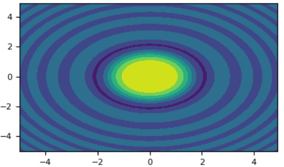

### Broadcasting机制

&emsp;&emsp;`NumPy`数组运算通常是逐元素(`element-by-element`)计算，因此要求两个数组的形状必须相同：<!--more-->

``` python
>>> a = np.array([1.0, 2.0, 3.0])
>>> b = np.array([2.0, 2.0, 2.0])
>>> a * b
array([ 2., 4., 6.])
```

`NumPy`的`Broadcasting`机制解除了这种限制，在两个数组的形状满足某种条件的情况下，不同形状的数组之间仍可以进行算术运算。最简单的就是数组乘以一个标量：

``` python
>>> a = np.array([1.0, 2.0, 3.0])
>>> b = 2.0
>>> a * b
array([ 2., 4., 6.])
```

结果和第一个`b`是数组的例子相同。可以认为标量`b`被拉伸成了和`a`相同形状的数组，拉伸后数组每个元素的值为先前标量值的复制。实际上复制操作并不会真正进行，只是在计算时使用标量的值罢了，因此节省了内存且效率更高。对于`==`等运算符的使用，`Broadcasting`的效果更显著：

``` python
>>> labels = np.array([1, 2, 0, 0, 2])
>>> labels == 0
array([False, False, True, True, False], dtype=bool)
>>> (labels == 0).astype(np.float32)
array([ 0.,  0.,  1.,  1.,  0.], dtype=float32)
```

&emsp;&emsp;但并不是任何维数不等的数组运算时都能触发广播机制，只有当两个数组的`trailing dimensions compatible`(尾部维度兼容)时才会触发广播，否则报错`ValueError: frames are not aligned exception`。
&emsp;&emsp;什么是尾部维度？维数较大的数组的比维数较小的数组多出来的维度看做`头部维度`，剩下的就是`尾部维度`。将两数组的`shape`右对齐，右半边可以上下对应的部分就是尾部，如下面`1`和`2`轴。`b`数组将会在`0`轴广播`256`遍：

``` python
            axis:   0     1   2
a     (3d array): 256 x 256 x 3
b     (2d array):       256 x 3
a + b (2d array): 256 x 256 x 3
```

什么是兼容？来自官方文档`Broadcasting`的解释很简练：

``` python
Two dimensions are compatible when they are equal, or one of them is 1
```

即对应的尾部维度的长是相等的或者其中有一方是`1`。上面`a`、`b`对应的尾部维度是相等的，因此`a`、`b`的维度是兼容的，对应第一种情形。下面的`a`、`b`对应第二种情形：

``` python
            axis: 0   1   2   3
A     (4d array): 8 x 1 x 6 x 1
B     (3d array):     7 x 1 x 5
A + B (2d array): 8 x 7 x 6 x 5
```

即`1`是一张万能牌，它与任意长度的维度兼容，`A`在`1`轴广播`7`遍，在`3`轴广播`5`遍，而`B`在`0`轴广播`8`遍。如果我们把`0`轴空着的部分看做`1`，那么一切都将适用第二种情形`one of them is 1`。
&emsp;&emsp;对于任意`shape`的数组，我们可以利用`np.newaxis`使它们兼容，如下面的情况不会触发广播机制：

``` python
a     (2d array): 3 x 4
b     (2d array): 5 x 4
a + b ValueError
```

若转化为下面的形式(当然意义也变了，怎么转化应当根据需求而定)，可以触发广播：

``` python
a[:, np.newaxis, :]     (3d array): 3 x 1 x 4
b                       (2d array):     5 x 4
a[:, np.newaxis, :] + b (3d array): 3 x 5 x 4
```

### numpy.isfinite

&emsp;&emsp;`numpy.isfinite(x, /, out=None, *, where=True, casting='same_kind', order='K', dtype=None, subok=True[, signature, extobj]) = <ufunc 'isfinite'>`: Test element-wise for finiteness (not `infinity` or not `Not a Number`). The result is returned as a `boolean` array. Parameters:

- `x`: `array_like`. Input values.
- `out`: `ndarray`, `None`, or `tuple of ndarray` and `None`, optional. A location into which the result is stored. If provided, it must have a shape that the inputs broadcast to. If not provided or `None`, a freshly-allocated array is returned. A tuple (possible only as a keyword argument) must have length equal to the number of outputs.
- `where`: `array_like`, optional. Values of `True` indicate to calculate the ufunc at that position, values of `False` indicate to leave the value in the output alone.

&emsp;&emsp;Returns:

- `y` : `ndarray`, `bool`. For scalar input, the result is a new `boolean` with value `True` if the input is finite; otherwise the value is `False` (input is either positive infinity, negative infinity or `Not a Number`). For array input, the result is a `boolean` array with the same dimensions as the input and the values are `True` if the corresponding element of the input is finite; otherwise the values are `False` (element is either positive infinity, negative infinity or `Not a Number`).

&emsp;&emsp;**Notes**: `Not a Number`, positive infinity and negative infinity are considered to be `non-finite`.
&emsp;&emsp;NumPy uses the `IEEE Standard for Binary Floating-Point for Arithmetic` (`IEEE 754`). This means that `Not a Number` is not equivalent to infinity. Also that positive infinity is not equivalent to negative infinity. But infinity is equivalent to positive infinity. Errors result if the second argument is also supplied when `x` is a scalar input, or if first and second arguments have different shapes.

``` python
>>> np.isfinite(1)
True
>>> np.isfinite(0)
True
>>> np.isfinite(np.nan)
False
>>> np.isfinite(np.inf)
False
>>> np.isfinite(np.NINF)
False
>>> np.isfinite([np.log(-1.), 1., np.log(0)])
array([False, True, False])
>>> x = np.array([-np.inf, 0., np.inf])
>>> y = np.array([2, 2, 2])
>>> np.isfinite(x, y)
array([0, 1, 0])
>>> y
array([0, 1, 0])
```

### numpy.rollaxis

&emsp;&emsp;`numpy.rollaxis(a, axis, start=0)`: Roll the specified axis backwards, until it lies in a given position(实际上是把`axis`轴移到`start`位置).
&emsp;&emsp;This function continues to be supported for backward compatibility, but you should prefer `moveaxis`. The `moveaxis` function was added in `NumPy 1.11`. Parameters:

- `a`: ndarray. Input array.
- `axis`: `int`. The axis to roll backwards. The positions of the other axes do not change relative to one another.
- `start`: `int`, optional. The axis is rolled until it lies before this position. The default, `0`, results in a `complete` roll.

``` python
>>> a = np.ones((3,4,5,6))
>>> np.rollaxis(a, 3, 1).shape
(3, 6, 4, 5)
>>> np.rollaxis(a, 2).shape
(5, 3, 4, 6)
>>> np.rollaxis(a, 1, 4).shape
(3, 5, 6, 4)
```

### numpy.average

&emsp;&emsp;`numpy.average(a, axis=None, weights=None, returned=False)`: Compute the weighted average along the specified `axis`. Parameters:

- `a`: `array_like`. Array containing data to be averaged. If `a` is not an array, a conversion is attempted.
- `axis`: `None` or `int` or `tuple of ints`, optional. Axis or axes along which to average `a`. The default, `axis=None`, will average over all of the elements of the input array. If `axis` is negative, it counts from the last to the first axis. If `axis` is a tuple of ints, averaging is performed on all of the axes specified in the tuple instead of a single axis or all the axes as before.
- `weights`: `array_like`, optional. An array of `weights` associated with the values in `a`. Each value in a contributes to the average according to its associated weight. The `weights` array can either be `1-D` (in which case its length must be the size of `a` along the given `axis`) or of the same shape as `a`. If `weights=None`, then all data in `a` are assumed to have a weight equal to one.

- `returned`: `bool`, optional. Default is `False`. If `True`, the tuple `(average, sum_of_weights)` is returned, otherwise only the average is returned. If `weights=None`, `sum_of_weights` is equivalent to the number of elements over which the average is taken.

&emsp;&emsp;Returns:

- `average, [sum_of_weights]`: `array_type` or `double`. Return the average along the specified `axis`. When returned is `True`, return a tuple with the average as the first element and the sum of the weights as the second element. The return type is `Float` if `a` is of integer type, otherwise it is of the same type as `a`. `sum_of_weights` is of the same type as average.

&emsp;&emsp;Raises:

- `ZeroDivisionError`: When all weights along `axis` are `zero`. See `numpy.ma.average` for a version robust to this type of error.
- `TypeError`: When the length of `1D` weights is not the same as the shape of `a` along `axis`.

``` python
>>> data = range(1, 5)
>>> data
[1, 2, 3, 4]
>>> np.average(data)
2.5
>>> np.average(range(1, 11), weights=range(10, 0, -1))
4.0
>>> data = np.arange(6).reshape((3, 2))
>>> data
array([[0, 1],
       [2, 3],
       [4, 5]])
>>> np.average(data, axis=1, weights=[1./4, 3./4])
array([ 0.75,  2.75,  4.75])
>>> np.average(data, weights=[1./4, 3./4])
Traceback (most recent call last):
...
TypeError: Axis must be specified when shapes of a and weights differ.
```

### numpy.full

&emsp;&emsp;`numpy.full(shape, fill_value, dtype=None, order='C')`: Return a new array of given `shape` and type, filled with `fill_value`. Parameters:

- `shape`: `int` or `sequence of ints`. Shape of the new array, e.g., `(2, 3)` or `2`.
- `fill_value`: `scalar`. Fill value.
- `dtype`: `data-type`, optional. The desired `data-type` for the array The default, `None`, means `np.array(fill_value).dtype`.
- `order`: `{'C', 'F'}`, optional. Whether to store multidimensional data in `C-` or `Fortran-contiguous` (`row-` or `column-wise`) order in memory.

&emsp;&emsp;Returns:

- `out`: `ndarray`. Array of `fill_value` with the given `shape`, `dtype` and `order`.

``` python
>>> np.full((2, 2), np.inf)
array([[ inf,  inf],
       [ inf,  inf]])
>>> np.full((2, 2), 10)
array([[10, 10],
       [10, 10]])
```

### numpy.fromstring

&emsp;&emsp;`numpy.fromstring(string, dtype=float, count=-1, sep='')`: A new `1-D` array initialized from text data in a `string`. Parameters:

- `string`: `str`: A string containing the data.
- `dtype`: `data-type`, optional. The data type of the array. For binary input data, the data must be in exactly this format.
- `count`: `int`, optional. Read this number of dtype elements from the data. If this is negative (the default), the `count` will be determined from the length of the data.
- `sep`: `str`, optional. The string separating numbers in the data; extra whitespace between elements is also ignored. Deprecated since `version 1.14`: If this argument is not provided, fromstring falls back on the behaviour of frombuffer after encoding unicode string inputs as either `utf-8` (`python 3`), or the default encoding (`python 2`).

&emsp;&emsp;Returns:

- `arr`: `ndarray`. The constructed array.

&emsp;&emsp;Raises:

- `ValueError`. If the string is not the correct size to satisfy the requested dtype and count.

``` python
>>> np.fromstring('1 2', dtype=int, sep=' ')
array([1, 2])
>>> np.fromstring('1, 2', dtype=int, sep=',')
array([1, 2])
```

### np.numpy.nan_to_num

&emsp;&emsp;在使用`numpy`数组的过程中，时常会出现`nan`或者`inf`的元素，可能会造成数值计算时的一些错误。`numpy`提供了`nan_to_num`函数，使`nan`和`inf`能够最简单地转换成相应的数值：

``` python
numpy.nan_to_num(x)
```

使用`0`代替数组`x`中的`nan`元素，使用有限的数字代替`inf`元素：

``` python
>>> import numpy as np
>>> a = np.array([[np.nan, np.inf], [-np.nan, -np.inf]])
>>> a
array([[ nan,  inf],
       [ nan, -inf]])
>>> np.nan_to_num(a)
array([[ 0.00000000e+000,  1.79769313e+308],
       [ 0.00000000e+000, -1.79769313e+308]])
```

### numpy.meshgrid

&emsp;&emsp;`numpy.meshgrid(*xi, **kwargs)`: Return coordinate matrices from coordinate vectors. Make `N-D` coordinate arrays for vectorized evaluations of `N-D` scalar/vector fields over `N-D` grids, given `one-dimensional` coordinate arrays `x1, x2, ..., xn`. `1-D` and `0-D` cases are allowed. Parameters:

- `x1, x2, ..., xn`: `array_like`. `1-D` arrays representing the coordinates of a grid.
- `indexing`: `{'xy', 'ij'}`, optional. Cartesian (`xy`, default) or matrix (`ij`) indexing of output.
- `sparse`: `bool`, optional. If `True`, a sparse grid is returned in order to conserve memory. Default is `False`.
- `copy`: `bool`, optional. If `False`, a view into the original arrays are returned in order to conserve memory. Default is `True`.

Please note that `sparse=False`, `copy=False` will likely return `non-contiguous` arrays. Furthermore, more than one element of a broadcast array may refer to a single memory location. If you need to write to the arrays, make copies first.
&emsp;&emsp;Returns:

- `X1, X2, ..., XN`: `ndarray`. For vectors `x1, x2, ..., xn` with lengths `Ni = len(xi)`, return `(N1, N2, N3, ..., Nn)` shaped arrays if `indexing = 'ij'`, or `(N2, N1, N3, ..., Nn)` shaped arrays if `indexing='xy'` with the elements of `xi` repeated to fill the matrix along the first dimension for `x1`, the second for `x2` and so on.

&emsp;&emsp;**Notes**: This function supports both indexing conventions through the indexing keyword argument. Giving the string `ij` returns a meshgrid with matrix indexing, while `xy` returns a meshgrid with `Cartesian` indexing. In the `2-D` case with inputs of length `M` and `N`, the outputs are of shape `(N, M)` for `xy` indexing and `(M, N)` for `ij` indexing. In the `3-D` case with inputs of length `M`, `N` and `P`, outputs are of shape `(N, M, P)` for `xy` indexing and `(M, N, P)` for `ij` indexing. The difference is illustrated by the following code snippet:

``` python
xv, yv = np.meshgrid(x, y, sparse=False, indexing='ij')
for i in range(nx):
    for j in range(ny):
        # treat xv[i, j], yv[i, j]

xv, yv = np.meshgrid(x, y, sparse=False, indexing='xy')
for i in range(nx):
    for j in range(ny):
        # treat xv[j, i], yv[j, i]
```

In the `1-D` and `0-D` case, the indexing and sparse keywords have no effect.

``` python
>>> nx, ny = (3, 2)
>>> x = np.linspace(0, 1, nx)
>>> y = np.linspace(0, 1, ny)
>>> xv, yv = np.meshgrid(x, y)
>>> xv
array([[ 0. ,  0.5,  1. ],
       [ 0. ,  0.5,  1. ]])
>>> yv
array([[ 0.,  0.,  0.],
       [ 1.,  1.,  1.]])
>>> xv, yv = np.meshgrid(x, y, sparse=True)  # make sparse output arrays
>>> xv
array([[ 0. ,  0.5,  1. ]])
>>> yv
array([[ 0.],
       [ 1.]])
```

meshgrid is very useful to evaluate functions on a grid.

``` python
>>> import matplotlib.pyplot as plt
>>> x = np.arange(-5, 5, 0.1)
>>> y = np.arange(-5, 5, 0.1)
>>> xx, yy = np.meshgrid(x, y, sparse=True)
>>> z = np.sin(xx**2 + yy**2) / (xx**2 + yy**2)
>>> h = plt.contourf(x, y, z)
>>> plt.show()
```



### numpy.convolve(卷积)

&emsp;&emsp;`numpy.convolve(a, v, mode='full')`: Returns the discrete, linear convolution of two `one-dimensional` sequences.
&emsp;&emsp;The convolution operator is often seen in signal processing, where it models the effect of a linear `time-invariant` system on a signal. In probability theory, the sum of two independent random variables is distributed according to the convolution of their individual distributions.
&emsp;&emsp;If `v` is longer than `a`, the arrays are swapped before computation. Parameters:

- `a`: `(N,) array_like`. First `one-dimensional` input array.
- `v`: `(M,) array_like`. Second `one-dimensional` input array.
- `mode`: `{'full', 'valid', 'same'}`, optional.

1. `full`: By default, mode is `full`. This returns the convolution at each point of overlap, with an output shape of `(N + M - 1,)`. At the `end-points` of the convolution, the signals do not overlap completely, and boundary effects may be seen.
2. `same`: Mode `same` returns output of length `max(M, N)`. Boundary effects are still visible.
3. `valid`: Mode `valid` returns output of length `max(M, N) - min(M, N) + 1`. The convolution product is only given for points where the signals overlap completely. Values outside the signal boundary have no effect.

&emsp;&emsp;Returns:

- `out`: `ndarray`. Discrete, linear convolution of `a` and `v`.

&emsp;&emsp;**Notes**: The discrete convolution operation is defined as:

\begin{aligned}
\left (a \ast  v \right )\left [n \right ] = \sum_{m=-\infty}^{\infty }a\left [ m\right ]v\left [ n - m\right ] \notag
\end{aligned}

&emsp;&emsp;It can be shown that a convolution $x(t) * y(t)$ in time/space is equivalent to the multiplication $X(f)Y(f)$ in the `Fourier` domain, after appropriate padding (padding is necessary to prevent circular convolution). Since multiplication is more efficient (faster) than convolution, the function `scipy.signal.fftconvolve` exploits the `FFT` to calculate the convolution of large data-sets.
&emsp;&emsp;Examples: Note how the convolution operator flips the second array before `sliding` the two across one another:

``` python
>>> np.convolve([1, 2, 3], [0, 1, 0.5])
array([ 0. ,  1. ,  2.5,  4. ,  1.5])
```

Only return the middle values of the convolution. Contains boundary effects, where zeros are taken into account:

``` python
>>> np.convolve([1,2,3],[0,1,0.5], 'same')
array([ 1. ,  2.5,  4. ])
```

The two arrays are of the same length, so there is only one position where they completely overlap:

``` python
>>> np.convolve([1, 2, 3], [0, 1, 0.5], 'valid')
array([ 2.5])
```

### numpy.random.permutation

&emsp;&emsp;`numpy.random.permutation(x)`: Randomly permute a sequence, or return a permuted range. If `x` is a `multi-dimensional` array, it is only shuffled along its first index. Parameters:

- `x`: `int` or `array_like`. If `x` is an integer, randomly permute `np.arange(x)`. If `x` is an array, make a copy and shuffle the elements randomly.

&emsp;&emsp;Returns:

- `out`: ndarray. Permuted sequence or array range.

``` python
>>> np.random.permutation(10)
array([1, 7, 4, 3, 0, 9, 2, 5, 8, 6])
>>> np.random.permutation([1, 4, 9, 12, 15])
array([15,  1,  9,  4, 12])
>>> arr = np.arange(9).reshape((3, 3))
>>> np.random.permutation(arr)
array([[6, 7, 8],
       [0, 1, 2],
       [3, 4, 5]])
```

### numpy.matrix.A

&emsp;&emsp;`matrix.A`: Return self as an ndarray object. Equivalent to `np.asarray(self)`.

``` python
>>> x = np.matrix(np.arange(12).reshape((3, 4))); x
matrix([[ 0,  1,  2,  3],
        [ 4,  5,  6,  7],
        [ 8,  9, 10, 11]])
>>> x.getA()
array([[ 0,  1,  2,  3],
       [ 4,  5,  6,  7],
       [ 8,  9, 10, 11]])
```

### numpy.cov(协方差)

&emsp;&emsp;`numpy.cov(m, y=None, rowvar=True, bias=False, ddof=None, fweights=None, aweights=None)`: Estimate a covariance matrix, given data and weights.
&emsp;&emsp;Covariance indicates the level to which two variables vary together. If we examine `N-dimensional` samples, $X = [x_1, x_2, ... x_N]^T$, then the covariance matrix element $C_{ij}$ is the covariance of $x_i$ and $x_j$. The element $C_{ii}$ is the variance of $x_i$. Parameters:

- `m`: `array_like`. A `1-D` or `2-D` array containing multiple variables and observations. Each row of `m` represents a variable, and each column a single observation of all those variables.
- `y`: `array_like`, optional. An additional set of variables and observations. `y` has the same form as that of `m`.
- `rowvar`: `bool`, optional. If rowvar is `True`, then each row represents a variable, with observations in the columns. Otherwise, the relationship is transposed: each column represents a variable, while the rows contain observations.
- `bias`: `bool`, optional. Default normalization (`False`) is by `(N - 1)`, where `N` is the number of observations given (unbiased estimate). If `bias` is `True`, then normalization is by `N`. These values can be overridden by using the keyword `ddof` in `numpy versions >= 1.5`.
- `ddof`: `int`, optional. If not `None`, the default value implied by `bias` is overridden. Note that `ddof=1` will return the unbiased estimate, even if both `fweights` and `aweights` are specified, and `ddof=0` will return the simple average.
- `fweights`: `array_like`, `int`, optional. `1-D` array of integer freguency weights; the number of times each observation vector should be repeated.
- `aweights`: `array_like`, optional. `1-D` array of observation vector weights. These relative weights are typically large for observations considered `important` and smaller for observations considered less `important`. If `ddof=0` the array of weights can be used to assign probabilities to observation vectors.

&emsp;&emsp;Returns:

- `out`: `ndarray`. The covariance matrix of the variables.

&emsp;&emsp;**Notes**: Assume that the observations are in the columns of the observation array `m` and let `f = fweights` and `a = aweights` for brevity. The steps to compute the weighted covariance are as follows:

``` python
>>> w = f * a
>>> v1 = np.sum(w)
>>> v2 = np.sum(w * a)
>>> m -= np.sum(m * w, axis=1, keepdims=True) / v1
>>> cov = np.dot(m * w, m.T) * v1 / (v1**2 - ddof * v2)
```

Note that when `a == 1`, the normalization factor `v1 / (v1**2 - ddof * v2)` goes over to `1 / (np.sum(f) - ddof)` as it should.
&emsp;&emsp;Examples: Consider two variables, $x_0$ and $x_1$, which correlate perfectly, but in opposite directions:

``` python
>>> x = np.array([[0, 2], [1, 1], [2, 0]]).T
>>> x
array([[0, 1, 2],
       [2, 1, 0]])
```

Note how $x_0$ increases while $x_1$ decreases. The covariance matrix shows this clearly:

``` python
>>> np.cov(x)
array([[ 1., -1.],
       [-1.,  1.]])
```

Note that element $C_{0,1}$, which shows the correlation between $x_0$ and $x_1$, is negative. Further, note how `x` and `y` are combined:

``` python
>>> x = [-2.1, -1,  4.3]
>>> y = [3,  1.1,  0.12]
>>> X = np.stack((x, y), axis=0)
>>> print(np.cov(X))
[[ 11.71        -4.286     ]
 [ -4.286        2.14413333]]
>>> print(np.cov(x, y))
[[ 11.71        -4.286     ]
 [ -4.286        2.14413333]]
>>> print(np.cov(x))
11.71
```

### numpy.fromfunction

&emsp;&emsp;使用函数规则创建数组是非常方便的方法，我们常用`numpy`的`fromfunction`函数来实现这个功能。
&emsp;&emsp;创建一个函数，它是`y = i * 2`的表示形式：

``` python
import numpy as np

def func(i):
    print(i)  # 输出“[0. 1. 2. 3. 4.]”
    return i * 2

array = np.fromfunction(func, (5,))
print(array)  # 输出“[0. 2. 4. 6. 8.]”
```

`fromfunction`的第二个参数定义了数组的形状，参数`(5,)`表示的数组是`[0, 1, 2, 3, 4]`。
&emsp;&emsp;假如创建的是二维数组，则函数式有两个自变量，例如`y = i * j`这个函数：

``` python
import numpy as np

def func(i, j):
    print("i =\n", i)
    print("j =\n", j)
    return i * j

array = np.fromfunction(func, (3, 3))
print("----------")
print(array)
```

执行结果：

``` python
i =
 [[0. 0. 0.]
  [1. 1. 1.]
  [2. 2. 2.]]
j =
 [[0. 1. 2.]
  [0. 1. 2.]
  [0. 1. 2.]]
----------
[[0. 0. 0.]
 [0. 1. 2.]
 [0. 2. 4.]]
```

换一种取值范围：

``` python
import numpy as np

def func(i, j):
    print("i =\n", i)
    print("j =\n", j)
    return i * j

array = np.fromfunction(func, (3, 2))
print("----------")
print(array)
```

执行结果：

``` python
i =
 [[0. 0.]
  [1. 1.]
  [2. 2.]]
j =
 [[0. 1.]
  [0. 1.]
  [0. 1.]]
----------
[[0. 0.]
 [0. 1.]
 [0. 2.]]
```

### astype和dtype

&emsp;&emsp;`astype`用于数据类型转换，`dtype`用于查看数据类型：

``` python
import numpy as np

arr = np.array([1, 2, 3, 4, 5])
print(arr)  # 输出“[1 2 3 4 5]”
print(arr.dtype)  # 输出“int32”
float_arr = arr.astype(np.float64)  # int型转为float型
print(float_arr.dtype)  # 输出“float64”
print(float_arr)  # 输出“[1. 2. 3. 4. 5.]”
# ------------------------------------------
arr2 = np.array([1.1, 2.2, 3.3, 4.4, 5.3221])
print(arr2)  # 输出“[1.1    2.2    3.3    4.4    5.3221]”
print(arr2.dtype)  # 输出“float64”
int_arr2 = arr2.astype(np.int32)  # float型转为int型
print(int_arr2)  # 输出“[1 2 3 4 5]”
# ------------------------------------------
numeric_strings = np.array(['1.2', '2.3', '3.2141'], dtype=np.string_)
print(numeric_strings)  # 输出“[b'1.2' b'2.3' b'3.2141']”
# 此处写的是float，而不是np.float64。Numpy很聪明，会将python类型映射到等价的dtype上
float_arr = numeric_strings.astype(float)
print(float_arr)  # 输出“[1.2    2.3    3.2141]”
```

### numpy.ndarray.tofile

&emsp;&emsp;`ndarray.tofile(fid, sep="", format="%s")`: Write array to a file as text or binary (default). Data is always written in `C` order, independent of the order of `a`. The data produced by this method can be recovered using the function `fromfile`. Parameters:

- `fid`: `file` or `str`. An open file object, or a string containing a filename.
- `sep`: `str`. Separator between array items for text output. If empty, a binary file is written, equivalent to `file.write(a.tobytes())`.
- `format`: `str`. Format string for text file output. Each entry in the array is formatted to text by first converting it to the closest `Python` type, and then using `"format" % item`.

&emsp;&emsp;**Notes**: This is a convenience function for quick storage of array data. Information on endianness and precision is lost, so this method is not a good choice for files intended to archive data or transport data between machines with different endianness. Some of these problems can be overcome by outputting the data as text files, at the expense of speed and file size.
&emsp;&emsp;When `fid` is a file object, array contents are directly written to the file, bypassing the file object's write method. As a result, `tofile` cannot be used with files objects supporting compression (e.g., `GzipFile`) or `file-like` objects that do not support `fileno` (e.g., `BytesIO`).

### numpy.around(round)

&emsp;&emsp;`numpy.around(a, decimals=0, out=None)`: Evenly round to the given number of `decimals`. Parameters:

- `a`: `array_like`. Input data.
- `decimals`: `int`, optional. Number of decimal places to round to. If `decimals` is negative, it specifies the number of positions to the left of the decimal point.
- `out`: `ndarray`, optional. Alternative output array in which to place the result. It must have the same shape as the expected output, but the type of the output values will be cast if necessary.

&emsp;&emsp;**Notes**: For values exactly halfway between rounded decimal values, `NumPy` rounds to the nearest even value. Thus `1.5` and `2.5` round to `2.0`, `-0.5` and `0.5` round to `0.0`, etc. Results may also be surprising due to the inexact representation of decimal fractions in the `IEEE floating point standard` and errors introduced when scaling by powers of ten.

``` python
>>> np.around([0.37, 1.64])
array([ 0.,  2.])
>>> np.around([0.37, 1.64], decimals=1)
array([0.4, 1.6])
>>> np.around([.5, 1.5, 2.5, 3.5, 4.5])  # rounds to nearest even value
array([0., 2., 2., 4., 4.])
>>> np.around([1, 2, 3, 11], decimals=1)  # ndarray of ints is returned
array([1, 2, 3, 11])
>>> np.around([1, 2, 3, 11], decimals=-1)
array([0, 0,  0, 10])
```

### numpy.mod

&emsp;&emsp;`numpy.mod(x1, x2, /, out=None, *, where=True, casting='same_kind', order='K', dtype=None, subok=True[, signature, extobj]) = <ufunc 'remainder'>`: Return element-wise remainder of division(返回输入数组中相应元素的除法余数).
&emsp;&emsp;Computes the remainder complementary to the `floor_divide` function. It is equivalent to the `Python` modulus operator `x1 % x2` and has the same sign as the divisor `x2`. The `MATLAB` function equivalent to `np.remainder` is `mod`.
&emsp;&emsp;Warning: This should not be confused with:
`Python 3.7's math.remainder` and `C's remainder`, which computes the `IEEE` remainder, which are the complement to `round(x1 / x2)`.
&emsp;&emsp;The `MATLAB` `rem` function and or the `C` `%` operator which is the complement to `int(x1 / x2)`.
&emsp;&emsp;Parameters:

- `x1`: `array_like`. Dividend array.
- `x2`: `array_like`. Divisor array.
- `out`: `ndarray`, `None`, or `tuple of ndarray` and `None`, optional. A location into which the result is stored. If provided, it must have a shape that the inputs broadcast to. If not provided or `None`, a freshly-allocated array is returned. A tuple (possible only as a keyword argument) must have length equal to the number of outputs.
- `where`: `array_like`, optional. Values of `True` indicate to calculate the ufunc at that position, values of `False` indicate to leave the value in the output alone.

&emsp;&emsp;Returns:

- `y`: `ndarray`. The element-wise remainder of the quotient `floor_divide(x1, x2)`. This is a scalar if both `x1` and `x2` are scalars.

&emsp;&emsp;**Notes**: Returns `0` when `x2` is `0` and both `x1` and `x2` are (arrays of) integers. `mod` is an alias of `remainder`.

``` python
>>> np.remainder([4, 7], [2, 3])
array([0, 1])
>>> np.remainder(np.arange(7), 5)
array([0, 1, 2, 3, 4, 0, 1])
```

### numpy.swapaxes

&emsp;&emsp;有时需要对矩阵进行旋转维度操作，二维转置直接使用`.T`，高维矩阵则需要借助`numpy.swapaxes`函数：

``` python
>>> a = np.array([[1, 2, 3], [4, 5, 6]])
>>> a
array([[1, 2, 3],
       [4, 5, 6]])
>>> a.shape
(2, 3)
>>> a.swapaxes(0, 1)  # a.swapaxes(0, 1)等价于np.swapaxes(a, 0, 1)
array([[1, 4],
       [2, 5],
       [3, 6]])
>>> a.swapaxes(0, 1).shape
(3, 2)
>>> a.T.shape  # 由于是二维矩阵，可以使用“.T”操作
(3, 2)
```

### numpy.ascontiguousarray

&emsp;&emsp;`numpy.ascontiguousarray(a, dtype=None)`: Return a contiguous array in memory (`C order`). Parameters:

- `a`: `array_like`. Input array.
- `dtype`: `str` or `dtype` object, optional. `Data-type` of returned array.

&emsp;&emsp;Returns:

- `out`: `ndarray`. Contiguous array of same shape and content as `a`, with type `dtype` if specified.

``` python
>>> x = np.arange(6).reshape(2, 3)
>>> np.ascontiguousarray(x, dtype=np.float32)
array([[ 0.,  1.,  2.],
       [ 3.,  4.,  5.]], dtype=float32)
>>> x.flags['C_CONTIGUOUS']
True
```

### numpy.greater_equal

&emsp;&emsp;`numpy.greater_equal(x1, x2, /, out=None, *, where=True, casting='same_kind', order='K', dtype=None, subok=True[, signature, extobj])`: Return the truth value of (`x1 >= x2`) element-wise. Parameters:

- `x1, x2`: `array_like`. Input arrays. If `x1.shape != x2.shape`, they must be broadcastable to a common shape (which may be the shape of one or the other).
- `out`: `ndarray`, `None`, or `tuple of ndarray` and `None`, optional. A location into which the result is stored. If provided, it must have a shape that the inputs broadcast to. If not provided or `None`, a freshly-allocated array is returned. A tuple (possible only as a keyword argument) must have length equal to the number of outputs.
- `where`: `array_like`, optional. Values of `True` indicate to calculate the ufunc at that position, values of `False` indicate to leave the value in the output alone.

&emsp;&emsp;Returns:

- `out`: `bool` or `ndarray of bool`. Output array, element-wise comparison of `x1` and `x2`. Typically of type `bool`, unless `dtype=object` is passed. This is a scalar if both `x1` and `x2` are scalars.

``` python
>>> np.greater_equal([4, 2, 1], [2, 2, 2])
array([ True, True, False])
```

### numpy.ndarray.shape

&emsp;&emsp;Tuple of array dimensions. The shape property is usually used to get the current shape of an array, but may also be used to reshape the array `in-place` by assigning a tuple of array dimensions to it. As with `numpy.reshape`, one of the new shape dimensions can be `-1`, in which case its value is inferred from the size of the array and the remaining dimensions. Reshaping an array `in-place` will fail if a copy is required.

``` python
>>> x = np.array([1, 2, 3, 4])
>>> x.shape
(4,)
>>> y = np.zeros((2, 3, 4))
>>> y.shape
(2, 3, 4)
>>> y.shape = (3, 8)
>>> y
array([[ 0.,  0.,  0.,  0.,  0.,  0.,  0.,  0.],
       [ 0.,  0.,  0.,  0.,  0.,  0.,  0.,  0.],
       [ 0.,  0.,  0.,  0.,  0.,  0.,  0.,  0.]])
>>> y.shape = (3, 6)
Traceback (most recent call last):
  File "<stdin>", line 1, in <module>
ValueError: total size of new array must be unchanged
>>> np.zeros((4,2))[::2].shape = (-1,)
Traceback (most recent call last):
  File "<stdin>", line 1, in <module>
AttributeError: incompatible shape for a non-contiguous array
```

### einsum函数

&emsp;&emsp;给定向量`a`和向量`b`，若`a = (1, 2, 3)`，`b = (4, 5, 6)`：

``` python
import numpy as np

a = np.array([1, 2, 3])
b = np.array([4, 5, 6])
```

- `np.einsum('i', a)`返回向量`a`本身。
- `np.einsum('i->', a)`返回向量`a`的元素和(等价于`np.sum(a)`)。
- `np.einsum('i,i->i', a, b)`是向量`a`和向量`b`的点乘(等价于`a * b`)：

``` python
np.einsum('i, i->i', a, b)  # 结果为[4 10 18]
```

- `np.einsum('i,i', a, b)`是向量`a`和向量`b`的内积(等价于`np.inner(a, b)`)：

``` python
np.einsum('i, i', a, b)  # 结果为“32”
```

- `np.einsum('i, j->ij', a, b)`是向量`a`和向量`b`的外积(等价于`np.outer(a, b)`)，结果为：

``` python
[[ 4  5  6]
 [ 8 10 12]
 [12 15 18]]
```

&emsp;&emsp;给定矩阵`A`和矩阵`B`，若`A = [[1, 2], [3, 4]]`，`B = [[5, 6], [7, 8]]`：

``` python
import numpy as np

A = np.array([[1, 2], [3, 4]])
B = np.array([[5, 6], [7, 8]])
```

- `np.einsum('ij', A)`返回矩阵`A`本身。
- `np.einsum('ji', A)`返回矩阵`A`的转置(等价于`A.T`)。
- `np.einsum('ii', A)`返回矩阵`A`对角线上元素的和(等价于`np.trace(A)`)。
- `np.einsum('ij->', A)`返回矩阵`A`所有元素的和(等价于`np.sum(A)`)。
- `np.einsum('ij->j', A)`返回矩阵`A`列向量的和(等价于`np.sum(A, axis=0)`)。
- `np.einsum('ij->i', A)`返回矩阵`A`行向量的和(等价于`np.sum(A, axis=1)`)。
- `np.einsum('ij, ij->ij', A, B)`是矩阵`A`和矩阵`B`的点乘(等价于`A * B`)：

``` python
[[ 5 12]
 [21 32]]
```

- `np.einsum('ij, ji->ij', A, B)`是矩阵`A`点乘以矩阵`B`的转置(等价于`A*B.T`)：

``` python
[[ 5 14]
 [18 32]]
```

- `np.einsum('ij, jk', A, B)`是矩阵`A`乘以矩阵`B`(等价于`np.dot(A, B)`)：

``` python
[[19 22]
 [43 50]]
```

- `np.einsum('ij, ij', A, B)`是矩阵`A`和矩阵`B`的内积：

``` python
np.einsum('ij, ij', A, B)  # 结果为“70”
```

&emsp;&emsp;To enable and control broadcasting, use an ellipsis(省略号). Default `NumPy-style` broadcasting is done by adding an ellipsis to the left of each term, like `np.einsum('...ii->...i', a)`. To take the trace along the first and last axes, you can do `np.einsum('i...i', a)`, or to do a `matrix-matrix` product with the `left-most` indices instead of rightmost, you can do `np.einsum('ij...,jk...->ik...', a, b)`.
&emsp;&emsp;代码`1`如下：

``` python
>>> import numpy as np
>>> c = np.arange(6).reshape(2, 3)
>>> c
array([[0, 1, 2],
       [3, 4, 5]])
>>> np.einsum('..., ...', 3, c)
array([[ 0,  3,  6],
       [ 9, 12, 15]])
>>> a = np.arange(25).reshape(5, 5)
>>> a
array([[ 0,  1,  2,  3,  4],
       [ 5,  6,  7,  8,  9],
       [10, 11, 12, 13, 14],
       [15, 16, 17, 18, 19],
       [20, 21, 22, 23, 24]])
>>> np.einsum('i...->...', a)
array([50, 55, 60, 65, 70])
```

&emsp;&emsp;代码`2`如下：

``` python
>>> a = np.arange(60.).reshape(3, 4, 5)
>>> a
array([[[ 0.,  1.,  2.,  3.,  4.],
        [ 5.,  6.,  7.,  8.,  9.],
        [10., 11., 12., 13., 14.],
        [15., 16., 17., 18., 19.]],
       [[20., 21., 22., 23., 24.],
        [25., 26., 27., 28., 29.],
        [30., 31., 32., 33., 34.],
        [35., 36., 37., 38., 39.]],
       [[40., 41., 42., 43., 44.],
        [45., 46., 47., 48., 49.],
        [50., 51., 52., 53., 54.],
        [55., 56., 57., 58., 59.]]])
>>> b = np.arange(24.).reshape(4, 3, 2)
>>> b
array([[[ 0.,  1.],
        [ 2.,  3.],
        [ 4.,  5.]],
       [[ 6.,  7.],
        [ 8.,  9.],
        [10., 11.]],
       [[12., 13.],
        [14., 15.],
        [16., 17.]],
       [[18., 19.],
        [20., 21.],
        [22., 23.]]])
>>> np.einsum('ijk,jil->kl', a, b)
array([[4400., 4730.],
       [4532., 4874.],
       [4664., 5018.],
       [4796., 5162.],
       [4928., 5306.]])
```

&emsp;&emsp;代码`3`如下：

``` python
>>> a = np.arange(6).reshape((3,2))
>>> a
array([[0, 1],
       [2, 3],
       [4, 5]])
>>> b = np.arange(12).reshape((4,3))
>>> b
array([[ 0,  1,  2],
       [ 3,  4,  5],
       [ 6,  7,  8],
       [ 9, 10, 11]])
>>> np.einsum('ki,jk->ij', a, b)
array([[10, 28, 46, 64],
       [13, 40, 67, 94]])
>>> np.einsum('ki,...k->i...', a, b)
array([[10, 28, 46, 64],
       [13, 40, 67, 94]])
>>> np.einsum('k...,jk', a, b)
array([[10, 28, 46, 64],
       [13, 40, 67, 94]])
```

`array`坐标轴索引的先后顺序定义为`i -> j -> k -> l`。

### numpy.stack

&emsp;&emsp;`numpy.stack(arrays, axis=0)`: Join a sequence of `arrays` along a new axis. The `axis` parameter specifies the index of the new axis in the dimensions of the result. For example, if `axis=0` it will be the first dimension and if `axis=-1` it will be the last dimension. Parameters:

- `arrays`: sequence of `array_like`. Each array must have the same shape.
- `axis`: `int`, optional. The `axis` in the result array along which the input `arrays` are stacked.

&emsp;&emsp;Returns:

- `stacked`: `ndarray`. The stacked array has one more dimension than the input `arrays`.

``` python
>>> arrays = [np.random.randn(3, 4) for _ in range(10)]
>>> np.stack(arrays, axis=0).shape
(10, 3, 4)
>>> np.stack(arrays, axis=1).shape
(3, 10, 4)
>>> np.stack(arrays, axis=2).shape
(3, 4, 10)
>>> a = np.array([1, 2, 3])
>>> b = np.array([2, 3, 4])
>>> np.stack((a, b))
array([[1, 2, 3],
       [2, 3, 4]])
>>> np.stack((a, b), axis=-1)
array([[1, 2],
       [2, 3],
       [3, 4]])
```

### numpy.append

&emsp;&emsp;`numpy.append(arr, values, axis=None)`: Append `values` to the end of an array. Parameters:

- `arr`: `array_like`. Values are appended to a copy of this array.
- `values`: `array_like`. These `values` are appended to a copy of `arr`. It must be of the correct shape (the same shape as `arr`, excluding `axis`). If `axis` is not specified, `values` can be any shape and will be flattened before use.
- `axis`: `int`, optional. The `axis` along which `values` are appended. If `axis` is not given, both `arr` and `values` are flattened before use.

&emsp;&emsp;Returns:

- `append`: `ndarray`. A copy of `arr` with `values` appended to `axis`. Note that append does not occur `in-place`: a new array is allocated and filled. If `axis` is `None`, out is a flattened array.

``` python
>>> np.append([1, 2, 3], [[4, 5, 6], [7, 8, 9]])
array([1, 2, 3, 4, 5, 6, 7, 8, 9])
```

When `axis` is specified, `values` must have the correct shape:

``` python
>>> np.append([[1, 2, 3], [4, 5, 6]], [[7, 8, 9]], axis=0)
array([[1, 2, 3],
       [4, 5, 6],
       [7, 8, 9]])
>>> np.append([[1, 2, 3], [4, 5, 6]], [7, 8, 9], axis=0)
Traceback (most recent call last):
ValueError: arrays must have same number of dimensions
```

### numpy.cumsum

&emsp;&emsp;`numpy.cumsum(a, axis=None, dtype=None, out=None)`: Return the cumulative(累积) sum of the elements along a given `axis`. Parameters:

- `a`: `array_like`. Input array.
- `axis`: `int`, optional. Axis along which the cumulative sum is computed. The default (`None`) is to compute the cumsum over the flattened array.
- `dtype`: `dtype`, optional. Type of the returned array and of the accumulator in which the elements are summed. If `dtype` is not specified, it defaults to the dtype of `a`, unless `a` has an integer dtype with a precision less than that of the default platform integer. In that case, the default platform integer is used.
- `out`: `ndarray`, optional. Alternative output array in which to place the result. It must have the same shape and buffer length as the expected output but the type will be cast if necessary.

&emsp;&emsp;Returns:

- `cumsum_along_axis`: `ndarray`. A new array holding the result is returned unless `out` is specified, in which case a reference to `out` is returned. The result has the same size as `a`, and the same shape as `a` if `axis` is not `None` or `a` is a `1-d` array.

&emsp;&emsp;**Notes**: Arithmetic is modular when using integer types, and no error is raised on overflow.

``` python
>>> a = np.array([[1, 2, 3], [4, 5, 6]])
>>> a
array([[1, 2, 3],
       [4, 5, 6]])
>>> np.cumsum(a)
array([ 1,  3,  6, 10, 15, 21])
>>> np.cumsum(a, dtype=float)  # specifies type of output value(s)
array([  1.,   3.,   6.,  10.,  15.,  21.])
>>> np.cumsum(a,axis=0)  # sum over rows for each of the 3 columns
array([[1, 2, 3],
       [5, 7, 9]])
>>> np.cumsum(a,axis=1)  # sum over columns for each of the 2 rows
array([[ 1,  3,  6],
       [ 4,  9, 15]])
```

### numpy.random.shuffle

&emsp;&emsp;`numpy.random.shuffle(x)`: Modify a sequence `in-place` by shuffling its contents. This function only shuffles the array along the first axis of a `multi-dimensional` array. The order of `sub-arrays` is changed but their contents remains the same. Parameters:

- `x`: `array_like`. The array or list to be shuffled.

``` python
>>> arr = np.arange(10)
>>> np.random.shuffle(arr)
>>> arr
[1 7 5 2 9 4 3 6 0 8]
```

`Multi-dimensional` arrays are only shuffled along the first axis:

``` python
>>> arr = np.arange(9).reshape((3, 3))
>>> np.random.shuffle(arr)
>>> arr
array([[3, 4, 5],
       [6, 7, 8],
       [0, 1, 2]])
```

### numpy.hstack

&emsp;&emsp;`numpy.hstack(tup)`: Stack arrays in sequence horizontally (column wise).
&emsp;&emsp;This is equivalent to concatenation along the second axis, except for `1-D` arrays where it concatenates along the first axis. Rebuilds arrays divided by `hsplit`.
&emsp;&emsp;This function makes most sense for arrays with up to `3` dimensions. For instance, for `pixel-data` with a height (first axis), width (second axis), and `r/g/b` channels (third axis). The functions concatenate, stack and block provide more general stacking and concatenation operations.
&emsp;&emsp;Parameters:

- `tup`: sequence of `ndarrays`. The arrays must have the same shape along all but the second axis, except `1-D` arrays which can be any length.

&emsp;&emsp;Returns:

- `stacked`: `ndarray`. The array formed by stacking the given arrays.

``` python
>>> a = np.array((1, 2, 3))
>>> b = np.array((2, 3, 4))
>>> np.hstack((a,b))
array([1, 2, 3, 2, 3, 4])
>>> a = np.array([[1], [2], [3]])
>>> b = np.array([[2], [3], [4]])
>>> np.hstack((a, b))
array([[1, 2],
       [2, 3],
       [3, 4]])
```

### numpy.bincount

&emsp;&emsp;`numpy.bincount(x, weights=None, minlength=None)`: Count number of occurrences of each value in array of `non-negative` ints.
&emsp;&emsp;The number of bins (of size `1`) is one larger than the largest value in `x`. If `minlength` is specified, there will be at least this number of bins in the output array (though it will be longer if necessary, depending on the contents of `x`). Each bin gives the number of occurrences of its index value in `x`. If `weights` is specified, the input array is weighted by it, i.e. if a value `n` is found at position `i`, `out[n] += weight[i]` instead of `out[n] += 1`. Parameters:

- `x`: `array_like`, `1` dimension, nonnegative ints. Input array.
- `weights`: `array_like`, optional. Weights, array of the same shape as `x`.
- `minlength`: `int`, optional. A minimum number of bins for the output array.

&emsp;&emsp;Returns:

- `out`: ndarray of ints. The result of binning the input array. The length of `out` is equal to `np.amax(x) + 1`.

&emsp;&emsp;Raises:

- `ValueError`: If the input is not `1-dimensional`, or contains elements with negative values, or if minlength is `non-positive`.
- `TypeError`: If the type of the input is `float` or `complex`.

``` python
>>> np.bincount(np.arange(5))
array([1, 1, 1, 1, 1])
>>> np.bincount(np.array([0, 1, 1, 3, 2, 1, 7]))
array([1, 3, 1, 1, 0, 0, 0, 1])
>>> x = np.array([0, 1, 1, 3, 2, 1, 7, 23])
>>> np.bincount(x).size == np.amax(x)+1
True
```

The input array needs to be of integer dtype, otherwise a `TypeError` is raised:

``` python
>>> np.bincount(np.arange(5, dtype=np.float))
Traceback (most recent call last):
  File "<stdin>", line 1, in <module>
TypeError: array cannot be safely cast to required type
```

A possible use of `bincount` is to perform sums over `variable-size` chunks of an array, using the `weights` keyword.

``` python
>>> w = np.array([0.3, 0.5, 0.2, 0.7, 1., -0.6])  # weights
>>> x = np.array([0, 1, 1, 2, 2, 2])
>>> np.bincount(x,  weights=w)
array([ 0.3,  0.7,  1.1])
```

### numpy.count_nonzero

&emsp;&emsp;`numpy.count_nonzero(a, axis=None)`: Counts the number of `non-zero` values in the array `a`.
&emsp;&emsp;The word `non-zero` is in reference to the `Python 2.x` built-in method `__nonzero__()` (renamed `__bool__()` in `Python 3.x`) of `Python` objects that tests an object's `truthfulness`. For example, any number is considered truthful if it is `nonzero`, whereas any string is considered truthful if it is not the empty string. Thus, this function (recursively) counts how many elements in `a` (and in `sub-arrays` thereof) have their `__nonzero__()` or `__bool__()` method evaluated to True. Parameters:

- `a`: `array_like`. The array for which to count `non-zeros`.
- `axis`: `int` or `tuple`, optional. Axis or tuple of axes along which to count `non-zeros`. Default is `None`, meaning that `non-zeros` will be counted along a flattened version of `a`.

&emsp;&emsp;Returns:

- `count`: `int` or `array of int`. Number of `non-zero` values in the array along a given `axis`. Otherwise, the total number of `non-zero` values in the array is returned.

``` python
>>> np.count_nonzero(np.eye(4))
4
>>> np.count_nonzero([[0, 1, 7, 0, 0], [3, 0, 0, 2, 19]])
5
>>> np.count_nonzero([[0, 1, 7, 0, 0], [3, 0, 0, 2, 19]], axis=0)
array([1, 1, 1, 1, 1])
>>> np.count_nonzero([[0, 1, 7, 0, 0], [3, 0, 0, 2, 19]], axis=1)
array([2, 3])
```

### numpy.loadtxt

&emsp;&emsp;`numpy.loadtxt(fname, dtype=<type 'float'>, comments='#', delimiter=None, converters=None, skiprows=0, usecols=None, unpack=False, ndmin=0, encoding='bytes')`: Load data from a text file. Each row in the text file must have the same number of values. Parameters:

- `fname`: file, `str`, or `pathlib.Path`. File, filename, or generator to read. If the filename extension is `.gz` or `.bz2`, the file is first decompressed. Note that generators should return byte strings for `Python 3`.
- `dtype`: `data-type`, optional. Data-type of the resulting array. If this is a structured `data-type`, the resulting array will be `1-dimensional`, and each row will be interpreted as an element of the array. In this case, the number of columns used must match the number of fields in the `data-type`.
- `comments`: `str` or sequence of `str`, optional. The characters or list of characters used to indicate the start of a comment. For backwards compatibility, byte strings will be decoded as `latin1`.
- `delimiter`: `str`, optional. The string used to separate values. For backwards compatibility, byte strings will be decoded as `latin1`. The default is `whitespace`.
- `converters`: `dict`, optional. A dictionary mapping column number to a function that will convert that column to a `float`. E.g., if column `0` is a date string: `converters = {0: datestr2num}`. Converters can also be used to provide a default value for missing data: `converters = {3: lambda s: float(s.strip() or 0)}`.
- `skiprows`: `int`, optional. Skip the first `skiprows` lines.
- `usecols`: `int` or sequence, optional. Which columns to read, with `0` being the first. For example, `usecols = (1, 4, 5)` will extract the `2nd`, `5th` and `6th` columns. The default, `None`, results in all columns being read. Changed in `version 1.11.0`: When a single column has to be read, it is possible to use an integer instead of a tuple. E.g `usecols = 3` reads the `fourth` column the same way as `usecols = (3,)` would.
- `unpack`: `bool`, optional. If `True`, the returned array is transposed, so that arguments may be unpacked using `x, y, z = loadtxt(...)`. When used with a structured `data-type`, arrays are returned for each field.
- `ndmin`: `int`, optional. The returned array will have at least `ndmin` dimensions. Otherwise `mono-dimensional` axes will be squeezed. Legal values: `0` (default), `1` or `2`.
- `encoding`: `str`, optional. Encoding used to decode the inputfile. Does not apply to input streams. The special value `bytes` enables backward compatibility workarounds that ensures you receive byte arrays as results if possible and passes `latin1` encoded strings to converters. Override this value to receive unicode arrays and pass strings as input to converters. If set to `None`, the system default is used.

&emsp;&emsp;Returns:

- `out`: `ndarray`. Data read from the text file.

&emsp;&emsp;**Notes**: This function aims to be a fast reader for simply formatted files. The `genfromtxt` function provides more sophisticated handling of, e.g., lines with missing values. The strings produced by the Python `float.hex` method can be used as input for floats.

``` python
>>> from io import StringIO  # StringIO behaves like a file object
>>> c = StringIO("0 1\n2 3")
>>> np.loadtxt(c)
array([[ 0.,  1.],
       [ 2.,  3.]])
>>> d = StringIO("M 21 72\nF 35 58")
>>> np.loadtxt(d, dtype={'names': ('gender', 'age', 'weight'), 'formats': ('S1', 'i4', 'f4')})
array([('M', 21, 72.0), ('F', 35, 58.0)], dtype=[('gender', '|S1'), ('age', '<i4'), ('weight', '<f4')])
>>> c = StringIO("1,0,2\n3,0,4")
>>> x, y = np.loadtxt(c, delimiter=',', usecols=(0, 2), unpack=True)
>>> x
array([ 1.,  3.])
>>> y
array([ 2.,  4.])
```

### numpy.savez

&emsp;&emsp;`numpy.savez(file, *args, **kwds)`: Save several arrays into a single file in uncompressed `.npz` format.
&emsp;&emsp;If arguments are passed in with no keywords, the corresponding variable names, in the `.npz` file, are `arr_0`, `arr_1`, etc. If keyword arguments are given, the corresponding variable names, in the `.npz` file will match the keyword names. Parameters:

- `file`: `str` or `file`: Either the file name (`string`) or an open file (`file-like` object) where the data will be saved. If `file` is a string or a `Path`, the `.npz` extension will be appended to the file name if it is not already there.
- `args`: Arguments, optional: Arrays to save to the file. Since it is not possible for `Python` to know the names of the arrays outside `savez`, the arrays will be saved with names `arr_0`, `arr_1`, and so on. These arguments can be any expression.
- `kwds`: Keyword arguments, optional: Arrays to save to the file. Arrays will be saved in the file with the keyword names.

&emsp;&emsp;**Notes**: The `.npz` file format is a zipped archive of files named after the variables they contain. The archive is not compressed and each file in the archive contains one variable in `.npy` format. For a description of the `.npy` format, see `numpy.lib.format` or the [NumPy Enhancement Proposal](http://docs.scipy.org/doc/numpy/neps/npy-format.html).
&emsp;&emsp;When opening the saved `.npz` file with load a `NpzFile` object is returned. This is a `dictionary-like` object which can be queried for its list of arrays (with the `.files` attribute), and for the arrays themselves.

``` python
>>> from tempfile import TemporaryFile
>>> outfile = TemporaryFile()
>>> x = np.arange(10)
>>> y = np.sin(x)
```

Using `savez` with `*args`, the arrays are saved with default names.

``` python
>>> np.savez(outfile, x, y)
>>> outfile.seek(0)  # Only needed here to simulate closing & reopening file
>>> npzfile = np.load(outfile)
>>> npzfile.files
['arr_1', 'arr_0']
>>> npzfile['arr_0']
array([0, 1, 2, 3, 4, 5, 6, 7, 8, 9])
```

Using `savez` with `**kwds`, the arrays are saved with the keyword names.

``` python
>>> outfile = TemporaryFile()
>>> np.savez(outfile, x=x, y=y)
>>> outfile.seek(0)
>>> npzfile = np.load(outfile)
>>> npzfile.files
['y', 'x']
>>> npzfile['x']
array([0, 1, 2, 3, 4, 5, 6, 7, 8, 9])
```

### numpy.repeat

&emsp;&emsp;`numpy.repeat(a, repeats, axis=None)`: Repeat elements of an array. Parameters:

- `a`: `array_like`. Input array.
- `repeats`: `int` or `array of ints`. The number of repetitions for each element. `repeats` is broadcasted to fit the shape of the given `axis`.
- `axis`: `int`, optional. The `axis` along which to repeat values. By default, use the flattened input array, and return a flat output array.

&emsp;&emsp;Returns:

- `repeated_array`: `ndarray`. Output array which has the same shape as `a`, except along the given axis.

``` python
>>> np.repeat(3, 4)
array([3, 3, 3, 3])
>>> x = np.array([[1, 2], [3, 4]])
>>> np.repeat(x, 2)
array([1, 1, 2, 2, 3, 3, 4, 4])
>>> np.repeat(x, 3, axis=1)
array([[1, 1, 1, 2, 2, 2],
       [3, 3, 3, 4, 4, 4]])
>>> np.repeat(x, [1, 2], axis=0)
array([[1, 2],
       [3, 4],
       [3, 4]])
```

### numpy.vsplit

&emsp;&emsp;`numpy.vsplit(ary, indices_or_sections)`: Split an array into multiple `sub-arrays` vertically (`row-wise`).
&emsp;&emsp;Please refer to the split documentation. `vsplit` is equivalent to split with `axis=0` (default), the array is always split along the first axis regardless of the array dimension.

``` python
>>> x = np.arange(16.0).reshape(4, 4)
>>> x
array([[  0.,   1.,   2.,   3.],
       [  4.,   5.,   6.,   7.],
       [  8.,   9.,  10.,  11.],
       [ 12.,  13.,  14.,  15.]])
>>> np.vsplit(x, 2)
[array([[ 0.,  1.,  2.,  3.],
        [ 4.,  5.,  6.,  7.]]),
array([[  8.,   9.,  10.,  11.],
       [ 12.,  13.,  14.,  15.]])]
>>> np.vsplit(x, np.array([3, 6]))
[array([[  0.,   1.,   2.,   3.],
        [  4.,   5.,   6.,   7.],
        [  8.,   9.,  10.,  11.]]),
array([[ 12.,  13.,  14.,  15.]]),
array([], dtype=float64)]
```

With a higher dimensional array the split is still along the first axis.

``` python
>>> x = np.arange(8.0).reshape(2, 2, 2)
>>> x
array([[[ 0.,  1.],
        [ 2.,  3.]],
       [[ 4.,  5.],
        [ 6.,  7.]]])
>>> np.vsplit(x, 2)
[array([[[ 0.,  1.],
         [ 2.,  3.]]]),
 array([[[ 4.,  5.],
         [ 6.,  7.]]])]
```

### numpy.where

&emsp;&emsp;`numpy.where(condition [, x, y])`: Return elements, either from `x` or `y`, depending on `condition`. If only `condition` is given, return `condition.nonzero()`. Parameters:

- `condition`: `array_like`, `bool`. When `True`, yield `x`, otherwise yield `y`.
- `x, y`: `array_like`, optional. Values from which to choose. `x`, `y` and `condition` need to be broadcastable to some shape.

&emsp;&emsp;Returns:

- `out`: `ndarray` or `tuple of ndarrays`. If both `x` and `y` are specified, the output array contains elements of `x` where `condition` is `True`, and elements from `y` elsewhere. If only `condition` is given, return the tuple `condition.nonzero()`, the indices where `condition` is `True`.

&emsp;&emsp;**Notes**: If `x` and `y` are given and input arrays are `1-D`, where is equivalent to:

``` python
[xv if c else yv for (c, xv, yv) in zip(condition, x, y)]
```

Examples:

``` python
>>> np.where([[True, False], [True, True]], [[1, 2], [3, 4]], [[9, 8], [7, 6]])
array([[1, 8],
       [3, 4]])
>>> np.where([[0, 1], [1, 0]])
(array([0, 1]), array([1, 0]))
>>> x = np.arange(9.).reshape(3, 3)
>>> np.where( x > 5 )
(array([2, 2, 2]), array([0, 1, 2]))
>>> x[np.where( x > 3.0 )]  # Note: result is 1D
array([ 4.,  5.,  6.,  7.,  8.])
>>> np.where(x < 5, x, -1)  # Note: broadcasting
array([[ 0.,  1.,  2.],
       [ 3.,  4., -1.],
       [-1., -1., -1.]])
```

对于第一个例子，条件为`[[True, False], [True, False]]`，分别对应最后输出结果的四个值。第一个值从`[1, 9]`中选，因为条件为`True`，所以选`1`；第二个值从`[2, 8]`中选，因为条件为`False`，所以选`8`。
&emsp;&emsp;Example: Find the indices of elements of `x` that are in `goodvalues`:

``` python
>>> goodvalues = [3, 4, 7]
>>> ix = np.isin(x, goodvalues)
>>> ix
array([[False, False, False],
       [ True,  True, False],
       [False,  True, False]])
>>> np.where(ix)
(array([1, 1, 2]), array([0, 1, 1]))
```