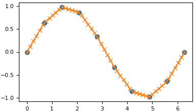
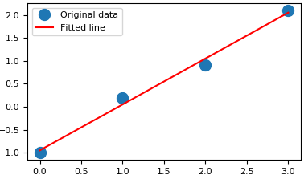

### argsort

&emsp;&emsp;`argsort`是`Numpy`模块中的函数：<!--more-->

``` python
>>> import numpy
>>> help(numpy.argsort)
Help on function argsort in module numpy.core.fromnumeric:
argsort(a, axis=-1, kind='quicksort', order=None): Returns the indices that would sort an array.
Perform an indirect sort along the given axis using the algorithm specified
by the `kind` keyword. It returns an array of indices of the same shape as
`a` that index data along the given axis in sorted order.
```

从中可以看出`argsort`函数返回的是数组值从小到大的索引值。

``` python
>>> x = np.array([3, 1, 2])  # One dimensional array(一维数组)
>>> np.argsort(x)
array([1, 2, 0])  # 即“1”在第1位，“2”在第2位，“3”在第0位
>>> x = np.array([[0, 3], [2, 2]])  # Two-dimensional array(二维数组)
>>> x
array([[0, 3],
       [2, 2]])
>>> np.argsort(x, axis=0)  # 按列排序
array([[0, 1],
       [1, 0]])
>>> np.argsort(x, axis=1)  # 按行排序
array([[0, 1],
       [0, 1]])
```

### numpy.delete

&emsp;&emsp;`numpy.delete(arr, obj, axis=None)`: Return a new array with `sub-arrays` along an `axis` deleted. For a one dimensional array, this returns those entries not returned by `arr[obj]`. Parameters:

- `arr`: `array_like`. Input array.
- `obj`: `slice`, `int` or `array of ints`. Indicate which `sub-arrays` to remove.
- `axis`: `int`, optional. The `axis` along which to delete the subarray defined by `obj`. If `axis` is `None`, `obj` is applied to the flattened array.

&emsp;&emsp;Returns:

- `out`: `ndarray`. A copy of `arr` with the elements specified by `obj` removed. Note that delete does not occur `in-place`. If `axis` is `None`, `out` is a flattened array.

&emsp;&emsp;**Notes**: Often it is preferable to use a `boolean` mask:

``` python
>>> mask = np.ones(len(arr), dtype=bool)
>>> mask[[0, 2, 4]] = False
>>> result = arr[mask, ...]
```

Is equivalent to `np.delete(arr, [0,2,4], axis=0)`, but allows further use of mask.

``` python
>>> arr = np.array([[1, 2, 3, 4], [5, 6, 7, 8], [9, 10, 11, 12]])
>>> arr
array([[ 1,  2,  3,  4],
       [ 5,  6,  7,  8],
       [ 9, 10, 11, 12]])
>>> np.delete(arr, 1, 0)
array([[ 1,  2,  3,  4],
       [ 9, 10, 11, 12]])
>>> np.delete(arr, np.s_[::2], 1)
array([[ 2,  4],
       [ 6,  8],
       [10, 12]])
>>> np.delete(arr, [1,3,5], None)
array([ 1,  3,  5,  7,  8,  9, 10, 11, 12])
```

### numpy.squeeze

&emsp;&emsp;`numpy.squeeze(a, axis=None)`: Remove `single-dimensional` entries from the shape of an array. Parameters:

- `a`: `array_like`. Input data.
- `axis`: `None` or `int` or `tuple of ints`, optional.

Selects a subset of the `single-dimensional` entries in the shape. If an `axis` is selected with shape entry greater than one, an error is raised.
&emsp;&emsp;Returns:

- `squeezed`: `ndarray`. The input array, but with all or a subset of the dimensions of length `1` removed. This is always `a` itself or a view into `a`.

&emsp;&emsp;Raises:

- `ValueError`. If `axis` is not `None`, and an axis being squeezed is not of length `1`.

``` python
>>> x = np.array([[[0], [1], [2]]])
>>> x.shape
(1, 3, 1)
>>> np.squeeze(x).shape
(3,)
>>> np.squeeze(x, axis=0).shape
(3, 1)
>>> np.squeeze(x, axis=1).shape
Traceback (most recent call last):
...
ValueError: cannot select an axis to squeeze out which has size not equal to one
>>> np.squeeze(x, axis=2).shape
(1, 3)
```

### numpy.maximum(与numpy.minimum相反)

&emsp;&emsp;`numpy.maximum(x1, x2, /, out=None, *, where=True, casting='same_kind', order='K', dtype=None, subok=True[, signature, extobj]) = <ufunc 'maximum'>`: Element-wise `maximum` of array elements.
&emsp;&emsp;Compare two arrays and returns a new array containing the `element-wise` maxima. If one of the elements being compared is a `NaN`, then that element is returned. If both elements are `NaNs`, then the first is returned. The latter distinction is important for complex `NaNs`, which are defined as at least one of the real or imaginary parts being a `NaN`. The net effect is that `NaNs` are propagated. Parameters:

- `x1, x2`: `array_like`. The arrays holding the elements to be compared. They must have the same shape, or shapes that can be broadcast to a single shape.
- `out`: `ndarray`, `None`, or `tuple of ndarray` and `None`, optional. A location into which the result is stored. If provided, it must have a shape that the inputs broadcast to. If not provided or `None`, a `freshly-allocated` array is returned. A tuple (possible only as a keyword argument) must have length equal to the number of outputs.
- `where`: `array_like`, optional. Values of `True` indicate to calculate the ufunc at that position, values of `False` indicate to leave the value in the output alone.

&emsp;&emsp;Returns:

- `y`: `ndarray` or `scalar`. The maximum of `x1` and `x2`, `element-wise`. Returns scalar if both `x1` and `x2` are scalars.

&emsp;&emsp;**Notes**: The `maximum` is equivalent to `np.where(x1 >= x2, x1, x2)` when neither `x1` nor `x2` are `nans`, but it is faster and does proper broadcasting.

``` python
>>> np.maximum([2, 3, 4], [1, 5, 2])
array([2, 5, 4])
>>> np.maximum(np.eye(2), [0.5, 2])  # broadcasting
array([[ 1. ,  2. ],
       [ 0.5,  2. ]])
>>> np.maximum([np.nan, 0, np.nan], [0, np.nan, np.nan])
array([ NaN,  NaN,  NaN])
>>> np.maximum(np.Inf, 1)
inf
```

### numpy.logical_not

&emsp;&emsp;`numpy.logical_not(x, /, out=None, *, where=True, casting='same_kind', order='K', dtype=None, subok=True[, signature, extobj]) = <ufunc 'logical_not'>`. Compute the truth value of `NOT x` element-wise. Parameters:

- `x`: `array_like`. Logical `NOT` is applied to the elements of `x`.
- `out`: `ndarray`, `None`, or `tuple of ndarray` and `None`, optional. A location into which the result is stored. If provided, it must have a shape that the inputs broadcast to. If not provided or `None`, a `freshly-allocated` array is returned. A tuple (possible only as a keyword argument) must have length equal to the number of outputs.
- `where`: `array_like`, optional. Values of `True` indicate to calculate the ufunc at that position, values of `False` indicate to leave the value in the output alone.

&emsp;&emsp;Returns:

- `y`: `bool` or `ndarray of bool`. `Boolean` result with the same shape as `x` of the `NOT` operation on elements of `x`.

``` python
>>> np.logical_not(3)
False
>>> np.logical_not([True, False, 0, 1])
array([False,  True,  True, False])
>>> x = np.arange(5)
>>> np.logical_not(x < 3)
array([False, False, False,  True,  True])
```

### numpy.logical_and

&emsp;&emsp;`numpy.logical_and(x1, x2, /, out=None, *, where=True, casting='same_kind', order='K', dtype=None, subok=True[, signature, extobj]) = <ufunc 'logical_and'>`. Compute the truth value of `x1 AND x2` element-wise. Parameters:

- `x1, x2`: `array_like`. Input arrays. `x1` and `x2` must be of the same shape.
- `out`: `ndarray`, `None`, or `tuple of ndarray` and `None`, optional. A location into which the result is stored. If provided, it must have a shape that the inputs broadcast to. If not provided or `None`, a `freshly-allocated` array is returned. A tuple (possible only as a keyword argument) must have length equal to the number of outputs.
- `where`: `array_like`, optional. Values of `True` indicate to calculate the ufunc at that position, values of `False` indicate to leave the value in the output alone.

&emsp;&emsp;Returns:

- `y`: `ndarray` or `bool`. `Boolean` result with the same shape as `x1` and `x2` of the logical `AND` operation on corresponding elements of `x1` and `x2`.

``` python
>>> np.logical_and(True, False)
False
>>> np.logical_and([True, False], [False, False])
array([False, False])
>>> x = np.arange(5)
>>> np.logical_and(x > 1, x < 4)
array([False, False,  True,  True, False])
```

### numpy.less

&emsp;&emsp;`numpy.less(x1, x2, /, out=None, *, where=True, casting='same_kind', order='K', dtype=None, subok=True[, signature, extobj]) = <ufunc 'less'>`. Return the truth value of (`x1 < x2`) element-wise. Parameters:

- `x1, x2`: `array_like`. Input arrays. If `x1.shape != x2.shape`, they must be broadcastable to a common shape (which may be the shape of one or the other).
- `out`: `ndarray`, `None`, or `tuple of ndarray` and `None`, optional. A location into which the result is stored. If provided, it must have a shape that the inputs broadcast to. If not provided or `None`, a `freshly-allocated` array is returned. A tuple (possible only as a keyword argument) must have length equal to the number of outputs.
- `where`: `array_like`, optional. Values of `True` indicate to calculate the ufunc at that position, values of `False` indicate to leave the value in the output alone.

&emsp;&emsp;Returns:

- `out`: `bool` or `ndarray of bool`. Array of bools, or a single bool if `x1` and `x2` are scalars.

``` python
>>> np.less([1, 2], [2, 2])
array([ True, False])
```

### concatenate

&emsp;&emsp;`np.concatenate`用于将数组拼接起来：

``` python
concatenate((a1, a2, ...), axis=0)
```

参数`a1`、`a2`等是需要拼接的矩阵，`axis`则是拼接的方向。

``` python
>>> a = np.array([[1, 2], [3, 4]])
>>> b = np.array([[5, 6]])
>>> np.concatenate((a, b), axis=0)
array([[1, 2],
       [3, 4],
       [5, 6]])
>>> np.concatenate((a, b.T), axis=1)
array([[1, 2, 5],
       [3, 4, 6]])
```

### numpy.ma.size

&emsp;&emsp;`numpy.ma.size(obj, axis=None)`: Return the number of elements along a given `axis`. Parameters:

- `a`: `array_like`. Input data.
- `axis`: `int`, optional. Axis along which the elements are counted. By default, give the total number of elements.

&emsp;&emsp;Returns:

- `element_count`: `int`. Number of elements along the specified `axis`.

``` python
>>> a = np.array([[1, 2, 3], [4, 5, 6]])
>>> np.size(a)
6
>>> np.size(a,1)
3
>>> np.size(a,0)
2
```

### numpy.empty

&emsp;&emsp;`numpy.empty(shape, dtype=float, order='C')`: Return a new array of given `shape` and `type`, without initializing entries. Parameters:

- `shape`: `int` or `tuple of int`. Shape of the empty array.
- `dtype`: `data-type`, optional. Desired output `data-type`.
- `order`: `{'C', 'F'}`, optional. Whether to store `multi-dimensional` data in `row-major` (`C-style`) or `column-major` (`Fortran-style`) order in memory.

&emsp;&emsp;Returns:

- `out`: `ndarray`. Array of uninitialized (arbitrary) data of the given `shape`, `dtype`, and `order`. Object arrays will be initialized to `None`.

&emsp;&emsp;**Notes**: empty, unlike `zeros`, does not set the array values to `zero`, and may therefore be marginally faster. On the other hand, it requires the user to manually set all the values in the array, and should be used with caution.

``` python
>>> np.empty([2, 2])
array([[ -9.74499359e+001,   6.69583040e-309],
       [  2.13182611e-314,   3.06959433e-309]])  # random
>>> np.empty([2, 2], dtype=int)
array([[-1073741821, -1067949133],
       [  496041986,    19249760]])  # random
```

### numpy.fliplr

&emsp;&emsp;`numpy.fliplr(m)`: Flip array in the `left/right` direction. Flip the entries in each row in the `left/right` direction. Columns are preserved, but appear in a different order than before. Parameters:

- `m`: `array_like`. Input array, must be at least `2-D`.

&emsp;&emsp;Returns:

- `f`: `ndarray`. A view of m with the columns reversed. Since a view is returned, this operation is `O(1)`.

&emsp;&emsp;**Notes**: Equivalent to `m[:, ::-1]`. Requires the array to be at least `2-D`.

``` python
>>> A = np.diag([1.,2.,3.])
>>> A
array([[ 1.,  0.,  0.],
       [ 0.,  2.,  0.],
       [ 0.,  0.,  3.]])
>>> np.fliplr(A)
array([[ 0.,  0.,  1.],
       [ 0.,  2.,  0.],
       [ 3.,  0.,  0.]])
>>> A = np.random.randn(2,3,5)
>>> np.all(np.fliplr(A) == A[:,::-1,...])
True
```

### histogram函数

&emsp;&emsp;`histogram`函数用于统计数据的频率分布，其参数为输入数组和`bin`。如果`bin`是一个`int`，它定义了在给定范围(默认为`10`)中等宽单元格的数量；如果`bin`是序列，则它定义了块边缘，包括最右边缘，允许非均匀的块宽度。

``` python
import numpy as np
a = np.array([22, 87, 5, 43, 56, 73, 55, 54, 11, 20, 51, 5, 79, 31, 27])
np.histogram(a, bins=[0, 20, 40, 60, 80, 100])
hist, bins = np.histogram(a, bins=[0, 20, 40, 60, 80, 100])
print(hist)
print(bins)
```

执行结果：

``` python
[3 4 5 2 1]
[  0  20  40  60  80 100]
```

### numpy.interp

&emsp;&emsp;`numpy.interp(x, xp, fp, left=None, right=None, period=None)`: `One-dimensional` linear interpolation(线性插值). Returns the `one-dimensional` piecewise linear interpolant to a function with given values at discrete `data-points`. Parameters:

- `x`: `array_like`. The `x-coordinates` of the interpolated values.
- `xp`: `1-D` sequence of `floats`. The `x-coordinates` of the data points, must be increasing if argument `period` is not specified. Otherwise, `xp` is internally sorted after normalizing the periodic boundaries with `xp = xp % period`.
- `fp`: `1-D` sequence of `float` or `complex`. The `y-coordinates` of the data points, same length as `xp`.
- `left`: optional `float` or `complex` corresponding to `fp`. Value to return for `x < xp[0]`, default is `fp[0]`.
- `right`: optional `float` or `complex` corresponding to `fp`. Value to return for `x > xp[-1]`, default is `fp[-1]`.
- `period`: `None` or `float`, optional. A period for the `x-coordinates`. This parameter allows the proper interpolation of angular `x-coordinates`. Parameters `left` and `right` are ignored if `period` is specified.

&emsp;&emsp;Returns:

- `y`: `float` or `complex` (corresponding to `fp`) or `ndarray`. The interpolated values, same shape as `x`.

&emsp;&emsp;Raises:

- `ValueError`:

1. If `xp` and `fp` have different length.
2. If `xp` or `fp` are not `1-D` sequences.
3. If `period == 0`.

&emsp;&emsp;**Notes**: Does not check that the `x-coordinate` sequence `xp` is increasing. If `xp` is not increasing, the results are nonsense. A simple check for increasing is:

``` python
np.all(np.diff(xp) > 0)
```

Examples:

``` python
>>> xp = [1, 2, 3]
>>> fp = [3, 2, 0]
>>> np.interp(2.5, xp, fp)
1.0
>>> np.interp([0, 1, 1.5, 2.72, 3.14], xp, fp)
array([ 3. ,  3. ,  2.5 ,  0.56,  0. ])
>>> UNDEF = -99.0
>>> np.interp(3.14, xp, fp, right=UNDEF)
-99.0
Plot an interpolant to the sine function:
>>> x = np.linspace(0, 2*np.pi, 10)
>>> y = np.sin(x)
>>> xvals = np.linspace(0, 2*np.pi, 50)
>>> yinterp = np.interp(xvals, x, y)
>>> import matplotlib.pyplot as plt
>>> plt.plot(x, y, 'o')
[<matplotlib.lines.Line2D object at 0x...>]
>>> plt.plot(xvals, yinterp, '-x')
[<matplotlib.lines.Line2D object at 0x...>]
>>> plt.show()
```



### ones_like(zeros_like)

&emsp;&emsp;该函数返回一个用`1`填充的，和输入数组形状和类型一致的数组：

``` python
>>> x = np.arange(6)
>>> x = x.reshape((2, 3))
>>> x
array([[0, 1, 2],
       [3, 4, 5]])
>>> np.ones_like(x)
array([[1, 1, 1],
       [1, 1, 1]])
>>>
>>> y = np.arange(3, dtype=np.float)
>>> y
array([ 0.,  1.,  2.])
>>> np.ones_like(y)
array([ 1.,  1.,  1.])
```

同理，`zeros_like`返回一个用`0`填充的，和输入数组形状和类型一样的数组。

### numpy.ceil

&emsp;&emsp;`numpy.ceil(x, /, out=None, *, where=True, casting='same_kind', order='K', dtype=None, subok=True[, signature, extobj]) = <ufunc 'ceil'>`: Return the ceiling of the input, `element-wise`. The ceil of the scalar `x` is the smallest integer `i`, such that `i >= x`. Parameters:

- `x`: `array_like`. Input data.
- `out`: `ndarray`, `None`, or `tuple of ndarray` and `None`, optional. A location into which the result is stored. If provided, it must have a shape that the inputs broadcast to. If not provided or `None`, a `freshly-allocated` array is returned. A tuple (possible only as a keyword argument) must have length equal to the number of outputs.
- `where`: `array_like`, optional. Values of `True` indicate to calculate the ufunc at that position, values of `False` indicate to leave the value in the output alone.

&emsp;&emsp;Returns:

- `y`: `ndarray` or `scalar`. The ceiling of each element in `x`, with `float` dtype.

``` python
>>> a = np.array([-1.7, -1.5, -0.2, 0.2, 1.5, 1.7, 2.0])
>>> np.ceil(a)
array([-1., -1., -0.,  1.,  2.,  2.,  2.])
```

### numpy.load

&emsp;&emsp;`numpy.load(file, mmap_mode=None, allow_pickle=True, fix_imports=True, encoding='ASCII')`: Load arrays or pickled objects from `.npy`, `.npz` or pickled files. Parameters:

- `file`: `file-like object`, `string`, or `pathlib.Path`. The `file` to read. `File-like objects` must support the `seek()` and `read()` methods. Pickled files require that the `file-like` object support the `readline()` method as well.
- `mmap_mode`: `{None, 'r+', 'r', 'w+', 'c'}`, optional. If not `None`, then `memory-map` the file, using the given mode (see `numpy.memmap` for a detailed description of the modes). A `memory-mapped` array is kept on disk. However, it can be accessed and sliced like any ndarray. Memory mapping is especially useful for accessing small fragments of large files without reading the entire file into memory.
- `allow_pickle`: `bool`, optional. Allow loading pickled object arrays stored in `npy` files. Reasons for disallowing pickles include security, as loading pickled data can execute arbitrary code. If pickles are disallowed, loading object arrays will fail.
- `fix_imports`: `bool`, optional. Only useful when loading `Python 2` generated pickled files on `Python 3`, which includes `npy/npz` files containing object arrays. If `fix_imports` is `True`, pickle will try to map the old `Python 2` names to the new names used in `Python 3`.
- `encoding`: `str`, optional. What `encoding` to use when reading `Python 2` strings. Only useful when loading `Python 2` generated pickled files in `Python 3`, which includes `npy/npz` files containing object arrays. Values other than `latin1`, `ASCII` and `bytes` are not allowed, as they can corrupt numerical data.

&emsp;&emsp;Returns:

- `result`: `array`, `tuple`, `dict`, etc. Data stored in the file. For `.npz` files, the returned instance of `NpzFile` class must be closed to avoid leaking file descriptors.

&emsp;&emsp;Raises:

- `IOError`: If the input file does not exist or cannot be read.
- `ValueError`: The file contains an object array, but `allow_pickle=False` given.

&emsp;&emsp;**Notes**:

1. If the file contains pickle data, then whatever object is stored in the pickle is returned.
2. If the file is a `.npy` file, then a single array is returned.
3. If the file is a `.npz` file, then a `dictionary-like` object is returned, containing `{filename: array}` `key-value` pairs, one for each file in the archive.
4. If the file is a `.npz` file, the returned value supports the context manager protocol in a similar fashion to the open function:

``` python
with load('foo.npz') as data:
    a = data['a']
```

The underlying file descriptor is closed when exiting the `with` block.
&emsp;&emsp;Examples: Store data to disk, and load it again:

``` python
>>> np.save('/tmp/123', np.array([[1, 2, 3], [4, 5, 6]]))
>>> np.load('/tmp/123.npy')
array([[1, 2, 3],
       [4, 5, 6]])
```

Store compressed data to disk, and load it again:

``` python
>>> a = np.array([[1, 2, 3], [4, 5, 6]])
>>> b = np.array([1, 2])
>>> np.savez('/tmp/123.npz', a=a, b=b)
>>> data = np.load('/tmp/123.npz')
>>> data['a']
array([[1, 2, 3],
       [4, 5, 6]])
>>> data['b']
array([1, 2])
>>> data.close()
```

`Mem-map` the stored array, and then access the second row directly from disk:

``` python
>>> X = np.load('/tmp/123.npy', mmap_mode='r')
>>> X[1, :]
memmap([4, 5, 6])
```

### numpy.power

&emsp;&emsp;`numpy.power(x1, x2, /, out=None, *, where=True, casting='same_kind', order='K', dtype=None, subok=True[, signature, extobj]) = <ufunc 'power'>`: First array elements raised to powers from second array, `element-wise`. Raise each base in `x1` to the `positionally-corresponding` power in `x2`. `x1` and `x2` must be broadcastable to the same shape. Note that an integer type raised to a negative integer power will raise a `ValueError`. Parameters:

- `x1`: `array_like`. The bases.
- `x2`: `array_like`. The exponents.
- `out`: `ndarray`, `None`, or `tuple of ndarray` and `None`, optional. A location into which the result is stored. If provided, it must have a shape that the inputs broadcast to. If not provided or `None`, a `freshly-allocated` array is returned. A tuple (possible only as a keyword argument) must have length equal to the number of outputs.
- `where`: `array_like`, optional. Values of `True` indicate to calculate the ufunc at that position, values of `False` indicate to leave the value in the output alone.

&emsp;&emsp;Returns:

- `y`: `ndarray`. The bases in `x1` raised to the exponents in `x2`.

&emsp;&emsp;Examples: Cube each element in a list.

``` python
>>> x1 = range(6)
>>> x1
[0, 1, 2, 3, 4, 5]
>>> np.power(x1, 3)
array([  0,   1,   8,  27,  64, 125])
Raise the bases to different exponents:
>>> x2 = [1.0, 2.0, 3.0, 3.0, 2.0, 1.0]
>>> np.power(x1, x2)
array([  0.,   1.,   8.,  27.,  16.,   5.])
The effect of broadcasting:
>>> x2 = np.array([[1, 2, 3, 3, 2, 1], [1, 2, 3, 3, 2, 1]])
>>> x2
array([[1, 2, 3, 3, 2, 1],
       [1, 2, 3, 3, 2, 1]])
>>> np.power(x1, x2)
array([[ 0,  1,  8, 27, 16,  5],
       [ 0,  1,  8, 27, 16,  5]])
```

### numpy.fix

&emsp;&emsp;`numpy.fix(x, out=None, **kwargs)`: Round to nearest integer towards `zero`. Round an array of floats `element-wise` to nearest integer towards `zero`. The rounded values are returned as `floats`. Parameters:

- `x`: `array_like`. An array of `floats` to be rounded.
- `y`: `ndarray`, optional. Output array.

&emsp;&emsp;Returns:

- `out`: `ndarray` of `floats`. The array of rounded numbers.

``` python
>>> np.fix(3.14)
3.0
>>> np.fix(3)
3.0
>>> np.fix([2.1, 2.9, -2.1, -2.9])
array([ 2.,  2., -2., -2.])
```

### numpy.transpose(矩阵转置)

&emsp;&emsp;`numpy.transpose(a, axes=None)`: Permute the dimensions of an array. Parameters:

- `a`: `array_like`. Input array.
- `axes`: list of `ints`, optional. By default, reverse the dimensions, otherwise permute the `axes` according to the values given.

&emsp;&emsp;Returns:

- `p`: `ndarray`. `a` with its `axes` permuted. A view is returned whenever possible.

&emsp;&emsp;**Notes**: `Use transpose(a, argsort(axes))` to invert the transposition of tensors when using the `axes` keyword argument. Transposing a `1-D` array returns an unchanged view of the original array.

``` python
>>> x = np.arange(4).reshape((2,2))
>>> x
array([[0, 1],
       [2, 3]])
>>> np.transpose(x)
array([[0, 2],
       [1, 3]])
>>> x = np.ones((1, 2, 3))
>>> np.transpose(x, (1, 0, 2)).shape
(2, 1, 3)
```

### numpy.argwhere

&emsp;&emsp;`numpy.argwhere(a)`: Find the indices of array elements that are `non-zero`, grouped by element. Parameters:

- `a`: `array_like`. Input data.

&emsp;&emsp;Returns:

- `index_array`: `ndarray`. Indices of elements that are `non-zero`. Indices are grouped by element.

&emsp;&emsp;**Notes**: `np.argwhere(a)` is the same as `np.transpose(np.nonzero(a))`. The output of argwhere is not suitable for indexing arrays. For this purpose use `nonzero(a)` instead.

``` python
>>> x = np.arange(6).reshape(2,3)
>>> x
array([[0, 1, 2],
       [3, 4, 5]])
>>> np.argwhere(x>1)
array([[0, 2],
       [1, 0],
       [1, 1],
       [1, 2]])
```

### numpy.prod

&emsp;&emsp;`numpy.prod(a, axis=None, dtype=None, out=None, keepdims=<class 'numpy._globals._NoValue'>)`: Return the product(乘积) of array elements over a given `axis`. Parameters:

- `a`: `array_like`. Input data.
- `axis`: `None` or `int` or `tuple of ints`, optional. Axis or axes along which a product is performed. The default, `axis=None`, will calculate the product of all the elements in the input array. If `axis` is negative, it counts from the last to the first axis. If `axis` is a `tuple of ints`, a product is performed on all of the axes specified in the tuple instead of a single axis or all the axes as before.
- `dtype`: `dtype`, optional. The type of the returned array, as well as of the accumulator in which the elements are multiplied. The `dtype` of `a` is used by default unless `a` has an integer `dtype` of less precision than the default platform integer. In that case, if `a` is signed, then the platform integer is used while if `a` is unsigned, then an unsigned integer of the same precision as the platform integer is used.
- `out`: `ndarray`, optional. Alternative output array in which to place the result. It must have the same shape as the expected output, but the type of the output values will be cast if necessary.
- `keepdims`: `bool`, optional. If this is set to `True`, the axes which are reduced are left in the result as dimensions with size `one`. With this option, the result will broadcast correctly against the input array. If the default value is passed, then `keepdims` will not be passed through to the prod method of `sub-classes` of `ndarray`, however any non-default value will be. If the sub-classes sum method does not implement `keepdims` any exceptions will be raised.

&emsp;&emsp;Returns:

- `product_along_axis`: `ndarray`, see `dtype` parameter above. An array shaped as `a` but with the specified `axis` removed. Returns a reference to `out` if specified.

&emsp;&emsp;**Notes**: Arithmetic is modular when using integer types, and no error is raised on overflow. That means that, on a `32-bit` platform:

``` python
>>> x = np.array([536870910, 536870910, 536870910, 536870910])
>>> np.prod(x)  # random
16
```

The product of an empty array is the neutral element `1`:

``` python
>>> np.prod([])
1.0
```

&emsp;&emsp;Examples: By default, calculate the product of all elements:

``` python
>>> np.prod([1., 2.])
2.0
```

Even when the input array is `two-dimensional`:

``` python
>>> np.prod([[1., 2.],[3., 4.]])
24.0
```

But we can also specify the `axis` over which to multiply:

``` python
>>> np.prod([[1., 2.],[3., 4.]], axis=1)
array([  2.,  12.])
```

If the type of `x` is unsigned, then the output type is the unsigned platform integer:

``` python
>>> x = np.array([1, 2, 3], dtype=np.uint8)
>>> np.prod(x).dtype == np.uint
True
```

If `x` is of a signed integer type, then the output type is the default platform integer:

``` python
>>> x = np.array([1, 2, 3], dtype=np.int8)
>>> np.prod(x).dtype == int
True
```

### numpy.testing.assert_almost_equal

&emsp;&emsp;`numpy.testing.assert_almost_equal(actual, desired, decimal=7, err_msg='', verbose=True)`: Raises an `AssertionError` if two items are not equal up to `desired` precision.
&emsp;&emsp;Note: It is recommended to use one of `assert_allclose`, `assert_array_almost_equal_nulp` or `assert_array_max_ulp` instead of this function for more consistent floating point comparisons.
&emsp;&emsp;The test verifies that the elements of `actual` and `desired` satisfy:

``` python
abs(desired - actual) < 1.5 * 10**(-decimal)
```

&emsp;&emsp;That is a looser test than originally documented, but agrees with what the actual implementation in `assert_array_almost_equal` did up to rounding vagaries. An exception is raised at conflicting values. For ndarrays this delegates to `assert_array_almost_equal`. Parameters:

- `actual`: `array_like`. The object to check.
- `desired`: `array_like`. The expected object.
- `decimal`: `int`, optional. Desired precision.
- `err_msg`: `str`, optional. The error message to be printed in case of failure.
- `verbose`: `bool`, optional. If `True`, the conflicting values are appended to the error message.

&emsp;&emsp;Raises:

- `AssertionError`. If `actual` and `desired` are not equal up to specified precision.

``` python
>>> import numpy.testing as npt
>>> npt.assert_almost_equal(2.3333333333333, 2.33333334)
>>> npt.assert_almost_equal(2.3333333333333, 2.33333334, decimal=10)
<type 'exceptions.AssertionError'>:
Items are not equal:
 ACTUAL: 2.3333333333333002
 DESIRED: 2.3333333399999998
>>> npt.assert_almost_equal(np.array([1.0,2.3333333333333]), np.array([1.0,2.33333334]), decimal=9)
<type 'exceptions.AssertionError'>:
Arrays are not almost equal
(mismatch 50.0%)
 x: array([ 1.        ,  2.33333333])
 y: array([ 1.        ,  2.33333334])
```

### numpy.roll

&emsp;&emsp;`numpy.roll(a, shift, axis=None)`: Roll(滚动) array elements along `a` given `axis`. Elements that roll beyond the last position are `re-introduced` at the first. Parameters:

- `a`: `array_like`. Input array.
- `shift`: `int` or `tuple of ints`. The number of places by which elements are shifted. If a tuple, then `axis` must be a tuple of the same size, and each of the given axes is shifted by the corresponding number. If an `int` while `axis` is a `tuple of ints`, then the same value is used for all given axes.
- `axis`: `int` or `tuple of ints`, optional. Axis or axes along which elements are shifted. By default, the array is flattened before shifting, after which the original shape is restored.

&emsp;&emsp;Returns:

- `res`: `ndarray`. Output array, with the same shape as `a`.

&emsp;&emsp;**Notes**: Supports rolling over multiple dimensions simultaneously.

``` python
>>> x = np.arange(10)
>>> np.roll(x, 2)
array([8, 9, 0, 1, 2, 3, 4, 5, 6, 7])
>>> x2 = np.reshape(x, (2,5))
>>> x2
array([[0, 1, 2, 3, 4],
       [5, 6, 7, 8, 9]])
>>> np.roll(x2, 1)
array([[9, 0, 1, 2, 3],
       [4, 5, 6, 7, 8]])
>>> np.roll(x2, 1, axis=0)
array([[5, 6, 7, 8, 9],
       [0, 1, 2, 3, 4]])
>>> np.roll(x2, 1, axis=1)
array([[4, 0, 1, 2, 3],
       [9, 5, 6, 7, 8]])
```

### numpy.outer

&emsp;&emsp;`numpy.outer(a, b, out=None)`: Compute the outer product of two vectors. Given two vectors, `a = [a0, a1, ..., aM]` and `b = [b0, b1, ..., bN]`, the outer product is:

``` python
[[a0 * b0  a0 * b1 ... a0 * bN]
 [a1 * b0     .
 [ ...           .
 [aM * b0              aM * bN]]
```

Parameters:

- `a`: `(M,) array_like`. First input vector. Input is flattened if not already `1-dimensional`.
- `b`: `(N,) array_like`. Second input vector. Input is flattened if not already `1-dimensional`.
- `out`: `(M, N)` `ndarray`, optional. A location where the result is stored.

&emsp;&emsp;Returns:

- `out`: `(M, N)` ndarray. `out[i, j] = a[i] * b[j]`

&emsp;&emsp;Examples: Make a (very coarse) grid for computing a `Mandelbrot` set:

``` python
>>> rl = np.outer(np.ones((5,)), np.linspace(-2, 2, 5))
>>> rl
array([[-2., -1.,  0.,  1.,  2.],
       [-2., -1.,  0.,  1.,  2.],
       [-2., -1.,  0.,  1.,  2.],
       [-2., -1.,  0.,  1.,  2.],
       [-2., -1.,  0.,  1.,  2.]])
>>> im = np.outer(1j * np.linspace(2, -2, 5), np.ones((5,)))
>>> im
array([[ 0.+2.j,  0.+2.j,  0.+2.j,  0.+2.j,  0.+2.j],
       [ 0.+1.j,  0.+1.j,  0.+1.j,  0.+1.j,  0.+1.j],
       [ 0.+0.j,  0.+0.j,  0.+0.j,  0.+0.j,  0.+0.j],
       [ 0.-1.j,  0.-1.j,  0.-1.j,  0.-1.j,  0.-1.j],
       [ 0.-2.j,  0.-2.j,  0.-2.j,  0.-2.j,  0.-2.j]])
>>> grid = rl + im
>>> grid
array([[-2.+2.j, -1.+2.j,  0.+2.j,  1.+2.j,  2.+2.j],
       [-2.+1.j, -1.+1.j,  0.+1.j,  1.+1.j,  2.+1.j],
       [-2.+0.j, -1.+0.j,  0.+0.j,  1.+0.j,  2.+0.j],
       [-2.-1.j, -1.-1.j,  0.-1.j,  1.-1.j,  2.-1.j],
       [-2.-2.j, -1.-2.j,  0.-2.j,  1.-2.j,  2.-2.j]])
```

An example using a `vector` of letters:

``` python
>>> x = np.array(['a', 'b', 'c'], dtype=object)
>>> np.outer(x, [1, 2, 3])
array([[a, aa, aaa],
       [b, bb, bbb],
       [c, cc, ccc]], dtype=object)
```

### numpy.frombuffer

&emsp;&emsp;`numpy.frombuffer(buffer, dtype=float, count=-1, offset=0)`: Interpret a `buffer` as a `1-dimensional` array. Parameters:

- `buffer`: `buffer_like`. An object that exposes the buffer interface.
- `dtype`: `data-type`, optional. `Data-type` of the returned array.
- `count`: `int`, optional. Number of items to read. `-1` means all data in the buffer.
- `offset`: `int`, optional. Start reading the buffer from this `offset` (in `bytes`).

**Notes**: If the `buffer` has data that is not in machine `byte-order`, this should be specified as part of the `data-type`:

``` python
>>> dt = np.dtype(int)
>>> dt = dt.newbyteorder('>')
>>> np.frombuffer(buf, dtype=dt)
```

The data of the resulting array will not be byteswapped, but will be interpreted correctly.

``` python
>>> s = 'hello world'
>>> np.frombuffer(s, dtype='S1', count=5, offset=6)
array(['w', 'o', 'r', 'l', 'd'], dtype='|S1')
>>> np.frombuffer(b'\x01\x02', dtype=np.uint8)
array([1, 2], dtype=uint8)
>>> np.frombuffer(b'\x01\x02\x03\x04\x05', dtype=np.uint8, count=3)
array([1, 2, 3], dtype=uint8)
```

### numpy.ndarray

&emsp;&emsp;`class numpy.ndarray`: An array object represents a multidimensional, homogeneous array of `fixed-size` items. An associated `data-type` object describes the format of each element in the array (its `byte-order`, how many bytes it occupies in memory, whether it is an integer, a floating point number, or something else, etc.)
&emsp;&emsp;Arrays should be constructed using `array`, `zeros` or `empty`. The parameters given here refer to a `low-level` method (`ndarray(...)`) for instantiating an array.
&emsp;&emsp;Parameters:

- `shape`: `tuple of ints`. Shape of created array.
- `dtype`: `data-type`, optional. Any object that can be interpreted as a numpy data type.
- `buffer`: object exposing buffer interface, optional. Used to fill the array with data.
- `offset`: `int`, optional. Offset of array data in `buffer`.
- `strides`: `tuple of ints`, optional. Strides of data in memory.
- `order`: `{'C', 'F'}`, optional. `Row-major` (`C-style`) or `column-major` (`Fortran-style`) order.

**Notes**: There are two modes of creating an array using `__new__`:

1. If `buffer` is `None`, then only `shape`, `dtype` and `order` are used.
2. If `buffer` is an object exposing the buffer interface, then all keywords are interpreted.

No `__init__` method is needed because the array is fully initialized after the `__new__` method.
&emsp;&emsp;Examples: These examples illustrate the `low-level` ndarray constructor. First mode, buffer is `None`:

``` python
>>> np.ndarray(shape=(2,2), dtype=float, order='F')
array([[ -1.13698227e+002,   4.25087011e-303],
       [  2.88528414e-306,   3.27025015e-309]])  # random
```

Second mode:

``` python
>>> # offset = 1 * itemsize, i.e. skip first element
>>> np.ndarray((2,), buffer=np.array([1,2,3]), offset=np.int_().itemsize, dtype=int)
array([2, 3])
```

### numpy.isnan

&emsp;&emsp;`numpy.isnan(x, /, out=None, *, where=True, casting='same_kind', order='K', dtype=None, subok=True[, signature, extobj]) = <ufunc 'isnan'>`: Test `element-wise` for `NaN` and return result as a `boolean` array. Parameters:

- `x`: `array_like`. Input array.
- `out`: `ndarray`, `None`, or `tuple of ndarray` and `None`, optional. A location into which the result is stored. If provided, it must have a shape that the inputs broadcast to. If not provided or `None`, a `freshly-allocated` array is returned. A tuple (possible only as a keyword argument) must have length equal to the number of outputs.
- `where`: `array_like`, optional. Values of `True` indicate to calculate the ufunc at that position, values of `False` indicate to leave the value in the output alone.

&emsp;&emsp;Returns:

- `y`: `ndarray` or `bool`. For scalar input, the result is a new `boolean` with value `True` if the input is `NaN`; otherwise the value is `False`. For array input, the result is a `boolean` array of the same dimensions as the input and the values are `True` if the corresponding element of the input is `NaN`; otherwise the values are `False`.

&emsp;&emsp;**Notes**: `NumPy` uses the `IEEE Standard for Binary Floating-Point for Arithmetic`. This means that `Not a Number` is not equivalent to `infinity`.

``` python
>>> np.isnan(np.nan)
True
>>> np.isnan(np.inf)
False
>>> np.isnan([np.log(-1.),1.,np.log(0)])
array([ True, False, False])
```

### numpy.linalg.lstsq(最小二乘法)

&emsp;&emsp;`numpy.linalg.lstsq(a, b, rcond='warn')`: Return the `least-squares` solution to a linear matrix equation.
&emsp;&emsp;Solves the equation `a x = b` by computing a vector `x` that minimizes the Euclidean 2-norm `|| b - a x ||^2`. The equation may be `under-`, `well-`, or `over-` determined (i.e., the number of linearly independent rows of `a` can be less than, equal to, or greater than its number of linearly independent columns). If `a` is square and of full rank, then `x` (but for `round-off` error) is the `exact` solution of the equation. Parameters:

- `a`: `(M, N) array_like`. `Coefficient` matrix.
- `b`: `{(M,), (M, K)} array_like`. Ordinate or `dependent variable` values. If `b` is `two-dimensional`, the `least-squares` solution is calculated for each of the `K` columns of `b`.
- `rcond`: `float`, optional. `Cut-off` ratio for small singular values of `a`. For the purposes of rank determination, singular values are treated as `zero` if they are smaller than `rcond` times the largest singular value of `a`. Changed in `version 1.14.0`: If not set, a `FutureWarning` is given. The previous default of `-1` will use the machine precision as `rcond` parameter, the new default will use the machine precision times `max(M, N)`. To silence the warning and use the new default, use `rcond=None`, to keep using the old behavior, use `rcond=-1`.

&emsp;&emsp;Returns:

- `x`: `{(N,), (N, K)} ndarray`. `Least-squares` solution. If `b` is `two-dimensional`, the solutions are in the `K` columns of `x`.
- `residuals`: `{(1,), (K,), (0,)} ndarray`. Sums of residuals; squared `Euclidean 2-norm` for each column in `b - a * x`. If the rank of `a` is `< N` or `M <= N`, this is an empty array. If `b` is `1-dimensional`, this is a `(1,)` shape array. Otherwise the shape is `(K,)`.
- `rank`: `int`. Rank of matrix `a`.
- `s`: `(min(M, N),) ndarray`. Singular values of `a`.

&emsp;&emsp;Raises:

- `LinAlgError`: If computation does not converge.

**Notes**: If `b` is a matrix, then all array results are returned as matrices.
&emsp;&emsp;Examples: Fit a line, `y = mx + c`, through some noisy data-points:

``` python
>>> x = np.array([0, 1, 2, 3])
>>> y = np.array([-1, 0.2, 0.9, 2.1])
```

By examining the coefficients, we see that the line should have a gradient of roughly `1` and cut the `y-axis` at, more or less, `-1`.
&emsp;&emsp;We can rewrite the line equation as `y = Ap`, where `A = [[x 1]]` and `p = [[m], [c]]`. Now use lstsq to solve for `p`:

``` python
>>> A = np.vstack([x, np.ones(len(x))]).T
>>> A
array([[ 0.,  1.],
       [ 1.,  1.],
       [ 2.,  1.],
       [ 3.,  1.]])
>>> m, c = np.linalg.lstsq(A, y)[0]
>>> print(m, c)
1.0 -0.95
```

Plot the data along with the fitted line:

``` python
>>> import matplotlib.pyplot as plt
>>> plt.plot(x, y, 'o', label='Original data', markersize=10)
>>> plt.plot(x, m*x + c, 'r', label='Fitted line')
>>> plt.legend()
>>> plt.show()
```



### numpy.linalg.qr(QR分解)

&emsp;&emsp;`numpy.linalg.qr(a, mode='reduced')`: Compute the `qr` factorization of a matrix. Factor the matrix `a` as `qr`, where `q` is orthonormal and `r` is `upper-triangular`. Parameters:

- `a`: `array_like`, shape `(M, N)`. Matrix to be factored.
- `mode`: `{"reduced", "complete", "r", "raw", "full", "economic"}`, optional. If `K = min(M, N)`, then

1. `reduced`: returns `q`, `r` with dimensions `(M, K)`, `(K, N)`.
2. `complete`: returns `q`, `r` with dimensions `(M, M)`, `(M, N)`.
3. `r`: returns `r` only with dimensions `(K, N)`.
4. `raw`: returns `h`, `tau` with dimensions `(N, M)`, `(K,)`.
5. `full`: alias of `reduced`, deprecated.
6. `economic`: returns `h` from `raw`, deprecated.

The default is `reduced`, and to maintain backward compatibility with earlier versions of numpy both it and the old default `full` can be omitted. Note that array `h` returned in `raw` mode is transposed for calling `Fortran`. The `economic` mode is deprecated. The modes `full` and `economic` may be passed using only the first letter for backwards compatibility, but all others must be spelled out.
&emsp;&emsp;Returns:

- `q`: `ndarray` of `float` or `complex`, optional. A matrix with orthonormal columns. When `mode = "complete"`, the result is an orthogonal/unitary matrix depending on whether or not `a` is real/complex. The determinant may be either `+/- 1` in that case.
- `r`: `ndarray` of `float` or `complex`, optional. The `upper-triangular` matrix.
- `(h, tau)`: `ndarrays` of `np.double` or `np.cdouble`, optional. The array `h` contains the `Householder` reflectors that generate `q` along with `r`. The `tau` array contains scaling factors for the reflectors. In the deprecated `economic` mode only `h` is returned.

&emsp;&emsp;Raises:

- `LinAlgError`. If factoring fails.

&emsp;&emsp;**Notes**: This is an interface to the `LAPACK` routines `dgeqrf`, `zgeqrf`, `dorgqr` and `zungqr`. For more information on the `qr` factorization, see for example: `http://en.wikipedia.org/wiki/QR_factorization`.
&emsp;&emsp;Subclasses of ndarray are preserved except for the `raw` mode. So if `a` is of type matrix, all the return values will be matrices too.
&emsp;&emsp;New `reduced`, `complete` and `raw` options for mode were added in `NumPy 1.8.0` and the old option `full` was made an alias of `reduced`. In addition the options `full` and `economic` were deprecated. Because `full` was the previous default and `reduced` is the new default, backward compatibility can be maintained by letting mode default. The `raw` option was added so that `LAPACK` routines that can multiply arrays by `q` using the `Householder` reflectors can be used. Note that in this case the returned arrays are of type `np.double` or `np.cdouble` and the `h` array is transposed to be `FORTRAN` compatible. No routines using the `raw` return are currently exposed by numpy, but some are available in `lapack_lite` and just await the necessary work.

``` python
>>> a = np.random.randn(9, 6)
>>> q, r = np.linalg.qr(a)
>>> np.allclose(a, np.dot(q, r))  # a does equal qr
True
>>> r2 = np.linalg.qr(a, mode='r')
>>> r3 = np.linalg.qr(a, mode='economic')
>>> np.allclose(r, r2)  # mode='r' returns the same r as mode='full'
True
>>> # But only triu parts are guaranteed equal when mode='economic'
>>> np.allclose(r, np.triu(r3[:6,:6], k=0))
True
```

&emsp;&emsp;Example illustrating a common use of `qr`: solving of least squares problems.
&emsp;&emsp;What are the least-squares-best `m` and `y0` in `y = y0 + mx` for the following data: `{(0, 1), (1, 0), (1, 2), (2, 1)}`. (Graph the points and you'll see that it should be `y0 = 0`, `m = 1`.) The answer is provided by solving the `over-determined` matrix equation `Ax = b`, where:

``` python
A = array([[0, 1], [1, 1], [1, 1], [2, 1]])
x = array([[y0], [m]])
b = array([[1], [0], [2], [1]])
```

&emsp;&emsp;If `A = qr` such that `q` is orthonormal (which is always possible via `Gram-Schmidt`), then `x = inv(r) * (q.T) * b`. (In numpy practice, however, we simply use `lstsq`.)

``` python
>>> A = np.array([[0, 1], [1, 1], [1, 1], [2, 1]])
>>> A
array([[0, 1],
       [1, 1],
       [1, 1],
       [2, 1]])
>>> b = np.array([1, 0, 2, 1])
>>> q, r = LA.qr(A)
>>> p = np.dot(q.T, b)
>>> np.dot(LA.inv(r), p)
array([  1.1e-16,   1.0e+00])
```

使用示例如下：

``` python
import numpy as np

def main():
    A = np.random.rand(2, 2)  # 2*2の行列Aを生成
    Q, R = np.linalg.qr(A)  # 行列AをQR分解
    # 結果を表示
    print("A = \n" + str(A))
    print("Q = \n" + str(Q))
    print("R = \n" + str(R))
    print("Q * R = \n" + str(Q.dot(R)))

if __name__ == '__main__':
    main()
```

### numpy.sign

&emsp;&emsp;`numpy.sign(x, /, out=None, *, where=True, casting='same_kind', order='K', dtype=None, subok=True[, signature, extobj]) = <ufunc 'sign'>`: Returns an `element-wise` indication of the sign of a number.
&emsp;&emsp;The sign function returns `-1` if `x < 0`, `0` if `x == 0`, `1` if `x > 0`. `nan` is returned for `nan` inputs. For `complex` inputs, the sign function returns `sign(x.real) + 0j` if `x.real != 0` else `sign(x.imag) + 0j`. `complex(nan, 0)` is returned for `complex nan` inputs. Parameters:

- `x`: `array_like`. Input values.
- `out`: `ndarray`, `None`, or `tuple of ndarray` and `None`, optional. A location into which the result is stored. If provided, it must have a shape that the inputs broadcast to. If not provided or `None`, a `freshly-allocated` array is returned. A tuple (possible only as a keyword argument) must have length equal to the number of outputs.
- `where`: `array_like`, optional. Values of `True` indicate to calculate the ufunc at that position, values of `False` indicate to leave the value in the output alone.

&emsp;&emsp;Returns:

- `y`: `ndarray`. The sign of `x`.

&emsp;&emsp;**Notes**: There is more than one definition of sign in common use for `complex` numbers. The definition used here is equivalent to $\frac{x}{\sqrt{x * x}}$ which is different from a common alternative, $\frac{x}{\left | x \right |}$.

``` python
>>> np.sign([-5., 4.5])
array([-1.,  1.])
>>> np.sign(0)
0
>>> np.sign(5 - 2j)
(1+0j)
```

### numpy.cross

&emsp;&emsp;`numpy.cross(a, b, axisa=-1, axisb=-1, axisc=-1, axis=None)`: Return the cross product of two (arrays of) vectors.
&emsp;&emsp;The cross product of `a` and `b` in `R^3` is a vector perpendicular to both `a` and `b`. If `a` and `b` are arrays of vectors, the vectors are defined by the last axis of `a` and `b` by default, and these axes can have dimensions `2` or `3`. Where the dimension of either `a` or `b` is `2`, the third component of the input vector is assumed to be `zero` and the cross product calculated accordingly. In cases where both input vectors have dimension `2`, the `z-component` of the cross product is returned.
&emsp;&emsp;Parameters:

- `a`: `array_like`. Components of the first vector(s).
- `b`: `array_like`. Components of the second vector(s).
- `axisa`: `int`, optional. Axis of `a` that defines the vector(s). By default, the last axis.
- `axisb`: `int`, optional. Axis of `b` that defines the vector(s). By default, the last axis.
- `axisc`: `int`, optional. Axis of `c` containing the cross product vector(s). Ignored if both input vectors have dimension `2`, as the return is scalar. By default, the last axis.
- `axis`: `int`, optional. If defined, the axis of `a`, `b` and `c` that defines the vector(s) and cross product(s). Overrides `axisa`, `axisb` and `axisc`.

&emsp;&emsp;Returns:

- `c`: `ndarray`. Vector cross product(s).

&emsp;&emsp;Raises:

- `ValueError`. When the dimension of the vector(s) in `a` and/or `b` does not equal `2` or `3`.

&emsp;&emsp;**Notes**: Supports full broadcasting of the inputs.
&emsp;&emsp;Examples: Vector `cross-product`:

``` python
>>> x = [1, 2, 3]
>>> y = [4, 5, 6]
>>> np.cross(x, y)
array([-3,  6, -3])
```

One vector with dimension `2`:

``` python
>>> x = [1, 2]
>>> y = [4, 5, 6]
>>> np.cross(x, y)
array([12, -6, -3])
```

Equivalently:

``` python
>>> x = [1, 2, 0]
>>> y = [4, 5, 6]
>>> np.cross(x, y)
array([12, -6, -3])
```

Both vectors with dimension `2`:

``` python
>>> x = [1, 2]
>>> y = [4, 5]
>>> np.cross(x, y)
-3
```

Multiple vector `cross-products`. Note that the direction of the cross product vector is defined by the `right-hand` rule:

``` python
>>> x = np.array([[1, 2, 3], [4, 5, 6]])
>>> y = np.array([[4, 5, 6], [1, 2, 3]])
>>> np.cross(x, y)
array([[-3,  6, -3],
       [ 3, -6,  3]])
```

The orientation of `c` can be changed using the `axisc` keyword:

``` python
>>> np.cross(x, y, axisc=0)
array([[-3,  3],
       [ 6, -6],
       [-3,  3]])
```

Change the vector definition of `x` and `y` using `axisa` and `axisb`:

``` python
>>> x = np.array([[1, 2, 3], [4, 5, 6], [7, 8, 9]])
>>> y = np.array([[7, 8, 9], [4, 5, 6], [1, 2, 3]])
>>> np.cross(x, y)
array([[ -6,  12,  -6],
       [  0,   0,   0],
       [  6, -12,   6]])
>>> np.cross(x, y, axisa=0, axisb=0)
array([[-24,  48, -24],
       [-30,  60, -30],
       [-36,  72, -36]])
```

### numpy.ndarray.flatten

&emsp;&emsp;`ndarray.flatten(order='C')`: Return a copy of the array collapsed into one dimension. Parameters:

- `order`: `{"C", "F", "A", "K"}`, optional.

1. `C` means to flatten in `row-major` (`C-style`) order.
2. `F` means to flatten in `column-major` (`Fortran- style`) order.
3. `A` means to flatten in `column-major` order if `a` is Fortran contiguous in memory, `row-major` order otherwise.
4. `K` means to flatten `a` in the order the elements occur in memory.

&emsp;&emsp;Returns:

- `y`: `ndarray`. A copy of the input array, flattened to one dimension.

``` python
>>> a = np.array([[1, 2], [3, 4]])
>>> a.flatten()
array([1, 2, 3, 4])
>>> a.flatten('F')
array([1, 3, 2, 4])
```

### numpy中matrix和array的区别

&emsp;&emsp;`Numpy`的`matrices`必须是`2`维的，但是`arrays`(或`ndarrays`)可以是多维的。`matrix`是`array`的一个小的分支，所以`matrix`拥有`array`的所有特性。
&emsp;&emsp;在`numpy`中，`matrix`的主要优势是可以使用相对简单的乘法运算符号。例如`a`和`b`是两个`matrices`，那么`a * b`就是矩阵积：

``` python
import numpy as np

a = np.mat('4 3; 2 1')
b = np.mat('1 2; 3 4')
print(a)
print("-------")
print(b)
print("-------")
print(a * b)
```

执行结果：

``` python
[[4 3]
 [2 1]]
-------
[[1 2]
 [3 4]]
-------
[[13 20]
 [ 5  8]]
```

`matrix`和`array`都可以通过`objects`后面加`.T`得到其转置，但是`matrix`的`objects`还可以在后面加`.H`得到共轭矩阵，加`.I`得到逆矩阵。
&emsp;&emsp;`numpy`中的`arrays`则是逐个元素的运算，所以`c`和`d`的`c * d`运算相当于`matlab`里面的`c.*d`运算：

``` python
import numpy as np

c = np.array([[4, 3], [2, 1]])
d = np.array([[1, 2], [3, 4]])
print(c * d)
```

执行结果：

``` python
[[4 6]
 [6 4]]
```

而矩阵相乘则需要使用`numpy`的`dot`命令：

``` python
print(np.dot(c, d))
```

`**`运算符的作用也不一样：

``` python
import numpy as np

a = np.mat('4 3; 2 1')
c = np.array([[4, 3], [2, 1]])
print(a ** 2)
print("--------")
print(c ** 2)
```

执行结果：

``` python
[[22 15]
 [10  7]]
--------
[[16  9]
 [ 4  1]]
```

因为`a`是个`matrix`，所以`a**2`返回的是`a*a`，相当于矩阵相乘。而`c`是`array`，`c**2`相当于`c`中的元素逐个求平方。

### numpy.matrix

&emsp;&emsp;`class numpy.matrix(data, dtype=None, copy=True)`: Returns a matrix from an `array-like` object, or from a string of `data`. A matrix is a specialized `2-D` array that retains its `2-D` nature through operations. It has certain special operators, such as `*` (matrix multiplication) and `**` (matrix power). Parameters:

- `data`: `array_like` or `string`. If `data` is a `string`, it is interpreted as a matrix with commas or spaces separating columns, and semicolons separating rows.
- `dtype`: `data-type`. `Data-type` of the output matrix.
- `copy`: `bool`. If `data` is already an `ndarray`, then this flag determines whether the `data` is copied (the default), or whether a view is constructed.

``` python
>>> a = np.matrix('1 2; 3 4')
>>> print(a)
[[1 2]
 [3 4]]
>>> np.matrix([[1, 2], [3, 4]])
matrix([[1, 2],
        [3, 4]])
```

### numpy.matrix.getA

&emsp;&emsp;`matrix.getA()`: Return self as an ndarray object. Equivalent to `np.asarray(self)`.

``` python
>>> x = np.matrix(np.arange(12).reshape((3, 4))); x
matrix([[ 0,  1,  2,  3],
        [ 4,  5,  6,  7],
        [ 8,  9, 10, 11]])
>>> x.getA()
array([[ 0,  1,  2,  3],
       [ 4,  5,  6,  7],
       [ 8,  9, 10, 11]])
```

### numpy.ndarray.tolist

&emsp;&emsp;Return a copy of the array data as a (nested) `Python` list. Data items are converted to the nearest compatible `Python` type.
&emsp;&emsp;Returns: The possibly nested list of array elements.
&emsp;&emsp;**Notes**: The array may be recreated, `a = np.array(a.tolist())`.

``` python
>>> a = np.array([1, 2])
>>> a.tolist()
[1, 2]
>>> a = np.array([[1, 2], [3, 4]])
>>> list(a)
[array([1, 2]), array([3, 4])]
>>> a.tolist()
[[1, 2], [3, 4]]
```

### numpy.reshape

&emsp;&emsp;`numpy.reshape(a, newshape, order='C')`: Gives a new shape to an array without changing its data. Parameters:

- `a`: `array_like`. Array to be reshaped.
- `newshape`: `int` or `tuple of ints`. The new shape should be compatible with the original shape. If an integer, then the result will be a `1-D` array of that length. One shape dimension can be `-1`. In this case, the value is inferred from the length of the array and remaining dimensions.
- `order`: `{'C', 'F', 'A'}`, optional. Read the elements of `a` using this index `order`, and place the elements into the reshaped array using this index `order`.

1. `C` means to read/write the elements using `C-like` index order, with the last axis index changing fastest, back to the first axis index changing slowest.
2. `F` means to read/write the elements using `Fortran-like` index order, with the first index changing fastest, and the last index changing slowest.
3. `A` means to read/write the elements in `Fortran-like` index order if `a` is `Fortran` contiguous in memory, `C-like` order otherwise.

Note that the `C` and `F` options take no account of the memory layout of the underlying array, and only refer to the order of indexing.
&emsp;&emsp;Returns:

- `reshaped_array`: `ndarray`. This will be a new view object if possible; otherwise, it will be a copy. Note there is no guarantee of the memory layout (`C-` or `Fortran-` contiguous) of the returned array.

&emsp;&emsp;**Notes**: It is not always possible to change the shape of an array without copying the data. If you want an error to be raised when the data is copied, you should assign the new shape to the shape attribute of the array:

``` python
>>> a = np.zeros((10, 2))
>>> b = a.T  # A transpose makes the array non-contiguous
>>> # Taking a view makes it possible to modify the shape without modifying the initial object
>>> c = b.view()
>>> c.shape = (20)
AttributeError: incompatible shape for a non-contiguous array
```

The `order` keyword gives the index ordering both for fetching the values from `a`, and then placing the values into the output array. For example, let's say you have an array:

``` python
>>> a = np.arange(6).reshape((3, 2))
>>> a
array([[0, 1],
       [2, 3],
       [4, 5]])
```

You can think of reshaping as first raveling the array (using the given index `order`), then inserting the elements from the raveled array into the new array using the same kind of index ordering as was used for the raveling.

``` python
>>> np.reshape(a, (2, 3))  # C-like index ordering
array([[0, 1, 2],
       [3, 4, 5]])
>>> np.reshape(np.ravel(a), (2, 3))  # equivalent to C ravel then C reshape
array([[0, 1, 2],
       [3, 4, 5]])
>>> np.reshape(a, (2, 3), order='F')  # Fortran-like index ordering
array([[0, 4, 3],
       [2, 1, 5]])
>>> np.reshape(np.ravel(a, order='F'), (2, 3), order='F')
array([[0, 4, 3],
       [2, 1, 5]])
```

&emsp;&emsp;Examples:

``` python
>>> a = np.array([[1, 2, 3], [4, 5, 6]])
>>> np.reshape(a, 6)
array([1, 2, 3, 4, 5, 6])
>>> np.reshape(a, 6, order='F')
array([1, 4, 2, 5, 3, 6])
>>> np.reshape(a, (3, -1))  # the unspecified value is inferred to be 2
array([[1, 2],
       [3, 4],
       [5, 6]])
```

### numpy.ndarray.T

&emsp;&emsp;Same as `self.transpose()`, except that self is returned if `self.ndim < 2`.

``` python
>>> x = np.array([[1.,2.],[3.,4.]])
>>> x
array([[ 1.,  2.],
       [ 3.,  4.]])
>>> x.T
array([[ 1.,  3.],
       [ 2.,  4.]])
>>> x = np.array([1., 2., 3., 4.])
>>> x
array([ 1.,  2.,  3.,  4.])
>>> x.T
array([ 1.,  2.,  3.,  4.])
```

### numpy.ndarray.sort

&emsp;&emsp;`ndarray.sort(axis=-1, kind='quicksort', order=None)`: Sort an array, `in-place`. Parameters:

- `axis`: `int`, optional. Axis along which to sort. Default is `-1`, which means sort along the last axis.
- `kind`: `{'quicksort', 'mergesort', 'heapsort'}`, optional. Sorting algorithm.
- `order`: `str` or `list of str`, optional. When `a` is an array with fields defined, this argument specifies which fields to compare first, second, etc. A single field can be specified as a `string`, and not all fields need be specified, but unspecified fields will still be used, in the order in which they come up in the dtype, to break ties.

``` python
>>> a = np.array([[1, 4], [3, 1]])
>>> a.sort(axis=1)
>>> a
array([[1, 4],
       [1, 3]])
>>> a.sort(axis=0)
>>> a
array([[1, 3],
       [1, 4]])
```

Use the `order` keyword to specify a field to use when sorting a structured array:

``` python
>>> a = np.array([('a', 2), ('c', 1)], dtype=[('x', 'S1'), ('y', int)])
>>> a.sort(order='y')
>>> a
array([('c', 1), ('a', 2)],
      dtype=[('x', '|S1'), ('y', '<i4')])
```

### corrcoef函数

&emsp;&emsp;相关系数是用来反映变量之间相关关系密切程度的统计指标。相关系数也可以看成协方差：一种剔除了两个变量量纲影响、标准化后的特殊协方差。它消除了两个变量变化幅度的影响，而只是单纯地反应两个变量每单位变化时的相似程度：

\begin{aligned}
r = \frac{Cov(X,Y)}{\sqrt{\partial_{x}} \sqrt{\partial_{y}}}
\end{aligned}

$\partial_{x}$和$\partial_{y}$表示$X$、$Y$的方差，并且$|r| ≤ 1$。

``` python
import numpy as np

a = np.array([1, 2, 3])
b = np.array([2, 5, 8])
x = np.vstack((a, b))
print(np.corrcoef(a, b))
print("--------")
print(np.corrcoef(x))
```

执行结果：

``` python
[[1. 1.]
 [1. 1.]]
--------
[[1. 1.]
 [1. 1.]]
```

### numpy.var

&emsp;&emsp;`numpy.var(a, axis=None, dtype=None, out=None, ddof=0, keepdims=<class 'numpy._globals._NoValue'>)`: Compute the variance along the specified `axis`. Returns the variance of the array elements, a measure of the spread of a distribution. The variance is computed for the flattened array by default, otherwise over the specified `axis`. Parameters:

- `a`: `array_like`. Array containing numbers whose variance is desired. If `a` is not an array, a conversion is attempted.
- `axis`: `None` or `int` or `tuple of ints`, optional. Axis or axes along which the variance is computed. The default is to compute the variance of the flattened array. If this is a `tuple of ints`, a variance is performed over multiple axes, instead of a single axis or all the axes as before.
- `dtype`: `data-type`, optional. Type to use in computing the variance. For arrays of integer type the default is `float32`; for arrays of `float` types it is the same as the array type.
- `out`: `ndarray`, optional. Alternate output array in which to place the result. It must have the same shape as the expected output, but the type is cast if necessary.
- `ddof`: `int`, optional. `Delta Degrees of Freedom`: the divisor used in the calculation is `N - ddof`, where `N` represents the number of elements.
- `keepdims`: `bool`, optional. If this is set to `True`, the axes which are reduced are left in the result as dimensions with size one. With this option, the result will broadcast correctly against the input array. If the default value is passed, then `keepdims` will not be passed through to the var method of `sub-classes` of `ndarray`, however any `non-default` value will be. If the `sub-classes` sum method does not implement `keepdims` any exceptions will be raised.

&emsp;&emsp;Returns:

- `variance`: `ndarray`, see `dtype` parameter above. If `out=None`, returns a new array containing the variance; otherwise, a reference to the output array is returned.

&emsp;&emsp;**Notes**: The variance is the average of the squared deviations from the mean, i.e., `var = mean(abs(x - x.mean())**2)`.
&emsp;&emsp;The mean is normally calculated as `x.sum() / N`, where `N = len(x)`. If, however, `ddof` is specified, the divisor `N - ddof` is used instead. In standard statistical practice, `ddof = 1` provides an unbiased estimator of the variance of a hypothetical infinite population. `ddof = 0` provides a maximum likelihood estimate of the variance for normally distributed variables.
&emsp;&emsp;Note that for `complex` numbers, the absolute value is taken before squaring, so that the result is always `real` and `nonnegative`.
&emsp;&emsp;For `floating-point` input, the variance is computed using the same precision the input has. Depending on the input data, this can cause the results to be inaccurate, especially for `float32`. Specifying a `higher-accuracy` accumulator using the `dtype` keyword can alleviate this issue.

``` python
>>> a = np.array([[1, 2], [3, 4]])
>>> np.var(a)
1.25
>>> np.var(a, axis=0)
array([ 1.,  1.])
>>> np.var(a, axis=1)
array([ 0.25,  0.25])
```

In single precision, `var()` can be inaccurate:

``` python
>>> a = np.zeros((2, 512*512), dtype=np.float32)
>>> a[0, :] = 1.0
>>> a[1, :] = 0.1
>>> np.var(a)
0.20250003
```

Computing the variance in `float64` is more accurate:

``` python
>>> np.var(a, dtype=np.float64)
0.20249999932944759
>>> ((1 - 0.55)**2 + (0.1 - 0.55)**2)/2
0.2025
```