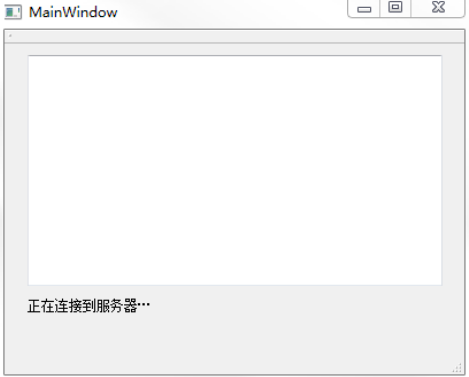
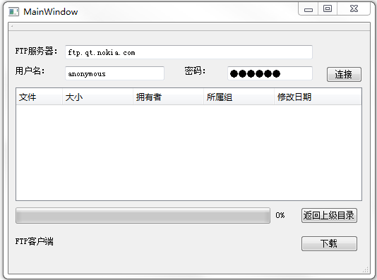

### Ftp文件阅读器(匿名登录)

&emsp;&emsp;`mainwindow.h`如下：<!--more-->

``` cpp
#ifndef MAINWINDOW_H
#define MAINWINDOW_H

#include <QMainWindow>
class QFtp;

namespace Ui {
    class MainWindow;
}

class MainWindow : public QMainWindow {
    Q_OBJECT
public:
    explicit MainWindow ( QWidget *parent = 0 );
    ~MainWindow();
private:
    Ui::MainWindow *ui;
    QFtp *ftp;
private slots:
    void ftpCommandStarted ( int );
    void ftpCommandFinished ( int, bool );
};

#endif // MAINWINDOW_H
```

&emsp;&emsp;`mainwindow.cpp`如下：

``` cpp
#include "mainwindow.h"
#include "ui_mainwindow.h"
#include <QFtp>

MainWindow::MainWindow ( QWidget *parent ) : QMainWindow ( parent ), ui ( new Ui::MainWindow ) {
    ui->setupUi ( this );
    ftp = new QFtp ( this );
    ftp->connectToHost ( "ftp.qt.nokia.com" );
    ftp->login();
    ftp->cd ( "qt" );
    ftp->get ( "INSTALL" );
    ftp->close();
    connect ( ftp, SIGNAL ( commandStarted ( int ) ), this, SLOT ( ftpCommandStarted ( int ) ) );
    connect ( ftp, SIGNAL ( commandFinished ( int, bool ) ), this, SLOT ( ftpCommandFinished ( int, bool ) ) );
}

MainWindow::~MainWindow() {
    delete ui;
}

void MainWindow::ftpCommandStarted ( int ) {
    int id = ftp->currentCommand();

    switch ( id ) {
        case QFtp::ConnectToHost :
            ui->label->setText ( tr ( "正在连接到服务器…" ) );
            break;
        case QFtp::Login :
            ui->label->setText ( tr ( "正在登录…" ) );
            break;
        case QFtp::Get :
            ui->label->setText ( tr ( "正在下载…" ) );
            break;
        case QFtp::Close :
            ui->label->setText ( tr ( "正在关闭连接…" ) );
    }
}

void MainWindow::ftpCommandFinished ( int, bool error ) {
    if ( ftp->currentCommand() == QFtp::ConnectToHost ) {
        if ( error ) {
            ui->label->setText ( tr ( "连接服务器出现错误：%1" ).arg ( ftp->errorString() ) );
        } else {
            ui->label->setText ( tr ( "连接到服务器成功" ) );
        }
    } else if ( ftp->currentCommand() == QFtp::Login ) {
        if ( error ) {
            ui->label->setText ( tr ( "登录出现错误：%1" ).arg ( ftp->errorString() ) );
        } else {
            ui->label->setText ( tr ( "登录成功" ) );
        }
    } else if ( ftp->currentCommand() == QFtp::Get ) {
        if ( error ) {
            ui->label->setText ( tr ( "下载出现错误：%1" ).arg ( ftp->errorString() ) );
        } else {
            ui->label->setText ( tr ( "已经完成下载" ) );
            ui->textBrowser->setText ( ftp->readAll() );
        }
    } else if ( ftp->currentCommand() == QFtp::Close ) {
        ui->label->setText ( tr ( "已经关闭连接" ) );
    }
}
```



---

### ftp文件下载器(密码登录)

&emsp;&emsp;`mainwindow.h`如下：

``` cpp
#ifndef MAINWINDOW_H
#define MAINWINDOW_H

#include <QMainWindow>
class QFtp;
#include <QHash>
class QFile;
class QUrlInfo;
class QTreeWidgetItem;

namespace Ui {
    class MainWindow;
}

class MainWindow : public QMainWindow {
    Q_OBJECT
public:
    explicit MainWindow ( QWidget *parent = 0 );
    ~MainWindow();
private:
    Ui::MainWindow *ui;
    QFtp *ftp;
    QHash<QString, bool> isDirectory; /* 用来存储一个路径是否为目录的信息 */
    QString currentPath; /* 用来存储现在的路径 */
    QFile *file; /* 用来表示下载的文件 */
private slots:
    void ftpCommandStarted ( int );
    void ftpCommandFinished ( int, bool );
    void updateDataTransferProgress ( qint64, qint64 ); /* 更新进度条 */
    void addToList ( const QUrlInfo &urlInfo ); /* 将服务器上的文件添加到“Tree Widget”部件中 */
    void processItem ( QTreeWidgetItem *, int ); /* 双击一个目录时显示其内容 */
    void on_connectButton_clicked();
    void on_cdToParentButton_clicked();
    void on_downloadButton_clicked();
};

#endif // MAINWINDOW_H
```

&emsp;&emsp;`mainwindow.cpp`如下：

``` cpp
#include "mainwindow.h"
#include "ui_mainwindow.h"
#include <QFtp>
#include <QFile>
#include <QTreeWidgetItem>

MainWindow::MainWindow ( QWidget *parent ) : QMainWindow ( parent ), ui ( new Ui::MainWindow ) {
    ui->setupUi ( this );
    ui->progressBar->setValue ( 0 );
    connect ( ui->fileList, SIGNAL ( itemActivated ( QTreeWidgetItem *, int ) ), \
              this, SLOT ( processItem ( QTreeWidgetItem *, int ) ) );
}

MainWindow::~MainWindow() {
    delete ui;
}

void MainWindow::ftpCommandStarted ( int ) {
    int id = ftp->currentCommand();

    switch ( id ) {
        case QFtp::ConnectToHost : ui->label->setText ( tr ( "正在连接到服务器..." ) ); break;
        case QFtp::Login         : ui->label->setText ( tr ( "正在登录..." ) );        break;
        case QFtp::Get           : ui->label->setText ( tr ( "正在下载..." ) );        break;
        case QFtp::Close         : ui->label->setText ( tr ( "正在关闭连接..." ) );
    }
}

void MainWindow::ftpCommandFinished ( int, bool error ) {
    if ( ftp->currentCommand() == QFtp::ConnectToHost ) {
        if ( error ) {
            ui->label->setText ( tr ( "连接服务器出现错误：%1" ).arg ( ftp->errorString() ) );
        } else {
            ui->label->setText ( tr ( "连接到服务器成功" ) );
        }
    } else if ( ftp->currentCommand() == QFtp::Login ) {
        if ( error ) {
            ui->label->setText ( tr ( "登录出现错误：%1" ).arg ( ftp->errorString() ) );
        } else {
            ui->label->setText ( tr ( "登录成功" ) );
            ftp->list();
        }
    } else if ( ftp->currentCommand() == QFtp::Get ) {
        if ( error ) {
            ui->label->setText ( tr ( "下载出现错误：%1" ).arg ( ftp->errorString() ) );
        } else {
            ui->label->setText ( tr ( "已经完成下载" ) );
            file->close();
        }

        ui->downloadButton->setEnabled ( true );
    } else if ( ftp->currentCommand() == QFtp::List ) {
        if ( isDirectory.isEmpty() ) {
            ui->fileList->addTopLevelItem ( new QTreeWidgetItem ( QStringList() << tr ( "<empty>" ) ) );
            ui->fileList->setEnabled ( false );
            ui->label->setText ( tr ( "该目录为空" ) );
        }
    } else if ( ftp->currentCommand() == QFtp::Close ) {
        ui->label->setText ( tr ( "已经关闭连接" ) );
    }
}

void MainWindow::on_connectButton_clicked() { /* 连接按钮 */
    ui->fileList->clear();
    currentPath.clear();
    isDirectory.clear();
    ftp = new QFtp ( this );
    connect ( ftp, SIGNAL ( commandStarted ( int ) ), this, SLOT ( ftpCommandStarted ( int ) ) );
    connect ( ftp, SIGNAL ( commandFinished ( int, bool ) ), this, SLOT ( ftpCommandFinished ( int, bool ) ) );
    connect ( ftp, SIGNAL ( listInfo ( QUrlInfo ) ), this, SLOT ( addToList ( QUrlInfo ) ) );
    connect ( ftp, SIGNAL ( dataTransferProgress ( qint64, qint64 ) ), \
              this, SLOT ( updateDataTransferProgress ( qint64, qint64 ) ) );
    QString ftpServer = ui->ftpServerLineEdit->text();
    QString userName = ui->userNameLineEdit->text();
    QString passWord = ui->passWordLineEdit->text();
    ftp->connectToHost ( ftpServer, 21 );
    ftp->login ( userName, passWord );
}

void MainWindow::addToList ( const QUrlInfo &urlInfo ) {
    QTreeWidgetItem *item = new QTreeWidgetItem;
    item->setText ( 0, urlInfo.name() );
    item->setText ( 1, QString::number ( urlInfo.size() ) );
    item->setText ( 2, urlInfo.owner() );
    item->setText ( 3, urlInfo.group() );
    item->setText ( 4, urlInfo.lastModified().toString ( "MMM dd yyyy" ) );
    QPixmap pixmap ( urlInfo.isDir() ? "../myFTP/dir.png" : "../myFTP/file.png" );
    item->setIcon ( 0, pixmap );
    isDirectory[urlInfo.name()] = urlInfo.isDir();
    ui->fileList->addTopLevelItem ( item );

    if ( !ui->fileList->currentItem() ) {
        ui->fileList->setCurrentItem ( ui->fileList->topLevelItem ( 0 ) );
        ui->fileList->setEnabled ( true );
    }
}

void MainWindow::processItem ( QTreeWidgetItem *item, int ) {
    QString name = item->text ( 0 );

    /* 如果这个文件是个目录，则打开 */
    if ( isDirectory.value ( name ) ) {
        ui->fileList->clear();
        isDirectory.clear();
        currentPath += "/";
        currentPath += name;
        ftp->cd ( name );
        ftp->list();
        ui->cdToParentButton->setEnabled ( true );
    }
}

void MainWindow::on_cdToParentButton_clicked() { /* 返回上级目录按钮 */
    ui->fileList->clear();
    isDirectory.clear();
    currentPath = currentPath.left ( currentPath.lastIndexOf ( '/' ) );

    if ( currentPath.isEmpty() ) {
        ui->cdToParentButton->setEnabled ( false );
        ftp->cd ( "/" );
    } else {
        ftp->cd ( currentPath );
    }

    ftp->list();
}

void MainWindow::on_downloadButton_clicked() { /* 下载按钮 */
    QString fileName = ui->fileList->currentItem()->text ( 0 );
    file = new QFile ( fileName );

    if ( !file->open ( QIODevice::WriteOnly ) ) {
        delete file;
        return;
    }

    ui->downloadButton->setEnabled ( false );
    ftp->get ( ui->fileList->currentItem()->text ( 0 ), file );
}

void MainWindow::updateDataTransferProgress ( qint64 readBytes, qint64 totalBytes ) {
    ui->progressBar->setMaximum ( totalBytes );
    ui->progressBar->setValue ( readBytes );
}
```

