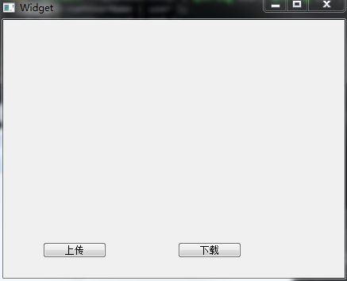

&emsp;&emsp;在此实现的`FTP`包括两个类，一个是界面类，一个是`Ftp`实现的类。<!--more-->
&emsp;&emsp;`client.h`如下：

``` cpp
#ifndef CLIENT_H
#define CLIENT_H

#include <QFile>
#include <QNetworkAccessManager>
#include <QUrl>
#include <QNetworkReply>
#include <QByteArray>
#include <QFileInfo>
#include <QDir>

class FtpCLient: public QObject {
    Q_OBJECT
protected slots:
    void finished ( QNetworkReply *reply );
public:
    FtpCLient();
    void FtpGet ( QString sor, QString dev );
    void FtpPut ( QString source, QString dev );
    void FtpSetUserInfor ( QString user, QString pwd );
    void FtpSetHostPort ( QString str, int port = 21 );
private:
    QFile *m_pFile;
    QNetworkReply *m_pReply;
    QNetworkAccessManager *m_pManager;
    QUrl *m_pUrl;
    bool is_down = true; /* 判断是否为下载选项 */
};

#endif // CLIENT_H
```

&emsp;&emsp;`client.cpp`如下：

``` cpp
#include "client.h"

FtpCLient::FtpCLient() {
    m_pManager = new QNetworkAccessManager();
    m_pUrl = new QUrl();
    m_pUrl->setScheme ( "ftp" );
    connect ( m_pManager, SIGNAL ( finished ( QNetworkReply * ) ), \
              this, SLOT ( finished ( QNetworkReply * ) ) );
}

void FtpCLient::finished ( QNetworkReply *reply ) {
    if ( is_down == true ) { /* 如果是下载选项，则关闭打开的文件 */
        m_pFile->write ( reply->readAll() );
        m_pFile->flush();
        m_pFile->close();
    }

    reply->deleteLater();
}

/* 设置FTP服务器用户名和密码 */
void FtpCLient::FtpSetUserInfor ( QString user, QString pwd ) {
    m_pUrl->setUserName ( user );
    m_pUrl->setPassword ( pwd );
}

/* 设置地址和端口 */
void FtpCLient::FtpSetHostPort ( QString str, int port ) {
    m_pUrl->setHost ( str );
    m_pUrl->setPort ( port );
}

/* 下载文件 */
void FtpCLient::FtpGet ( QString sor, QString dev ) {
    is_down = true; /* 该选项是下载选项 */
    QFileInfo info;
    info.setFile ( dev );
    m_pFile = new QFile ( info.filePath() );
    m_pFile->open ( QIODevice::WriteOnly );
    m_pUrl->setPath ( sor );
    m_pReply = m_pManager->get ( QNetworkRequest ( *m_pUrl ) );
}

/* 上传文件 */
void FtpCLient::FtpPut ( QString source, QString dev ) {
    is_down = false; /* 该选项是上传选项 */
    QFile file ( source );
    file.open ( QIODevice::ReadOnly );
    QByteArray data = file.readAll();
    m_pUrl->setPath ( dev );
    m_pManager->put ( QNetworkRequest ( *m_pUrl ), data );
}
```

&emsp;&emsp;`widget.h`如下：

``` cpp
#ifndef WIDGET_H
#define WIDGET_H

#include <QWidget>
#include <client.h>

namespace Ui {
    class Widget;
}

class Widget : public QWidget {
    Q_OBJECT
public:
    explicit Widget ( QWidget *parent = 0 );
    ~Widget();
private:
    Ui::Widget *ui;
    FtpCLient client;
private slots:
    void on_up_clicked();
    void on_down_clicked();
};

#endif // WIDGET_H
```

&emsp;&emsp;`widget.cpp`如下：

``` cpp
#include "widget.h"
#include "ui_widget.h"

Widget::Widget ( QWidget *parent ) : QWidget ( parent ), ui ( new Ui::Widget ) {
    ui->setupUi ( this );
    client.FtpSetUserInfor ( "fukangwei", "171720" ); /* 填充ftp服务器的用户名和密码 */
    client.FtpSetHostPort ( "192.168.1.109", 21 ); /* 填充ftp服务器的ip地址和端口号 */
}

Widget::~Widget() {
    delete ui;
}

void Widget::on_up_clicked() {
    /* 将文件hello中的内容上传至服务器的hello.c文件中 */
    client.FtpPut ( "hello", "./hello.c" );
}

void Widget::on_down_clicked() {
    /* 将下载内容复制到hello.c文件 */
    client.FtpGet ( "./test/little", "hello.c" );
}
```

&emsp;&emsp;`main.cpp`如下：

``` cpp
#include "widget.h"
#include <QApplication>
#include <QTextCodec>

int main ( int argc, char *argv[] ) {
    QApplication a ( argc, argv );
    /* 指定字符集为UTF-8 */
    QTextCodec::setCodecForTr ( QTextCodec::codecForName("UTF-8") );
    Widget w;
    w.show();
    return a.exec();
}
```

