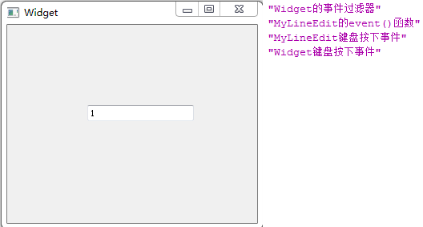
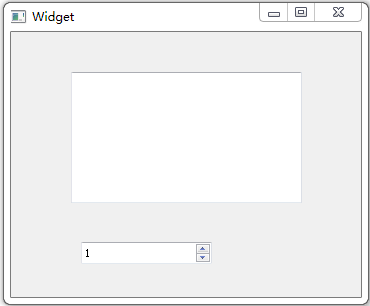

### 事件过滤器

&emsp;&emsp;`mylineedit.h`如下：<!--more-->

``` cpp
#ifndef MYLINEEDIT_H
#define MYLINEEDIT_H

#include <QLineEdit>

class MyLineEdit : public QLineEdit {
    Q_OBJECT
public:
    explicit MyLineEdit ( QWidget *parent = 0 );
    bool event ( QEvent *event );
protected:
    void keyPressEvent ( QKeyEvent *event );
signals:
public slots:
};

#endif // MYLINEEDIT_H
```

&emsp;&emsp;`widget.h`如下：

``` cpp
#ifndef WIDGET_H
#define WIDGET_H

#include <QWidget>

namespace Ui {
    class Widget;
}

class MyLineEdit;

class Widget : public QWidget {
    Q_OBJECT
public:
    explicit Widget ( QWidget *parent = 0 );
    ~Widget();
    bool eventFilter ( QObject *obj, QEvent *event );
protected:
    void keyPressEvent ( QKeyEvent *event );
private:
    Ui::Widget *ui;
    MyLineEdit *lineEdit;
};

#endif // WIDGET_H
```

&emsp;&emsp;`widget.cpp`如下：

``` cpp
#include "widget.h"
#include "ui_widget.h"
#include "mylineedit.h"
#include <QKeyEvent>
#include <QDebug>

Widget::Widget ( QWidget *parent ) : QWidget ( parent ), ui ( new Ui::Widget ) {
    ui->setupUi ( this );
    lineEdit = new MyLineEdit ( this );
    lineEdit->move ( 100, 100 );
    lineEdit->installEventFilter ( this ); /* 在Widget上为lineEdit安装事件过滤器 */
}

Widget::~Widget() {
    delete ui;
}

void Widget::keyPressEvent ( QKeyEvent *event ) {
    qDebug() << tr ( "Widget键盘按下事件" );
}

bool Widget::eventFilter ( QObject *obj, QEvent *event ) { /* 事件过滤器 */
    if ( obj == lineEdit ) { /* 如果是lineEdit部件上的事件 */
        if ( event->type() == QEvent::KeyPress ) {
            qDebug() << tr ( "Widget的事件过滤器" );
        }
    }

    return QWidget::eventFilter ( obj, event );
}
```

&emsp;&emsp;`mylineedit.cpp`如下：

``` cpp
#include "mylineedit.h"
#include <QKeyEvent>
#include <QDebug>

MyLineEdit::MyLineEdit ( QWidget *parent ) : QLineEdit ( parent ) {
}

void MyLineEdit::keyPressEvent ( QKeyEvent *event ) { /* 键盘按下事件 */
    qDebug() << tr ( "MyLineEdit键盘按下事件" );
    QLineEdit::keyPressEvent ( event ); /* 执行QLineEdit类的默认事件处理 */
    event->ignore(); /* 忽略该事件 */
}

bool MyLineEdit::event ( QEvent *event ) { /* 事件 */
    if ( event->type() == QEvent::KeyPress ) {
        qDebug() << tr ( "MyLineEdit的event()函数" );
    }

    return QLineEdit::event ( event ); /* 执行QLineEdit类event函数的默认操作 */
}
```



&emsp;&emsp;在事件过滤器中，先判断该事件的对象是不是`lineEdit`，如果是，再判断事件类型。最后返回了`QWidget`类默认的事件过滤器的执行结果。
&emsp;&emsp;可以看到，事件的传递顺序是这样的：先是事件过滤器，然后是该部件的`event`函数，最后是该部件的事件处理函数。这里还要注意，`event`和事件处理函数是在该部件内进行重新定义的，而事件过滤器却是在该部件的父部件中进行定义的。

---

### 事件过滤器与事件的发送

&emsp;&emsp;`widget.h`如下：

``` cpp
#ifndef WIDGET_H
#define WIDGET_H

#include <QWidget>

namespace Ui {
    class Widget;
}

class Widget : public QWidget {
    Q_OBJECT
public:
    explicit Widget ( QWidget *parent = 0 );
    ~Widget();
    bool eventFilter ( QObject *obj, QEvent *event );
private:
    Ui::Widget *ui;
};

#endif // WIDGET_H
```

&emsp;&emsp;`widget.cpp`如下：

``` cpp
#include "widget.h"
#include "ui_widget.h"
#include <QKeyEvent>
#include <QWheelEvent>

Widget::Widget ( QWidget *parent ) : QWidget ( parent ), ui ( new Ui::Widget ) {
    ui->setupUi ( this );
    ui->textEdit->installEventFilter ( this ); /* 为编辑器部件在本窗口上安装事件过滤器 */
    ui->spinBox->installEventFilter ( this );
    QKeyEvent myEvent ( QEvent::KeyPress, Qt::Key_Up, Qt::NoModifier );
    // qApp->sendEvent( ui->spinBox, &myEvent ); /* 发送键盘事件到spinBox部件 */
    QApplication::sendEvent ( ui->spinBox, &myEvent );
}

Widget::~Widget() {
    delete ui;
}

bool Widget::eventFilter ( QObject *obj, QEvent *event ) { /* 事件过滤器 */
    if ( obj == ui->textEdit ) { /* 判断部件 */
        if ( event->type() == QEvent::Wheel ) { /* 判断事件 */
            /* 将event强制转换为发生的事件的类型 */
            QWheelEvent *wheelEvent = static_cast<QWheelEvent *> ( event );

            if ( wheelEvent->delta() > 0 ) {
                ui->textEdit->zoomIn();
            } else {
                ui->textEdit->zoomOut();
            }

            return true; /* 该事件已经被处理 */
        } else {
            return false; /* 如果是其他事件，可以进行进一步的处理 */
        }
    } else if ( obj == ui->spinBox ) {
        if ( event->type() == QEvent::KeyPress ) {
            QKeyEvent *keyEvent = static_cast<QKeyEvent *> ( event );

            if ( keyEvent->key() == Qt::Key_Space ) {
                ui->spinBox->setValue ( 0 );
                return true;
            } else {
                return false;
            }
        } else {
            return false;
        }
    } else {
        return QWidget::eventFilter ( obj, event );
    }
}
```



&emsp;&emsp;要对一个部件使用事件过滤器，那么就要先使用该部件的`installEventFilter`函数为该部件安装事件过滤器，这个函数的参数表明了监视对象。比如这里就是为`textEdit`和`spinBox`部件安装了事件过滤器，其参数`this`表明要在本部件即`Widget`中监视`textEdit`和`spinBox`的事件。这样就需要重新实现`Widget`类的`eventFilter`函数，在其中截获并处理两个子部件的事件。
&emsp;&emsp;如果要对一个特定的事件进行处理，而且不希望它在后面的传递过程中再被处理，那么就返回`true`，否则返回`false`。`qApp`是`QApplication`对象的全局指针，每一个应用程序中只能使用一个`QApplication`对象，这里等价于使用`QApplication::sendEvent`。