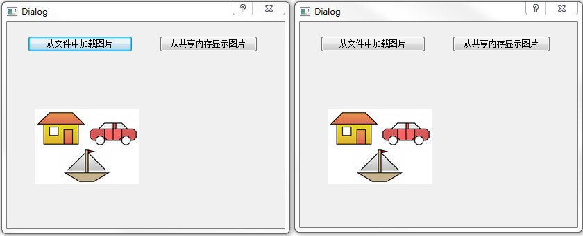

&emsp;&emsp;`dialog.h`如下：<!--more-->

``` cpp
#ifndef DIALOG_H
#define DIALOG_H

#include <QDialog>
#include <QDebug>
#include <QMessageBox>
#include <QFileDialog>
#include <QDir>
#include <QPixmap>
#include <QImage>
#include <QDataStream>
#include <QBuffer>
#include <QSharedMemory>

namespace Ui {
    class Dialog;
}

class Dialog : public QDialog {
    Q_OBJECT
public:
    explicit Dialog ( QWidget *parent = 0 );
    ~Dialog();
public slots:
    void loadFromFile(); /* 载入图片按钮 */
    void loadFromMemory(); /* 显示图片按钮 响应函数 */
private:
    Ui::Dialog *ui;
    QSharedMemory *sharememory; /* 定义共享内存实例指针 */
    bool first_flag; /* 判断是否是首次加载文件 */
};

#endif // DIALOG_H
```

`dialog.cpp`如下：

``` cpp
#include "dialog.h"
#include "ui_dialog.h"

#define DEBUG /* 调试开关 */

Dialog::Dialog ( QWidget *parent ) :
    QDialog ( parent ),
    ui ( new Ui::Dialog ) {
    ui->setupUi ( this );
    QObject::connect ( ui->PBtn_Load, SIGNAL ( clicked() ), this, SLOT ( loadFromFile() ) );
    QObject::connect ( ui->PBtn_Display, SIGNAL ( clicked() ), this, SLOT ( loadFromMemory() ) );
    sharememory = new QSharedMemory(); /* 构造实例对象 */
    sharememory->setKey ( "QSharedMemoryExample" ); /* 为实例对象指定关键字(给共享内存命名) */
    first_flag = true;
}

Dialog::~Dialog() {
    delete ui;
}

void Dialog::loadFromFile() { /* 载入图片按钮响应函数 */
    if ( sharememory->isAttached() ) { /* 检测程序当前是否关联共享内存 */
        sharememory->detach(); /* 解除关联 */
    }

    ui->Label_Display->setText ( tr ( "请选择一张图片" ) );
    QString filename = QFileDialog::getOpenFileName ( this, "打开", QString(), tr ( "Image (*.png *.xpm *.jpg)" ) );
    QImage image;

    if ( !image.load ( filename ) ) { /* 将打开的图片文件和QImage实例关联 */
        ui->Label_Display->setText ( tr ( "您选择的不是图片文件，请重新选择" ) );
        return;
    }

    ui->Label_Display->setPixmap ( QPixmap::fromImage ( image ) );
    QBuffer buffer;
    buffer.open ( QBuffer::ReadWrite ); /* 构建并打开数据缓冲区，访问方式为读写 */
#ifdef DEBUG
    qDebug() << "新建缓冲区的大小为：" << buffer.size(); /* 测试缓冲区大小(一般为0) */
#endif
    QDataStream in ( &buffer ); /* 建立数据流对象并和缓冲区相关联 */
    in << image; /* 向缓冲区写入数据 */
    int size = buffer.size(); /* 获取写入数据的大小(图片的大小) */
#ifdef DEBUG
    qDebug() << "缓冲区的大小为：" << size;
    qDebug() << sharememory->key();
    qDebug() << sharememory->nativeKey();
    qDebug() << sharememory->error();
    qDebug() << sharememory->errorString();
#endif

    if ( true == first_flag ) {
        if ( !sharememory->create ( size ) ) { /* 创建共享内存，大小为size */
            ui->Label_Display->setText ( tr ( "无法创建共享内存段" ) );
            qDebug() << sharememory->errorString();
            return;
        }

        first_flag = false;
        qDebug() << sharememory->size(); /* 显示共享内存的大小 */
    }

    /* 对共享内存进行读写操作 */
    sharememory->lock(); /* 锁定共享内存 */
    char *to = ( char * ) sharememory->data(); /* 获取共享内存中的地址 */
    const char *from = buffer.data().data(); /* 获取有效数据在缓冲区中的地址 */
    memcpy ( to, from, qMin ( sharememory->size(), size ) ); /* 将缓冲区中的数据复制到共享内存 */
    sharememory->unlock(); /* 解锁共享内存 */
}

void Dialog::loadFromMemory() { /* 显示图片按钮响应函数 */
    if ( !sharememory->attach() ) { /* 关联共享内存 */
        ui->Label_Display->setText ( "无法关联共享内存" );
        return;
    }

    QBuffer buffer; /* 构建缓冲区 */
    QDataStream out ( &buffer ); /* 建立数据流对象，并和缓冲区关联 */
    QImage image;
    /* 对共享内存进行读写操作 */
    sharememory->lock(); /* 锁定共享内存 */
    /* 初始化缓冲区中的数据，setData函数用来初始化缓冲区。该函数如果在open函数之后被调用，则不起任何作用 */
    buffer.setData ( ( char * ) sharememory->constData(), sharememory->size() );
    buffer.open ( QBuffer::ReadOnly ); /* 只读方式打开缓冲区 */
    out >> image; /* 将缓冲区的数据写入QImage对象 */
    sharememory->unlock(); /* 解锁共享内存 */
    sharememory->detach(); /* 解除程序和共享内存的关联 */
    ui->Label_Display->setPixmap ( QPixmap::fromImage ( image ) ); /* 显示图片 */
}
```

`main.cpp`如下：

``` cpp
#include <QtGui/QApplication>
#include "dialog.h"
#include <QTextCodec>

int main ( int argc, char *argv[] ) {
    QApplication application ( argc, argv );
    /* Qt国际化显示 */
    QTextCodec::setCodecForTr ( QTextCodec::codecForName ( "GB18030" ) );
    QTextCodec::setCodecForLocale ( QTextCodec::codecForName ( "GB18030" ) );
    QTextCodec::setCodecForCStrings ( QTextCodec::codecForName ( "GB18030" ) );
    Dialog dialog;
    dialog.show();
    return application.exec();
}
```



在`Windows`系统中，首先复制该程序的可执行文件，然后让第一个可执行文件点击按钮`从文件中加载图片`，让第二个可执行文件点击按钮`从共享内存显示图片`。