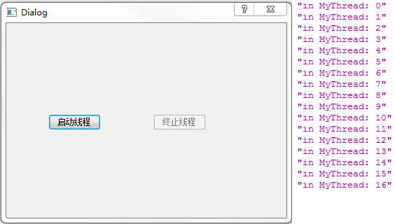

&emsp;&emsp;`mythread.h`如下：<!--more-->

``` cpp
#ifndef MYTHREAD_H
#define MYTHREAD_H

#include <QThread>

class MyThread : public QThread {
    Q_OBJECT
public:
    explicit MyThread ( QObject *parent = 0 );
    void stop();
protected:
    void run();
private:
    volatile bool stopped;
signals:
public slots:
};

#endif // MYTHREAD_H
```

&emsp;&emsp;`dialog.h`如下：

``` cpp
#ifndef DIALOG_H
#define DIALOG_H

#include <QDialog>
#include "mythread.h"

namespace Ui {
    class Dialog;
}

class Dialog : public QDialog {
    Q_OBJECT
public:
    explicit Dialog ( QWidget *parent = 0 );
    ~Dialog();
private slots:
    void on_startButton_clicked();
    void on_stopButton_clicked();
private:
    Ui::Dialog *ui;
    MyThread thread;
};

#endif // DIALOG_H
```

&emsp;&emsp;`mythread.cpp`如下：

``` cpp
#include "mythread.h"
#include <QDebug>

MyThread::MyThread ( QObject *parent ) : QThread ( parent ) {
    stopped = false;
}

void MyThread::run() {
    qreal i = 0;

    while ( !stopped ) {
        qDebug() << QString ( "in MyThread: %1" ).arg ( i++ );
    }

    stopped = false;
}

void MyThread::stop() {
    stopped = true;
}
```

&emsp;&emsp;`dialog.cpp`如下：

``` cpp
#include "dialog.h"
#include "ui_dialog.h"

Dialog::Dialog ( QWidget *parent ) : QDialog ( parent ), ui ( new Ui::Dialog ) {
    ui->setupUi ( this );
}

Dialog::~Dialog() {
    delete ui;
}

void Dialog::on_startButton_clicked() { /* 启动线程按钮 */
    thread.start();
    ui->startButton->setEnabled ( false );
    ui->stopButton->setEnabled ( true );
}

void Dialog::on_stopButton_clicked() { /* 终止线程按钮 */
    if ( thread.isRunning() ) {
        thread.stop();
        ui->startButton->setEnabled ( true );
        ui->stopButton->setEnabled ( false );
    }
}
```

&emsp;&emsp;`main.cpp`如下：

``` cpp
#include <QtGui/QApplication>
#include "dialog.h"

int main ( int argc, char *argv[] ) {
    QApplication a ( argc, argv );
    Dialog w;
    w.show();
    return a.exec();
}
```

