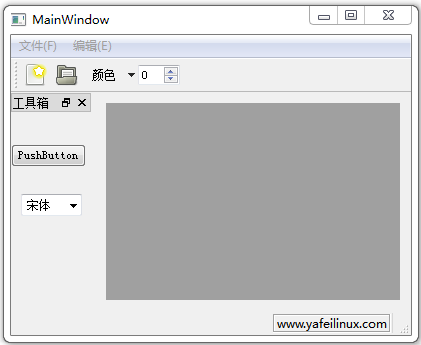
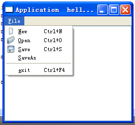
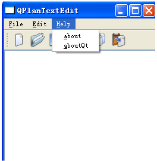

&emsp;&emsp;`mainwindow.h`如下：<!--more-->

``` cpp
#ifndef MAINWINDOW_H
#define MAINWINDOW_H

#include <QMainWindow>

namespace Ui {
    class MainWindow;
}

class MainWindow : public QMainWindow {
    Q_OBJECT
public:
    explicit MainWindow ( QWidget *parent = 0 );
    ~MainWindow();
private slots:
    void on_action_New_triggered();
    void on_action_Dock_triggered();
private:
    Ui::MainWindow *ui;
};

#endif // MAINWINDOW_H
```

&emsp;&emsp;`mainwindow.cpp`如下：

``` cpp
#include "mainwindow.h"
#include "ui_mainwindow.h"
#include <QToolButton>
#include <QSpinBox>
#include <QTextEdit>
#include <QMdiSubWindow>
#include <QLabel>

MainWindow::MainWindow ( QWidget *parent ) : QMainWindow ( parent ), ui ( new Ui::MainWindow ) {
    ui->setupUi ( this );
    QMenu *editMenu = ui->menuBar->addMenu ( tr ( "编辑(&E)" ) ); /* 添加编辑菜单 */
    /* 添加打开菜单(图片位于images目录下) */
    QAction *action_Open = editMenu->addAction ( QIcon ( ":/myImage/images/open.png" ), tr ( "打开文件(&O)" ) );
    action_Open->setShortcut ( QKeySequence ( "Ctrl+O" ) ); /* 设置快捷键 */
    ui->mainToolBar->addAction ( action_Open ); /* 在工具栏中添加动作 */
    QActionGroup *group = new QActionGroup ( this ); /* 建立动作组 */
    /* 向动作组中添加动作，设置动作checkable属性为true，最后指定action_L为选中状态 */
    QAction *action_L = group->addAction ( tr ( "左对齐(&L)" ) );
    action_L->setCheckable ( true );
    QAction *action_R = group->addAction ( tr ( "右对齐(&R)" ) );
    action_R->setCheckable ( true );
    QAction *action_C = group->addAction ( tr ( "居中(&C)" ) );
    action_C->setCheckable ( true );
    action_L->setChecked ( true );
    editMenu->addSeparator(); /* 向菜单中添加间隔器 */
    /* 向菜单中添加动作 */
    editMenu->addAction ( action_L );
    editMenu->addAction ( action_R );
    editMenu->addAction ( action_C );
    /* 创建QToolButton */
    QToolButton *toolBtn = new QToolButton ( this );
    toolBtn->setText ( tr ( "颜色" ) );
    /* 创建一个菜单 */
    QMenu *colorMenu = new QMenu ( this );
    colorMenu->addAction ( tr ( "红色" ) );
    colorMenu->addAction ( tr ( "绿色" ) );
    toolBtn->setMenu ( colorMenu ); /* 添加菜单 */
    toolBtn->setPopupMode ( QToolButton::MenuButtonPopup ); /* 设置弹出模式 */
    ui->mainToolBar->addWidget ( toolBtn ); /* 向工具栏添加QToolButton按钮 */
    QSpinBox *spinBox = new QSpinBox ( this ); /* 创建QSpinBox */
    ui->mainToolBar->addWidget ( spinBox ); /* 向工具栏添加QSpinBox部件 */
    /* 显示临时消息，显示2000毫秒即2秒钟 */
    ui->statusBar->showMessage ( tr ( "欢迎使用多文档编辑器" ), 2000 );
    QLabel *permanent = new QLabel ( this ); /* 创建标签 */
    permanent->setFrameStyle ( QFrame::Box | QFrame::Sunken ); /* 标签样式 */
    permanent->setText ( "www.yafeilinux.com" ); /* 显示信息 */
    ui->statusBar->addPermanentWidget ( permanent ); /* 将标签设置为永久部件 */
}

MainWindow::~MainWindow() {
    delete ui;
}

void MainWindow::on_action_New_triggered() { /* 新建文件菜单 */
    QTextEdit *edit = new QTextEdit ( this ); /* 新建文本编辑器部件 */
    /* 使用QMdiArea类的addSubWindow函数创建子窗口，以文本编辑器为中心部件 */
    QMdiSubWindow *child = ui->mdiArea->addSubWindow ( edit );
    child->setWindowTitle ( tr ( "多文档编辑器子窗口" ) );
    child->show(); /* 显示子窗口 */
}

void MainWindow::on_action_Dock_triggered() { /* 显示Dock菜单 */
    ui->dockWidget->show();
}
```



---

### QT之菜单栏QMenu、下拉菜单QAction、工具栏QToolBar的使用

&emsp;&emsp;如下内容是实现一个菜单栏以及下拉菜单的制作：
&emsp;&emsp;在`mainwindow.h`中添加如下内容：

``` cpp
class QAction;
class QMenu;
```

在`pro`中添加`QT += widgets`。`QMenu`类作为菜单栏，`QAction`类作为点击菜单栏的下拉菜单使用`QMenu`类对象的`addaction(QAction类的对象)`来添加：
&emsp;&emsp;`main.c`如下：

``` cpp
#include "mainwindow.h"

int main ( int argc, char *argv[] ) {
    Q_INIT_RESOURCE ( application ); /* 初始化qrc资源 */
    QApplication a ( argc, argv );
    a.setOrganizationName ( "Qtporject" );
    a.setApplicationName ( "Application  hello Example" ); /* 给窗口添加name */
    MainWindow w;
    w.show();
    return a.exec();
}
```

&emsp;&emsp;`mainwindow.h`如下：

``` cpp
#ifndef MAINWINDOW_H
#define MAINWINDOW_H

class QPlainTextEdit;
class QAction;
class QMenu;

class MainWindow : public QMainWindow {
    Q_OBJECT
public:
    explicit MainWindow();
    ~MainWindow();
private slots:
    void test();
private:
    void createActions();
    void createMenus();
    QPlainTextEdit *textEdit; /* 文本框 */
    QMenu *fileMenu; /* file菜单 */
    /* 定义了file的下拉菜单为new、open、save、saveAS、exit */
    QAction *newAct;
    QAction *open;
    QAction *Save;
    QAction *saveAs;
    QAction *exit;
};

#endif // MAINWINDOW_H
```

&emsp;&emsp;`mainwindow.cpp`如下：

``` cpp
#include "mainwindow.h"

MainWindow::MainWindow() {
    textEdit = new QPlainTextEdit; /* 创建一个文本编辑器 */
    setCentralWidget ( textEdit ); /* 设置文本编辑器为中心位置 */
    createActions(); /* 首先创建file下拉的菜单栏 */
    createMenus(); /* 再来创建菜单目录，把下拉菜单的内容addaction加入到menu中 */
}

MainWindow::~MainWindow() {
}

void MainWindow::test() {
}

/* file下拉菜单，名字为new、open、Save、saveAs和exit，并且添加了快捷键和图标，以及相应的槽函数 */
void MainWindow::createActions() {
    newAct = new QAction ( QIcon ( ":/image/new.png" ), tr ( "&New" ), this );
    newAct->setShortcuts ( QKeySequence::New );
    newAct->setStatusTip ( tr ( "Create a new file" ) );
    connect ( newAct, SIGNAL ( triggered() ), this, SLOT ( test() ) ); /* New点击事件调用test */
    open = new QAction ( QIcon ( ":/image/open.png" ), tr ( "&Open" ), this );
    open->setShortcuts ( QKeySequence::Open );
    open->setStatusTip ( tr ( "open a new file" ) );
    connect ( open, SIGNAL ( triggered() ), this, SLOT ( test() ) ); /* 点击Open事件调用test */
    Save = new QAction ( QIcon ( ":/image/save.png" ), tr ( "&Save" ), this );
    Save->setShortcuts ( QKeySequence::Save );
    Save->setStatusTip ( tr ( "Save a new file" ) );
    connect ( Save, SIGNAL ( triggered() ), this, SLOT ( test() ) ); /* 点击Save事件调用test */
    saveAs = new QAction ( tr ( "&SaveAs" ), this );
    saveAs->setShortcuts ( QKeySequence::SaveAs );
    newAct->setStatusTip ( tr ( "SaveAs a new file" ) );
    connect ( saveAs, SIGNAL ( triggered() ), this, SLOT ( test() ) ); /* saveAS点击事件调用test */
    exit = new QAction ( tr ( "&exit" ), this );
    exit->setShortcuts ( QKeySequence::Close );
    exit->setStatusTip ( tr ( "exit a new file" ) );
    connect ( exit, SIGNAL ( triggered() ), this, SLOT ( close() ) ); /* 点击exit事件调用test */
}

void MainWindow::createMenus() {
    fileMenu = menuBar()->addMenu ( tr ( "&File" ) ); /* 创建一个name为file的菜单栏 */
    /* 在这个菜单栏添加action即下拉菜单 */
    fileMenu->addAction ( newAct );
    fileMenu->addAction ( open );
    fileMenu->addAction ( Save );
    fileMenu->addAction ( saveAs );
    fileMenu->addSeparator(); /* 添加一个分割器 */
    fileMenu->addAction ( exit ); /* 推出下拉菜单 */
}
```



&emsp;&emsp;下文在原来的基础上添加了菜单栏`edit`、`help`，以及`edit`、`help`的下拉菜单，还添加了`file`工具栏和`edit`工具栏。菜单栏及下拉菜单与上面使用的一样，创建菜单栏类如下：

``` cpp
QMenu *fileMenu;
QMenu *editMenu;
QMenu *helpMenu;
```

下拉菜单的类如下：

``` cpp
/* 定义edit的下拉菜单cut、copy、past */
QAction *cut;
QAction *copy;
QAction *past;
/* 定义help的下拉菜单about、aboutQt */
QAction *about;
QAction *aboutQt;
edit与help的使用方法为：
/* 创建一个name为edit的菜单栏 */
editMenu = menuBar()->addMenu ( tr ( "&Edit" ) );
/* 在这个菜单栏添加action，即下拉菜单 */
editMenu->addAction ( cut );
editMenu->addAction ( copy );
editMenu->addAction ( past );

/* 创建一个name为help的菜单栏 */
helpMenu = menuBar()->addMenu ( tr ( "&Help" ) );
/* 在这个菜单栏添加action，即下拉菜单 */
helpMenu->addAction ( about );
helpMenu->addAction ( aboutQt );
```

&emsp;&emsp;工具栏使用的使用如下：

``` cpp
QToolBar *fileToolBar;
QToolBar *editToolBar;
```

使用方法为：

``` cpp
fileToolBar = addToolBar ( tr ( "File" ) );
fileToolBar->addAction ( newAct );
fileToolBar->addAction ( open ) ；
fileToolBar->addAction ( Save );
editToolBar = addToolBar ( tr ( "Edit" ) );
editToolBar->addAction ( cut );
editToolBar->addAction ( copy );
editToolBar->addAction ( past );
```

&emsp;&emsp;`mainwindow.h`如下：

``` cpp
#ifndef MAINWINDOW_H
#define MAINWINDOW_H

class QPlainTextEdit;
class QAction;
class QMenu;

class MainWindow : public QMainWindow{
    Q_OBJECT
public:
    explicit MainWindow();
    ~MainWindow();
private slots:
    void test();
private:
    void createActions();
    void createMenus();
    void createToolBars();

    QPlainTextEdit *textEdit; /* 文本框 */
    /* file菜单 */
    QMenu *fileMenu;
    QMenu *editMenu;
    QMenu *helpMenu;
    QToolBar *fileToolBar;
    QToolBar *editToolBar;
    /* 定义了file的下拉菜单为new、open、save、saveAS和exit */
    QAction *newAct;
    QAction *open;
    QAction *Save;
    QAction *saveAs;
    QAction *exit;
    /* 定义edit的下拉菜单cut、copy、past */
    QAction *cut;
    QAction *copy;
    QAction *past;
    /* 定义help的下拉菜单about aboutQt */
    QAction *about;
    QAction *aboutQt;
};

#endif // MAINWINDOW_H
```

&emsp;&emsp;`mainwindow.cpp`代码：

``` cpp
#include "mainwindow.h"

MainWindow::MainWindow() {
    textEdit = new QPlainTextEdit;
    setCentralWidget ( textEdit );
    createActions(); /* 首先创建file下拉的菜单栏 */
    createMenus(); /* 再来创建菜单目录，把下拉菜单的内容addaction加入到menu中 */
    createToolBars();
}

MainWindow::~MainWindow() {
}

void MainWindow::test() {
}

void MainWindow::createActions() {
    newAct = new QAction ( QIcon ( ":/image/new.png" ), tr ( "&New" ), this );
    newAct->setShortcuts ( QKeySequence::New );
    newAct->setStatusTip ( tr ( "Create a new file" ) );
    connect ( newAct, SIGNAL ( triggered() ), this, SLOT ( test() ) );
    open = new QAction ( QIcon ( ":/image/open.png" ), tr ( "&Open" ), this );
    open->setShortcuts ( QKeySequence::Open );
    open->setStatusTip ( tr ( "open a new file" ) );
    connect ( open, SIGNAL ( triggered() ), this, SLOT ( test() ) );
    Save = new QAction ( QIcon ( ":/image/save.png" ), tr ( "&Save" ), this );
    Save->setShortcuts ( QKeySequence::Save );
    Save->setStatusTip ( tr ( "Save a new file" ) );
    connect ( Save, SIGNAL ( triggered() ), this, SLOT ( test() ) );
    saveAs = new QAction ( tr ( "&SaveAs" ), this );
    saveAs->setShortcuts ( QKeySequence::SaveAs );
    newAct->setStatusTip ( tr ( "SaveAs a new file" ) );
    connect ( saveAs, SIGNAL ( triggered() ), this, SLOT ( test() ) );
    exit = new QAction ( tr ( "&exit" ), this );
    exit->setShortcuts ( QKeySequence::Close );
    exit->setStatusTip ( tr ( "exit a new file" ) );
    connect ( exit, SIGNAL ( triggered() ), this, SLOT ( close() ) );
    cut = new QAction ( QIcon ( ":/image/cut.png" ), tr ( "&Cut" ), this );
    cut->setShortcuts ( QKeySequence::Cut );
    cut->setStatusTip ( tr ( "Save a new file" ) );
    connect ( cut, SIGNAL ( triggered() ), this, SLOT ( test() ) );
    copy = new QAction ( QIcon ( ":/image/copy.png" ), tr ( "&Copy" ), this );
    saveAs->setShortcuts ( QKeySequence::Copy );
    copy->setStatusTip ( tr ( "SaveAs a new file" ) );
    connect ( copy, SIGNAL ( triggered() ), this, SLOT ( test() ) );
    past = new QAction ( QIcon ( ":/image/paste.png" ), tr ( "&Paste" ), this );
    past->setShortcuts ( QKeySequence::Paste );
    past->setStatusTip ( tr ( "exit a new file" ) );
    connect ( past, SIGNAL ( triggered() ), this, SLOT ( close() ) );
    about = new QAction ( tr ( "&about" ), this );
    about->setStatusTip ( tr ( "SaveAs a new file" ) );
    connect ( about, SIGNAL ( triggered() ), this, SLOT ( test() ) );
    aboutQt = new QAction ( tr ( "&aboutQt" ), this );
    aboutQt->setStatusTip ( tr ( "exit a new file" ) );
    connect ( aboutQt, SIGNAL ( triggered() ), this, SLOT ( close() ) );
}

void MainWindow::createToolBars() {
    fileToolBar = addToolBar ( tr ( "File" ) );
    fileToolBar->addAction ( newAct );
    fileToolBar->addAction ( open );
    fileToolBar->addAction ( Save );
    editToolBar = addToolBar ( tr ( "Edit" ) );
    editToolBar->addAction ( cut );
    editToolBar->addAction ( copy );
    editToolBar->addAction ( past );
}

void MainWindow::createMenus() {
    fileMenu = menuBar()->addMenu ( tr ( "&File" ) ); /* 创建一个name为file的菜单栏 */
    /* 在这个菜单栏添加action即下拉菜单 */
    fileMenu->addAction ( newAct );
    fileMenu->addAction ( open );
    fileMenu->addAction ( Save );
    fileMenu->addAction ( saveAs );
    fileMenu->addSeparator(); /* 添加一个分割器 */
    fileMenu->addAction ( exit ); /* 推出下拉菜单 */
    editMenu = menuBar()->addMenu ( tr ( "&Edit" ) ); /* 创建一个name为edit的菜单栏 */
    /* 在这个菜单栏添加action即下拉菜单 */
    editMenu->addAction ( cut );
    editMenu->addAction ( copy );
    editMenu->addAction ( past );
    helpMenu = menuBar()->addMenu ( tr ( "&Help" ) ); /* 创建一个name为help的菜单栏 */
    /* 在这个菜单栏添加action即下拉菜单 */
    helpMenu->addAction ( about );
    helpMenu->addAction ( aboutQt );
}
```

