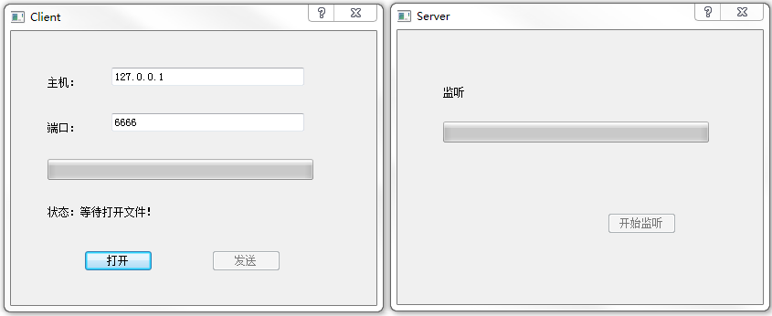

### tcp_client

&emsp;&emsp;`client.h`如下：<!--more-->

``` cpp
#ifndef CLIENT_H
#define CLIENT_H

#include <QDialog>

#include <QAbstractSocket>
class QTcpSocket;
class QFile;

namespace Ui {
    class Client;
}

class Client : public QDialog {
    Q_OBJECT
public:
    explicit Client ( QWidget *parent = 0 );
    ~Client();
private:
    Ui::Client *ui;
    QTcpSocket *tcpClient;
    QFile *localFile; /* 要发送的文件 */
    qint64 totalBytes; /* 发送数据的总大小 */
    qint64 bytesWritten; /* 已经发送数据大小 */
    qint64 bytesToWrite; /* 剩余数据大小 */
    qint64 payloadSize; /* 每次发送数据的大小 */
    QString fileName; /* 保存文件路径 */
    QByteArray outBlock; /* 数据缓冲区，即存放每次要发送的数据块 */
private slots:
    void openFile();
    void send();
    void startTransfer();
    void updateClientProgress ( qint64 );
    void displayError ( QAbstractSocket::SocketError );
    void on_openButton_clicked();
    void on_sendButton_clicked();
};

#endif // CLIENT_H
```

&emsp;&emsp;`client.cpp`如下：

``` cpp
#include "client.h"
#include "ui_client.h"

#include <QtNetwork>
#include <QFileDialog>

Client::Client ( QWidget *parent ) : QDialog ( parent ), ui ( new Ui::Client ) {
    ui->setupUi ( this );
    payloadSize = 64 * 1024; /* 64KB */
    totalBytes = 0;
    bytesWritten = 0;
    bytesToWrite = 0;
    tcpClient = new QTcpSocket ( this );
    /* 当连接服务器成功时，发出connected信号，开始传送文件 */
    connect ( tcpClient, SIGNAL ( connected() ), this, SLOT ( startTransfer() ) );
    connect ( tcpClient, SIGNAL ( bytesWritten ( qint64 ) ), this, SLOT ( updateClientProgress ( qint64 ) ) );
    connect ( tcpClient, SIGNAL ( error ( QAbstractSocket::SocketError ) ), \
              this, SLOT ( displayError ( QAbstractSocket::SocketError ) ) );
    ui->sendButton->setEnabled ( false );
}

Client::~Client() {
    delete ui;
}

void Client::openFile() { /* 打开文件 */
    fileName = QFileDialog::getOpenFileName ( this );

    if ( !fileName.isEmpty() ) {
        ui->sendButton->setEnabled ( true );
        ui->clientStatusLabel->setText ( tr ( "打开文件 %1 成功！" ).arg ( fileName ) );
    }
}

void Client::send() { /* 连接到服务器 */
    ui->sendButton->setEnabled ( false );
    bytesWritten = 0; /* 初始化已发送字节为0 */
    ui->clientStatusLabel->setText ( tr ( "连接中…" ) );
    tcpClient->connectToHost ( ui->hostLineEdit->text(), ui->portLineEdit->text().toInt() );
}

void Client::startTransfer() { /* 传输文件大小等信息 */
    localFile = new QFile ( fileName );

    if ( !localFile->open ( QFile::ReadOnly ) ) {
        qDebug() << "client: open file error!";
        return;
    }

    totalBytes = localFile->size(); /* 获取文件大小 */
    QDataStream sendOut ( &outBlock, QIODevice::WriteOnly );
    sendOut.setVersion ( QDataStream::Qt_4_0 );
    QString currentFileName = fileName.right ( fileName.size() - fileName.lastIndexOf ( '/' ) - 1 );
    /* 保留总大小信息空间、文件名大小信息空间，然后输入文件名 */
    sendOut << qint64 ( 0 ) << qint64 ( 0 ) << currentFileName;
    totalBytes += outBlock.size(); /* 这里的总大小是总大小信息、文件名大小信息、文件名和实际文件大小的总和 */
    sendOut.device()->seek ( 0 );
    /* 返回outBolock的开始，用实际的大小信息代替两个qint64(0)空间 */
    sendOut << totalBytes << qint64 ( ( outBlock.size() - sizeof ( qint64 ) * 2 ) );
    bytesToWrite = totalBytes - tcpClient->write ( outBlock ); /* 发送完文件头结构后剩余数据的大小 */
    ui->clientStatusLabel->setText ( tr ( "已连接" ) );
    outBlock.resize ( 0 );
}

void Client::updateClientProgress ( qint64 numBytes ) { /* 发送数据，并更新进度条 */
    bytesWritten += ( int ) numBytes; /* 已经发送数据的大小 */

    if ( bytesToWrite > 0 ) { /* 如果已经发送了数据 */
        /* 每次发送payloadSize大小的数据，这里设置为64KB，如果剩余的数据不足64KB，就发送剩余数据的大小 */
        outBlock = localFile->read ( qMin ( bytesToWrite, payloadSize ) );
        bytesToWrite -= ( int ) tcpClient->write ( outBlock ); /* 发送完一次数据后还剩余数据的大小 */
        outBlock.resize ( 0 ); /* 清空发送缓冲区 */
    } else { /* 如果没有发送任何数据，则关闭文件 */
        localFile->close();
    }

    /* 更新进度条 */
    ui->clientProgressBar->setMaximum ( totalBytes );
    ui->clientProgressBar->setValue ( bytesWritten );

    if ( bytesWritten == totalBytes ) { /* 如果发送完毕 */
        ui->clientStatusLabel->setText ( tr ( "传送文件 %1 成功" ).arg ( fileName ) );
        localFile->close();
        tcpClient->close();
    }
}

void Client::displayError ( QAbstractSocket::SocketError ) { /* 显示错误 */
    qDebug() << tcpClient->errorString();
    tcpClient->close();
    ui->clientProgressBar->reset();
    ui->clientStatusLabel->setText ( tr ( "客户端就绪" ) );
    ui->sendButton->setEnabled ( true );
}

void Client::on_openButton_clicked() { /* 打开按钮 */
    ui->clientProgressBar->reset();
    ui->clientStatusLabel->setText ( tr ( "状态：等待打开文件！" ) );
    openFile();
}

void Client::on_sendButton_clicked() { /* 发送按钮 */
    send();
}
```

&emsp;&emsp;`main.cpp`如下：

``` cpp
#include <QtGui/QApplication>
#include "client.h"
#include <QTextCodec>

int main ( int argc, char *argv[] ) {
    QApplication a ( argc, argv );
    QTextCodec::setCodecForTr ( QTextCodec::codecForLocale() );
    Client w;
    w.show();
    return a.exec();
}
```

### tcp_server

&emsp;&emsp;`server.h`如下：

``` cpp
#ifndef SERVER_H
#define SERVER_H

#include <QDialog>
#include <QAbstractSocket>
#include <QTcpServer>
class QTcpSocket;
class QFile;

namespace Ui {
    class Server;
}

class Server : public QDialog {
    Q_OBJECT
public:
    explicit Server ( QWidget *parent = 0 );
    ~Server();
private:
    Ui::Server *ui;
    QTcpServer tcpServer;
    QTcpSocket *tcpServerConnection;
    qint64 totalBytes; /* 存放总大小信息 */
    qint64 bytesReceived; /* 已收到数据的大小 */
    qint64 fileNameSize; /* 文件名的大小信息 */
    QString fileName; /* 存放文件名 */
    QFile *localFile; /* 本地文件 */
    QByteArray inBlock; /* 数据缓冲区 */
private slots:
    void start();
    void acceptConnection();
    void updateServerProgress();
    void displayError ( QAbstractSocket::SocketError socketError );
    void on_startButton_clicked();
};

#endif // SERVER_H
```

`server.cpp`如下：

``` cpp
#include "server.h"
#include "ui_server.h"
#include <QtNetwork>

Server::Server ( QWidget *parent ) : QDialog ( parent ), ui ( new Ui::Server ) {
    ui->setupUi ( this );
    connect ( &tcpServer, SIGNAL ( newConnection() ), this, SLOT ( acceptConnection() ) );
}

Server::~Server() {
    delete ui;
}

void Server::start() { /* 开启监听 */
    if ( !tcpServer.listen ( QHostAddress::LocalHost, 6666 ) ) {
        qDebug() << tcpServer.errorString();
        close();
        return;
    }

    ui->startButton->setEnabled ( false );
    totalBytes = 0;
    bytesReceived = 0;
    fileNameSize = 0;
    ui->serverStatusLabel->setText ( tr ( "监听" ) );
    ui->serverProgressBar->reset();
}

void Server::acceptConnection() { /* 接收连接 */
    tcpServerConnection = tcpServer.nextPendingConnection();
    connect ( tcpServerConnection, SIGNAL ( readyRead() ), this, SLOT ( updateServerProgress() ) );
    connect ( tcpServerConnection, SIGNAL ( error ( QAbstractSocket::SocketError ) ), \
              this, SLOT ( displayError ( QAbstractSocket::SocketError ) ) );
    ui->serverStatusLabel->setText ( tr ( "接受连接" ) );
    tcpServer.close(); /* 关闭服务器，不再进行监听 */
}

void Server::updateServerProgress() { /* 接收文件并更新进度条 */
    QDataStream in ( tcpServerConnection );
    in.setVersion ( QDataStream::Qt_4_0 );

    if ( bytesReceived <= sizeof ( qint64 ) * 2 ) { /* 如果接收到的数据小于16个字节，保存到来的文件头结构 */
        if ( ( tcpServerConnection->bytesAvailable() >= sizeof ( qint64 ) * 2 ) && ( fileNameSize == 0 ) ) {
            in >> totalBytes >> fileNameSize; /* 接收数据总大小信息和文件名大小信息 */
            bytesReceived += sizeof ( qint64 ) * 2;
        }

        if ( ( tcpServerConnection->bytesAvailable() >= fileNameSize ) && ( fileNameSize != 0 ) ) {
            in >> fileName; /* 接收文件名，并建立文件 */
            ui->serverStatusLabel->setText ( tr ( "接收文件 %1 …" ).arg ( fileName ) );
            bytesReceived += fileNameSize;
            localFile = new QFile ( fileName );

            if ( !localFile->open ( QFile::WriteOnly ) ) {
                qDebug() << "server: open file error!";
                return;
            }
        } else {
            return;
        }
    }

    if ( bytesReceived < totalBytes ) { /* 如果接收的数据小于总数据，那么写入文件 */
        bytesReceived += tcpServerConnection->bytesAvailable();
        inBlock = tcpServerConnection->readAll();
        localFile->write ( inBlock );
        inBlock.resize ( 0 );
    }

    ui->serverProgressBar->setMaximum ( totalBytes );
    ui->serverProgressBar->setValue ( bytesReceived );

    if ( bytesReceived == totalBytes ) { /* 接收数据完成时 */
        tcpServerConnection->close();
        localFile->close();
        ui->startButton->setEnabled ( true );
        ui->serverStatusLabel->setText ( tr ( "接收文件 %1 成功！" ).arg ( fileName ) );
    }
}

void Server::displayError ( QAbstractSocket::SocketError socketError ) { /* 显示错误 */
    qDebug() << tcpServerConnection->errorString();
    tcpServerConnection->close();
    ui->serverProgressBar->reset();
    ui->serverStatusLabel->setText ( tr ( "服务端就绪" ) );
    ui->startButton->setEnabled ( true );
}

void Server::on_startButton_clicked() { /* 开始监听按钮 */
    start();
}
```

