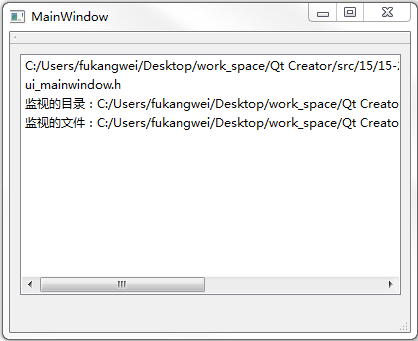

&emsp;&emsp;`mainwindow.h`如下：<!--more-->

``` cpp
#ifndef MAINWINDOW_H
#define MAINWINDOW_H

#include <QMainWindow>
#include <QFileSystemWatcher>

namespace Ui {
    class MainWindow;
}

class MainWindow : public QMainWindow {
    Q_OBJECT
public:
    explicit MainWindow ( QWidget *parent = 0 );
    ~MainWindow();
private slots:
    void showMessage ( const QString &path );
private:
    Ui::MainWindow *ui;
    QFileSystemWatcher myWatcher;
};

#endif // MAINWINDOW_H
```

&emsp;&emsp;`mainwindow.cpp`如下：

``` cpp
#include "mainwindow.h"
#include "ui_mainwindow.h"
#include <QDir>

MainWindow::MainWindow ( QWidget *parent ) : QMainWindow ( parent ), ui ( new Ui::MainWindow ) {
    ui->setupUi ( this );
    /* 将监视器的信号和自定义的槽进行关联 */
    connect ( &myWatcher, SIGNAL ( directoryChanged ( QString ) ), this, SLOT ( showMessage ( QString ) ) );
    connect ( &myWatcher, SIGNAL ( fileChanged ( QString ) ), this, SLOT ( showMessage ( QString ) ) );
    /* 显示出当前目录下的所有“.h”文件 */
    QDir myDir ( QDir::currentPath() );
    myDir.setNameFilters ( QStringList ( "*.h" ) );
    ui->listWidget->addItem ( myDir.absolutePath() + tr ( "目录下的.h文件有：" ) );
    ui->listWidget->addItems ( myDir.entryList() );
    /* 创建目录，并将其加入到监视器中 */
    myDir.mkdir ( "mydir" );
    myDir.cd ( "mydir" );
    ui->listWidget->addItem ( tr ( "监视的目录：" ) + myDir.absolutePath() );
    myWatcher.addPath ( myDir.absolutePath() );
    /* 创建文件，并将其加入到监视器中 */
    QFile file ( myDir.absolutePath() + "/myfile.txt" );

    if ( file.open ( QIODevice::WriteOnly ) ) {
        QFileInfo info ( file );
        ui->listWidget->addItem ( tr ( "监视的文件：" ) + info.absoluteFilePath() );
        myWatcher.addPath ( info.absoluteFilePath() );
        file.close();
    }
}

MainWindow::~MainWindow() {
    delete ui;
}

void MainWindow::showMessage ( const QString &path ) { /* 显示文件或目录改变信息 */
    QDir dir ( QDir::currentPath() + "/mydir" );

    /* 如果是目录发生了改变 */
    if ( path == dir.absolutePath() ) {
        ui->listWidget->addItem ( dir.dirName() + tr ( "目录发生改变: " ) );
        ui->listWidget->addItems ( dir.entryList() );
    } else { /* 如果是文件发生了改变 */
        ui->listWidget->addItem ( path + tr ( "文件发生改变！" ) );
    }
}
```

