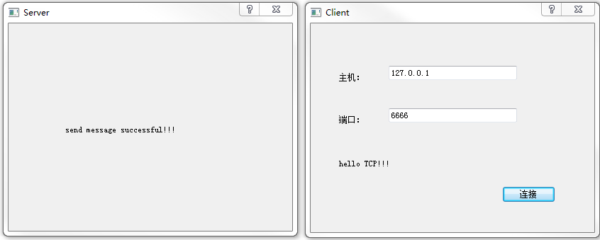

### tcp_client

&emsp;&emsp;`client.h`如下：<!--more-->

``` cpp
#ifndef CLIENT_H
#define CLIENT_H

#include <QDialog>

#include <QAbstractSocket>
class QTcpSocket;

namespace Ui {
    class Client;
}

class Client : public QDialog {
    Q_OBJECT
public:
    explicit Client ( QWidget *parent = 0 );
    ~Client();
private:
    Ui::Client *ui;
    QTcpSocket *tcpSocket;
    QString message;
    quint16 blockSize; /* 用来存放数据大小的信息 */
private slots:
    void newConnect();
    void readMessage();
    void displayError ( QAbstractSocket::SocketError );
    void on_connectButton_clicked();
};

#endif // CLIENT_H
```

&emsp;&emsp;`client.cpp`如下：

``` cpp
#include "client.h"
#include "ui_client.h"
#include <QtNetwork>

Client::Client ( QWidget *parent ) : QDialog ( parent ), ui ( new Ui::Client ) {
    ui->setupUi ( this );
    tcpSocket = new QTcpSocket ( this );
    connect ( tcpSocket, SIGNAL ( readyRead() ), this, SLOT ( readMessage() ) );
    connect ( tcpSocket, SIGNAL ( error ( QAbstractSocket::SocketError ) ), \
              this, SLOT ( displayError ( QAbstractSocket::SocketError ) ) );
}

Client::~Client() {
    delete ui;
}

void Client::newConnect() {
    blockSize = 0; /* 初始化数据大小信息为0 */
    tcpSocket->abort(); /* 取消已有的连接 */
    tcpSocket->connectToHost ( ui->hostLineEdit->text(), ui->portLineEdit->text().toInt() );
}

void Client::readMessage() {
    QDataStream in ( tcpSocket );
    in.setVersion ( QDataStream::Qt_4_6 ); /* 设置数据流版本，这里要和服务器端相同 */

    if ( blockSize == 0 ) { /* 如果是刚开始接收数据 */
        /* 判断接收的数据是否大于两字节，也就是文件的大小信息所占的空间。
           如果是则保存到blockSize变量中，否则直接返回，继续接收数据 */
        if ( tcpSocket->bytesAvailable() < ( int ) sizeof ( quint16 ) ) {
            return;
        }

        in >> blockSize;
    }

    if ( tcpSocket->bytesAvailable() < blockSize ) {
        return; /* 如果没有得到全部的数据，则返回，继续接收数据 */
    }

    in >> message; /* 将接收到的数据存放到变量中 */
    qDebug() << message; /* 显示接收到的数据 */
    ui->messageLabel->setText ( message );
}

void Client::displayError ( QAbstractSocket::SocketError ) {
    qDebug() << tcpSocket->errorString();
}

void Client::on_connectButton_clicked() { /* 连接按钮 */
    newConnect();
}
```

&emsp;&emsp;`main.cpp`如下：

``` cpp
#include <QtGui/QApplication>
#include "client.h"

int main ( int argc, char *argv[] ) {
    QApplication a ( argc, argv );
    Client w;
    w.show();
    return a.exec();
}
```

### tcp_server

&emsp;&emsp;`server.h`如下：

``` cpp
#ifndef SERVER_H
#define SERVER_H

#include <QDialog>
class QTcpServer;

namespace Ui {
    class Server;
}

class Server : public QDialog {
    Q_OBJECT
public:
    explicit Server ( QWidget *parent = 0 );
    ~Server();
private:
    Ui::Server *ui;
    QTcpServer *tcpServer;
private slots:
    void sendMessage();
};

#endif // SERVER_H
```

&emsp;&emsp;`server.cpp`如下：

``` cpp
#include "server.h"
#include "ui_server.h"
#include <QtNetwork>

Server::Server ( QWidget *parent ) : QDialog ( parent ), ui ( new Ui::Server ) {
    ui->setupUi ( this );
    tcpServer = new QTcpServer ( this );

    /* 使用了IPv4的本地主机地址，等价于QHostAddress("127.0.0.1") */
    if ( !tcpServer->listen ( QHostAddress::LocalHost, 6666 ) ) {
        qDebug() << tcpServer->errorString();
        close();
    }

    connect ( tcpServer, SIGNAL ( newConnection() ), this, SLOT ( sendMessage() ) );
}

Server::~Server() {
    delete ui;
}

void Server::sendMessage() {
    QByteArray block; /* 用于暂存我们要发送的数据 */
    QDataStream out ( &block, QIODevice::WriteOnly );
    out.setVersion ( QDataStream::Qt_4_0 ); /* 设置数据流的版本，客户端和服务器端使用的版本要相同 */
    out << ( quint16 ) 0;
    out << tr ( "hello TCP!!!" );
    out.device()->seek ( 0 );
    out << ( quint16 ) ( block.size() - sizeof ( quint16 ) );
    QTcpSocket *clientConnection = tcpServer->nextPendingConnection(); /* 获取已经建立的连接的套接字 */
    connect ( clientConnection, SIGNAL ( disconnected() ), clientConnection, SLOT ( deleteLater() ) );
    clientConnection->write ( block );
    clientConnection->disconnectFromHost();
    ui->label->setText ( "send message successful!!!" ); /* 发送数据成功后，显示该提示 */
}
```



---

&emsp;&emsp;对于从网络上接收数据，更好的方式如下：

``` cpp
void tcp_client::readMessage() {
    QByteArray datagram;

    if ( tcpSocket->bytesAvailable() > 0 ) { /* 如果有数据到达 */
        datagram.resize ( tcpSocket->bytesAvailable() );
        tcpSocket->read ( datagram.data(), datagram.size() );
    } else {
        return ;
    }

    QString msg = datagram.data();
    qDebug() << msg; /* 显示接收到的数据 */
}
```