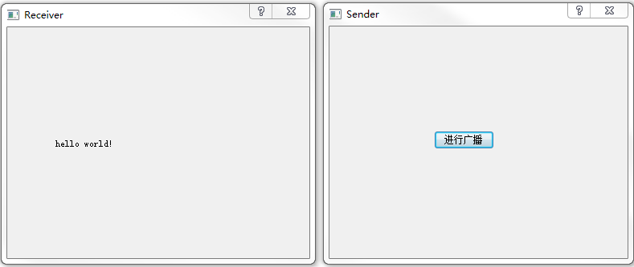

### udp_receiver

&emsp;&emsp;`receiver.h`如下：<!--more-->

``` cpp
#ifndef RECEIVER_H
#define RECEIVER_H

#include <QDialog>
class QUdpSocket;

namespace Ui {
    class Receiver;
}

class Receiver : public QDialog {
    Q_OBJECT
public:
    explicit Receiver ( QWidget *parent = 0 );
    ~Receiver();
private:
    Ui::Receiver *ui;
    QUdpSocket *receiver;
private slots:
    void processPendingDatagram();
};

#endif // RECEIVER_H
```

&emsp;&emsp;`receiver.cpp`如下：

``` cpp
#include "receiver.h"
#include "ui_receiver.h"
#include <QtNetwork>

Receiver::Receiver ( QWidget *parent ) : QDialog ( parent ), ui ( new Ui::Receiver ) {
    ui->setupUi ( this );
    receiver = new QUdpSocket ( this );
    receiver->bind ( 45454, QUdpSocket::ShareAddress );
    connect ( receiver, SIGNAL ( readyRead() ), this, SLOT ( processPendingDatagram() ) );
}

Receiver::~Receiver() {
    delete ui;
}

void Receiver::processPendingDatagram() { /* 处理等待的数据报 */
    while ( receiver->hasPendingDatagrams() ) { /* 如果有等待的数据报 */
        QByteArray datagram;
        /* 让datagram的大小为等待处理的数据报的大小，这样才能接收到完整的数据 */
        datagram.resize ( receiver->pendingDatagramSize() );
        /* 接收数据报，将其存放到datagram中 */
        receiver->readDatagram ( datagram.data(), datagram.size() );
        ui->label->setText ( datagram );
    }
}
```

### udp_sender

`sender.h`如下：

``` cpp
#ifndef SENDER_H
#define SENDER_H

#include <QDialog>
class QUdpSocket;

namespace Ui {
    class Sender;
}

class Sender : public QDialog {
    Q_OBJECT
public:
    explicit Sender ( QWidget *parent = 0 );
    ~Sender();
private slots:
    void on_pushButton_clicked();
private:
    Ui::Sender *ui;
    QUdpSocket *sender;
};

#endif // SENDER_H
```

&emsp;&emsp;`sender.cpp`如下：

``` cpp
#include "sender.h"
#include "ui_sender.h"
#include <QtNetwork>

Sender::Sender ( QWidget *parent ) : QDialog ( parent ), ui ( new Ui::Sender ) {
    ui->setupUi ( this );
    sender = new QUdpSocket ( this );
}

Sender::~Sender() {
    delete ui;
}

void Sender::on_pushButton_clicked() {
    QByteArray datagram = "hello world!";
    sender->writeDatagram ( datagram.data(), datagram.size(), QHostAddress::Broadcast, 45454 );
}
```

