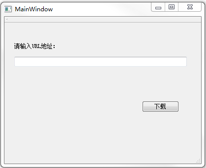

&emsp;&emsp;`mainwindow.h`如下：<!--more-->

``` cpp
#ifndef MAINWINDOW_H
#define MAINWINDOW_H

#include <QMainWindow>
#include <QUrl>

class QFile;
class QNetworkReply;
class QNetworkAccessManager;

namespace Ui {
    class MainWindow;
}

class MainWindow : public QMainWindow {
    Q_OBJECT
public:
    explicit MainWindow ( QWidget *parent = 0 );
    ~MainWindow();
    void startRequest ( QUrl url );
private slots:
    void httpFinished();
    void httpReadyRead();
    void updateDataReadProgress ( qint64, qint64 );
    void on_pushButton_clicked();
private:
    Ui::MainWindow *ui;
    QNetworkAccessManager *manager;
    QNetworkReply *reply;
    QUrl url;
    QFile *file;
};

#endif // MAINWINDOW_H
```

&emsp;&emsp;`mainwindow.cpp`如下：

``` cpp
#include "mainwindow.h"
#include "ui_mainwindow.h"
#include <QtNetwork>
#include <QTextCodec>

MainWindow::MainWindow ( QWidget *parent ) : QMainWindow ( parent ), ui ( new Ui::MainWindow ) {
    ui->setupUi ( this );
    manager = new QNetworkAccessManager ( this );
    ui->progressBar->hide();
}

MainWindow::~MainWindow() {
    delete ui;
}

void MainWindow::startRequest ( QUrl url ) {
    reply = manager->get ( QNetworkRequest ( url ) );
    connect ( reply, SIGNAL ( readyRead() ), this, SLOT ( httpReadyRead() ) );
    connect ( reply, SIGNAL ( downloadProgress ( qint64, qint64 ) ), \
              this, SLOT ( updateDataReadProgress ( qint64, qint64 ) ) );
    connect ( reply, SIGNAL ( finished() ), this, SLOT ( httpFinished() ) );
}

void MainWindow::httpReadyRead() {
    if ( file ) {
        file->write ( reply->readAll() );
    }
}

void MainWindow::updateDataReadProgress ( qint64 bytesRead, qint64 totalBytes ) {
    ui->progressBar->setMaximum ( totalBytes );
    ui->progressBar->setValue ( bytesRead );
}

void MainWindow::httpFinished() {
    ui->progressBar->hide();
    file->flush();
    file->close();
    reply->deleteLater();
    reply = 0;
    delete file;
    file = 0;
}

void MainWindow::on_pushButton_clicked() {
    url = ui->lineEdit->text();
    QFileInfo info ( url.path() );
    QString fileName ( info.fileName() );

    if ( fileName.isEmpty() ) {
        fileName = "index.html";
    }

    file = new QFile ( fileName );

    if ( !file->open ( QIODevice::WriteOnly ) ) {
        qDebug() << "file open error";
        delete file;
        file = 0;
        return;
    }

    startRequest ( url );
    ui->progressBar->setValue ( 0 );
    ui->progressBar->show();
}
```

