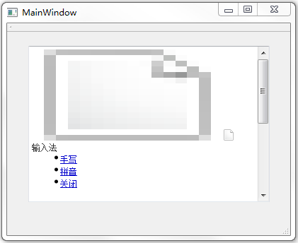

&emsp;&emsp;`mainwindow.h`如下：<!--more-->

``` cpp
#ifndef MAINWINDOW_H
#define MAINWINDOW_H

#include <QMainWindow>
class QNetworkReply;
class QNetworkAccessManager;

namespace Ui {
    class MainWindow;
}

class MainWindow : public QMainWindow {
    Q_OBJECT
public:
    explicit MainWindow ( QWidget *parent = 0 );
    ~MainWindow();
private slots:
    void replyFinished ( QNetworkReply * );
private:
    Ui::MainWindow *ui;
    QNetworkAccessManager *manager;
};

#endif // MAINWINDOW_H
```

&emsp;&emsp;`mainwindow.cpp`如下：

``` cpp
#include "mainwindow.h"
#include "ui_mainwindow.h"
#include <QtNetwork>
#include <QTextCodec>

MainWindow::MainWindow ( QWidget *parent ) : QMainWindow ( parent ), ui ( new Ui::MainWindow ) {
    ui->setupUi ( this );
    manager = new QNetworkAccessManager ( this );
    connect ( manager, SIGNAL ( finished ( QNetworkReply * ) ), \
              this, SLOT ( replyFinished ( QNetworkReply * ) ) );
    manager->get ( QNetworkRequest ( QUrl ( "http://www.baidu.com" ) ) );
}

MainWindow::~MainWindow() {
    delete ui;
}

void MainWindow::replyFinished ( QNetworkReply *reply ) {
    /* QTextCodec *codec = QTextCodec::codecForLocale(); */
    QTextCodec *codec = QTextCodec::codecForName ( "UTF-8" );
    QString all = codec->toUnicode ( reply->readAll() );
    ui->textBrowser->setText ( all );
    reply->deleteLater();
}
```

