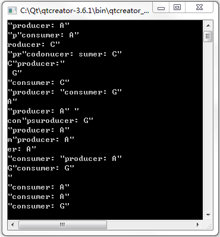

&emsp;&emsp;代码如下：<!--more-->

``` cpp
#include <QtCore>
#include <stdio.h>
#include <stdlib.h>
#include <QDebug>

const int DataSize = 10;
const int BufferSize = 5;
char buffer[BufferSize];

QSemaphore freeBytes ( BufferSize );
QSemaphore usedBytes;

class Producer : public QThread { /* 生产者线程类 */
public:
    void run();
};

void Producer::run() {
    qsrand ( QTime ( 0, 0, 0 ).secsTo ( QTime::currentTime() ) );

    for ( int i = 0; i < DataSize; ++i ) {
        freeBytes.acquire();
        buffer[i % BufferSize] = "ACGT"[ ( int ) qrand() % 4];
        qDebug() << QString ( "producer: %1" ).arg ( buffer[i % BufferSize] );
        usedBytes.release();
    }
}

class Consumer : public QThread { /* 消费者线程类 */
public:
    void run();
};

void Consumer::run() {
    for ( int i = 0; i < DataSize; ++i ) {
        usedBytes.acquire();
        qDebug() << QString ( "consumer: %1" ).arg ( buffer[i % BufferSize] );
        freeBytes.release();
    }
}

int main ( int argc, char *argv[] ) {
    QCoreApplication app ( argc, argv );
    Producer producer;
    Consumer consumer;
    producer.start();
    consumer.start();
    producer.wait();
    consumer.wait();
    return app.exec();
}
```

