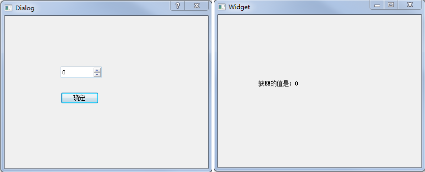

&emsp;&emsp;`widget.h`如下：<!--more-->

``` cpp
#ifndef WIDGET_H
#define WIDGET_H

#include <QWidget>

namespace Ui {
    class Widget;
}

class Widget : public QWidget {
    Q_OBJECT
public:
    explicit Widget ( QWidget *parent = 0 );
    ~Widget();
private slots:
    void showValue ( int value );
private:
    Ui::Widget *ui;
};

#endif // WIDGET_H
```

&emsp;&emsp;`mydialog.h`如下：

``` cpp
#ifndef MYDIALOG_H
#define MYDIALOG_H

#include <QDialog>

namespace Ui {
    class MyDialog;
}

class MyDialog : public QDialog {
    Q_OBJECT
public:
    explicit MyDialog ( QWidget *parent = 0 );
    ~MyDialog();
private slots:
    void on_pushButton_clicked();
signals:
    void dlgReturn ( int ); /* 自定义的信号 */
private:
    Ui::MyDialog *ui;
};

#endif // MYDIALOG_H
```

&emsp;&emsp;`widget.cpp`如下：

``` cpp
#include "widget.h"
#include "ui_widget.h"
#include "mydialog.h"

Widget::Widget ( QWidget *parent ) : QWidget ( parent ), ui ( new Ui::Widget ) {
    ui->setupUi ( this );
    MyDialog *dlg = new MyDialog ( this ); /* 创建对话框 */
    /* 将对话框中的自定义信号与主界面中的自定义槽函数进行关联 */
    connect ( dlg, SIGNAL ( dlgReturn ( int ) ), this, SLOT ( showValue ( int ) ) );
    dlg->show(); /* 显示对话框 */
}

Widget::~Widget() {
    delete ui;
}

void Widget::showValue ( int value ) { /* 自定义槽函数 */
    ui->label->setText ( tr ( "获取的值是：%1" ).arg ( value ) );
}
```

&emsp;&emsp;`mydialog.cpp`如下：

``` cpp
#include "mydialog.h"
#include "ui_mydialog.h"

MyDialog::MyDialog ( QWidget *parent ) : QDialog ( parent ), ui ( new Ui::MyDialog ) {
    ui->setupUi ( this );
}

MyDialog::~MyDialog() {
    delete ui;
}

void MyDialog::on_pushButton_clicked() { /* 确定按钮 */
    int value = ui->spinBox->value(); /* 获取输入的数值 */
    emit dlgReturn ( value ); /* 发射信号 */
    close(); /* 关闭对话框 */
}
```



&emsp;&emsp;声明一个信号要使用`signals`关键字，在`signals`前面不能使用`public`、`private`和`protected`等限定符，因为只有定义该信号的类以及子类才可以发射该信号。而且信号只用声明，不需要也不能对它进行定义实现。信号没有返回值，只能是`void`类型的。因为只有`QObject`类以及其子类派生的类才能使用信号和槽机制。使用信号和槽还必须在类声明的最开始处添加`Q_OBJECT`宏。
&emsp;&emsp;声明一个槽需要使用`slots`关键词。一个槽可以是`private`、`public`或者`protected`类型的，也可以声明为虚函数，这与普通的成员函数是一样的，也可以像调用一个普通函数一样来调用槽。