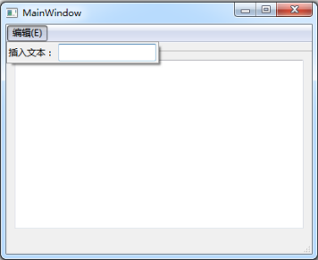

&emsp;&emsp;`mainwindow.h`如下：<!--more-->

``` cpp
#ifndef MAINWINDOW_H
#define MAINWINDOW_H

#include <QMainWindow>

namespace Ui {
    class MainWindow;
}

class MainWindow : public QMainWindow {
    Q_OBJECT
public:
    explicit MainWindow ( QWidget *parent = 0 );
    ~MainWindow();
private:
    Ui::MainWindow *ui;
private slots:
    void setText ( const QString &string ); /* 向编辑器中添加文本 */
};

#endif // MAINWINDOW_H
```

&emsp;&emsp;`myaction.h`如下：

``` cpp
#ifndef MYACTION_H
#define MYACTION_H

#include <QWidgetAction>

class QLineEdit; /* 前置声明 */

class MyAction : public QWidgetAction {
    Q_OBJECT
public:
    explicit MyAction ( QObject *parent = 0 );
protected:
    /* 声明函数，该函数是QWidgetAction类中的虚函数 */
    QWidget *createWidget ( QWidget *parent );
signals:
    /* 新建信号，用于在按下回车键时，将行编辑器中的内容发射出去 */
    void getText ( const QString &string );
private slots:
    void sendText(); /* 新建槽，它用来与行编辑器的按下回车键信号关联 */
private:
    QLineEdit *lineEdit; /* 定义行编辑器对象的指针 */
};

#endif // MYACTION_H
```

&emsp;&emsp;`myaction.cpp`如下：

``` cpp
#include "myaction.h"
#include <QLineEdit>
#include <QSplitter>
#include <QLabel>

MyAction::MyAction ( QObject *parent ) : QWidgetAction ( parent ) {
    lineEdit = new QLineEdit; /* 创建行编辑器 */
    /* 将行编辑器的按下回车键信号与我们的发送文本槽关联 */
    connect ( lineEdit, SIGNAL ( returnPressed() ), this, SLOT ( sendText() ) );
}

/* 创建部件(当使用该类的对象并将其添加到一个部件上时，就会自动调用createWidget函数) */
QWidget *MyAction::createWidget ( QWidget *parent ) {
    /* 这里使用inherits函数判断父部件是否是菜单或者工具栏。
       如果是，则创建该父部件的子部件，并且返回子部件；如果不是，则直接返回0 */
    if ( parent->inherits ( "QMenu" ) || parent->inherits ( "QToolBar" ) ) {
        QSplitter *splitter = new QSplitter ( parent );
        QLabel *label = new QLabel;
        label->setText ( tr ( "插入文本：" ) );
        splitter->addWidget ( label );
        splitter->addWidget ( lineEdit );
        return splitter;
    }

    return 0;
}

void MyAction::sendText() { /* 发送文本 */
    emit getText ( lineEdit->text() ); /* 发射信号，将行编辑器中的内容发射出去 */
    lineEdit->clear(); /* 清空行编辑器中的内容 */
}
```

&emsp;&emsp;`mainwindow.cpp`如下：

``` cpp
#include "mainwindow.h"
#include "ui_mainwindow.h"
#include "myaction.h"

MainWindow::MainWindow ( QWidget *parent ) : QMainWindow ( parent ), ui ( new Ui::MainWindow ) {
    ui->setupUi ( this );
    MyAction *action = new MyAction; /* 创建MyAction */
    QMenu *editMenu = ui->menuBar->addMenu ( tr ( "编辑(&E)" ) );
    editMenu->addAction ( action ); /* 添加菜单并且加入我们的action */
    /* 将action的getText信号和这里的setText槽进行关联 */
    connect ( action, SIGNAL ( getText ( QString ) ), this, SLOT ( setText ( QString ) ) );
}

MainWindow::~MainWindow() {
    delete ui;
}

void MainWindow::setText ( const QString &string ) { /* 插入文本 */
    ui->textEdit->setText ( string ); /* 将获取的文本添加到编辑器中 */
}
```

