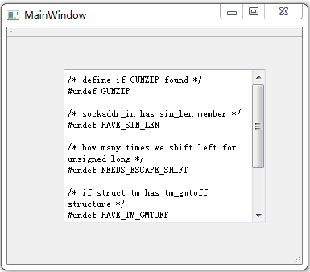

&emsp;&emsp;`mainwindow.h`如下：<!--more-->

``` cpp
#ifndef MAINWINDOW_H
#define MAINWINDOW_H

#include <QMainWindow>

namespace Ui {
    class MainWindow;
}

class MainWindow : public QMainWindow {
    Q_OBJECT
public:
    explicit MainWindow ( QWidget *parent = 0 );
    ~MainWindow();
protected:
    void dragEnterEvent ( QDragEnterEvent *event ); /* 拖动进入事件 */
    void dropEvent ( QDropEvent *event ); /* 放下事件 */
private:
    Ui::MainWindow *ui;
};

#endif // MAINWINDOW_H
```

&emsp;&emsp;`mainwindow.cpp`如下：

``` cpp
#include "mainwindow.h"
#include "ui_mainwindow.h"
#include <QDragEnterEvent>
#include <QUrl>
#include <QFile>
#include <QTextStream>

MainWindow::MainWindow ( QWidget *parent ) : QMainWindow ( parent ), ui ( new Ui::MainWindow ) {
    ui->setupUi ( this );
    setAcceptDrops ( true );
}

MainWindow::~MainWindow() {
    delete ui;
}

void MainWindow::dragEnterEvent ( QDragEnterEvent *event ) { /* 拖动进入事件 */
    if ( event->mimeData()->hasUrls() ) { /* 数据中是否包含URL，如果是则接收动作，否则忽略该事件 */
        event->acceptProposedAction();
    } else {
        event->ignore();
    }
}

void MainWindow::dropEvent ( QDropEvent *event ) { /* 放下事件 */
    const QMimeData *mimeData = event->mimeData(); /* 获取MIME数据 */

    if ( mimeData->hasUrls() ) { /* 如果数据中包含URL */
        QList<QUrl> urlList = mimeData->urls(); /* 获取URL列表 */
        QString fileName = urlList.at ( 0 ).toLocalFile(); /* 将其中第一个URL表示为本地文件路径 */

        if ( !fileName.isEmpty() ) { /* 如果文件路径不为空 */
            QFile file ( fileName ); /* 建立QFile对象并且以只读方式打开该文件 */

            if ( !file.open ( QIODevice::ReadOnly ) ) {
                return;
            }

            QTextStream in ( &file ); /* 建立文本流对象 */
            ui->textEdit->setText ( in.readAll() ); /* 将文件中所有内容读入编辑器 */
        }
    }
}
```

