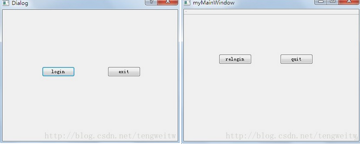

&emsp;&emsp;在用`Qt`设计`GUI`时，经常要设计两个窗口之间的相互切换，即以从一个窗口跳转到另一个窗口，然后又从另一个窗口跳转回原窗口。下面来介绍具体的实现方法。<!--more-->
&emsp;&emsp;首先建立`Qt`的`Gui`应用，项目名是`TwoWindowsHandoff`，基类选择`QMainWindow`。然后右击项目，添加`Qt`设计器界面类，类名取为`logindialog`。我们在这里假设一个窗口是登录对话框，另一个窗口是主界面；登录对话框有两个按钮，分别更改显示文本为`login`、`exit`；主界面也有两个按钮，分别更改显示文本为`relogin`、`quit`。我们最终的实现功能是：程序运行时，出现登录对话框，点击`login`按钮进入主界面且登录对话框消失；在主界面点击`relogin`按钮回到登录对话框且主界面消失，点击`exit`按钮或`quit`按钮都会退出程序。
&emsp;&emsp;我们可以通过`Qt Designer`来在两个窗口上分别添加上述按钮，主要的问题是如何设计信号和槽。我们先设计两个窗口的退出按钮：分别右击`exit`和`quit`按钮，转到槽，在槽函数中发射`quit`信号，然后将信号与`QApplication`对象的`quit`槽函数关联，这样就设计好了两个退出按钮的退出操作。对于`login`按钮，我们在其槽函数中发射`showmainwindow`信号，隐藏对话框，然后在主窗口类中定义对应的槽函数`receivelogin`，在该函数中应该显示主窗口。同理，对于`relogin`窗口，我们在其槽函数中发射`dlgshow`信号，隐藏主窗口，然后在登录对话框类中定义对应的槽函数`receivelshow`，在该函数中应该显示登录对话框。具体的程序实现如下：
&emsp;&emsp;`mainwindow.h`如下：

``` cpp
#ifndef MAINWINDOW_H
#define MAINWINDOW_H

#include <QMainWindow>

namespace Ui {
    class MainWindow;
}

class MainWindow : public QMainWindow {
    Q_OBJECT
public:
    explicit MainWindow ( QWidget *parent = 0 );
    ~MainWindow();
private:
    Ui::MainWindow *ui;
private slots:
    void receivelogin(); /* 与login中发射的信号关联的槽函数 */
    void on_pushButton_clicked(); /* 与relogin的click关联的槽函数 */
    void on_pushButton_2_clicked(); /* 与quit的click关联的槽函数 */
signals:
    void dlgshow(); /* 显示登录对话框信号 */
    void quit(); /* 退出信号 */
};

#endif // MAINWINDOW_H
```

&emsp;&emsp;`mydialog.h`如下：

``` cpp
#ifndef MYDIALOG_H
#define MYDIALOG_H

#include <QDialog>

namespace Ui {
    class MyDialog;
}

class MyDialog : public QDialog {
    Q_OBJECT
public:
    explicit MyDialog ( QWidget *parent = 0 );
    ~MyDialog();
private slots:
    void on_pushButton_clicked(); /* 与login关联的槽函数 */
    void receiveshow(); /* 与relogin中发射的信号关联的槽函数 */
    void on_pushButton_2_clicked(); /* 与exit关联的槽函数 */
signals:
    void showmainwindow(); /* 显示主窗口信号 */
    void quit(); /* 退出信号 */
private:
    Ui::MyDialog *ui;
};
#endif // MYDIALOG_H
```

&emsp;&emsp;`main.cpp`如下：

``` cpp
#include <QtGui/QApplication>
#include "mainwindow.h"
#include "mydialog.h"

int main ( int argc, char *argv[] ) {
    QApplication a ( argc, argv );
    MainWindow w;
    MyDialog dlg;
    dlg.show();
    /* 信号与槽之间进行关联 */
    QObject::connect ( &dlg, SIGNAL ( showmainwindow() ), &w, SLOT ( receivelogin() ) );
    QObject::connect ( &w, SIGNAL ( dlgshow() ), &dlg, SLOT ( receiveshow() ) );
    QObject::connect ( &w, SIGNAL ( quit() ), &a, SLOT ( quit() ) );
    QObject::connect ( &dlg, SIGNAL ( quit() ), &a, SLOT ( quit() ) );
    return a.exec();
}
```

&emsp;&emsp;`mainwindow.cpp`如下：

``` cpp
#include "mainwindow.h"
#include "ui_mainwindow.h"
#include <QPushButton>
#include <QHBoxLayout>

MainWindow::MainWindow ( QWidget *parent ) : QMainWindow ( parent ), ui ( new Ui::MainWindow ) {
    ui->setupUi ( this ); /* 默认是类名 */
    setWindowTitle ( tr ( "myMainWindow" ) );
}

MainWindow::~MainWindow() {
    delete ui;
}

void MainWindow::receivelogin() {
    this->show(); /* 显示主窗口 */
}

void MainWindow::on_pushButton_clicked() {
    this->hide(); /* 隐藏主窗口 */
    emit dlgshow(); /* 发射显示登录对话框信号 */
}

void MainWindow::on_pushButton_2_clicked() {
    emit quit(); /* 发射退出信号 */
}
```

&emsp;&emsp;`mydialog.cpp`如下：

``` cpp
#include "mydialog.h"
#include "ui_mydialog.h"
#include <QHBoxLayout>
#include <mainwindow.h>

MyDialog::MyDialog ( QWidget *parent ) : QDialog ( parent ), ui ( new Ui::MyDialog ) {
    ui->setupUi ( this );
}

MyDialog::~MyDialog() {
    delete ui;
}

void MyDialog::on_pushButton_clicked() {
    this->hide(); /* 隐藏登录对话框 */
    emit showmainwindow(); /* 显示主窗口 */
}

void MyDialog::receiveshow() {
    this->show(); /* 显示登录对话框 */
}

void MyDialog::on_pushButton_2_clicked() {
    emit quit(); /* 发射退出信号 */
}
```

