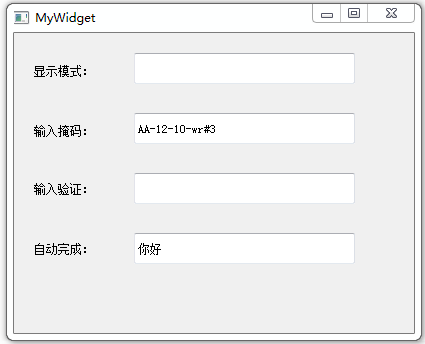
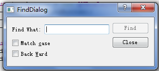

### 行编辑器

&emsp;&emsp;`mywidget.h`如下：<!--more-->

``` cpp
#ifndef MYWIDGET_H
#define MYWIDGET_H

#include <QWidget>

namespace Ui {
    class MyWidget;
}

class MyWidget : public QWidget {
    Q_OBJECT
public:
    explicit MyWidget ( QWidget *parent = 0 );
    ~MyWidget();
private slots:
    void on_lineEdit2_returnPressed();
    void on_lineEdit3_returnPressed();
private:
    Ui::MyWidget *ui;
};

#endif // MYWIDGET_H
```

&emsp;&emsp;`mywidget.cpp`如下：

``` cpp
#include "mywidget.h"
#include "ui_mywidget.h"
#include <QDebug>
#include <QCompleter>

MyWidget::MyWidget ( QWidget *parent ) : QWidget ( parent ), ui ( new Ui::MyWidget ) {
    ui->setupUi ( this );
    QValidator *validator = new QIntValidator ( 100, 999, this ); /* 新建验证器，指定范围为100至999 */
    ui->lineEdit3->setValidator ( validator ); /* 在行编辑器中使用验证器 */
    QStringList wordList;
    wordList << "Qt" << "Qt Creator" << tr ( "你好" );
    QCompleter *completer = new QCompleter ( wordList, this ); /* 新建自动完成器 */
    completer->setCaseSensitivity ( Qt::CaseInsensitive ); /* 设置大小写不敏感 */
    ui->lineEdit4->setCompleter ( completer );
}

MyWidget::~MyWidget() {
    delete ui;
}

void MyWidget::on_lineEdit2_returnPressed() { /* 回车键按下信号的槽 */
    ui->lineEdit3->setFocus(); /* 让lineEdit3获得光标 */
    qDebug() << ui->lineEdit2->text(); /* 输出lineEdit2的内容 */
    qDebug() << ui->lineEdit2->displayText(); /* 输出lineEdit2显示的内容 */
}

void MyWidget::on_lineEdit3_returnPressed() { /* 回车键按下信号的槽 */
    ui->lineEdit4->setFocus();
    qDebug() << ui->lineEdit3->text();
}
```



---

### lineEdit->textChanged信号不触发的原因

&emsp;&emsp;项目要求是当`lineEdit`中的内容发生改变时，激活`find`按纽。但实际运行结果却不行，发现是自己的`connect`语句写错了：



``` cpp
// connect ( lineEdit, SIGNAL ( textChanged ( QString & ) ), this, SLOT ( enableFindButton ( QString & ) ) ); /* 错误写法 */
connect ( lineEdit, SIGNAL ( textChanged ( const QString & ) ), this, SLOT ( enableFindButton ( const QString & ) ) );
```

---

### Qt设置密码输入框

&emsp;&emsp;`QLineEdit`类自带`public function: void setEchoMode(EchoMode)`以实现密码输入框效果。`EchoMode`的枚举值如下：

Constant                        | Value | Description
--------------------------------|-------|------------
`QLineEdit::Normal`             | `0`   | 正常显示形式，也就是一边输入一边显示
`QLineEdit::NoEcho`             | `1`   | 不会显示任何字符，包括字符串长度
`QLineEdit::Password`           | `2`   | 根据平台使用模糊字符代替你实际输入的字符
`QLineEdit::PasswordEchoOnEdit` | `3`   | 当你处于输入状态的时候，是正常显示字符。输入完毕之后使用`Password`形式隐藏字符

通过`EchoMode`提供枚举值有选择的设置`setEchoMode(EchoMode)`，以达到自己想要的效果。

---

- `text()`：获得`lineEdit`中的内容，为`QString`类型。