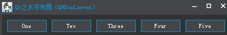

### 简述

&emsp;&emsp;`QBoxLayout`可以在水平方向或垂直方向上排列控件，由`QHBoxLayout`、`QVBoxLayout`所继承。<!--more-->

- `QHBoxLayout`：水平布局，在水平方向上排列控件，即左右排列。
- `QVBoxLayout`：垂直布局，在垂直方向上排列控件，即上下排列。

&emsp;&emsp;通过查看源码可以发现，水平布局、垂直布局除了构造时的方向(`LeftToRight`、`TopToBottom`)不同外，其它均相同。下面以`QHBoxLayout`为例，来讲解`QBoxLayout`的常用功能。

### 使用

&emsp;&emsp;下面介绍下水平布局的基本使用。


&emsp;&emsp;下面创建`5`个按钮，然后添加至水平不居中：

``` cpp
QPushButton *pButton1 = new QPushButton ( "One" );
QPushButton *pButton2 = new QPushButton ( "Two" );
QPushButton *pButton3 = new QPushButton ( "Three" );
QPushButton *pButton4 = new QPushButton ( "Four" );
QPushButton *pButton5 = new QPushButton ( "Five" );

QHBoxLayout *pHLayout = new QHBoxLayout();
pHLayout->addWidget ( pButton1 );
pHLayout->addWidget ( pButton2 );
pHLayout->addWidget ( pButton3 );
pHLayout->addWidget ( pButton4 );
pHLayout->addWidget ( pButton5 );

setLayout ( pHLayout );
```

### 常用接口

&emsp;&emsp;默认的外边距为`0`，为了美观性，可以设置`Margin`：

- `setMargin(int);`
- `setContentsMargins(int left, int top, int right, int bottom);`
- `setContentsMargins(const QMargins &margins);`

&emsp;&emsp;`setMargin`可以设置左、上、右、下的外边距，设置之后，它们的外边距是相同的。`setContentsMargins`与其功能相同，但是可以将左、上、右、下的外边距设置为不同的值。这里我使用`setMargin(10)`将外边距设置为`10`：



&emsp;&emsp;`setSpacing(int)`的作用是设置间距。一般情况下，界面会有一个默认间距值。为了保持所有布局的统一性或者需要一个更合适的间距值，则需要手动设置。这里使用`setSpacing(0)`将间距设置为`0`：


&emsp;&emsp;`addStretch`的作用是添加了一个伸缩空间(`QSpacerItem`)。居右效果如下：


&emsp;&emsp;在第一个控件之前添加伸缩，这样所有的控件就会居右显示：

``` cpp
QHBoxLayout *pHLayout = new QHBoxLayout();
pHLayout->addStretch(); /* 添加伸缩 */
pHLayout->addWidget ( pButton1 );
pHLayout->addWidget ( pButton2 );
pHLayout->addWidget ( pButton3 );
pHLayout->addWidget ( pButton4 );
pHLayout->addWidget ( pButton5 );
```

&emsp;&emsp;居左效果如下：


&emsp;&emsp;在最后一个控件之后添加伸缩，这样所有的控件就会居左显示。

``` cpp
QHBoxLayout *pHLayout = new QHBoxLayout();
pHLayout->addWidget ( pButton1 );
pHLayout->addWidget ( pButton2 );
pHLayout->addWidget ( pButton3 );
pHLayout->addWidget ( pButton4 );
pHLayout->addWidget ( pButton5 );
pHLayout->addStretch(); /* 添加伸缩 */
```

&emsp;&emsp;居中效果如下：


&emsp;&emsp;在第一个控件之前、最后一个控件之后添加伸缩，这样所有的控件就会居中显示。

``` cpp
QHBoxLayout *pHLayout = new QHBoxLayout();
pHLayout->addStretch(); /* 第一个控件之前添加伸缩 */
pHLayout->addWidget ( pButton1 );
pHLayout->addWidget ( pButton2 );
pHLayout->addWidget ( pButton3 );
pHLayout->addWidget ( pButton4 );
pHLayout->addWidget ( pButton5 );
pHLayout->addStretch(); /* 最后一个控件之后添加伸缩 */
pHLayout->setSpacing ( 10 );
```

&emsp;&emsp;均分效果如下：


&emsp;&emsp;在每一个控件之间都添加伸缩，这样所有的控件之间的间距都会相同。

``` cpp
QHBoxLayout *pHLayout = new QHBoxLayout();
pHLayout->addStretch();
pHLayout->addWidget ( pButton1 );
pHLayout->addStretch();
pHLayout->addWidget ( pButton2 );
pHLayout->addStretch();
pHLayout->addWidget ( pButton3 );
pHLayout->addStretch();
pHLayout->addWidget ( pButton4 );
pHLayout->addStretch();
pHLayout->addWidget ( pButton5 );
pHLayout->addStretch();
pHLayout->setSpacing ( 0 );
```

`addWidget`的作用是添加控件，其函数原型如下：

``` cpp
addWidget ( QWidget *, int stretch = 0, Qt::Alignment alignment = 0 );
```

&emsp;&emsp;默认情况下，我们添加控件至水平布局中，默认都是垂直方向居中对齐的：


&emsp;&emsp;当存在控件大小不相同的时候，就会看得很明显了。如果需要将其中的某些控件居上、居下显示，那么可以使用对齐方式`Qt::Alignment`。下面使用向上、向下对齐来设置其它控件：

``` cpp
QHBoxLayout *pHLayout = new QHBoxLayout();
pHLayout->addStretch();
/* 水平居左，垂直居上 */
pHLayout->addWidget ( pButton1, 0, Qt::AlignLeft | Qt::AlignTop );
pHLayout->addWidget ( pButton2, 0, Qt::AlignLeft | Qt::AlignTop );
pHLayout->addWidget ( pButton3 );
/* 水平居左，垂直居下 */
pHLayout->addWidget ( pButton4, 0, Qt::AlignLeft | Qt::AlignBottom );
pHLayout->addWidget ( pButton5, 0, Qt::AlignLeft | Qt::AlignBottom );
pHLayout->setSpacing ( 10 );
```


&emsp;&emsp;`setDirection(Direction)`的作用是设置布局方向，可以设置从左到右、从右到左、从上到下、从下到上等。
&emsp;&emsp;`setDirection(QBoxLayout::RightToLeft)`的效果如下：


&emsp;&emsp;`setDirection(QBoxLayout::TopToBottom)`的效果如下：


&emsp;&emsp;既然使用了`QHBoxLayout`，一般就不建议使用`TopToBottom`或者`BottomToTop`，如果实在确定不了方向，或者方向可以随意变化，那么建议使用`QBoxLayout`。
&emsp;&emsp;`setStretchFactor`可以用来设置控件、布局的拉伸系数：

``` cpp
setStretchFactor( QWidget *w, int stretch );
setStretchFactor( QLayout *l, int stretch );
```

&emsp;&emsp;当窗体大小变化时，控件会根据拉伸系数来做相应的调整：

``` cpp
setStretchFactor ( pButton1, 1 );
setStretchFactor ( pButton2, 2 );
```


设置`pButton1`的拉伸系数为`1`，`pButton2`拉伸系数为`2`，当窗体变大时，会优先将`pButton2`进行拉伸；当达到一定程度时，再拉伸`pButton1`，`pButton1`与`pButton2`的宽度比例为`1:2`。