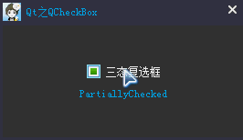

### 简述

&emsp;&emsp;`QCheckBox`继承自`QAbstractButton`，它提供了一个带文本标签的复选框。`QCheckBox`(复选框)和`QRadioButton`(单选框)都是选项按钮，这是因为它们都可以在开(选中)或者关(未选中)之间切换。区别是对用户选择的限制：单选框定义了`多选一`的选择，而复选框提供的是`多选多`的选择。尽管在技术上可以通过复选框来实现单选框的行为，反之亦然，但还是强烈建议使用众所周知的约定。<!--more-->

### 详细描述

&emsp;&emsp;`QButtonGroup`可以用来在视觉上把许多复选框组织在一起。只要复选框被选中或者清除，都会发射一个`stateChanged`信号。如果想在复选框状态改变的时候触发一个行为，请连接这个信号，可以使用`isChecked`来查询复选框是否被选中。除了常用的选中和未选中两个状态，`QCheckBox`还可选地提供了第三种状态(半选)来表明`没有变化`。当需要给用户一个选中或者未选中复选框的选择时，这是很有用的。如果需要第三种状态，可以通过`setTristate`来使它生效，并使用`checkState`来查询当前的切换状态。
&emsp;&emsp;和`QPushButton`一样，复选框可以显示文本或者图标。文本可以通过构造函数或者`setText`来设置，图标可以通过`setIcon`来设置。

``` cpp
QCheckBox *checkbox = new QCheckBox ( "C&ase sensitive", this );
```

这个例子中，快捷键为`Alt + a`。要显示一个实际的符号`&`，使用`&&`。

### 公有函数

&emsp;&emsp;公有函数如下：

``` cpp
/* 返回复选框的选中状态。如果不需要三态的支持，可以使用QAbstractButton::isChecked，它返回一个布尔值 */
Qt::CheckState checkState() const;
/* 复选框是否为一个三态复选框。默认的是false，也就是说复选框只有两个状态 */
bool isTristate() const;
/* 设置复选框的选中状态。如果不需要三态的支持，可以使用QAbstractButton:setChecked，它接受一个布尔值 */
void setCheckState(Qt::CheckState state);
void setTristate(bool y = true) /* 设置复选框为一个三态复选框 */
```

### 信号

&emsp;&emsp;信号如下：

``` cpp
/* 当复选框状态发生改变，这个信号就会被发射，即用户选中或者取消选中 */
void stateChanged(int state);
```

### 三态复选框

&emsp;&emsp;下面实现一个三态复选框，并监听状态变化：



&emsp;&emsp;构造一个复选框`QCheckBox`，然后使用`setTristate`开启三态模式：

``` cpp
QCheckBox *pCheckBox = new QCheckBox ( this );
m_pLabel = new QLabel ( this );
m_pLabel->setText ( "Click CheckBox..." );
pCheckBox->setText ( QString::fromLocal8Bit ( "三态复选框" ) );
pCheckBox->setTristate(); /* 开启三态模式 */
/* 连接信号槽 */
connect ( pCheckBox, SIGNAL ( stateChanged ( int ) ), this, SLOT ( onStateChanged ( int ) ) );
```

槽函数是用来判断当前复选框状态，其中包括选中(`Qt::Checked`)、半选(`Qt::PartiallyChecked`)、未选中(`Qt::Unchecked`)：

``` cpp
void MainWindow::onStateChanged ( int state ) {
    if ( state == Qt::Checked ) { /* 选中 */
        m_pLabel->setText ( "Checked" );
    } else if ( state == Qt::PartiallyChecked ) { /* 半选 */
        m_pLabel->setText ( "PartiallyChecked" );
    } else { /* 未选中，即Qt::Unchecked */
        m_pLabel->setText ( "Unchecked" );
    }
}
```

连接`stateChanged`信号和槽函数，当用户点击复选框时，状态发生改变就会调用槽函数。