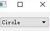
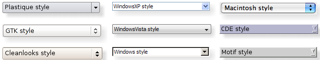

&emsp;&emsp;`QComboBox`提供了下拉列表框的控件，下面简单地介绍几个的方法和属性。<!--more-->
&emsp;&emsp;`addItems`在列表的最后一项添加一个文本内容为`text`选项：

``` cpp
void addItem ( const QString &text, const QVariant &userData = QVariant() );
void addItem ( const QIcon &icon, const QString &text, const QVariant &userData = QVariant() );
```

&emsp;&emsp;`currentText`返回下拉列表框中当前选中的文本：

``` cpp
QString currentText() const;
```

&emsp;&emsp;`count`返回当前列表框中选项数量：

``` cpp
int count() const;
```

&emsp;&emsp;`currentIndex`返回当前列表框中选中文本的序号：

``` cpp
int currentIndex() const;
```

&emsp;&emsp;代码如下：

``` cpp
#include "widget.h"
#include <QComboBox>
#include <QLayout>
#include <QDebug>

Widget::Widget ( QWidget *parent ) : QWidget ( parent ) {
    QComboBox *combobox = new QComboBox ( this );
    combobox->addItem ( tr ( "Circle" ) );
    combobox->addItem ( tr ( "Pology" ) );
    QGridLayout *mainLayout = new QGridLayout ( this );
    mainLayout->addWidget ( combobox, 0, 0 );
    qDebug() << "Now there are " << combobox->count() << "Items";
    qDebug() << "The current item is" << combobox->currentText();
}

Widget::~Widget() {
}
```



执行结果：

``` cpp
Now there are 2 Items
The current item is "Circle"
```

---

&emsp;&emsp;The `QComboBox` widget is a combined button and popup list.

Header      | Inherits  | Inherited By
------------|-----------|-------------
`QComboBox` | `QWidget` | `QFontComboBox`

### Public Functions

Return                    | Function
--------------------------|----------
                          | `QComboBox(QWidget * parent = 0)`
                          | `~QComboBox()`
`void`                    | `addItem(const QString & text, const QVariant & userData = QVariant())`
`void`                    | `addItem(const QIcon & icon, const QString & text, const QVariant & userData = QVariant())`
`void`                    | `addItems(const QStringList & texts)`
`QCompleter *`            | `completer() const`
`int`                     | `count() const`
`int`                     | `currentIndex() const`
`QString`                 | `currentText() const`
`bool`                    | `duplicatesEnabled() const`
`int`                     | <code>findData(const QVariant & data, int role = Qt::UserRole, Qt::MatchFlags flags = static_cast<Qt::MatchFlags> ( Qt::MatchExactly &#124; Qt::MatchCaseSensitive )) const<code \>
`int`                     | <code>findText(const QString & text, Qt::MatchFlags flags = static_cast<Qt::MatchFlags> ( Qt::MatchExactly &#124; Qt::MatchCaseSensitive )) const<code \>
`bool`                    | `hasFrame() const`
`virtual void`            | `hidePopup()`
`QSize`                   | `iconSize() const`
`void`                    | `insertItem(int index, const QString & text, const QVariant & userData = QVariant())`
`void`                    | `insertItem(int index, const QIcon & icon, const QString & text, const QVariant & userData = QVariant())`
`void`                    | `insertItems(int index, const QStringList & list)`
`InsertPolicy`            | `insertPolicy() const`
`void`                    | `insertSeparator(int index)`
`bool`                    | `isEditable() const`
`QVariant`                | `itemData(int index, int role = Qt::UserRole) const`
`QAbstractItemDelegate *` | `itemDelegate() const`
`QIcon`                   | `itemIcon(int index) const`
`QString`                 | `itemText(int index) const`
`QLineEdit *`             | `lineEdit() const`
`int`                     | `maxCount() const`
`int`                     | `maxVisibleItems() const`
`int`                     | `minimumContentsLength() const`
`QAbstractItemModel *`    | `model() const`
`int`                     | `modelColumn() const`
`void`                    | `removeItem(int index)`
`QModelIndex`             | `rootModelIndex() const`
`void`                    | `setCompleter(QCompleter * completer)`
`void`                    | `setDuplicatesEnabled(bool enable)`
`void`                    | `setEditable(bool editable)`
`void`                    | `setFrame(bool)`
`void`                    | `setIconSize(const QSize & size)`
`void`                    | `setInsertPolicy(InsertPolicy policy)`
`void`                    | `setItemData(int index, const QVariant & value, int role = Qt::UserRole)`
`void`                    | `setItemDelegate(QAbstractItemDelegate * delegate)`
`void`                    | `setItemIcon(int index, const QIcon & icon)`
`void`                    | `setItemText(int index, const QString & text)`
`void`                    | `setLineEdit(QLineEdit * edit)`
`void`                    | `setMaxCount(int max)`
`void`                    | `setMaxVisibleItems(int maxItems)`
`void`                    | `setMinimumContentsLength(int characters)`
`void`                    | `setModel(QAbstractItemModel * model)`
`void`                    | `setModelColumn(int visibleColumn)`
`void`                    | `setRootModelIndex(const QModelIndex & index)`
`void`                    | `setSizeAdjustPolicy(SizeAdjustPolicy policy)`
`void`                    | `setValidator(const QValidator * validator)`
`void`                    | `setView(QAbstractItemView * itemView)`
`virtual void`            | `showPopup()`
`SizeAdjustPolicy`        | `sizeAdjustPolicy() const`
`const QValidator *`      | `validator() const`
`QAbstractItemView *`     | `view() const`

### Reimplemented Public Functions

Return          | Function
----------------|---------
`virtual bool`  | `event(QEvent * event)`
`virtual QSize` | `minimumSizeHint() const`
`virtual QSize` | `sizeHint() const`

### Public Slots

Return | Function
-------|---------
`void` | `clear()`
`void` | `clearEditText()`
`void` | `setCurrentIndex(int index)`
`void` | `setEditText(const QString & text)`

### Signals

Return | Function
-------|---------
`void` | `activated(int index)`
`void` | `activated(const QString & text)`
`void` | `currentIndexChanged(int index)`
`void` | `currentIndexChanged(const QString & text)`
`void` | `editTextChanged(const QString & text)`
`void` | `highlighted(int index)`
`void` | `highlighted(const QString & text)`

### Protected Functions

- `void initStyleOption(QStyleOptionComboBox * option) const`

### Reimplemented Protected Functions

Return             | Function
-------------------|---------
`virtual void`     | `changeEvent(QEvent * e)`
`virtual void`     | `contextMenuEvent(QContextMenuEvent * e)`
`virtual void`     | `focusInEvent(QFocusEvent * e)`
`virtual void`     | `focusOutEvent(QFocusEvent * e)`
`virtual void`     | `hideEvent(QHideEvent * e)`
`virtual void`     | `inputMethodEvent(QInputMethodEvent * e)`
`virtual QVariant` | `inputMethodQuery(Qt::InputMethodQuery query) const`
`virtual void`     | `keyPressEvent(QKeyEvent * e)`
`virtual void`     | `keyReleaseEvent(QKeyEvent * e)`
`virtual void`     | `mousePressEvent(QMouseEvent * e)`
`virtual void`     | `mouseReleaseEvent(QMouseEvent * e)`
`virtual void`     | `paintEvent(QPaintEvent * e)`
`virtual void`     | `resizeEvent(QResizeEvent * e)`
`virtual void`     | `showEvent(QShowEvent * e)`
`virtual void`     | `wheelEvent(QWheelEvent * e)`

### Detailed Description

&emsp;&emsp;The `QComboBox` widget is a combined button and popup list.
&emsp;&emsp;A `QComboBox` provides a means of presenting a list of options to the user in a way that takes up the minimum amount of screen space.
&emsp;&emsp;A combobox is a selection widget that displays the current item, and can pop up a list of selectable items. A combobox may be editable, allowing the user to modify each item in the list.
&emsp;&emsp;Comboboxes can contain pixmaps as well as strings; the `insertItem()` and `setItemText()` functions are suitably overloaded. For editable comboboxes, the function `clearEditText()` is provided, to clear the displayed string without changing the combobox's contents.
&emsp;&emsp;There are two signals emitted if the current item of a combobox changes, `currentIndexChanged()` and `activated()`. `currentIndexChanged()` is always emitted regardless if the change was done programmatically or by user interaction, while `activated()` is only emitted when the change is caused by user interaction. The `highlighted()` signal is emitted when the user highlights an item in the combobox popup list. All three signals exist in two versions, one with a `QString` argument and one with an int argument. If the user selects or highlights a pixmap, only the int signals are emitted. Whenever the text of an editable combobox is changed the `editTextChanged()` signal is emitted.
&emsp;&emsp;When the user enters a new string in an editable combobox, the widget may or may not insert it, and it can insert it in several locations. The default policy is is `AtBottom` but you can change this using `setInsertPolicy()`.
&emsp;&emsp;It is possible to constrain the input to an editable combobox using `QValidator`; see `setValidator()`. By default, any input is accepted.
&emsp;&emsp;A combobox can be populated using the insert functions, `insertItem()` and `insertItems()` for example. Items can be changed with `setItemText()`. An item can be removed with `removeItem()` and all items can be removed with `clear()`. The text of the current item is returned by `currentText()`, and the text of a numbered item is returned with `text()`. The current item can be set with `setCurrentIndex()`. The number of items in the combobox is returned by `count()`; the maximum number of items can be set with `setMaxCount()`. You can allow editing using `setEditable()`. For editable comboboxes you can set `auto-completion` using `setCompleter()` and whether or not the user can add duplicates is set with `setDuplicatesEnabled()`.
&emsp;&emsp;`QComboBox` uses the `model/view` framework for its popup list and to store its items. By default a `QStandardItemModel` stores the items and a `QListView` subclass displays the popuplist. You can access the model and view directly (with `model()` and `view()`), but `QComboBox` also provides functions to set and get item data (e.g., `setItemData()` and `itemText()`). You can also set a new model and view (with `setModel()` and `setView()`). For the text and icon in the combobox label, the data in the model that has the `Qt::DisplayRole` and `Qt::DecorationRole` is used. Note that you cannot alter the `SelectionMode` of the `view()`, e.g., by using `setSelectionMode()`.



### Member Type Documentation

- enum `QComboBox::InsertPolicy`: This enum specifies what the `QComboBox` should do when a new string is entered by the user.

Constant                          | Value | Description
----------------------------------|-------|------------
`QComboBox::NoInsert`             | `0`   | The string will not be inserted into the combobox.
`QComboBox::InsertAtTop`          | `1`   | The string will be inserted as the first item in the combobox.
`QComboBox::InsertAtCurrent`      | `2`   | The current item will be replaced by the string.
`QComboBox::InsertAtBottom`       | `3`   | The string will be inserted after the last item in the combobox.
`QComboBox::InsertAfterCurrent`   | `4`   | The string is inserted after the current item in the combobox.
`QComboBox::InsertBeforeCurrent`  | `5`   | The string is inserted before the current item in the combobox.
`QComboBox::InsertAlphabetically` | `6`   | The string is inserted in the alphabetic order in the combobox.

- enum `QComboBox::SizeAdjustPolicy`: This enum specifies how the size hint of the `QComboBox` should adjust when new content is added or content changes.

Constant                                           | Value | Description
---------------------------------------------------|-------|-------------
`QComboBox::AdjustToContents`                      | `0`   | The combobox will always adjust to the contents
`QComboBox::AdjustToContentsOnFirstShow`           | `1`   | The combobox will adjust to its contents the first time it is shown.
`QComboBox::AdjustToMinimumContentsLength`         | `2`   | Use `AdjustToContents` or `AdjustToContentsOnFirstShow` instead.
`QComboBox::AdjustToMinimumContentsLengthWithIcon` | `3`   | The combobox will adjust to `minimumContentsLength` plus space for an icon. For performance reasons use this policy on large models.

### Property Documentation

- `count : const int`: This property holds the number of items in the combobox. By default, for an empty combo box, this property has a value of `0`. Access functions:

``` cpp
int count() const
```

- `currentIndex : int`: This property holds the index of the current item in the combobox. The current index can change when inserting or removing items. By default, for an empty combo box or a combo box in which no current item is set, this property has a value of `-1`. Access functions:

``` cpp
int currentIndex() const
void setCurrentIndex ( int index )
```

Notifier signal:

``` cpp
void currentIndexChanged ( int index )
void currentIndexChanged ( const QString &text )
```

- `currentText : const QString`: This property holds the current text. If the combo box is editable, the current text is the value displayed by the line edit. Otherwise, it is the value of the current item or an empty string if the combo box is empty or no current item is set. Access functions:

``` cpp
QString currentText() const
```

- `duplicatesEnabled : bool`: This property holds whether the user can enter duplicate items into the combobox. Note that it is always possible to programmatically insert duplicate items into the combobox. By default, this property is false (duplicates are not allowed). Access functions:

``` cpp
bool duplicatesEnabled() const
void setDuplicatesEnabled ( bool enable )
```

- `editable : bool`: This property holds whether the combo box can be edited by the user. By default, this property is false. The effect of editing depends on the insert policy. Access functions:

``` cpp
bool isEditable() const
void setEditable ( bool editable )
```

- `frame : bool`: This property holds whether the combo box draws itself with a frame. If enabled (the default) the combo box draws itself inside a frame, otherwise the combo box draws itself without any frame. Access functions:

``` cpp
bool hasFrame() const
void setFrame ( bool )
```

- `iconSize : QSize`: This property holds the size of the icons shown in the combobox. Unless explicitly set this returns the default value of the current style. This size is the maximum size that icons can have; icons of smaller size are not scaled up. Access functions:

``` cpp
QSize iconSize() const
void setIconSize ( const QSize &size )
```

- `insertPolicy : InsertPolicy`: This property holds the policy used to determine where `user-inserted` items should appear in the combobox. The default value is `AtBottom`, indicating that new items will appear at the bottom of the list of items. Access functions:

``` cpp
InsertPolicy insertPolicy() const
void setInsertPolicy ( InsertPolicy policy )
```

- `maxCount : int`: This property holds the maximum number of items allowed in the combobox. **Note**: If you set the maximum number to be less then the current amount of items in the combobox, the extra items will be truncated. This also applies if you have set an external model on the combobox. By default, this property's value is derived from the highest signed integer available (typically `2147483647`). Access functions:

``` cpp
int maxCount() const
void setMaxCount ( int max )
```

- `maxVisibleItems : int`: This property holds the maximum allowed size on screen of the combo box, measured in items. By default, this property has a value of `10`. **Note**: This property is ignored for `non-editable` comboboxes in styles that returns true for `QStyle::SH_ComboBox_Popup` such as the `Mac` style or the `Gtk+` Style. Access functions:

``` cpp
int maxVisibleItems() const
void setMaxVisibleItems ( int maxItems )
```

- `minimumContentsLength : int`: This property holds the minimum number of characters that should fit into the combobox. The default value is `0`. If this property is set to a positive value, the `minimumSizeHint()` and `sizeHint()` take it into account. Access functions:

``` cpp
int minimumContentsLength() const
void setMinimumContentsLength ( int characters )
```

- `modelColumn : int`: This property holds the column in the model that is visible. If set prior to populating the combo box, the `pop-up` view will not be affected and will show the first column (using this property's default value). By default, this property has a value of `0`. Access functions:

``` cpp
int modelColumn() const
void setModelColumn ( int visibleColumn )
```

- `sizeAdjustPolicy : SizeAdjustPolicy`: This property holds the policy describing how the size of the combobox changes when the content changes. The default value is `AdjustToContentsOnFirstShow`. Access functions:

``` cpp
SizeAdjustPolicy sizeAdjustPolicy() const
void setSizeAdjustPolicy ( SizeAdjustPolicy policy )
```

### Member Function Documentation

- `QComboBox::QComboBox(QWidget * parent = 0)`: Constructs a combobox with the given `parent`, using the default model `QStandardItemModel`.
- `QComboBox::~QComboBox()`: Destroys the combobox.
- `void QComboBox::activated(int index) [signal]`: This signal is sent when the user chooses an item in the combobox. The item's `index` is passed. Note that this signal is sent even when the choice is not changed. If you need to know when the choice actually changes, use signal `currentIndexChanged()`.
- `void QComboBox::activated(const QString & text) [signal]`: This signal is sent when the user chooses an item in the combobox. The item's `text` is passed. Note that this signal is sent even when the choice is not changed. If you need to know when the choice actually changes, use signal `currentIndexChanged()`.
- `void QComboBox::addItem(const QString & text, const QVariant & userData = QVariant())`: Adds an item to the combobox with the given `text`, and containing the specified `userData` (stored in the `Qt::UserRole`). The item is appended to the list of existing items.
- `void QComboBox::addItem(const QIcon & icon, const QString & text, const QVariant & userData = QVariant())`: Adds an item to the combobox with the given `icon` and `text`, and containing the specified `userData` (stored in the `Qt::UserRole`). The item is appended to the list of existing items.
- `void QComboBox::addItems(const QStringList & texts)`: Adds each of the strings in the given `texts` to the combobox. Each item is appended to the list of existing items in turn.
- `void QComboBox::changeEvent(QEvent * e) [virtual protected]`: Reimplemented from `QWidget::changeEvent()`.
- `void QComboBox::clear() [slot]`: Clears the combobox, removing all items. **Note**: If you have set an external model on the combobox this model will still be cleared when calling this function.
- `void QComboBox::clearEditText() [slot]`: Clears the contents of the line edit used for editing in the combobox.
- `QCompleter * QComboBox::completer() const`: Returns the completer that is used to auto complete text input for the combobox.
- `void QComboBox::contextMenuEvent(QContextMenuEvent * e) [virtual protected]`: Reimplemented from `QWidget::contextMenuEvent()`.
- `void QComboBox::editTextChanged(const QString & text) [signal]`: This signal is emitted when the `text` in the combobox's line edit widget is changed. The new text is specified by `text`.
- `bool QComboBox::event(QEvent * event) [virtual]`: Reimplemented from `QObject::event()`.
- `int QComboBox::findData(const QVariant & data, int role = Qt::UserRole, Qt::MatchFlags flags = static_cast<Qt::MatchFlags> ( Qt::MatchExactly | Qt::MatchCaseSensitive )) const`: Returns the index of the item containing the given `data` for the given `role`; otherwise returns `-1`. The `flags` specify how the items in the combobox are searched.
- `int QComboBox::findText(const QString & text, Qt::MatchFlags flags = static_cast<Qt::MatchFlags> ( Qt::MatchExactly | Qt::MatchCaseSensitive )) const`: Returns the index of the item containing the given `text`; otherwise returns `-1`. The `flags` specify how the items in the combobox are searched.
- `void QComboBox::focusInEvent(QFocusEvent * e) [virtual protected]`: Reimplemented from `QWidget::focusInEvent()`.
- `void QComboBox::focusOutEvent(QFocusEvent * e) [virtual protected]`: Reimplemented from `QWidget::focusOutEvent()`.
- `void QComboBox::hideEvent(QHideEvent * e) [virtual protected]`: Reimplemented from `QWidget::hideEvent()`.
- `void QComboBox::hidePopup() [virtual]`: Hides the list of items in the combobox if it is currently visible and resets the internal state, so that if the custom `pop-up` was shown inside the reimplemented `showPopup()`, then you also need to reimplement the `hidePopup()` function to hide your custom `pop-up` and call the base class implementation to reset the internal state whenever your custom `pop-up` widget is hidden.
- `void QComboBox::highlighted(int index) [signal]`: This signal is sent when an item in the combobox popup list is highlighted by the user. The item's `index` is passed.
- `void QComboBox::highlighted(const QString & text) [signal]`: This signal is sent when an item in the combobox popup list is highlighted by the user. The item's `text` is passed.
- `void QComboBox::initStyleOption(QStyleOptionComboBox * option) const [protected]`:  Initialize `option` with the values from this `QComboBox`. This method is useful for subclasses when they need a `QStyleOptionComboBox`, but don't want to fill in all the information themselves.
- `void QComboBox::inputMethodEvent(QInputMethodEvent * e) [virtual protected]`: Reimplemented from `QWidget::inputMethodEvent()`.
- `QVariant QComboBox::inputMethodQuery(Qt::InputMethodQuery query) const [virtual protected]`: Reimplemented from `QWidget::inputMethodQuery()`.
- `void QComboBox::insertItem(int index, const QString & text, const QVariant & userData = QVariant())`: Inserts the `text` and `userData` (stored in the `Qt::UserRole`) into the combobox at the given `index`. If the `index` is equal to or higher than the total number of items, the new item is appended to the list of existing items. If the `index` is `0` or negative, the new item is prepended to the list of existing items.
- `void QComboBox::insertItem(int index, const QIcon & icon, const QString & text, const QVariant & userData = QVariant())`: Inserts the `icon`, `text` and `userData` (stored in the `Qt::UserRole`) into the combobox at the given `index`. If the `index` is equal to or higher than the total number of items, the new item is appended to the list of existing items. If the `index` is `0` or negative, the new item is prepended to the list of existing items.
- `void QComboBox::insertItems(int index, const QStringList & list)`: Inserts the strings from the `list` into the combobox as separate items, starting at the `index` specified. If the `index` is equal to or higher than the total number of items, the new items are appended to the list of existing items. If the `index` is `0` or negative, the new items are prepended to the list of existing items.
- `void QComboBox::insertSeparator(int index)`: Inserts a separator item into the combobox at the given `index`. If the `index` is equal to or higher than the total number of items, the new item is appended to the list of existing items. If the `index` is zero or negative, the new item is prepended to the list of existing items.
- `QVariant QComboBox::itemData(int index, int role = Qt::UserRole) const`: Returns the data for the given `role` in the given `index` in the combobox, or `QVariant::Invalid` if there is no data for this role.
- `QAbstractItemDelegate * QComboBox::itemDelegate() const`: Returns the item delegate used by the popup list view.
- `QIcon QComboBox::itemIcon(int index) const`: Returns the icon for the given `index` in the combobox.
- `QString QComboBox::itemText(int index) const`: Returns the text for the given `index` in the combobox.
- `void QComboBox::keyPressEvent(QKeyEvent * e) [virtual protected]`: Reimplemented from `QWidget::keyPressEvent()`.
- `void QComboBox::keyReleaseEvent(QKeyEvent * e) [virtual protected]`: Reimplemented from `QWidget::keyReleaseEvent()`.
- `QLineEdit * QComboBox::lineEdit() const`: Returns the line edit used to edit items in the combobox, or `0` if there is no line edit. Only editable combo boxes have a line edit.
- `QSize QComboBox::minimumSizeHint() const [virtual]`: Reimplemented from `QWidget::minimumSizeHint()`.
- `QAbstractItemModel * QComboBox::model() const`: Returns the model used by the combobox.
- `void QComboBox::mousePressEvent(QMouseEvent * e) [virtual protected]`: Reimplemented from `QWidget::mousePressEvent()`.
- `void QComboBox::mouseReleaseEvent(QMouseEvent * e) [virtual protected]`: Reimplemented from `QWidget::mouseReleaseEvent()`.
- `void QComboBox::paintEvent(QPaintEvent * e) [virtual protected]`: Reimplemented from `QWidget::paintEvent()`.
- `void QComboBox::removeItem(int index)`: Removes the item at the given `index` from the combobox. This will update the current index if the `index` is removed. This function does nothing if `index` is out of range.
- `void QComboBox::resizeEvent(QResizeEvent * e) [virtual protected]`: Reimplemented from `QWidget::resizeEvent()`.
- `QModelIndex QComboBox::rootModelIndex() const`: Returns the root model item index for the items in the combobox.
- `void QComboBox::setCompleter(QCompleter * completer)`: Sets the `completer` to use instead of the current completer. If `completer` is `0`, auto completion is disabled. By default, for an editable combo box, a QCompleter that performs case insensitive inline completion is automatically created.
- `void QComboBox::setEditText(const QString & text) [slot]`: Sets the `text` in the combobox's text edit.
- `void QComboBox::setItemData(int index, const QVariant & value, int role = Qt::UserRole)`: Sets the data `role` for the item on the given `index` in the combobox to the specified `value`.
- `void QComboBox::setItemDelegate(QAbstractItemDelegate * delegate)`: Sets the item delegate for the popup list view. The combobox takes ownership of the delegate. **Warning**: You should not share the same instance of a delegate between comboboxes, widget mappers or views. Doing so can cause incorrect or unintuitive editing behavior since each view connected to a given `delegate` may receive the `closeEditor()` signal, and attempt to access, modify or close an editor that has already been closed.
- `void QComboBox::setItemIcon(int index, const QIcon & icon)`: Sets the `icon` for the item on the given `index` in the combobox.
- `void QComboBox::setItemText(int index, const QString & text)`: Sets the `text` for the item on the given `index` in the combobox.
- `void QComboBox::setLineEdit(QLineEdit * edit)`: Sets the line `edit` to use instead of the current line edit widget. The combo box takes ownership of the line `edit`.
- `void QComboBox::setModel(QAbstractItemModel * model)`: Sets the model to be `model`. `model` must not be `0`. If you want to clear the contents of a model, call `clear()`.
- `void QComboBox::setRootModelIndex(const QModelIndex & index)`: Sets the root model item `index` for the items in the combobox.
- `void QComboBox::setValidator(const QValidator * validator)`: Sets the `validator` to use instead of the current validator.
- `void QComboBox::setView(QAbstractItemView * itemView)`: Sets the view to be used in the combobox popup to the given `itemView`. The combobox takes ownership of the view. **Note**: If you want to use the convenience views (like `QListWidget`, `QTableWidget` or `QTreeWidget`), make sure to call `setModel()` on the combobox with the convenience widgets model before calling this function.
- `void QComboBox::showEvent(QShowEvent * e) [virtual protected]`: Reimplemented from `QWidget::showEvent()`.
- `void QComboBox::showPopup() [virtual]`: Displays the list of items in the combobox. If the list is empty then the no items will be shown. If you reimplement this function to show a custom `pop-up`, make sure you call `hidePopup()` to reset the internal state.
- `QSize QComboBox::sizeHint() const [virtual]`: Reimplemented from `QWidget::sizeHint()`. This implementation caches the size hint to avoid resizing when the contents change dynamically. To invalidate the cached value change the sizeAdjustPolicy.
- `const QValidator * QComboBox::validator() const`: Returns the validator that is used to constrain text input for the combobox.
- `QAbstractItemView * QComboBox::view() const`: Returns the list view used for the combobox popup.
- `void QComboBox::wheelEvent(QWheelEvent * e) [virtual protected]`: Reimplemented from `QWidget::wheelEvent()`.