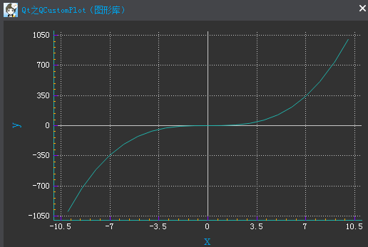

### 简述

&emsp;&emsp;`QCustomPlot`是一个基于`C++`的`Qt`的图形库，用于绘制图像和数据可视化，例如制作曲线图、趋势图、坐标图、柱状图等。`QCustomPlot`可以导出为各种格式，比如`PDF`文件和位图(例如`PNG`、`JPG`和`BMP`)。<!--more-->

### 下载

&emsp;&emsp;`QCustomPlot`的主页是`http://www.qcustomplot.com/`，进入`QCustomPlot`下载页，下载最新的完整包。将下载好的安装包进行解压缩，里面包含文档、示例、更改日志、`GPL`授权，以及最重要的两个文件`qcustomplot.h`与`qcustomplot.cpp`。

### 配置

&emsp;&emsp;完整的`API`文档在`complete API documentation`上面，或者作为完整包的一部分，在解压缩后的目录中可以找到。里面包含一个`HTML`文档的层次结构和`qch`帮助文件用于`QtCreator/Assistant`集成。如果使用`QtCreator`或`Assistant`，应考虑使用`qch`文件，这将极大地提高工作效率！
&emsp;&emsp;集成`qch`文件的方法非常简单：复制`qcustomplot.qch`文件到你需要存储的地方(例如本地`QtCreator`配置目录)。在`QtCreator`中，选择`工具 -> 选项 -> 帮助 -> 文档`，你会看到一个加载文档模块的列表，以及添加或者删除模块的按钮。点击`添加…`按钮，选择`qcustomplot.qch`文件，这样就完成了添加工作。可以通过`帮助 -> 索引`来搜索`QCustomPlot`相关的类或函数。当你把光标放在任何`QCustomPlot`相关的类或函数上时，按下`F1`键，就会有相应的文档项弹出，就像`Qt`组件一样。

### 使用

&emsp;&emsp;在`examples`中，我们会看到一些自带的示例，可以运行看一下效果。如果在自己的项目中使用，需要进行以下配置：首先在`pro`中添加如下内容：

``` cpp
QT += printsupport
```

然后将`qcustomplot.h`与`qcustomplot.cpp`拷贝到工程目录下，按照步骤`右键 -> 添加现有文件…`，将这两个文件添加至工程。
&emsp;&emsp;下面来实现一个曲线图：



``` cpp
#include "qcustomplot.h"

MainWindow::MainWindow ( QWidget *parent ) : CustomWindow ( parent ) {
    QCustomPlot *pCustomPlot = new QCustomPlot ( this );
    pCustomPlot->resize ( 300, 300 );
    /* 可变数组存放绘图的坐标的数据，分别存放x和y坐标的数据，101为数据长度 */
    QVector<double> x ( 101 ), y ( 101 );

    /* 添加数据，这里演示“y = x^3”，为了正负对称，x从“-10”到“+10” */
    for ( int i = 0; i < 101; ++i ) {
        x[i] = i / 5 - 10;
        y[i] = qPow ( x[i], 3 ); /* x的y次方 */
    }

    QCPGraph *pGraph = pCustomPlot->addGraph(); /* 向绘图区域QCustomPlot添加一条曲线 */
    pCustomPlot->graph ( 0 )->setData ( x, y ); /* 添加数据 */
    /* 设置坐标轴名称 */
    pCustomPlot->xAxis->setLabel ( "x" );
    pCustomPlot->yAxis->setLabel ( "y" );
    /* 设置背景色 */
    pCustomPlot->setBackground ( QColor ( 50, 50, 50 ) );
    pGraph->setPen ( QPen ( QColor ( 32, 178, 170 ) ) );
    /* 设置“x/y轴文本色、轴线色、字体等 */
    pCustomPlot->xAxis->setTickLabelColor ( Qt::white );
    pCustomPlot->xAxis->setLabelColor ( QColor ( 0, 160, 230 ) );
    pCustomPlot->xAxis->setBasePen ( QPen ( QColor ( 32, 178, 170 ) ) );
    pCustomPlot->xAxis->setTickPen ( QPen ( QColor ( 128, 0, 255 ) ) );
    pCustomPlot->xAxis->setSubTickPen ( QColor ( 255, 165, 0 ) );
    QFont xFont = pCustomPlot->xAxis->labelFont();
    xFont.setPixelSize ( 20 );
    pCustomPlot->xAxis->setLabelFont ( xFont );
    pCustomPlot->yAxis->setTickLabelColor ( Qt::white );
    pCustomPlot->yAxis->setLabelColor ( QColor ( 0, 160, 230 ) );
    pCustomPlot->yAxis->setBasePen ( QPen ( QColor ( 32, 178, 170 ) ) );
    pCustomPlot->yAxis->setTickPen ( QPen ( QColor ( 128, 0, 255 ) ) );
    pCustomPlot->yAxis->setSubTickPen ( QColor ( 255, 165, 0 ) );
    QFont yFont = pCustomPlot->yAxis->labelFont();
    yFont.setPixelSize ( 20 );
    pCustomPlot->yAxis->setLabelFont ( yFont );
    /* 设置坐标轴显示范围，否则只能看到默认范围 */
    pCustomPlot->xAxis->setRange ( -11, 11 );
    pCustomPlot->yAxis->setRange ( -1100, 1100 );
}
```

&emsp;&emsp;如果需要导出图片，可以调用对应的`save…`接口。例如导出一张`PNG`格式，宽度、宽度分别为`400px`、`300px`的图片：

``` cpp
pCustomPlot->savePng ( "customPlot.png", 400, 300 );
```