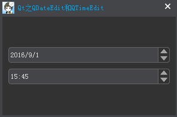

### 简述

&emsp;&emsp;`QDateTime`类提供了一个部件，用于编辑日期和时间。`QDateTimeEdit`允许用户编辑日期，通过使用键盘或箭头键来增加和减少日期和时间值。箭头键可以在`QDateTimeEdit`内进行部分移动，日期和时间的格式按照`setDisplayFormat`设置的显示。<!--more-->

### 基本使用

&emsp;&emsp;`QDateTimeEdit`有多个构造函数，分别看看它们是如何使用的。


&emsp;&emsp;默认情况下，如果`QDateTimeEdit`构造时不指定日期时间，系统会为其设置一个和本地相同的日期时间格式(右下角可更改本地日期时间格式)，并且值为`2000年1月1日0时0分0秒`。

``` cpp
QDateTimeEdit *dateTimeEdit = new QDateTimeEdit ( this );
QDateTimeEdit *dateTimeEdit2 = new QDateTimeEdit ( QDateTime::currentDateTime(), this );
QDateTimeEdit *dateEdit = new QDateTimeEdit ( QDate::currentDate(), this );
QDateTimeEdit *timeEdit = new QDateTimeEdit ( QTime::currentTime(), this );
```

### 日期时间格式

&emsp;&emsp;如果不想要系统默认的格式，可以通过`setDisplayFormat`来自定设置。


``` cpp
QDateTimeEdit *dateTimeEdit = new QDateTimeEdit ( this );
QDateTimeEdit *dateTimeEdit2 = new QDateTimeEdit ( QDateTime::currentDateTime(), this );
QDateTimeEdit *dateEdit = new QDateTimeEdit ( QDate::currentDate(), this );
QDateTimeEdit *timeEdit = new QDateTimeEdit ( QTime::currentTime(), this );

/* 设置日期时间格式 */
dateTimeEdit->setDisplayFormat ( "yyyy-MM-dd HH:mm:ss" );
dateTimeEdit2->setDisplayFormat ( "yyyy/MM/dd HH-mm-ss" );
dateEdit->setDisplayFormat ( "yyyy.M.d" );
timeEdit->setDisplayFormat ( "H:mm" );
```

- `yyyy`：年，用`4`个数表示。
- `MM`：月，`01`至`12`。
- `dd`：日，`01`至`31`。
- `HH`：时，`00`至`23`。
- `mm`：分，`00`至`59`。
- `ss`：秒，`00`至`59`。

### 日期时间范围

&emsp;&emsp;创建了`QDateTimeEdit`对象，并设置其日期时间为今天(`currentDate`)，同时限制有效日期的范围，例如距离今天`±365`天。


``` cpp
QDateTimeEdit *dateEdit = new QDateTimeEdit ( QDate::currentDate(), this );
dateEdit->setMinimumDate ( QDate::currentDate().addDays ( -365 ) ); /* -365天 */
dateEdit->setMaximumDate ( QDate::currentDate().addDays ( 365 ) ); /* +365天 */
```

其他同功能的有用函数：`setDateTimeRange`、`setDateRange`、`setTimeRange`、`setMaximumDateTime`和`setMinimumDateTime`、`setMinimumTime`和`setMaximumTime`。

### 显示日历

&emsp;&emsp;默认情况下只能通过鼠标点击上下箭头来改变日期时间，如果要弹出日期控件，只需调用`setCalendarPopup(true)`即可。


``` cpp
QDateTimeEdit *dateEdit = new QDateTimeEdit ( QDate::currentDate(), this );
dateEdit->setMinimumDate ( QDate::currentDate().addDays ( -365 ) ); /* -365天 */
dateEdit->setMaximumDate ( QDate::currentDate().addDays ( 365 ) ); /* +365天 */
dateEdit->setCalendarPopup ( true ); /* 日历弹出 */
```

这时的上/下箭头就变为下拉箭头了。当点击下拉箭头之后，就会弹出日历控件，由于我们设置了日期范围，所以不在范围内的日期是无法选择的(`disabled`)。

### 获取日期时间

&emsp;&emsp;可以通过`date`、`dateTime`等接口来获取日期时间对象，如果要获取年、月、日等信息，可以调用例如`QDate`的`year`、`month`、`day`等函数。

``` cpp
QDateTimeEdit *dateEdit = new QDateTimeEdit ( QDate::currentDate(), this );
dateEdit->setMinimumDate ( QDate::currentDate().addDays ( -365 ) ); /* -365天 */
dateEdit->setMaximumDate ( QDate::currentDate().addDays ( 365 ) ); /* +365天 */

QDate date = dateEdit->date(); /* 日期 */
QDateTime dateTime = dateEdit->dateTime(); /* 日期时间 */
QDate maxDate = dateEdit->maximumDate(); /* 最大日期 */
QDateTime maxDateTime = dateEdit->maximumDateTime(); /* 最大日期时间 */
QTime maxTime = dateEdit->maximumTime(); /* 最大时间 */
QDate minDate = dateEdit->minimumDate(); /* 最小日期 */
QDateTime minDateTime = dateEdit->minimumDateTime(); /* 最小日期时间 */
QTime minTime = dateEdit->minimumTime(); /* 最小时间 */

qDebug() << "Date : " << date;
qDebug() << "DateTime : " << dateTime;
qDebug() << "MaxDate : " << maxDate;
qDebug() << "MaxDateTime : " << maxDateTime;
qDebug() << "MaxTime : " << maxTime;
qDebug() << "MinDate : " << minDate;
qDebug() << "MinDateTime : " << minDateTime;
qDebug() << "MinTime : " << minTime;
```

执行结果：

``` cpp
Date : QDate(“2016-09-01”)
DateTime : QDateTime(2016-09-01 00:00:00.000 中国标准时间 Qt::TimeSpec(LocalTime))
MaxDate : QDate(“2017-09-01”)
MaxDateTime : QDateTime(2017-09-01 23:59:59.999 中国标准时间 Qt::TimeSpec(LocalTime))
MaxTime : QTime(“23:59:59.999”)
MinDate : QDate(“2015-09-02”)
MinDateTime : QDateTime(2015-09-02 00:00:00.000 中国标准时间 Qt::TimeSpec(LocalTime))
MinTime : QTime(“00:00:00.000”)
```

### 信号

&emsp;&emsp;常用的三个信号是`dateChanged`、`dateTimeChanged`、`timeChanged`，当日期、日期时间、时间改变时发射。

``` cpp
QDateTimeEdit *dateTimeEdit = new QDateTimeEdit ( QDateTime::currentDateTime(), this );

/* 连接信号和槽 */
connect ( dateTimeEdit, SIGNAL ( dateChanged ( QDate ) ), this, SLOT ( onDateChanged ( QDate ) ) );
connect ( dateTimeEdit, SIGNAL ( dateTimeChanged ( QDateTime ) ), \
          this, SLOT ( onDateTimeChanged ( QDateTime ) ) );
connect ( dateTimeEdit, SIGNAL ( timeChanged ( QTime ) ), this, SLOT ( onTimeChanged ( QTime ) ) );
```

槽函数如下：

``` cpp
/* 日期发生改变时执行 */
void onDateChanged ( const QDate &date ) {
    qDebug() << "QDate : " << date;
}

/* 无论日期还是时间发生改变，都会执行 */
void onDateTimeChanged ( const QDateTime &dateTime ) {
    qDebug() << "QDateTime : " << dateTime;
}

/* 时间发生改变时执行 */
void onTimeChanged ( const QTime &time ) {
    qDebug() << "QTime : " << time;
}
```

### 日期时间部分

&emsp;&emsp;枚举为`QDateTimeEdit::Section`，标识为`QDateTimeEdit::Sections`。

常量                           | 值
-------------------------------|----
`QDateTimeEdit::NoSection`     | `0x0000`
`QDateTimeEdit::AmPmSection`   | `0x0001`
`QDateTimeEdit::MSecSection`   | `0x0002`
`QDateTimeEdit::SecondSection` | `0x0004`
`QDateTimeEdit::MinuteSection` | `0x0008`
`QDateTimeEdit::HourSection`   | `0x0010`
`QDateTimeEdit::DaySection`    | `0x0100`
`QDateTimeEdit::MonthSection`  | `0x0200`
`QDateTimeEdit::YearSection`   | `0x0400`

常用的日期时间格式为`yyyy/MM/dd HH:mm:ss`，包含`6`部分，分别是年月日时分秒，可以通过`sectionCount`来获取数量。通过调用`setSelectedSection`可以设置当前选择的部分，如果需要获取某部分的值，可以调用`sectionText`；通过`sectionAt`来获取下标对应的部分。

``` cpp
QDateTimeEdit *dateEdit = new QDateTimeEdit ( QDateTime::currentDateTime(), this );
dateEdit->setDisplayFormat ( "yyyy/MM/dd HH:mm:ss" ); /* 设置显示格式 */
dateEdit->setSelectedSection ( QDateTimeEdit::DaySection ); /* 设置所选部分 */

int nCount = dateEdit->sectionCount(); /* 部分数量 */
QDateTimeEdit::Section monthSection = dateEdit->sectionAt ( 1 ); /* 下标为1对应的部分 */
QDateTimeEdit::Section section = dateEdit->currentSection(); /* 当前部分 */
int nIndex = dateEdit->currentSectionIndex(); /* 当前部分下标 */

/* 各部分对应的值 */
QString strYear = dateEdit->sectionText ( QDateTimeEdit::YearSection );
QString strMonth = dateEdit->sectionText ( QDateTimeEdit::MonthSection );
QString strDay = dateEdit->sectionText ( QDateTimeEdit::DaySection );
QString strHour = dateEdit->sectionText ( QDateTimeEdit::HourSection );
QString strMinute = dateEdit->sectionText ( QDateTimeEdit::MinuteSection );
QString strSecond = dateEdit->sectionText ( QDateTimeEdit::SecondSection );

qDebug() << "SectionCount : " << nCount;
qDebug() << "MonthSection : " << monthSection;
qDebug() << "CurrentSection : " << section;
qDebug() << "CurrentSectionIndex : " << nIndex;
qDebug() << "Year : " << strYear;
qDebug() << "Month : " << strMonth;
qDebug() << "Day : " << strDay;
qDebug() << "Hour : " << strHour;
qDebug() << "Minute : " << strMinute;
qDebug() << "Second : " << strSecond;
```

执行结果：

``` cpp
SectionCount : 6
MonthSection : QDateTimeEdit::Section(MonthSection)
CurrentSection : QDateTimeEdit::Section(DaySection)
CurrentSectionIndex : 2
Year : "2016"
Month : "09"
Day : "01"
Hour : "14"
Minute : "50"
Second : "29"
```

如果格式为`yyyy/MM/dd`，那么`sectionCount`将会返回`3`。`sectionAt(0)`将会返回`YearSection`；`sectionAt(1)`返回`MonthSection`；`sectionAt(2)`返回`YearSection`。
&emsp;&emsp;**补充说明**：`text`函数返回`QDateTimeEdit`的内容。

---

### Qt之QDateEdit和QTimeEdit

&emsp;&emsp;`QDateEdit`类提供了一个部件，用于编辑日期；`QTimeEdit`类提供了一个部件，用于编辑时间。`QDateEdit`和`QTimeEdit`均继承自`QDateTimeEdit`，许多特性和功能都由`QDateTimeEdit`提供。
&emsp;&emsp;`QDateEdit`：

- `date`：保存了部件的显示日期。
- `minimumDate`：定义了用户可以设置的最小日期。
- `maximumDate`：定义了用户可以设置的最大日期。
- `displayFormat`：包含了一个字符串用于格式化日期。

&emsp;&emsp;`QTimeEdit`：

- `time`：保存了部件的显示时间。
- `minimumTime`：定义了用户可以设置的最小时间。
- `maximumTime`：定义了用户可以设置的最大时间。
- `displayFormat`：包含了一个字符串用于格式化时间。

&emsp;&emsp;使用`QDateEdit`时，如果不设置日期，则系统会为其指定一个默认的日期，即`2000`年`1`月`1`日。使用`QTimeEdit`时，如果不设置时间，则系统会为其指定一个默认的时间，即`0`时`0`分`0`秒。所以一般都会指定一个合适的日期和时间(当前日期时间)：



``` cpp
QDateEdit *dateEdit = new QDateEdit ( QDate::currentDate(), this );
QTimeEdit *timeEdit = new QTimeEdit ( QTime::currentTime(), this );
```

&emsp;&emsp;`QDateEdit`用于编辑日期，而`QTimeEdit`用于编辑时间。所以不要用`QDateEdit`来设置或获取时间，也不要用`QTimeEdit`来设置或获取日期。如果要同时操作日期时间，请使用`QDateTimeEdit`。


``` cpp
QDateEdit *dateEdit = new QDateEdit ( this );
QTimeEdit *timeEdit = new QTimeEdit ( this );
dateEdit->setDisplayFormat ( "yyyy/MM/dd" );
timeEdit->setDisplayFormat ( "HH:mm:ss" );
dateEdit->setDateTime ( QDateTime::currentDateTime() );
timeEdit->setDateTime ( QDateTime::currentDateTime() );
```

当点击`QDateEdit`的上下箭头时，只能改变日期，而改变不了时间。同理，当点击`QTimeEdit`的上下箭头时，只能改变时间，而改变不了日期。所以即使语法正确，也不建议把`QDateEdit`和`QTimeEdit`当做`QDateTimeEdit`来用。注意，即使是设置显示格式，对于`QDateEdit`来说，只需要设置年月日即可，例如`yyyy/MM/dd`；对于`QTimeEdit`，只需要设置时分秒，例如`HH:mm:ss`。
&emsp;&emsp;在`QDateTimeEdit`使用过程中，分享了如何显示日历。而日历是对应的是`QDate`，而非`QTime`。所以`QDateEdit`、`QDateTimeEdit`可以使用，而`QTimeEdit`并不能使用。

``` cpp
QDateTimeEdit *dateTimeEdit = new QDateTimeEdit ( this );
QDateEdit *dateEdit = new QDateEdit ( this );
QTimeEdit *timeEdit = new QTimeEdit ( this );
dateTimeEdit->setCalendarPopup ( true ); /* 正确 */
dateEdit->setCalendarPopup ( true ); /* 正确 */
timeEdit->setCalendarPopup ( true ); /* 语法正确但实际上是错误的 */
```