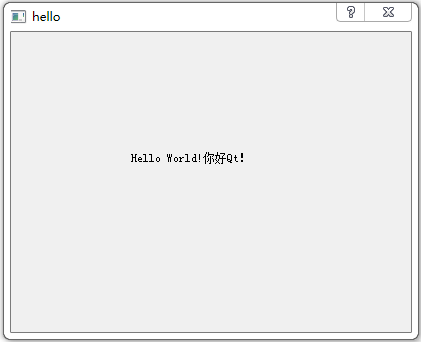
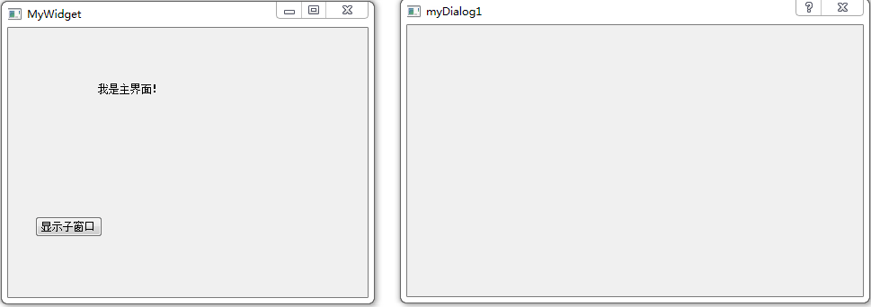
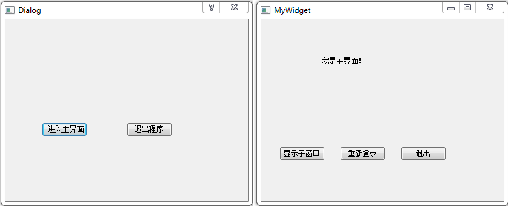

### QDialog基础

&emsp;&emsp;代码如下：<!--more-->

``` cpp
#include <QApplication>
#include <QDialog>
#include <QLabel>
#include <QTextCodec> /* 提供文本编码转换功能 */

int main ( int argc, char *argv[] ) {
    QApplication a ( argc, argv ); /* QApplication对象用于管理应用程序的资源 */
    // /* 设置QObject::tr函数所用的字符集，这里使用系统指定的字符集 */
    // QTextCodec::setCodecForTr ( QTextCodec::codecForLocale() );
    QTextCodec::setCodecForTr ( QTextCodec::codecForName ( "UTF-8" ) ); /* 指定字符集为UTF-8 */
    QDialog w; /* QDialog对象用于实现一个对话框 */
    w.resize ( 400, 300 ); /* 设置QDialog对话框的大小 */
    QLabel label ( &w ); /* 说明对话框是label的父对象 */
    label.move ( 120, 120 ); /* 移动label的位置 */
    label.setText ( QObject::tr ( "Hello World!你好Qt！" ) ); /* 设置label的文本 */
    w.show();
    return a.exec();
}
```



---

### 多窗口切换

&emsp;&emsp;`mywidget.h`如下：

``` cpp
#ifndef MYWIDGET_H
#define MYWIDGET_H

#include <QWidget>

namespace Ui {
    class MyWidget;
}

class MyWidget : public QWidget {
    Q_OBJECT
public:
    explicit MyWidget ( QWidget *parent = 0 );
    ~MyWidget();
private:
    Ui::MyWidget *ui;
public slots:
    void showChildDialog();
};

#endif // MYWIDGET_H
```

&emsp;&emsp;`mywidget.cpp`如下：

``` cpp
#include "mywidget.h"
#include "ui_mywidget.h"
#include <QDialog>

MyWidget::MyWidget ( QWidget *parent ) : QWidget ( parent ), ui ( new Ui::MyWidget ) {
    ui->setupUi ( this );
    /* 发送信号的对象、发送的信号、接收信号的对象、要执行的槽 */
    connect ( ui->showChildButton, SIGNAL ( clicked() ), this, SLOT ( showChildDialog() ) );
}

MyWidget::~MyWidget() {
    delete ui;
}

void MyWidget::showChildDialog() {
    QDialog *dialog = new QDialog ( this );
    dialog->show();
}
```



---

### QDialog对话框的show和exec

&emsp;&emsp;`QDialog`继承自`QWitget`，自然从基类继承了显示函数`show`。然而`QDialog`还有一个特殊的显示函数`exec`，二者的区别如下：

- `show`：显示一个非`modal`的对话框，控制权立刻返回给调用函数，弹出窗口是否为`model`对话框，可由`modal`值决定。
- `exec`：显示一个`modal`的对话框，并且锁住程序，直到用户关闭对话框为止，函数返回一个`DialogCode`结果。在对话框弹出期间，用户不可切换至其他窗口。

&emsp;&emsp;`mydialog.h`如下：

``` cpp
#ifndef MYDIALOG_H
#define MYDIALOG_H

#include <QDialog>

namespace Ui {
    class MyDialog;
}

class MyDialog : public QDialog {
    Q_OBJECT
public:
    explicit MyDialog ( QWidget *parent = 0 );
    ~MyDialog();
private slots:
    void on_pushButton_clicked();
private:
    Ui::MyDialog *ui;
};

#endif // MYDIALOG_H
```

&emsp;&emsp;`mywidget.h`如下：

``` cpp
#ifndef MYWIDGET_H
#define MYWIDGET_H

#include <QWidget>

namespace Ui {
    class MyWidget;
}

class MyWidget : public QWidget {
    Q_OBJECT
public:
    explicit MyWidget ( QWidget *parent = 0 );
    ~MyWidget();
private:
    Ui::MyWidget *ui;
public slots:
    void on_showChildButton_clicked();
private slots:
    void on_pushButton_clicked();
};

#endif // MYWIDGET_H
```

&emsp;&emsp;`mydialog.cpp`如下：

``` cpp
#include "mydialog.h"
#include "ui_mydialog.h"

MyDialog::MyDialog ( QWidget *parent ) : QDialog ( parent ), ui ( new Ui::MyDialog ) {
    ui->setupUi ( this );
}

MyDialog::~MyDialog() {
    delete ui;
}

void MyDialog::on_pushButton_clicked() {
    accept();
}
```

&emsp;&emsp;`mywidget.cpp`如下：

``` cpp
#include "mywidget.h"
#include "ui_mywidget.h"
#include <QDialog>
#include "mydialog.h"
#include <QDebug>

MyWidget::MyWidget ( QWidget *parent ) : QWidget ( parent ), ui ( new Ui::MyWidget ) {
    ui->setupUi ( this );
}

MyWidget::~MyWidget() {
    delete ui;
}

void MyWidget::on_showChildButton_clicked() { /* 显示子窗口按钮 */
    QDialog *dialog = new QDialog ( this );
    dialog->show();
}

void MyWidget::on_pushButton_clicked() { /* 重新登录按钮 */
    close(); /* 先关闭主界面，其实是隐藏起来了，并没有真正退出 */
    MyDialog dlg; /* 新建MyDialog对象 */

    /* 如果按下了“进入主窗口”按钮，则再次显示主界面。
       否则，因为现在已经没有显示的界面了，所以程序将退出 */
    if ( dlg.exec() == QDialog::Accepted ) {
        show();
    }
}
```

&emsp;&emsp;`main.cpp`如下：

``` cpp
#include <QtGui/QApplication>
#include "mywidget.h"
#include "mydialog.h"

int main ( int argc, char *argv[] ) {
    QApplication a ( argc, argv );
    MyWidget w;
    MyDialog dialog; /* 新建MyDialog类对象 */

    if ( dialog.exec() == QDialog::Accepted ) { /* 判断dialog执行结果 */
        w.show(); /* 如果是按下了“进入主界面”按钮，则显示主界面 */
        return a.exec(); /* 程序正常运行 */
    } else {
        return 0; /* 否则，退出程序 */
    }
}
```



&emsp;&emsp;对于`QDialog`的`accept`函数和`reject`函数，这两个函数都能够隐藏`QDialog`。但是返回的值不同，一个是`Accepted`，一个是`Rejected`。通过返回值可以区分用户按下的是`OK`按钮，还是`Cancel`按钮。