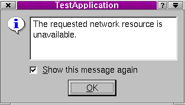

&emsp;&emsp;`QErrorMessage`类提供了错误消息显示对话框，其头文件为`qerrormessage.h`，它继承了`QDialog`。所有成员函数的列表如下：<!--more-->

``` cpp
/* 公有成员 */
QErrorMessage ( QWidget *parent, const char *name = 0 );
~QErrorMessage ();
void message ( const QString &m ); /* 公有槽 */
QErrorMessage * qtHandler (); /* 静态公有成员 */
```

&emsp;&emsp;成员函数详解如下：

``` cpp
/* 构造并安装一个错误处理器窗口。父对象parent和名称name都被传递给QDialog的构造函数 */
QErrorMessage::QErrorMessage ( QWidget *parent, const char *name = 0 );
/* 销毁这个对象并且释放任何已经分配的资源。特别地，“do not show again”消息列表也被删除 */
QErrorMessage::~QErrorMessage ();
/* 显示消息m并且立即返回。如果用户要求m不被显示，这个函数将什么都不做。
   通常m会被立即显示，但是如果存在未处理的消息，m将被排到队列中，稍后会显示 */
void QErrorMessage::message ( const QString &m ); [槽]
/* 返回输出默认Qt消息的QErrorMessage对象的指针。如果没有这样的对象存在，这个函数创建一个这样的对象 */
QErrorMessage * QErrorMessage::qtHandler (); [静态]
```



&emsp;&emsp;使用示例如下：

``` cpp
QErrorMessage *dialog = new QErrorMessage ( this );
dialog->setWindowTitle ( tr ( "错误信息对话框" ) );
dialog->showMessage ( tr ( "这里是出错信息！" ) );
```