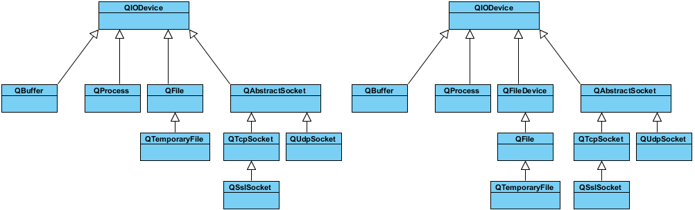

&emsp;&emsp;基础代码如下：<!--more-->

``` cpp
#include <QtCore/QCoreApplication>
#include <QFileInfo>
#include <QTextCodec>
#include <QStringList>
#include <QDateTime>
#include <QDebug>

int main ( int argc, char *argv[] ) {
    QCoreApplication a ( argc, argv );
    QTextCodec::setCodecForTr ( QTextCodec::codecForLocale() );
    QFile file ( "myfile.txt" ); /* 以只写方式打开，如果文件不存在，那么会创建该文件 */

    if ( !file.open ( QIODevice::WriteOnly | QIODevice::Text ) ) {
        qDebug() << file.errorString();
    }

    file.write ( "helloQt!\nyafeilinux" );
    file.close();
    QFileInfo info ( file ); /* 获取文件信息 */
    qDebug() << QObject::tr ( "绝对路径：" ) << info.absoluteFilePath() << endl
             << QObject::tr ( "文件名：" ) << info.fileName() << endl
             << QObject::tr ( "基本名称：" ) << info.baseName() << endl
             << QObject::tr ( "后缀：" ) << info.suffix() << endl
             << QObject::tr ( "创建时间：" ) << info.created() << endl
             << QObject::tr ( "大小：" ) << info.size();

    if ( !file.open ( QIODevice::ReadOnly | QIODevice::Text ) ) { /* 以只读方式打开 */
        qDebug() << file.errorString();
    }

    qDebug() << QObject::tr ( "文件内容：" ) << endl << file.readAll();
    qDebug() << QObject::tr ( "当前位置：" ) << file.pos();
    file.seek ( 0 );
    QByteArray array;
    array = file.read ( 5 );
    qDebug() << QObject::tr ( "前5个字符：" ) << array
             << QObject::tr ( "当前位置：" ) << file.pos();
    file.seek ( 15 );
    array = file.read ( 5 );
    qDebug() << QObject::tr ( "第16-20个字符：" ) << array;
    file.close();
    return a.exec();
}
```

---

&emsp;&emsp;`Qt`作为一个通用开发库，提供了跨平台的文件操作能力。`Qt`通过`QIODevice`提供了对`I/O`设备的抽象，这些设备具有读写字节块的能力。下面是`I/O`设备的类图(左图为`Qt4`的，右图为`Qt5`的)：



&emsp;&emsp;从上面的类图可以看出，`Qt4`和`Qt5`在`I/O`设备部分大同小异，只不过`Qt5`新增加了一个`QFileDevice`类。图中所涉及的类及其用途如下：

类名               | 作用
------------------|-----
`QIODevice`       | 所有`I/O`设备类的父类，提供了字节块读写的通用操作以及基本接口
`QFlie`           | 访问本地文件或者嵌入资源
`QTemporaryFile`  | 创建和访问本地文件系统的临时文件
`QBuffer`         | 读写`QByteArray`
`QProcess`        | 运行外部程序，处理进程间通讯
`QAbstractSocket` | 所有套接字类的父类
`QTcpSocket`      | `TCP`协议网络数据传输
`QUdpSocket`      | 传输`UDP`报文
`QSslSocket`      | 使用`SSL/TLS`传输数据
`QFileDevice`     | `Qt5`新增加的类，提供了有关文件操作的通用实现

`QProcess`、`QTcpSocket`、`QUdpSoctet`和`QSslSocket`是顺序访问设备。所谓`顺序访问`，是指它们的数据只能访问一遍：从头走到尾，从第一个字节开始访问，直到最后一个字节，中途不能返回去读取上一个字节；`QFile`、`QTemporaryFile`和`QBuffer`是随机访问设备，可以访问任意位置任意次数，还可以使用`QIODevice::seek`函数来重新定位文件访问位置指针。
&emsp;&emsp;在所有的`I/O`设备中，文件`I/O`是最重要的部分之一，因为大多数的程序依旧需要首先访问本地文件。`QFile`提供了从文件中读取和写入数据的能力，`Qt5`新加入的`QFileDevice`类，则将这部分公共操作放到了这个单独的类中。显然这部分代码在`Qt4`中位于`QFile`类。这样看来，`Qt5`的代码结构更为清晰，层次更好。
&emsp;&emsp;通常会将文件路径作为参数传给`QFile`的构造函数，不过也可以在创建好对象之后，使用`setFileName`来修改。`QFile`需要使用`/`作为文件分隔符，不过它会自动将其转换成操作系统所需要的形式。例如`C:/windows`这样的路径在`Windows`平台下同样是可以的。
&emsp;&emsp;`QFile`主要提供了有关文件的各种操作，比如打开文件、关闭文件、刷新文件等。可以使用`QDataStream`或`QTextStream`类来读写文件，也可以使用`QIODevice`类提供的`read`、`readLine`、`readAll`以及`write`这样的函数。值得注意的是，有关文件本身的信息，比如文件名、文件所在目录的名字等，则是通过`QFileInfo`获取。下面使用一段代码来看看`QFile`的有关操作：

``` cpp
int main ( int argc, char *argv[] ) {
    QApplication app ( argc, argv );
    QFile file ( "in.txt" );

    if ( !file.open ( QIODevice::ReadOnly | QIODevice::Text ) ) {
        qDebug() << "Open file failed.";
        return -1;
    } else {
        while ( !file.atEnd() ) {
            qDebug() << file.readLine();
        }
    }

    QFileInfo info ( file );
    qDebug() << info.isDir();
    qDebug() << info.isExecutable();
    qDebug() << info.baseName();
    qDebug() << info.completeBaseName();
    qDebug() << info.suffix();
    qDebug() << info.completeSuffix();
    return app.exec();
}
```

### Qt学习之二进制文件读写

&emsp;&emsp;`Qt`还提供了更高一级的操作：用于二进制的流`QDataStream`和用于文本流的`QTextStream`。
&emsp;&emsp;`QDataStream`提供了基于`QIODevice`的二进制数据的序列化。数据流是一种二进制流，这种流完全不依赖于底层操作系统、`CPU`或者字节顺序(大端或小端)。例如，在安装了`Windows`平台的`PC`上面写入的一个数据流，可以不经过任何处理，直接拿到运行了`Solaris`的`SPARC`机器上读取。由于数据流就是二进制流，因此也可以直接读写没有编码的二进制数据，例如图像、视频、音频等。`QDataStream`既能够存取`C++`基本类型，如`int`、`char`、`short`等，也可以存取复杂的数据类型，例如自定义的类。实际上，`QDataStream`对于类的存储，是将复杂的类分割为很多基本单元实现的。
&emsp;&emsp;结合`QIODevice`，`QDataStream`可以很方便地对文件、网络套接字等进行读写操作。我们从代码开始看起：

``` cpp
QFile file ( "file.dat" );
file.open ( QIODevice::WriteOnly );
QDataStream out ( &file );
out << QString ( "the answer is" );
out << ( qint32 ) 42;
```

在这段代码中，我们首先打开一个名为`file.dat`的文件(注意，我们为简单起见，并没有检查文件打开是否成功，这在正式程序中是不允许的)。然后，我们将刚刚创建的`file`对象的指针传递给一个`QDataStream`实例`out`。类似于`std::cout`标准输出流，`QDataStream`也重载了输出重定向`<<`运算符。后面的代码就很简单了：将`the answer is`和数字`42`输出到数据流。由于我们的`out`对象建立在`file`之上，因此相当于将答案写入`file`。
&emsp;&emsp;需要指出一点，最好使用`Qt`整型来进行读写，比如程序中的`qint32`，这保证了在任意平台和任意编译器都能够有相同的行为。
&emsp;&emsp;我们通过一个例子来看看`Qt`是如何存储数据的。例如`char *`字符串在存储时，会首先存储该字符串包括`\0`结束符的长度(`32`位整型)，然后是字符串的内容以及结束符`\0`。在读取时，先以`32`位整型读出整个的长度，然后按照这个长度取出整个字符串的内容。但是，如果你直接运行这段代码，你会得到一个空白的`file.dat`，并没有写入任何数据，这是因为我们的`file`没有正常关闭。为性能起见，数据只有在文件关闭时才会真正写入。因此，我们必须在最后添加一行代码：

``` cpp
file.close(); /* 如果不想关闭文件，可以使用file.flush */
```

重新运行一下程序，就可以了。下面要将这个答案读取出来：

``` cpp
QFile file ( "file.dat" );
file.open ( QIODevice::ReadOnly );
QDataStream in ( &file );
QString str;
qint32 a;
in >> str >> a;
```

这段代码没什么好说的。唯一需要注意的是，你必须按照写入的顺序将数据读取出来。也就是说，程序数据写入的顺序必须预先定义好。在这个例子中，我们首先写入字符串，然后写入数字，那么就首先读出来的就是字符串，然后才是数字。顺序颠倒的话，程序行为是不确定的，严重时会直接造成程序崩溃。
&emsp;&emsp;由于二进制流是纯粹的字节数据，带来的问题是，如果程序不同版本之间按照不同的方式读取(前面说过，`Qt`保证读写内容的一致，但是并不能保证不同`Qt`版本之间的一致)，数据就会出现错误。因此，我们必须提供一种机制来确保不同版本之间的一致性。通常，我们会使用如下的代码写入：

``` cpp
QFile file ( "file.dat" );
file.open ( QIODevice::WriteOnly );
QDataStream out ( &file );

/* 写入魔术数字和版本 */
out << ( quint32 ) 0xA0B0C0D0;
out << ( qint32 ) 123;

out.setVersion ( QDataStream::Qt_4_0 );
out << lots_of_interesting_data; /* 写入数据 */
```

这里增加了如下代码：

``` cpp
out << ( quint32 ) 0xA0B0C0D0;
```

用于写入魔术数字。所谓魔术数字，是二进制输出中经常使用的一种技术。二进制格式是人不可读的，并且通常具有相同的后缀名(比如`dat`之类)，因此我们没有办法区分两个二进制文件哪个是合法的。所以，我们定义的二进制格式通常具有一个魔术数字，用于标识文件的合法性。在本例中，我们在文件最开始写入`0xA0B0C0D0`，在读取的时候首先检查这个数字是不是`0xA0B0C0D0`。如果不是的话，说明这个文件不是可识别格式，因此根本不需要去继续读取。一般二进制文件都会有这么一个魔术数字，例如`Java`的`class`文件的魔术数字就是`0xCAFEBABE`，使用二进制查看器就可以查看。魔术数字是一个`32`位的无符号整型，因此我们使用`quint32`来得到一个平台无关的`32`位无符号整型。接下来的一行：

``` cpp
out << ( qint32 ) 123;
```

是标识文件的版本。我们用魔术数字标识文件的类型，从而判断文件是不是合法的。但是，文件的不同版本之间也可能存在差异：我们可能在第一版保存整型，第二版可能保存字符串。为了标识不同的版本，我们只能将版本写入文件。比如，现在我们的版本是`123`。下面一行还是有关版本的：

``` cpp
out.setVersion ( QDataStream::Qt_4_8 );
```

上面一句是文件的版本号，但是`Qt`不同版本之间的读取方式可能也不一样。这样，我们就需要指定`Qt`按照哪个版本去读。在这里我们指定以`Qt 4.8`格式去读取内容。
&emsp;&emsp;当我们这样写入文件之后，我们在读取的时候就需要增加一系列的判断：

``` cpp
QFile file ( "file.dat" );
file.open ( QIODevice::ReadOnly );
QDataStream in ( &file );

/* 检查魔术数字 */
quint32 magic;
in >> magic;

if ( magic != 0xA0B0C0D0 ) {
    return BAD_FILE_FORMAT;
}

/* 检查版本 */
qint32 version;
in >> version;

if ( version < 100 ) {
    return BAD_FILE_TOO_OLD;
}

if ( version > 123 ) {
    return BAD_FILE_TOO_NEW;
}

if ( version <= 110 ) {
    in.setVersion ( QDataStream::Qt_3_2 );
} else {
    in.setVersion ( QDataStream::Qt_4_0 );
}

/* 读取数据 */
in >> lots_of_interesting_data;

if ( version >= 120 ) {
    in >> data_new_in_version_1_2;
}

in >> other_interesting_data;
```

这段代码就是按照前面的解释进行的。首先读取魔术数字，检查文件是否合法。如果合法，读取文件版本：小于`100`或者大于`123`都是不支持的。如果在支持的版本范围内(`100 <= version <= 123`)，则当小于等于`110`的时候，按照`Qt_3_2`的格式读取，否则按照`Qt_4_0`的格式读取。当设置完这些参数之后，开始读取数据。
&emsp;&emsp;至此，我们介绍了有关`QDataStream`的相关内容。那么，既然`QIODevice`提供了`read`、`readLine`之类的函数，为什么还要有`QDataStream`呢？`QDataStream`同`QIODevice`有什么区别？区别在于，`QDataStream`提供流的形式，性能上一般比直接调用原始`API`更好一些。我们通过下面一段代码看看什么是流的形式：

``` cpp
QFile file ( "file.dat" );
file.open ( QIODevice::ReadWrite );

QDataStream stream ( &file );
QString str = "the answer is 42";
QString strout;

stream << str;
file.flush();
stream >> strout;
```

在这段代码中，我们首先向文件中写入数据，紧接着把数据读出来。有什么问题吗？运行之后你会发现，`strout`实际是空的。为什么没有读取出来？我们不是已经添加了`file.flush();`语句吗？原因并不在于文件有没有写入，而是在于我们使用的是`流`。所谓流，就像水流一样，它的游标会随着输出向后移动。当使用`<<`操作符输出之后，流的游标已经到了最后，此时你再去读，当然什么也读不到了。所以你需要在输出之后重新把游标设置为`0`的位置才能够继续读取。具体代码片段如下：

``` cpp
stream << str;
stream.device()->seek ( 0 );
stream >> strout;
```

### QT学习之文本文件读写

&emsp;&emsp;二进制文件比较小巧，却不是人可读的格式。而文本文件是一种人可读的文件。为了操作这种文件，我们需要使用`QTextStream`类。`QTextStream`和`QDataStream`的使用类似，只不过它是操作纯文本文件的。另外，像`XML`、`HTML`这种，虽然也是文本文件，可以由`QTextStream`生成，但`Qt`提供了更方便的`XML`操作类，这里就不包括这部分内容了。
&emsp;&emsp;`QTextStream`会自动将`Unicode`编码同操作系统的编码进行转换，这一操作对开发人员是透明的。它也会将换行符进行转换，同样不需要自己处理。`QTextStream`使用`16`位的`QChar`作为基础的数据存储单位，同样，它也支持`C++`标准类型，如`int`等。实际上，这是将这种标准类型与字符串进行了相互转换。
&emsp;&emsp;`QTextStream`同`QDataStream`的使用基本一致，例如下面的代码将把`The answer is 42`写入到`file.txt`文件中：

``` cpp
QFile data ( "file.txt" );

if ( data.open ( QFile::WriteOnly | QIODevice::Truncate ) ) {
    QTextStream out ( &data );
    out << "The answer is " << 42;
}
```

上述代码在`open`函数中增加了`QIODevice::Truncate`打开方式，可以从下表看到这些打开方式的区别：

枚举值                   | 描述
------------------------|-----
`QIODevice::NotOpen`    | 未打开
`QIODevice::ReadOnly`   | 以只读方式打开
`QIODevice::WriteOnly`  | 以只写方式打开
`QIODevice::ReadWrite`  | 以读写方式打开
`QIODevice::Append`     | 以追加的方式打开，新增加的内容将被追加到文件末尾
`QIODevice::Truncate`   | 以重写的方式打开，在写入新的数
`QIODevice::Text`       | 在读取时，将行结束符转换成`\n`；在写入时，将行结束符转换成本地格式，例如`Win32`平台上是`\r\n`
`QIODevice::Unbuffered` | 忽略缓存

在这里使用了`QFile::WriteOnly | QIODevice::Truncate`，也就是以只写并且覆盖已有内容的形式操作文件。注意，`QIODevice::Truncate`会直接将文件内容清空。

---

### QTextStream读取文件内容

&emsp;&emsp;基础代码如下：

``` cpp
QFile file ( "file.txt" );

if ( !file.open ( QIODevice::ReadOnly | QIODevice::Text ) ) {
    return;
}

QTextStream in ( &file );
QString QTextStream::read ( qint64 maxlen ); /* 读取txt文件maxlen个字符    */
QString line1 = in.read ( 1 );               /* 读取一个字符               */
QString line2 = in.read ( 1 );               /* 自动读取下一个字符          */
QString line1 = in.read ( 20 );              /* 读取20个字符，归为一个字符串 */
QString QTextStream::readLine ( qint64 maxlen = 0 )：
QString line1 = in.readLine ( 0 ); /* 读取第0行文档     */
QString line2 = in.readLine ( 5 ); /* 读取第0行5个文档  */
QString line1 = in.readLine();     /* 读取第0行文档     */
QString line2 = in.readLine();     /* 自动读取第1行文档 */
QString QTextStream::readAll ()：
QString line1 = in.readAll(); /* 读取全部txt文档，并归为一个字符串 */
bool QTextStream::seek ( qint64 pos )：
bool a = in.seek ( 6 );         /* 定位文本中的第6个位置 */
QString line2 = in.read ( 1 ) ; /* 读取该位的1字符       */
```

&emsp;&emsp;读取`txt`文本全部内容的方法：

``` cpp
/* 方法1 */
while ( !in.atEnd() ) {
    QString line = in.readLine();
    qDebug() << line;
}
/*-------------------------------*/
/* 方法2 */
QString line3 = in.readLine();

while ( !line3.isNull() ) {
    qDebug() << line3;
    line3 = in.readLine();
}
```

---

### QFileInfo的简单用法

&emsp;&emsp;`QFileInfo`的几个构造函数：

- `QFileInfo();`
- `QFileInfo( const QString & file );`
- `QFileInfo( const QFile & file );`
- `QFileInfo( const QDir & dir, const QString & file );`
- `QFileInfo( const QFileInfo & fileinfo );`

``` cpp
QFileInfo fileInfo ( path );
/* or */
QFileInfo fileInfo;
fileInfo.setFile ( path );
```

- `bool exists();`：判断文件是否存在，若存在返回`true`。
- `qint64 size();`：获取文件大小，返回`bytes`。

&emsp;&emsp;路径和文件名相关：

- `QString path();`：返回文件路径，不包含文件名。
- `QString filePath();`：返回文件路径，包含文件名。
- `QString fileName();`：返回文件名称。

``` cpp
QFileInfo fileInfo ( "/home/dipper/xyz.tar.gz" );
fileInfo.path();             /* returns "/home/dipper" */
fileInfo.fileName();         /* returns "xyz.tar.gz"   */
fileInfo.baseName();         /* returns "xyz"          */
fileInfo.completeBaseName(); /* returns "xyz.tar"      */
fileInfo.suffix();           /* returns "gz"           */
fileInfo.completeSuffix();   /* returns "tar.gz"       */
```

&emsp;&emsp;类型：

- `bool isFile();`：判断是否为文件。
- `bool isDir();`：判断是否为路径。
- `bool isSymLink();`：判断是否为符号链接。`symLinkTarget`返回符号链接的文件。

&emsp;&emsp;日期相关：

- `QDateTime created();`：创建时间。
- `QDateTime lastModified();`：最近修改时间。
- `QDateTime lastRead();`：最近读时间。