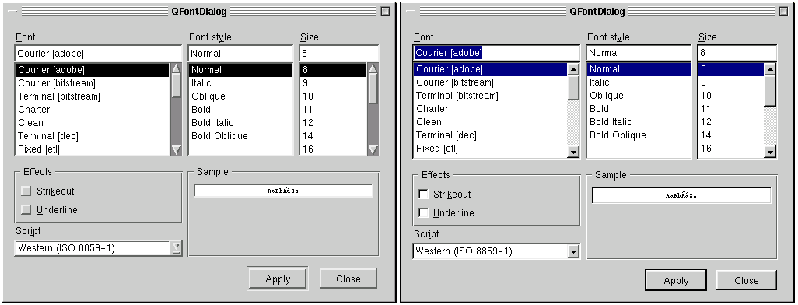

&emsp;&emsp;`QFontDialog`类提供了可以选择字体的对话框窗口部件，继承了`QDialog`，其头文件为`qfontdialog.h`。静态公有成员如下：<!--more-->


``` cpp
QFont getFont ( bool *ok, const QFont &initial, QWidget *parent = 0, const char *name = 0 );
QFont getFont ( bool *ok, QWidget *parent = 0, const char *name = 0 );
```

实例如下：

``` cpp
bool ok;
QFont font = QFontDialog::getFont ( &ok, QFont ( "Helvetica [Cronyx]", 10 ), this );

if ( ok ) {
    /* font被设置为用户选择的字体 */
} else {
    /* 用户取消这个对话框，font被设置为初始值，在这里就是“Helvetica [Cronyx], 10” */
}
```

对话框也可以被用来直接设置窗口部件的字体：

``` cpp
myWidget.setFont ( QFontDialog::getFont ( 0, myWidget.font() ) );
```

如果用户点击`OK`，它们选择的字体将被`myWidget`使用，并且如果点击`Cancel`，最初的字体被使用。



``` cpp
QFont QFontDialog::getFont (
    bool *ok, const QFont &initial,
    QWidget *parent = 0, const char *name = 0
);
```

该函数执行一个模式字体对话框并且返回一个字体。如果用户点击`OK`，被选择的字体将被返回，并且如果点击`Cancel`，`initial`字体被返回。对话框的父对象为`parent`、名称为`name`。`initial`是初始选择的字体。如果`ok`参数为非零，则用户点击`OK`，`*ok`被设置为真，并且如果用户点击`Cancel`，就被设置为假。这个静态函数没有完整的`QFontDialog`对象灵活，但是更容易使用。

``` cpp
bool ok;
QFont font = QFontDialog::getFont ( &ok, this );

if ( ok ) {
    /* font被设置为用户选择的字体 */
} else {
    /* 用户取消这个对话框，font被设置为默认应用程序字体，QApplication::font */
}
```