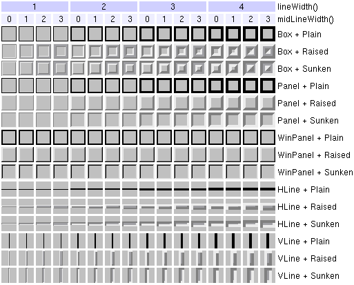

&emsp;&emsp;`QFrame`类是有框架的窗口部件的基类，其头文件是`qframe.h`。<!--more-->

### 属性

- `QRect contentsRect`：框架内的矩形。
- `QRect frameRect`：框架矩形。
- `Shadow frameShadow`：来自框架风格的框架阴影值。
- `Shape frameShape`：来自框架风格的框架外形值。
- `int frameWidth`：被绘制的框架的宽度。
- `int lineWidth`：线宽。
- `int margin`：边白的宽度。
- `int midLineWidth`：中间的线的宽度。

### 保护成员

``` cpp
virtual void paintEvent ( QPaintEvent *event );
virtual void resizeEvent ( QResizeEvent *e );
virtual void drawFrame ( QPainter *p );
virtual void drawContents ( QPainter * );
virtual void frameChanged ();
```

### 详细描述

&emsp;&emsp;`QFrame`类是有框架的窗口部件的基类。它绘制框架，并且调用一个虚函数`drawContents`来填充这个框架，这个函数是被子类重新实现的。这里至少还有两个有用的函数：`drawFrame`和`frameChanged`。
&emsp;&emsp;`QPopupMenu`用于把菜单`升高`，高于周围屏幕；`QProgressBar`有`凹陷`的外观；`QLabel`有平坦的外观。这些有框架的窗口部件可以被改变：

``` cpp
QLabel label ( ... );
label.setFrameStyle ( QFrame::Panel | QFrame::Raised );
label.setLineWidth ( 2 );

QProgressBar pbar ( ... );
label.setFrameStyle ( QFrame::NoFrame );
```

&emsp;&emsp;`QFrame`类也能够直接被用来创建没有任何内容的简单框架，通常情况下你要用到`QHBox`或`QVBox`，因为它们可以自动地布置你放到框架中的窗口部件。
&emsp;&emsp;框架窗口部件有四个属性：`frameStyle`、`lineWidth`、`midLineWidth`和`margin`。框架风格由框架外形和阴影风格决定，框架外形有`NoFrame`、`Box`、`Panel`、`StyledPanel`、`PopupPanel`、`WinPanel`、`ToolBarPanel`、`MenuBarPanel`、`HLine`和`VLine`，阴影风格有`Plain`、`Raised`和`Sunken`。
&emsp;&emsp;线宽就是框架边界的宽度。中间线宽指定的是在框架中间的另外一条线的宽度，它使用第三种颜色来得到一个三维的效果。注意，中间线只有在`Box`、`HLine`和`VLine`这些凸起和凹陷的框架中才被绘制。边白就是框架和框架内容之间的间隙。下面的表格显示的是风格和宽度的绝大多数有用的组合：



### 成员类型文档

&emsp;&emsp;`QFrame::Shadow`这个枚举类型定义了`QFrame`的框架所使用的三维效果。当前定义的效果有：

- `QFrame::Plain`：框架和内容看来和周围一样高。
- `QFrame::Raised`：框架和内容看起来凸起。
- `QFrame::Sunken`：框架和内容看起来凹陷。
- `QFrame::MShadow`：内部的，对于阴影的掩码。

&emsp;&emsp;`Shadow`和`QFrame::Shape`、`lineWidth`和`midLineWidth`相互作用。类文档中的框架的图片描绘的比这些词语更好。
&emsp;&emsp;`QFrame::Shape`这个枚举类型定义了`QFrame`的框架所使用的外形。当前定义的效果有：

- `NoFrame`：`QFrame`不画任何东西。
- `Box`：`QFrame`在它的内容周围画一个框。
- `Panel`：`QFrame`画一个平板使内容看起来凸起或者凹陷。
- `WinPanel`：类似于`Panel`，但`QFrame`绘制三维效果的方式和`Microsoft Windows 95`的一样。
- `ToolBarPanel`：`QFrame`调用`QStyle::drawToolBarPanel`。
- `MenuBarPanel`：`QFrame`调用`QStyle::drawMenuBarPanel`。
- `HLine`：`QFrame`绘制一个水平线，但没有框任何东西(作为分隔是有用的)。
- `VLine`：`QFrame`绘制一个竖直线，但没有框任何东西(作为分隔是有用的)。
- `StyledPanel`：`QFrame`调用`QStyle::drawPanel`。
- `PopupPanel`：`QFrame`调用`QStyle::drawPopupPanel`。

&emsp;&emsp;当它不调用`QStyle`时，`Shape`和`QFrame::Shadow`、`lineWidth`和`midLineWidth`相互作用来创建整个结果。

### 成员函数文档

- `QFrame::QFrame ( QWidget * parent = 0, const char * name = 0, WFlags f = 0 )`：构造一个框架风格为`NoFrame`并且`1`像素框架宽度的框架窗口部件。`parent`、`name`和`f`参数被传递给`QWidget`的构造函数。
- `QRect QFrame::contentsRect () const`：返回框架内的矩形。
- `void QFrame::drawContents ( QPainter * ) [虚 保护]`：绘制框架内容的虚函数。当你得到`QPainter`时，它已经被打开，并且在你离开时，它也必须是打开的。绘制工具的转换在真个过程中是被关闭的。如果你转换绘制工具，记得考虑框架并且在返回前重置转换。这个函数在子类中被重新实现用来绘制框架中的一些东西。它只能在`contentsRect`内绘制，默认函数什么都不做。
- `void QFrame::drawFrame ( QPainter * p ) [虚 保护]`：使用绘制工具`p`和当前框架属性和颜色组绘制框架。框架内的矩形不受影响。这个函数是虚函数，但通常情况下你不需要重新实现它。如果你要做，注意`QPainter`已经被打开并且必须保持打开的状态。
- `void QFrame::frameChanged () [虚 保护]`：当框架风格、线宽和中间线宽发生改变时，这个虚函数被调用。这个函数在子类中可以被重新实现，它需要知道什么时候框架属性发生变化。默认实现是调用`update`。
- `QRect QFrame::frameRect () const`：返回框架矩形。
- `Shadow QFrame::frameShadow () const`：返回来自框架风格的框架阴影值。
- `Shape QFrame::frameShape () const`：返回来自框架风格的框架外形值。
- `int QFrame::frameStyle () const`：返回框架风格，默认值是`QFrame::NoFrame`。
- `int QFrame::frameWidth () const`：返回所绘制的框架的宽度。
- `int QFrame::lineWidth () const`：返回线宽。
- `int QFrame::margin () const`：返回边白的宽度。
- `int QFrame::midLineWidth () const`：返回中间线的宽度。
- `void QFrame::paintEvent ( QPaintEvent * event ) [虚、保护]`：处理绘制事件`event`，绘制框架和内容。打开框架上的绘制工具并且调用`drawFrame`，然后是`drawContents`。
- `void QFrame::resizeEvent ( QResizeEvent * e ) [虚、保护]`：处理重定义大小事件`e`。对于被重新定义大小的窗口部件，调整框架矩形。框架矩形是弹性的，并且周围的区域是固定的。结果框架矩形也许是零或者无效，你可以使用`setMinimumSize`来避免这种可能。如果框架矩形已经是一个零矩形，那么将不会做任何事。
- `void QFrame::setFrameRect ( const QRect & ) [虚]`：设置框架矩形。
- `void QFrame::setFrameShadow ( Shadow )`：设置来自框架风格的框架阴影值。
- `void QFrame::setFrameShape ( Shape )`：设置来自框架风格的框架外形值。
- `void QFrame::setFrameStyle ( int style ) [虚]`：设置框架风格为`style`。`style`是框架外形和框架阴影风格的位或操作：

1. `NoFrame`：不绘制任何东西。
2. `Box`：绘制矩形框。内容看起来和周围的屏幕一样高，但是边界本身也许凸起或凹陷。
3. `Panel`：绘制矩形凸起或凹陷的平板。
4. `StyledPanel`：绘制一个依赖于当前`GUI`风格的矩形平板。它可能是凸起的，也可能是凹陷的。
5. `PopupPanel`：绘制用于弹出窗口的框架。它的外观也依赖于当前`GUI`风格，通常和`StyledPanel`一样。
6. `ToolBarPanel`：绘制用于工具条的框架。它的外观也依赖于当前`GUI`风格。
7. `MenuBarPanel`：绘制用于菜单条的框架。它的外观也依赖于当前`GUI`风格。
8. `LineEditPanel`：绘制用于行编辑的框架。它的外观也依赖于当前`GUI`风格。
9. `TabWidgetPanel`：绘制用于`Tab`窗口部件的框架。它的外观也依赖于当前`GUI`风格。
10. `WinPanel`：绘制一个和`Windows 95`一样的凸起或凹陷的矩形平板。指定这个外形设置线宽为`2`像素。`WinPanel`的提供是为了兼容性。为了使`GUI`风格独立，我们建议使用`StyledPanel`替换它。
11. `HLine`：绘制一条水平线(垂直中央)。
12. `VLine`：绘制一条垂直线(水平中央)。

&emsp;&emsp;阴影风格有：

1. `Plain`：使用调色板的前景颜色绘制(没有任何三维效果)。
2. `Raised`：使用当前颜色组的亮和暗颜色绘制三维的凸起线。
3. `Sunken`：使用当前颜色组的亮和暗颜色绘制三维的凹陷线。

如果被指定的中间线宽大于`0`，在`Raised`或`Sunken`、`HLine`和`VLine`框架中会被绘制一条另外的线。当前颜色组的中间颜色被用于绘制中间线。

- `void QFrame::setLineWidth ( int ) [虚]`：设置线宽。
- `void QFrame::setMargin ( int ) [虚]`：设置边白的宽度。
- `void QFrame::setMidLineWidth ( int ) [虚]`：设置中间线的宽度。

### 属性文档

- `QRect contentsRect`：这个属性保存的是框架内的矩形。使用`contentsRect`来得到这个属性值。
- `QRect frameRect`：这个属性保存的是框架矩形，框架矩形是被画的框架所在的矩形，默认情况下是整个窗口部件。设置这个属性不会导致窗口部件更新。如果这个属性被设置为零矩形(比如`QRect(0, 0, 0, 0)`)，那么框架矩形将会等于窗口部件矩形。使用`setFrameRect`来设置这个属性值，并且使用`frameRect`来得到这个属性值。
- `Shadow frameShadow`：这个属性保存的是来自框架风格的框架阴影值。使用`setFrameShadow`来设置这个属性值，并且使用`frameShadow`来得到这个属性值。
- `Shape frameShape`：这个属性用来操存的是来自框架风格的框架外形值。使用`setFrameShape`来设置这个属性值，并且使用`frameShape`来得到这个属性值。
- `int frameWidth`：这个属性保存的是被绘制的框架的宽度。注意框架宽度依赖于框架风格、线宽和中间线宽。比如在`NoFrame`风格下，框架宽度为`0`；而在`Panel`风格下，框架宽度和线宽相同。框架宽度也包括边白。使用`frameWidth`来得到这个属性值。
- `int lineWidth`：这个属性保存的是线宽。注意`HLine`和`VLine`的总线宽由`frameWidth`给定，而不是`lineWidth`，默认值为`1`。使用`setLineWidth`来设置这个属性值并且使用`lineWidth`来得到这个属性值。
- `int margin`：这个属性保存的是边白的宽度。边白是框架最里面的像素和`contentsRect`最外面的像素之间的区域。它被包含在`frameWidth`中。边白是根据`backgroundMode`被填充的，默认值为`0`。使用`setMargin`来设置这个属性值，并且使用`margin`来得到这个属性值。
- `int midLineWidth`：这个属性保存的是中间线的宽度，默认值为`0`。使用`setMidLineWidth`来设置这个属性值，并且使用`midLineWidth`来得到这个属性值。