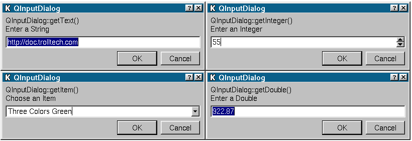

&emsp;&emsp;`QInputDialog`类提供了从用户那里得到一个单一值的简单方便的对话框，输入值可以是字符串、数字或者列表中的一项，必须设置标签来告诉用户应该输入什么。其头文件为`qinputdialog.h`，它继承了`QDialog`。<!--more-->

### getDouble

&emsp;&emsp;函数原型如下：

``` cpp
double QInputDialog::getDouble (
    const QString &caption, const QString &label, double num = 0,
    double from = -2147483647, double to = 2147483647, int decimals = 1,
    bool *ok = 0, QWidget *parent = 0, const char *name = 0 );
```

这是从用户那里得到浮点数的函数。

- `caption`：这个对话框在标题栏显示的文本。
- `label`：显示给用户的文本(它应该告诉用户应该输入什么)。
- `num`：这个行编辑中所要设置的默认的浮点数值。
- `from`和`to`：最小值和最大值，用户应该在这个范围内进行选择。
- `decimals`：小数点后面小数的最大位数；
- `parent`和`name`：对话框的父对象为`parent`，名称为`name`。
- `ok`：如果`ok`参数为非零，则用户点击`OK`，`*ok`被设置为`True`，并且如果用户点击`Cancel`，就被设置为`False`。

``` cpp
bool ok = FALSE;
double res = QInputDialog::getDouble (
                tr ( "Application name" ),
                tr ( "Please enter a decimal number" ),
                33.7, 0, 1000, 2, &ok, this );

if ( ok ) {
    /* 用户输入一些东西并且按下OK */
} else {
    /* 用户按下Cancel */
}
```

### getInteger

&emsp;&emsp;函数原型如下：

``` cpp
int QInputDialog::getInteger (
    const QString &caption, const QString &label, int num = 0,
    int from = -2147483647, int to = 2147483647, int step = 1,
    bool *ok = 0, QWidget *parent = 0, const char *name = 0 );
```

从用户那里得到整数的函数。

- `caption`：这个对话框在标题栏显示的文本；
- `label`：显示给用户的文本(它应该告诉用户应该输入什么)。
- `num`：微调框中所要设置的默认整数。
- `from`和`to`：最小值和最大值，用户应该在这个范围内进行选择。
- `step`：用户通过点击上下箭头增加或者减少的数值。
- `parent`和`name`：对话框的父对象为`parent`，名称为`name`。
- `ok`：如果`ok`参数为非零，则用户点击`OK`，`*ok`被设置为`True`，并且如果用户点击`Cancel`，就被设置为`False`。

``` cpp
bool ok = FALSE;
int res = QInputDialog::getInteger (
            tr ( "Application name" ),
            tr ( "Please enter a number" ),
            22, 0, 1000, 2, &ok, this );

if ( ok ) {
    /* 用户输入一些东西并且按下OK  */
} else {
    /* 用户按下Cancel */
}
```

### getItem

&emsp;&emsp;函数原型如下：

``` cpp
QString QInputDialog::getItem (
    const QString &caption, const QString &label, const QStringList &list, int current = 0,
    bool editable = TRUE, bool *ok = 0, QWidget *parent = 0, const char *name = 0 );
```

让用户从一个字符串列表中选择一项的函数。

- `caption`：这个对话框在标题栏显示的文本。
- `label`：显示给用户的文本(它应该告诉用户应该输入什么)。
- `list`：插入到组合框中的字符串列表。
- `current`：哪一项为当前项。
- `editable`：如果`editable`为`True`，则用户可以输入自己的文本；如果`editable`为`False`，则用户只能选择已有的项中的一项。
- `parent`和`name`：对话框的父对象为`parent`，名称为`name`。
- `ok`：如果`ok`参数为非零，则用户点击`OK`，`*ok`被设置为`True`，并且如果用户点击`Cancel`，就被设置为`False`。

这个函数返回当前项的文本，或者如果`editable`为真，就是组合框的当前文本。

``` cpp
QStringList lst;
lst << "First" << "Second" << "Third" << "Fourth" << "Fifth";
bool ok = FALSE;
QString res = QInputDialog::getItem (
                tr ( "Application name" ),
                tr ( "Please select an item" ),
                lst, 1, TRUE, &ok, this );

if ( ok ) {
    /* 用户选择一项并且按下OK */
} else {
    /* 用户按下Cancel */
}
```

### getText

&emsp;&emsp;函数原型如下：

``` cpp
QString QInputDialog::getText (
    const QString &caption, const QString &label, QLineEdit::EchoMode mode = QLineEdit::Normal,
    const QString &text = QString::null, bool *ok = 0, QWidget *parent = 0, const char *name = 0 );
```

从用户那里得到一个字符串的函数。

- `caption`：这个对话框在标题栏显示的文本。
- `label`：显示给用户的文本(它应该告诉用户应该输入什么)。
- `text`：放置在行编辑中的默认文本。
- `mode`：行编辑的回显模式。
- `parent`和`name`：对话框的父对象为`parent`，名称为`name`。
- `ok`：如果`ok`参数为非零，则用户点击`OK`，`*ok`被设置为`True`，并且如果用户点击`Cancel`，就被设置为`False`。

这个函数返回用户在行编辑中输入的文本，如果没有输入，就返回空字符串。

``` cpp
bool ok = FALSE;
QString text = QInputDialog::getText (
                    tr ( "Application name" ),
                    tr ( "Please enter your name" ),
                    QLineEdit::Normal, QString::null, &ok, this );

if ( ok && !text.isEmpty() ) {
    /* 用户输入一些东西并且按下OK */
} else {
    /* 用户不输入任何东西或者按下Cancel */
}
```



&emsp;&emsp;实际用法如下：

``` cpp
bool ok;
/* 获取字符串(参数：指定父窗口、标题栏、设置对话框中的标签的显示文本、设置输入的
   字符串的显示模式、设置输入框中的默认字符串、设置获取按下按钮信息的bool变量) */
QString string = QInputDialog::getText (
    this, tr ( "输入字符串对话框" ), tr ( "请输入用户名：" ),
    QLineEdit::Normal, tr ( "admin" ), &ok );

if ( ok ) {
    qDebug() << "string:" << string;
}

/* 获取整数 */
int value1 = QInputDialog::getInt (
    this, tr ( "输入整数对话框" ), tr ( "请输入-1000到1000之间的数值" ),
    100, -1000, 1000, 10, &ok ); /* 默认值100，最小值“-1000”，最大值1000，数值每次变化10 */

if ( ok ) {
    qDebug() << "value1:" << value1;
}

/* 获取浮点数 */
double value2 = QInputDialog::getDouble (
    this, tr ( "输入浮点数对话框" ), tr ( "请输入-1000到1000之间的数值" ),
    0.00, -1000, 1000, 2, &ok ); /* 2表示小数的位数为2 */

if ( ok ) {
    qDebug() << "value2:" << value2;
}

/* 获取条目 */
QStringList items;
items << tr ( "条目1" ) << tr ( "条目2" );
QString item = QInputDialog::getItem (
    this, tr ( "输入条目对话框" ), tr ( "请选择一个条目" ),
    items, 0, true, &ok ); /* 0表示默认显示列表中的第0个条目，true表示条目可以被更改 */

if ( ok ) {
    qDebug() << "item:" << item;
}
```