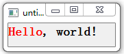

&emsp;&emsp;`QLable`的相关`API`如下：<!--more-->

- `setText( string )`：设置`label`显示的文本。
- `move(x, y)`：移动`label`到指定位置。
- `setWindowTitle( string )`：设置窗体的标题。
- `resize(x, y)`：设置`label`的大小。
- `show()`：在屏幕上显示出来。
- `QLabel( string )`：新建一个`label`控件并设置显示内容。

### 播放gif动画以及显示logo

&emsp;&emsp;代码如下：

``` cpp
#include "mywidget.h"
#include "ui_mywidget.h"
#include <QPixmap>
#include <QMovie>

MyWidget::MyWidget ( QWidget *parent ) : QWidget ( parent ), ui ( new Ui::MyWidget ) {
    ui->setupUi ( this );
    ui->label->setPixmap ( QPixmap ( "C:/logo.png" ) ); /* 显示logo图片 */
    QMovie *movie = new QMovie ( "C:/donghua.gif" ); /* 添加gif动画 */
    ui->label->setMovie ( movie ); /* 在标签中添加动画 */
    movie->start(); /* 开始播放 */
}

MyWidget::~MyWidget() {
    delete ui;
}
```

### 具有简单HTML样式的标签

``` cpp
#include <QApplication>
#include <QLabel>

int main ( int argc, char *argv[] ) {
    QApplication app ( argc, argv );
    QLabel *label = new QLabel ( "<h2><font color='red'>Hello</font>, world!<h2>" );
    label->show();
    return app.exec();
}
```



&emsp;&emsp;`QLabel`是`Qt`界面中的标签类，它从`QFrame`下继承了一些方法。例如设置它的外观、文字、对齐方式：

``` cpp
QLabel *label = new QLabel ( this );

label->setFrameStyle ( QFrame::Panel | QFrame::Sunken );
label->setText ( "first line\nsecond line" );
label->setAlignment ( Qt::AlignBottom | Qt::AlignRight );
```