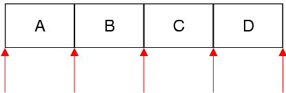

&emsp;&emsp;The `QListIterator` class provides a `Java-style` const iterator for `QList` and `QQueue`. The header file is `QListIterator`.<!--more-->

### Public Functions

Return            | Function
------------------|---------
                  | `QListIterator(const QList<T> & list)`
`bool`            | `findNext(const T & value)`
`bool`            | `findPrevious(const T & value)`
`bool`            | `hasNext() const`
`bool`            | `hasPrevious() const`
`const T &`       | `next()`
`const T &`       | `peekNext() const`
`const T &`       | `peekPrevious() const`
`const T &`       | `previous()`
`void`            | `toBack()`
`void`            | `toFront()`
`QListIterator &` | `operator=(const QList<T> & list)`

### Detailed Description

&emsp;&emsp;The `QListIterator` class provides a `Java-style` const iterator for `QList` and `QQueue`.
&emsp;&emsp;`QList` has both `Java-style` iterators and `STL-style` iterators. The `Java-style` iterators are more `high-level` and easier to use than the `STL-style` iterators; on the other hand, they are slightly less efficient.
&emsp;&emsp;An alternative to using iterators is to use index positions. Most `QList` member functions take an index as their first parameter, making it possible to access, modify, and remove items without using iterators.
&emsp;&emsp;`QListIterator<T>` allows you to iterate over a `QList<T>` (or a `QQueue<T>`). If you want to modify the list as you iterate over it, use `QMutableListIterator<T>` instead.
&emsp;&emsp;The `QListIterator` constructor takes a `QList` as argument. After construction, the iterator is located at the very beginning of the list (before the first item). Here's how to iterate over all the elements sequentially:

``` cpp
QList<float> list;

QListIterator<float> i ( list );

while ( i.hasNext() ) {
    qDebug() << i.next();
}
```

&emsp;&emsp;The `next()` function returns the next item in the list and advances the iterator. Unlike `STL-style` iterators, `Java-style` iterators point between items rather than directly at items. The first call to `next()` advances the iterator to the position between the first and second item, and returns the first item; the second call to `next()` advances the iterator to the position between the second and third item, and returns the second item; and so on.



&emsp;&emsp;Here's how to iterate over the elements in reverse order:

``` cpp
QListIterator<float> i ( list );
i.toBack();

while ( i.hasPrevious() ) {
    qDebug() << i.previous();
}
```

&emsp;&emsp;If you want to find all occurrences of a particular value, use `findNext()` or `findPrevious()` in a loop.
&emsp;&emsp;Multiple iterators can be used on the same list. If the list is modified while a `QListIterator` is active, the `QListIterator` will continue iterating over the original list, ignoring the modified copy.

### Member Function Documentation

- `QListIterator::QListIterator(const QList<T> & list)`: Constructs an iterator for traversing `list`. The iterator is set to be at the front of the `list` (before the first item).
- `bool QListIterator::findNext(const T & value)`: Searches for `value` starting from the current iterator position forward. Returns `true` if `value` is found; otherwise returns `false`. After the call, if `value` was found, the iterator is positioned just after the matching item; otherwise, the iterator is positioned at the back of the container.
- `bool QListIterator::findPrevious(const T & value)`: Searches for `value` starting from the current iterator position backward. Returns `true` if `value` is found; otherwise returns `false`. After the call, if `value` was found, the iterator is positioned just before the matching item; otherwise, the iterator is positioned at the front of the container.
- `bool QListIterator::hasNext() const`: Returns `true` if there is at least one item ahead of the iterator, i.e. the iterator is not at the back of the container; otherwise returns `false`.
- `bool QListIterator::hasPrevious() const`: Returns `true` if there is at least one item behind the iterator, i.e. the iterator is not at the front of the container; otherwise returns `false`.
- `const T & QListIterator::next()`: Returns the next item and advances the iterator by one position. Calling this function on an iterator located at the back of the container leads to undefined results.
- `const T & QListIterator::peekNext() const`: Returns the next item without moving the iterator. Calling this function on an iterator located at the back of the container leads to undefined results.
- `const T & QListIterator::peekPrevious() const`: Returns the previous item without moving the iterator. Calling this function on an iterator located at the front of the container leads to undefined results.
- `const T & QListIterator::previous()`: Returns the previous item and moves the iterator back by one position. Calling this function on an iterator located at the front of the container leads to undefined results.
- `void QListIterator::toBack()`: Moves the iterator to the back of the container (after the last item).
- `void QListIterator::toFront()`: Moves the iterator to the front of the container (before the first item).
- `QListIterator & QListIterator::operator=(const QList<T> & list)`: Makes the iterator operate on `list`. The iterator is set to be at the front of the `list` (before the first item).

&emsp;&emsp;**补充说明**：`JAVA`风格的迭代器是指向项目之间的，而不是直接指向项目。迭代器或者指向容器的最前面，或者指向两个项目之间，或者指向容器的最后面。