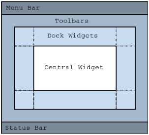

### 主窗口简介

&emsp;&emsp;`QT`中直接支持主窗口，`QMainWindow`是`QT`中主窗口的基类，是继承于`QWidget`类的容器型组件。<!--more-->
&emsp;&emsp;`QMainWindow`内部封装了菜单栏、工具栏、中心组件、停靠组件、状态栏等。`QMainWindow`内置了布局管理器，基本的组件布局如下：



### 菜单栏

&emsp;&emsp;`QT`中提供了预定义的与菜单相关的类组件，例如菜单栏`QMenuBar`、下拉菜单`QMenu`和菜单项`QAction`。


``` cpp
QMenuBar *mb = menuBar();
QMenu *menu = new QMenu ( "File(&F)" );
QAction *action = new QAction ( text, NULL );
menu->addAction ( action );
mb->addMenu ( menu );
```

&emsp;&emsp;快捷键设置如下：

``` cpp
action->setShortcut ( QKeySequence ( KEY ) );
```

### 工具栏

&emsp;&emsp;工具栏是应用程序中集成各种功能使用快捷方式的区域，不是应用程序必须存在的组件。工具栏的元素可以是各种窗口组件，但通常以图标按钮的方式存在。`QT`中提供了预定义的工具栏相关组件，工具栏`QToolBar`和快捷项`QAction`。


&emsp;&emsp;工具栏使用方法如下：

``` cpp
QToolBar *tb = addToolBar ( "ToolBar" ); /* 创建工具栏 */
QAction *action = new QAction ( "", NULL ); /* 创建工具栏选项 */
action->setToolTip ( "Open" );
action->setIcon ( QIcon ( "/res/pic/ open.png" ) );
tb->addAction ( action ); /* 将工具栏选项加入工具栏 */
```

&emsp;&emsp;`QToolBar`实用函数如下：

- `void setFloatable ( bool floatable )`：设置工具栏为浮动。
- `void setMovable ( bool movable )`：设置工具栏为可移动。
- `void setIconSize ( const QSize &iconSize )`：设置工具栏的图标大小。

&emsp;&emsp;`QTollBar`组件中可以加入`QT`中的任意`QWidget`组件：

``` cpp
QToolBar *tb = addToolBar ( "Tool Bar" );
QAction *action = new QAction ( "", NULL );

tb->setFloatable ( false );
tb->setMovable ( false );
action->setToolTip ( "Open" );
action->setIcon ( QIcon ( ":/Res/open.png" ) );
tb->addAction ( action );

QPushButton *b = new QPushButton ( "Button" );
QLabel *l = new QLabel ( "Label" );
QLineEdit *e = new QLineEdit();

tb->addWidget ( b );
tb->addWidget ( l );
tb->addWidget ( e );
```

### 状态栏

&emsp;&emsp;状态栏是应用程序中输出简要信息的区域，一般位于窗口的底部。状态栏显示的消息类型如下：

- 实时消息，例如当前程序状态。
- 永久消息，例如程序版本，开发机构。
- 进度消息，用于进度显示。

&emsp;&emsp;`QT`中提供了预定义的状态栏相关组件状态栏`QStatusBar`，`QStatusBar`是容器型组件，可以是任意组件`QWidget`的父组件。


&emsp;&emsp;`QT`状态栏的一般设计原则：

- 状态栏左边区域用于输出实时消息。
- 状态栏右边区域用于输出永久消息。

&emsp;&emsp;因此，`addWidget`函数用于在状态栏左边区域添加组件，`addPermanentWidget`函数用于在状态栏右边区域添加组件。状态栏使用方法如下：

``` cpp
QStatusBar *sb = statusBar();
QLabel *label = new QLabel ( "CopyRight @ Scorpio Studio 2016" );

if ( label != NULL ) {
    line.setMinimumWidth ( 120 );
    line.setAlignment ( Qt::AlignCenter );
    line.setText ( "Ln: 1    Col: 1" );
    label->setMinimumWidth ( 160 );
    label->setAlignment ( Qt::AlignCenter );
    sb->addPermanentWidget ( new QLabel() );
    sb->addPermanentWidget ( &line );
    sb->addPermanentWidget ( label );
}
```

### 文本编辑组件

&emsp;&emsp;`QT`中预定义了三种文本编辑组件，用于满足不同的开发需求。

- `QLineEdit`：单行文本编辑组件。
- `QTextEdit`：多行富文本编辑组件。
- `QPlainTextEdit`：多行普通文本编辑组件。

&emsp;&emsp;`QT`文本编辑组件的类继承图如下：


&emsp;&emsp;`QT`中的文本编辑组件内置了右键弹出和快捷键功能。文本编辑器的使用为：

``` cpp
mainEditor.setParent ( this ); /* 设置文本编辑器的父组件 */
setCentralWidget ( &mainEditor ); /* 设置文本编辑器为中央组件 */
```