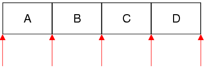

&emsp;&emsp;The `QMapIterator` class provides a `Java-style` const iterator for `QMap` and `QMultiMap`. The header file is `QMapIterator`.<!--more-->

### Public Functions

Return           | Function
-----------------|---------
                 | `QMapIterator(const QMap<Key, T> & map)`
`bool`           | `findNext(const T & value)`
`bool`           | `findPrevious(const T & value)`
`bool`           | `hasNext() const`
`bool`           | `hasPrevious() const`
`const Key &`    | `key() const`
`Item`           | `next()`
`Item`           | `peekNext() const`
`Item`           | `peekPrevious() const`
`Item`           | `previous()`
`void`           | `toBack()`
`void`           | `toFront()`
`const T &`      | `value() const`
`QMapIterator &` | `operator=(const QMap<Key, T> & map)`

### Detailed Description

&emsp;&emsp;The `QMapIterator` class provides a `Java-style` const iterator for `QMap` and `QMultiMap`.
&emsp;&emsp;`QMap` has both `Java-style` iterators and `STL-style` iterators. The `Java-style` iterators are more `high-level` and easier to use than the `STL-style` iterators; on the other hand, they are slightly less efficient.
&emsp;&emsp;`QMapIterator<Key, T>` allows you to iterate over a `QMap` (or a `QMultiMap`). If you want to modify the map as you iterate over it, use `QMutableMapIterator` instead.
&emsp;&emsp;The `QMapIterator` constructor takes a `QMap` as argument. After construction, the iterator is located at the very beginning of the map (before the first item). Here's how to iterate over all the elements sequentially:

``` cpp
QMap<int, QWidget *> map;

QMapIterator<int, QWidget *> i ( map );

while ( i.hasNext() ) {
    i.next();
    qDebug() << i.key() << ": " << i.value();
}
```

&emsp;&emsp;The `next()` function returns the next item in the map and advances the iterator. The `key()` and `value()` functions return the key and value of the last item that was jumped over.
&emsp;&emsp;Unlike `STL-style` iterators, `Java-style` iterators point between items rather than directly at items. The first call to `next()` advances the iterator to the position between the first and second item, and returns the first item; the second call to `next()` advances the iterator to the position between the second and third item; and so on.



&emsp;&emsp;Here's how to iterate over the elements in reverse order:

``` cpp
QMapIterator<int, QWidget *> i ( map );
i.toBack();

while ( i.hasPrevious() ) {
    i.previous();
    qDebug() << i.key() << ": " << i.value();
}
```

&emsp;&emsp;If you want to find all occurrences of a particular value, use `findNext()` or `findPrevious()` in a loop.

``` cpp
QMapIterator<int, QWidget *> i ( map );

while ( i.findNext ( widget ) ) {
    qDebug() << "Found widget " << widget << " under key "
             << i.key();
}
```

&emsp;&emsp;Multiple iterators can be used on the same map. If the map is modified while a `QMapIterator` is active, the `QMapIterator` will continue iterating over the original map, ignoring the modified copy.

### Member Function Documentation

- `QMapIterator::QMapIterator(const QMap<Key, T> & map)`：Constructs an iterator for traversing `map`. The iterator is set to be at the front of the `map` (before the first item).
- `bool QMapIterator::findNext(const T & value)`：Searches for `value` starting from the current iterator position forward. Returns `true` if a `(key, value)` pair with `value` is found; otherwise returns `false`. After the call, if `value` was found, the iterator is positioned just after the matching item; otherwise, the iterator is positioned at the back of the container.
- `bool QMapIterator::findPrevious(const T & value)`：Searches for `value` starting from the current iterator position backward. Returns `true` if a `(key, value)` pair with `value` is found; otherwise returns `false`. After the call, if `value` was found, the iterator is positioned just before the matching item; otherwise, the iterator is positioned at the front of the container.
- `bool QMapIterator::hasNext() const`：Returns `true` if there is at least one item ahead of the iterator, i.e. the iterator is not at the back of the container; otherwise returns `false`.
- `bool QMapIterator::hasPrevious() const`：Returns `true` if there is at least one item behind the iterator, i.e. the iterator is not at the front of the container; otherwise returns `false`.
- `const Key & QMapIterator::key() const`：Returns the key of the last item that was jumped over using one of the traversal functions (`next()`, `previous()`, `findNext()`, `findPrevious()`). After a call to `next()` or `findNext()`, `key()` is equivalent to `peekPrevious().key()`. After a call to `previous()` or `findPrevious()`, `key()` is equivalent to `peekNext().key()`.
- `Item QMapIterator::next()`：Returns the next item and advances the iterator by one position. Call `key()` on the return value to obtain the item's key, and `value()` to obtain the value. Calling this function on an iterator located at the back of the container leads to undefined results.
- `Item QMapIterator::peekNext() const`：Returns the next item without moving the iterator. Call `key()` on the return value to obtain the item's key, and `value()` to obtain the value. Calling this function on an iterator located at the back of the container leads to undefined results.
- `Item QMapIterator::peekPrevious() const`：Returns the previous item without moving the iterator. Call `key()` on the return value to obtain the item's key, and `value()` to obtain the value. Calling this function on an iterator located at the front of the container leads to undefined results.
- `Item QMapIterator::previous()`：Returns the previous item and moves the iterator back by one position. Call `key()` on the return value to obtain the item's key, and `value()` to obtain the value. Calling this function on an iterator located at the front of the container leads to undefined results.
- `void QMapIterator::toBack()`：Moves the iterator to the back of the container (after the last item).
- `void QMapIterator::toFront()`：Moves the iterator to the front of the container (before the first item).
- `const T & QMapIterator::value() const`：Returns the value of the last item that was jumped over using one of the traversal functions (`next()`, `previous()`, `findNext()`, `findPrevious()`). After a call to `next()` or `findNext()`, `value()` is equivalent to `peekPrevious().value()`. After a call to `previous()` or `findPrevious()`, `value()` is equivalent to `peekNext().value()`.
- `QMapIterator & QMapIterator::operator=(const QMap<Key, T> & map)`：Makes the iterator operate on `map`. The iterator is set to be at the front of the `map` (before the first item).