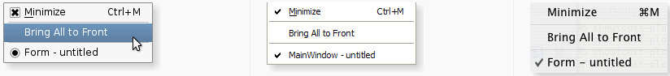

&emsp;&emsp;The `QMenu` class provides a menu widget for use in menu bars, context menus, and other popup menus.<!--more-->

Header  | Inherits  | Inherited By
--------|-----------|-------------
`QMenu` | `QWidget` | `Q3PopupMenu`

### Public Functions

Return      | Function
------------|---------
            | `QMenu(QWidget * parent = 0)`
            | `QMenu(const QString & title, QWidget * parent = 0)`
            | `~QMenu()`
`QAction *` | `actionAt(const QPoint & pt) const`
`QRect`     | `actionGeometry(QAction * act) const`
`QAction *` | `activeAction() const`
`QAction *` | `addAction(const QString & text)`
`QAction *` | `addAction(const QIcon & icon, const QString & text)`
`QAction *` | `addAction(const QString & text, const QObject * receiver, const char * member, const QKeySequence & shortcut = 0)`
`QAction *` | `addAction(const QIcon & icon, const QString & text, const QObject * receiver, const char * member, const QKeySequence & shortcut = 0)`
`void`      | `addAction(QAction * action)`
`QAction *` | `addMenu(QMenu * menu)`
`QMenu *`   | `addMenu(const QString & title)`
`QMenu *`   | `addMenu(const QIcon & icon, const QString & title)`
`QAction *` | `addSeparator()`
`void`      | `clear()`
`QAction *` | `defaultAction() const`
`QAction *` | `exec()`
`QAction *` | `exec(const QPoint & p, QAction * action = 0)`
`void`      | `hideTearOffMenu()`
`QIcon`     | `icon() const`
`QAction *` | `insertMenu(QAction * before, QMenu * menu)`
`QAction *` | `insertSeparator(QAction * before)`
`bool`      | `isEmpty() const`
`bool`      | `isTearOffEnabled() const`
`bool`      | `isTearOffMenuVisible() const`
`QAction *` | `menuAction() const`
`void`      | `popup(const QPoint & p, QAction * atAction = 0)`
`bool`      | `separatorsCollapsible() const`
`void`      | `setActiveAction(QAction * act)`
`void`      | `setDefaultAction(QAction * act)`
`void`      | `setIcon(const QIcon & icon)`
`void`      | `setSeparatorsCollapsible(bool collapse)`
`void`      | `setTearOffEnabled(bool)`
`void`      | `setTitle(const QString & title)`
`QString`   | `title() const`

### Reimplemented Public Functions

- `virtual QSize sizeHint() const;`

### Signals

Return | Function
-------|----------
`void` | `aboutToHide();`
`void` | `aboutToShow();`
`void` | `hovered ( QAction *action );`
`void` | `triggered ( QAction *action );`

### Static Public Members

Return      | Function
------------|----------
`QAction *` | `exec ( QList<QAction *> actions, const QPoint &pos, QAction *at, QWidget *parent );`
`QAction *` | `exec ( QList<QAction *> actions, const QPoint &pos, QAction *at = 0 );`

### Protected Functions

Return | Function
-------|----------
`int`  | `columnCount() const;`
`void` | `initStyleOption ( QStyleOptionMenuItem *option, const QAction *action ) const;`

### Reimplemented Protected Functions

Return         | Function
---------------|---------
`virtual void` | `actionEvent ( QActionEvent *e );`
`virtual void` | `changeEvent ( QEvent *e );`
`virtual void` | `enterEvent ( QEvent * );`
`virtual bool` | `event ( QEvent *e );`
`virtual bool` | `focusNextPrevChild ( bool next );`
`virtual void` | `hideEvent ( QHideEvent * );`
`virtual void` | `keyPressEvent ( QKeyEvent *e );`
`virtual void` | `leaveEvent ( QEvent * );`
`virtual void` | `mouseMoveEvent ( QMouseEvent *e );`
`virtual void` | `mousePressEvent ( QMouseEvent *e );`
`virtual void` | `mouseReleaseEvent ( QMouseEvent *e );`
`virtual void` | `paintEvent ( QPaintEvent *e );`
`virtual void` | `timerEvent ( QTimerEvent *e );`
`virtual void` | `wheelEvent ( QWheelEvent *e );`

### Detailed Description

&emsp;&emsp;The `QMenu` class provides a menu widget for use in menu bars, context menus, and other popup menus.
&emsp;&emsp;A menu widget is a selection menu. It can be either a `pull-down` menu in a menu bar or a standalone context menu. `Pull-down` menus are shown by the menu bar when the user clicks on the respective item or presses the specified shortcut key. Use `QMenuBar::addMenu()` to insert a menu into a menu bar. Context menus are usually invoked by some special keyboard key or by `right-clicking`. They can be executed either asynchronously with `popup()` or synchronously with `exec()`. Menus can also be invoked in response to button presses; these are just like context menus except for how they are invoked.



<p align="center" style="color:green">Fig. A menu shown in Plastique widget style, Windows XP widget style, and Macintosh widget style.</p>

### Actions

&emsp;&emsp;A menu consists of a list of action items. Actions are added with the `addAction()`, `addActions()` and `insertAction()` functions. An action is represented vertically and rendered by `QStyle`. In addition, actions can have a text label, an optional icon drawn on the very left side, and shortcut key sequence such as `Ctrl + X`.
&emsp;&emsp;The existing actions held by a menu can be found with `actions()`.
&emsp;&emsp;There are four kinds of action items: separators, actions that show a submenu, widgets, and actions that perform an action. Separators are inserted with `addSeparator()`, submenus with `addMenu()`, and all other items are considered action items.
&emsp;&emsp;When inserting action items you usually specify a receiver and a slot. The receiver will be notifed whenever the item is `triggered()`. In addition, `QMenu` provides two signals, `activated()` and `highlighted()`, which signal the `QAction` that was triggered from the menu.
&emsp;&emsp;You clear a menu with `clear()` and remove individual action items with `removeAction()`.
&emsp;&emsp;A `QMenu` can also provide a `tear-off` menu. A `tear-off` menu is a `top-level` window that contains a copy of the menu. This makes it possible for the user to `tear off` frequently used menus and position them in a convenient place on the screen. If you want this functionality for a particular menu, insert a `tear-off` handle with `setTearOffEnabled()`. When using `tear-off` menus, bear in mind that the concept isn't typically used on `Microsoft Windows` so some users may not be familiar with it. Consider using a `QToolBar` instead.
&emsp;&emsp;Widgets can be inserted into menus with the `QWidgetAction` class. Instances of this class are used to hold widgets, and are inserted into menus with the `addAction()` overload that takes a `QAction`.
&emsp;&emsp;Conversely, actions can be added to widgets with the `addAction()`, `addActions()` and `insertAction()` functions.
&emsp;&emsp;**Warning**: To make `QMenu` visible on the screen, `exec()` or `popup()` should be used instead of `show()`.

### Property Documentation

- `icon : QIcon`: This property holds the icon of the menu. This is equivalent to the `QAction::icon` property of the `menuAction()`. By default, if no icon is explicitly set, this property contains a null icon. Access functions:

``` cpp
QIcon icon() const;
void  setIcon ( const QIcon &icon );
```

- `separatorsCollapsible : bool`: This property holds whether consecutive separators should be collapsed. This property specifies whether consecutive separators in the menu should be visually collapsed to a single one. Separators at the beginning or the end of the menu are also hidden. By default, this property is `true`. Access functions:

``` cpp
bool separatorsCollapsible() const;
void setSeparatorsCollapsible ( bool collapse );
```

- `tearOffEnabled : bool`: This property holds whether the menu supports being torn off. When `true`, the menu contains a special `tear-off` item (often shown as a dashed line at the top of the menu) that creates a copy of the menu when it is triggered. This `torn-off` copy lives in a separate window. It contains the same menu items as the original menu, with the exception of the `tear-off` handle. By default, this property is `false`. Access functions:

``` cpp
bool isTearOffEnabled() const;
void setTearOffEnabled ( bool );
```

- `title : QString`: This property holds the title of the menu. This is equivalent to the `QAction::text` property of the `menuAction()`. By default, this property contains an empty string. Access functions:

``` cpp
QString title() const;
void setTitle ( const QString &title );
```

### Member Function Documentation

- `QMenu::QMenu(QWidget * parent = 0)`: Constructs a menu with `parent`. Although a popup menu is always a `top-level` widget, if a parent is passed, the popup menu will be deleted when that parent is destroyed (as with any other `QObject`).
- `QMenu::QMenu(const QString & title, QWidget * parent = 0)`: Constructs a menu with a `title` and a `parent`. Although a popup menu is always a `top-level` widget, if a parent is passed, the popup menu will be deleted when that parent is destroyed (as with any other `QObject`).
- `QMenu::~QMenu()`: Destroys the menu.
- `void QMenu::aboutToHide() [signal]`: This signal is emitted just before the menu is hidden from the user.
- `void QMenu::aboutToShow() [signal]`: This signal is emitted just before the menu is shown to the user.
- `QAction * QMenu::actionAt(const QPoint & pt) const`: Returns the item at `pt`; returns `0` if there is no item there.
- `void QMenu::actionEvent(QActionEvent * e) [virtual protected]`: Reimplemented from `QWidget::actionEvent()`.
- `QRect QMenu::actionGeometry(QAction * act) const`: Returns the geometry of action `act`.
- `QAction * QMenu::activeAction() const`: Returns the currently highlighted action, or `0` if no action is currently highlighted.
- `QAction * QMenu::addAction(const QString & text)`: This is an overloaded function. This convenience function creates a new action with `text`. The function adds the newly created action to the menu's list of actions, and returns it.
- `QAction * QMenu::addAction(const QIcon & icon, const QString & text)`: This is an overloaded function. This convenience function creates a new action with an `icon` and some `text`. The function adds the newly created action to the menu's list of actions, and returns it.
- `QAction * QMenu::addAction(const QString & text, const QObject * receiver, const char * member, const QKeySequence & shortcut = 0)`: This is an overloaded function. This convenience function creates a new action with the `text` and an optional `shortcut`. The action's `triggered()` signal is connected to the `receiver's` `member` slot. The function adds the newly created action to the menu's list of actions and returns it.
- `QAction * QMenu::addAction(const QIcon & icon, const QString & text, const QObject * receiver, const char * member, const QKeySequence & shortcut = 0)`: This is an overloaded function. This convenience function creates a new action with an `icon` and some `text` and an optional `shortcut`. The action's `triggered()` signal is connected to the `member` slot of the `receiver` object. The function adds the newly created action to the menu's list of actions, and returns it.
- `void QMenu::addAction(QAction * action)`: This is an overloaded function. Appends the `action` to the menu's list of actions.
- `QAction * QMenu::addMenu(QMenu * menu)`: This convenience function adds `menu` as a submenu to this menu. It returns menu's `menuAction()`. This `menu` does not take ownership of menu.
- `QMenu * QMenu::addMenu(const QString & title)`: Appends a new `QMenu` with `title` to the menu. The menu takes ownership of the menu. Returns the new menu.
- `QMenu * QMenu::addMenu(const QIcon & icon, const QString & title)`: Appends a new `QMenu` with `icon` and `title` to the menu. The menu takes ownership of the menu. Returns the new menu.
- `QAction * QMenu::addSeparator()`: This convenience function creates a new separator action, i.e. an action with `QAction::isSeparator()` returning `true`, and adds the new action to this menu's list of actions. It returns the newly created action.
- `void QMenu::changeEvent(QEvent * e) [virtual protected]`: Reimplemented from `QWidget::changeEvent()`.
- `void QMenu::clear()`: Removes all the menu's actions. Actions owned by the menu and not shown in any other widget are deleted.
- `int QMenu::columnCount() const [protected]`: If a menu does not fit on the screen it lays itself out so that it does fit. It is style dependent what layout means (for example, on `Windows` it will use multiple columns). This functions returns the number of columns necessary.
- `QAction * QMenu::defaultAction() const`: Returns the current default action.
- `void QMenu::enterEvent(QEvent *) [virtual protected]`: Reimplemented from `QWidget::enterEvent()`.
- `bool QMenu::event(QEvent * e) [virtual protected]`: Reimplemented from `QObject::event()`.
- `QAction * QMenu::exec()`: Executes this menu synchronously. This is equivalent to `exec(pos())`. This returns the triggered `QAction` in either the popup menu or one of its submenus, or `0` if no item was triggered (normally because the user pressed `Esc`). In most situations you'll want to specify the position yourself, for example, the current mouse position:

``` cpp
exec ( QCursor::pos() );
```

or aligned to a `widget`:

``` cpp
exec ( somewidget.mapToGlobal ( QPoint ( 0, 0 ) ) );
```

or in reaction to a `QMouseEvent *e`:

``` cpp
exec ( e->globalPos() );
```

- `QAction * QMenu::exec(const QPoint & p, QAction * action = 0)`: This is an overloaded function. Executes this menu synchronously. Pops up the menu so that the `action` will be at the specified global position `p`. To translate a widget's local coordinates into global coordinates, use `QWidget::mapToGlobal()`. This returns the triggered `QAction` in either the popup menu or one of its submenus, or `0` if no item was triggered (normally because the user pressed `Esc`). Note that all signals are emitted as usual. If you connect a `QAction` to a slot and call the menu's `exec()`, you get the result both via the `signal-slot` connection and in the return value of `exec()`. Common usage is to position the menu at the current mouse position:

``` cpp
exec ( QCursor::pos() );
```

or aligned to a widget:

``` cpp
exec ( somewidget.mapToGlobal ( QPoint ( 0, 0 ) ) );
```

or in reaction to a `QMouseEvent *e`:

``` cpp
exec ( e->globalPos() );
```

When positioning a menu with `exec()` or `popup()`, bear in mind that you cannot rely on the menu's current `size()`. For performance reasons, the menu adapts its size only when necessary. So in many cases, the size before and after the show is different. Instead, use `sizeHint()` which calculates the proper size depending on the menu's current contents.

- `QAction * QMenu::exec(QList<QAction *> actions, const QPoint & pos, QAction * at, QWidget * parent) [static]`: This is an overloaded function. Executes a menu synchronously. The menu's actions are specified by the list of `actions`. The menu will pop up so that the specified `action`, `at`, appears at global position `pos`. If `at` is not specified then the menu appears at position `pos`. `parent` is the menu's parent widget; specifying the `parent` will provide context when `pos` alone is not enough to decide where the menu should go (e.g., with multiple desktops or when the parent is embedded in `QGraphicsView`). The function returns the triggered `QAction` in either the popup menu or one of its submenus, or `0` if no item was triggered (normally because the user pressed `Esc`). This is equivalent to:

``` cpp
QMenu menu;
QAction *at = actions[0]; /* Assumes actions is not empty */

foreach ( QAction *a, actions ) {
    menu.addAction ( a );
}

menu.exec ( pos, at );
```

- `QAction * QMenu::exec(QList<QAction *> actions, const QPoint & pos, QAction * at = 0) [static]`: This is an overloaded function. Executes a menu synchronously. The menu's actions are specified by the list of `actions`. The menu will pop up so that the specified `action`, `at`, appears at global position `pos`. If `at` is not specified then the menu appears at position `pos`. The function returns the triggered `QAction` in either the popup menu or one of its submenus, or `0` if no item was triggered (normally because the user pressed `Esc`). This is equivalent to:

``` cpp
QMenu menu;
QAction *at = actions[0]; /* Assumes actions is not empty */

foreach ( QAction *a, actions ) {
    menu.addAction ( a );
}

menu.exec ( pos, at );
```

- `bool QMenu::focusNextPrevChild(bool next) [virtual protected]`: Reimplemented from `QWidget::focusNextPrevChild()`.
- `void QMenu::hideEvent(QHideEvent *) [virtual protected]`: Reimplemented from `QWidget::hideEvent()`.
- `void QMenu::hideTearOffMenu()`: This function will forcibly hide the torn off menu making it disappear from the users desktop.
- `void QMenu::hovered(QAction * action) [signal]`: This signal is emitted when a menu action is highlighted; `action` is the action that caused the signal to be emitted. Often this is used to update status information.
- `void QMenu::initStyleOption(QStyleOptionMenuItem * option, const QAction * action) const [protected]`: Initialize `option` with the values from this menu and information from `action`. This method is useful for subclasses when they need a `QStyleOptionMenuItem`, but don't want to fill in all the information themselves.
- `QAction * QMenu::insertMenu(QAction * before, QMenu * menu)`: This convenience function inserts `menu` before action `before` and returns the menus `menuAction()`.
- `QAction * QMenu::insertSeparator(QAction * before)`: This convenience function creates a new separator action, i.e. an action with `QAction::isSeparator()` returning `true`. The function inserts the newly created action into this menu's list of actions before action `before` and returns it.
- `bool QMenu::isEmpty() const`: Returns `true` if there are no visible actions inserted into the menu, `false` otherwise.
- `bool QMenu::isTearOffMenuVisible() const`: When a menu is torn off a second menu is shown to display the menu contents in a new window. When the menu is in this mode and the menu is visible returns `true`; otherwise `false`.
- `void QMenu::keyPressEvent(QKeyEvent * e) [virtual protected]`: Reimplemented from `QWidget::keyPressEvent()`.
- `void QMenu::leaveEvent(QEvent *) [virtual protected]`: Reimplemented from `QWidget::leaveEvent()`.
- `QAction * QMenu::menuAction() const`: Returns the action associated with this menu.
- `void QMenu::mouseMoveEvent(QMouseEvent * e) [virtual protected]`: Reimplemented from `QWidget::mouseMoveEvent()`.
- `void QMenu::mousePressEvent(QMouseEvent * e) [virtual protected]`: Reimplemented from `QWidget::mousePressEvent()`.
- `void QMenu::mouseReleaseEvent(QMouseEvent * e) [virtual protected]`: Reimplemented from `QWidget::mouseReleaseEvent()`.
- `void QMenu::paintEvent(QPaintEvent * e) [virtual protected]`: Reimplemented from `QWidget::paintEvent()`.
- `void QMenu::popup(const QPoint & p, QAction * atAction = 0)`: Displays the menu so that the action `atAction` will be at the specified global position `p`. To translate a widget's local coordinates into global coordinates, use `QWidget::mapToGlobal()`. When positioning a menu with `exec()` or `popup()`, bear in mind that you cannot rely on the menu's current `size()`. For performance reasons, the menu adapts its size only when necessary, so in many cases, the size before and after the show is different. Instead, use `sizeHint()` which calculates the proper size depending on the menu's current contents.
- `void QMenu::setActiveAction(QAction * act)`: Sets the currently highlighted action to `act`.
- `void QMenu::setDefaultAction(QAction * act)`: This sets the default action to `act`. The default action may have a visual cue, depending on the current `QStyle`. A default action usually indicates what will happen by default when a drop occurs.
- `QSize QMenu::sizeHint() const [virtual]`: Reimplemented from `QWidget::sizeHint()`.
- `void QMenu::timerEvent(QTimerEvent * e) [virtual protected]`: Reimplemented from `QObject::timerEvent()`.
- `void QMenu::triggered(QAction * action) [signal]`: This signal is emitted when an action in this menu is triggered. `action` is the action that caused the signal to be emitted. Normally, you connect each menu action's `triggered()` signal to its own custom slot, but sometimes you will want to connect several actions to a single slot, for example, when you have a group of closely related actions, such as `left justify`, `center`, `right justify`. **Note**: This signal is emitted for the main parent menu in a hierarchy. Hence, only the parent menu needs to be connected to a slot; `sub-menus` need not be connected.
- `void QMenu::wheelEvent(QWheelEvent * e) [virtual protected]`: Reimplemented from `QWidget::wheelEvent()`.